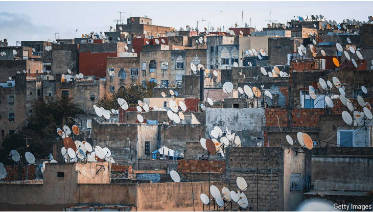

# Why the AI revolution is leaving Africa behind

Large infrastructure gaps are creating a new digital divide

digital divide：数字鸿沟

原文：

TWO DECADES ago a digital revolution transformed the lives and

livelihoods of millions of people as mobile phones swept across sub-Saharan

Africa. A region where a tiny fraction of the population had landline phones

or bank accounts was able to leapfrog old telephone monopolies and

infrastructure. Mobile phones allowed farmers to get advice on pests and the

weather, and the unbanked to send and receive mobile money. Now artificial

intelligence (AI) promises to be an even more powerful force for boosting

productivity and helping poorer countries overcome shortages of skilled

teachers and doctors. Yet where opportunity beckons, Africa is being left

behind.

二十年前，随着手机席卷撒哈拉以南非洲，一场数字革命改变了数百万人的生活和生计。一个只有极少数人口拥有固定电话或银行账户的地区，能够超越旧有的电话垄断和基础设施。手机让农民可以获得关于害虫和天气的建议，让没有银行账户的人可以收发移动资金。现在，人工智能(AI)有望成为一股更强大的力量，来提高生产率，帮助较贫穷的国家克服熟练教师和医生短缺的问题。然而，在机遇招手的地方，非洲却被落在了后面。

学习：

livelihoods：生计；（livelihood的复数）

landline：固定电话线路；固定电话

landline phone：固定电话

leapfrog：跳过；跃过；超越；越级提升；跳跃式发展

sweep:席卷，广泛传播

>“Sweep” 在这里表示迅速而广泛地传播或影响。举个例子：“The new social media app swept across the country, quickly gaining millions of users.”
>
>During the early 2000s, smartphones swept through urban areas, transforming communication and access to information.
>
>New health guidelines swept across the globe in response to the pandemic, changing daily routines for millions.

beckon: 吸引，召唤

>“Beckon” 意思是“吸引”或“召唤”。它可以表示某物对某人具有强烈的吸引力或诱惑力。
>
>**双语例句**：
>
>1. **The mountain peaks beckon adventurous hikers from around the world.**
>   - 山峰吸引着来自世界各地的冒险登山者。
>
>2. **The bright lights of the city beckon those seeking excitement and new opportunities.**
>   - 城市的灯火辉煌吸引着那些寻找刺激和新机会的人。
>
>3. **The idea of working abroad beckons to many young professionals.**
>   - 在国外工作的想法吸引了许多年轻的专业人士。
>
>4. **For those who love the ocean, the beach beckons with its promise of sun and surf.**
>   - 对于那些热爱大海的人，海滩以阳光和波浪的诱惑吸引着他们。

>在这段话中，“where opportunity beckons” 的意思是“机会在召唤的地方”。这句话表示在那些有巨大潜力和机会的地方，非洲却被落在了后面。

原文：

PWC, a professional-services firm, reckons that AI could add almost $16trn to

global economic output by around 2030 (compared with 2017). McKinsey, a

consulting firm, separately arrived at a similar figure, but now reckons this

could rise by another 15-40% because of newer forms of AI such as large

learning models. Yet Africa, which has around 17% of the world’s

population, looks likely to get a boost from AI in its annual GDP of just $400m

by 2030, or 2.5% of the total, because it lacks digital infrastructure. As a

result, instead of helping to narrow the productivity and income gap between

Africa and richer countries, AI seems set to widen it.

专业服务公司普华永道(PWC)认为，到2030年左右，人工智能可以为全球经济产出增加近16万亿美元(与2017年相比)。咨询公司麦肯锡(McKinsey)单独得出了一个类似的数字，但现在认为，由于较新形式的人工智能，如大型学习模型，这一数字可能会再上升15-40%。然而，占世界人口约17%的非洲看起来可能会从人工智能中获得提振，到2030年，其年GDP仅为4亿美元，占总数的2.5%，因为它缺乏数字基础设施。结果，人工智能非但没有帮助缩小非洲和富裕国家之间的生产率和收入差距，反而似乎在扩大这一差距。

学习：

set to: 很可能，预计会

>“Set to” 在这个上下文中的意思是“很可能”或“预计会”。它表示某事即将发生或预期会发生。
>
>**例句**：
>
>- The new policy is set to improve the healthcare system significantly.
>  - 新政策预计会显著改善医疗系统。
>- The weather is set to change later this week.
>  - 本周晚些时候天气预计会变化。

原文：

Take Nigeria, a regional tech hub whose average download speed of wired

internet is a tenth of Denmark’s. Most broadband users in Africa’s most

populous country are limited to mobile internet, which is slower still. A

growing number of underwater cables connect the continent with the wider

world, with more to come. These include Meta’s 2Africa, the world’s longest

undersea connection. But a dearth of onshore lines to carry data inland will

leave much of that capacity wasted.

以尼日利亚为例，它是一个区域性的科技中心，有线互联网的平均下载速度是丹麦的十分之一。在这个非洲人口最多的国家，大多数宽带用户仅限于移动互联网，而且速度还很慢。越来越多的水下电缆将非洲大陆与更广阔的世界连接起来，未来还会有更多。其中包括Meta的2Africa，它是世界上最长的海底连接。但是缺乏向内陆传输数据的陆上线路将会浪费大量的容量。

学习：

dearth：缺乏；不足；稀缺；

onshore： 美 [ˌɑnˈʃɔr] 陆上的；近岸的；

原文：

In some ways Africa’s weak digital infrastructure is explained by the success

of its mobile revolution, whereby privately owned telcos entered newly

liberalised markets, disrupting and displacing the incumbent operators.

These not-so-new firms are still growing rapidly—the 15 main ones have

averaged 29% revenue growth over the past five years. But their jump over

landlines is coming back to bite them. In much of the rich world, the basic

infrastructure of telephones—junction boxes and telephone poles or

underground cable conduits—have been repurposed to provide fast fibre-

optic broadband. Yet Africa is often starting from scratch.

在某种程度上，非洲薄弱的数字基础设施可以用其移动革命的成功来解释，私有电信公司借此进入新自由化的市场，颠覆并取代了现有的运营商。这些并不算新的公司仍在快速增长——15家主要公司在过去五年的平均收入增长率为29%。但是他们对固定电话的跳过会反过来咬他们一口。在许多富裕国家，电话的基础设施——接线盒、电线杆或地下电缆管道——已经被重新用于提供快速光纤宽带。然而，非洲往往是从零开始。

学习：

junction：（河流的）汇合处；（电缆的）主接点

junction box：接线盒

telephone pole：电线杆

repurposed：赋予新的用途；

原文：

The lack of connectivity is compounded by a shortage of the heavy-duty

data centres needed to crunch the masses of data required to train large

language models and run the AI-powered applications that could boost

Africa’s economic growth. These days much of the content and processing

needed to keep websites and programmes running is held in the cloud, which

is made up of thousands of processors in physical data centres. Yet Africa

has far fewer of these than any other major continent (see map).

缺少重型数据中心加剧了连通性的缺乏，这些数据中心需要处理大量数据，这些数据是训练大型语言模型和运行人工智能应用程序所需的，这些应用程序可以促进非洲的经济增长。如今，维持网站和程序运行所需的大部分内容和处理都在云端进行，由物理数据中心的数千个处理器组成。然而，非洲比其他任何大陆都要少得多(见地图)。

学习：

heavy-duty：牢固耐用的；重要的；大量的

crunch：（快速大量地）处理信息

原文：

Without nearby data centres, bits and bytes have to make long round-trips to

centres in cities such as Marseille or Amsterdam for processing, leading to

lagging applications and frustrating efforts to stream high-definition films.

Yet the closer data are to users, the faster they can reach them: films can zip

across to viewers from one of Netflix’s African servers more quickly than

you can say “Bridgerton”. The more cable landings and more local data

centres there are on the continent, the more resilient its network is if

undersea cables are damaged, as happened earlier this year when internet

access was disrupted across much of west Africa.

没有附近的数据中心，比特和字节必须长途往返于马赛或阿姆斯特丹等城市的数据中心进行处理，这导致应用程序滞后，并阻碍了高清电影的流媒体播放。然而，数据离用户越近，他们就能越快地接触到他们:电影从网飞的一个非洲服务器上快速传送到观众手中的速度比你说“布里奇顿”还要快。非洲大陆的电缆登陆点和本地数据中心越多，其网络的弹性就越大，如果海底电缆受损，正如今年早些时候西非大部分地区互联网接入中断时发生的情况。

学习：

round-trips：往返旅行      

high-definition：高清；高清晰度

原文：

All these new data centres will require more energy as they grow. AI, which

involves complex calculations that need even more computing power, will

further raise demand. A rack of servers needed for AI can use up to 14 times

more electricity than a rack of normal servers. They also need industrial air-

conditioning, which guzzles massive amounts of power and water—even

more so in ever-hotter climates.

随着发展，所有这些新的数据中心将需要更多的能源。人工智能涉及需要更多计算能力的复杂计算，将进一步提高需求。人工智能所需的一架服务器比一架普通服务器多消耗14倍的电力。他们还需要消耗大量电力和水的工业空调——在越来越热的气候下更是如此。

学习：

complex calculations：复杂计算

rack： 架子；支架

a rack of servers：一架服务器

guzzle：英 [ˈɡʌz(ə)l]  狂饮；滥吃

原文：

Yet Africa is so short of electricity that some 600m of its people have no

power. In Nigeria, which suffers 4,600 hours of blackouts a year, data

centres are forced to provide their own natural gas-powered generating

plants to keep the lights on and the servers humming. Though many centres

across the continent are turning to renewables, wind and solar are too erratic

to do the job continuously

然而，非洲如此缺电，以至于约有6亿人用不上电。在每年停电4600小时的尼日利亚，数据中心被迫提供自己的汽油动力的发电厂，以保持照明和服务器运转。尽管非洲大陆的许多中心正转向可再生能源，但风能和太阳能太不稳定，无法持续发挥作用

学习：

blackout：断电

generating plant：发电厂

humming：哼唱；活跃；发低哼声；（hum的现在分词形式）

erratic： 美 [ɪˈrætɪk] 不稳定的

原文：

Edge computing, where more data is processed on the user’s device, is

promoted as a way to bring AI-powered tech to more Africans. But it relies on

the presence of many smaller and less energy-efficient data centres, and on

users having smartphones powerful enough to handle the calculations.

Though around half of mobile phones in Africa are now smartphones, most

are cheap devices that lack the processing power for edge computing.

边缘计算，在用户的设备上处理更多的数据，被推广为一种将人工智能技术带给更多非洲人的方式。但它依赖于许多更小、能效更低的数据中心的存在，以及用户拥有足够强大的智能手机来处理计算。虽然现在非洲大约一半的手机是智能手机，但大多数是廉价设备，缺乏边缘计算的处理能力。

原文：

In 18 of the 41 African countries surveyed by the International

Telecommunication Union, a minimal mobile-data package costs more than

5% of average incomes, making them unaffordable for many. This may

explain why almost six in ten Africans lack a mobile phone, and why it is

not profitable for telcos to build phone towers in many rural areas.

“Approximately 60% of our population, representing about 560m people,

have access to a 4G or a 3G signal next to their doorstep, and they’ve never

gone online,” says Angela Wamola of GSMA, an advocacy group for mobile

operators. Every next yet-to-be-connected African is more expensive to

reach than the last, and brings fewer returns, too. And new phone towers in

remote areas, which typically cost $150,000 each, still need costly cables to

“backhaul” data

在国际电信联盟调查的41个非洲国家中，有18个国家最低限度的移动数据套餐花费超过平均收入的5%,使得许多人无法负担。这可能解释了为什么几乎十分之六的非洲人没有手机，以及为什么电信公司在许多农村地区建造电话塔无利可图。“大约60%的人口，也就是大约5 . 6亿人，在家门口就可以使用4G或3G信号，但他们从来没有上过网，”GSMA的安吉拉·瓦莫拉说，GSMA是一个为移动运营商宣传的组织。每一个下一个需要联系的非洲人都比上一个更昂贵，带来的回报也更少。偏远地区的新电话塔，每个通常花费15万美元，仍然需要昂贵的电缆来“回程”数据

学习：

advocacy：美 [ˈædvəkəsi] 倡导活动；代言；宣传

backhaul：美 [bæk'hɔl] 载货反航；回运

原文：

Part of the solution to Africa’s connectivity problem may be partnerships

between mobile-phone operators and development institutions. Existing

telcos know the terrain and the politics that can make laying cables a

delicate task. International tech firms such as Google or Microsoft are well

placed to take on more risk by laying their own cables and building data

centres. Equipment-providers and other multinationals can fill skill gaps.

解决非洲连接问题的部分方法可能是移动电话运营商和发展机构之间的合作。现有的电信公司了解地形和政治，这使得铺设电缆成为一项微妙的任务。像谷歌或微软这样的国际科技公司有能力通过铺设自己的电缆和建立数据中心来承担更多的风险。设备供应商和其他跨国公司可以填补技能缺口。

原文：

China’s Huawei, for example, is building 70% of Africa’s 4G networks.

Startups using cheaper technologies are exploring how to help far-flung

communities get connected. Africa’s connectivity mix will probably be as

diverse as its people, including everything from satellites that can be put up

by firms like Starlink to reach rural areas, to improved 4G networks in

medium-sized cities.

例如，中国的华为正在建设非洲70%的4G网络。使用更廉价技术的创业公司正在探索如何帮助遥远的社区连接起来。非洲的连接组合可能会像其人民一样多样化，包括从Starlink这样的公司可以建立的到达农村地区的卫星，到中等城市改善的4G网络。

学习：

far-flung：遥远的；边远的

原文：

Some foreign firms are investing in data centres in Kenya and Nigeria, but

not enough of them. There is also some experimenting with how to power

them. Kenya’s Ecocloud Data Centre, for example, will be the continent’s

first to be fully run on geothermal energy, a stable source of renewable

power. Since Kenya’s grid has plenty more green energy available, it is an

attractive place to build more data centres.

一些外国公司正在投资肯尼亚和尼日利亚的数据中心，但是还不够。也有一些关于如何给它们供电的实验。例如，肯尼亚的生态云数据中心将是非洲大陆第一个完全依靠地热能运行的数据中心，地热能是一种稳定的可再生能源。由于肯尼亚的电网有更多的绿色能源可用，这是一个建立更多数据中心的有吸引力的地方。

原文：

But given how many power sources your correspondent switched between to

write this article, and how many patchy internet connections interrupted her

work, much still needs to be done to improve infrastructure. That is even

truer if Africa’s animators, weather forecasters, quantum physicists and

computer scientists are to fulfil their potential. Even small-scale farming,

which provides a living for more than half the continent’s people, stands to

benefit from improved access to AI.

但是考虑到你的记者为了写这篇文章转换了多少电源，以及多少断断续续的互联网连接中断了她的工作，改善基础设施仍有许多工作要做。如果非洲的动画师、天气预报员、量子物理学家和计算机科学家要发挥他们的潜力，那就更是如此。即使是为非洲大陆一半以上的人口提供生计的小规模农业，也将受益于人工智能的改善。

学习：

correspondent: 美 [ˌkɔːrəˈspɑːndənt] 记者

patchy：不均匀的；不完全的；不完整的

原文：

Frustratingly, the case for improving Africa’s digital infrastructure is not

new. “Gosh! I can’t believe, 15 years later, we’re still having this

conversation,” says Funke Opeke, whose firm, MainOne, built Nigeria’s first

privately owned submarine cable in 2010. Unless big investments are made

soon, the same conversation may be taking place another 15 years on. ■

令人沮丧的是，改善非洲数字基础设施的案例并不新鲜。“啊呀！我真不敢相信，15年后，我们还在进行这样的对话，”Funke Opeke说，他的公司MainOne在2010年建造了尼日利亚第一条私有海底电缆。除非很快进行大规模投资，否则15年后同样的对话可能还会发生。■

## 后记

2024年8月1日13点20分于上海。

