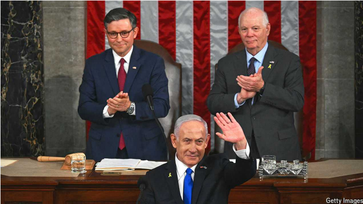

# Bibi Netanyahu offered spectacle over substance in America

spectacle： 精彩的表演；引人注目的事件；

His fourth address to Congress was historic, but held few answers for Israelis

Israelis： 美 [ɪzˈreɪli] 以色列人；以色列国民；（ Israeli的名词复数 ）

原文：

The timing of Binyamin Netanyahu’s first trip abroad since Israel’s war in

Gaza began over nine months ago was not propitious. The evening before

the Israeli prime minister left for Washington, Joe Biden announced that he

would not seek reelection as president. American lawmakers were

preoccupied with domestic politics even as they welcomed Mr Netanyahu.

So, too, was the Israeli prime minister, even as he left his country behind.

自从九个多月前以色列在加沙的战争开始以来，本雅明·内塔尼亚胡首次出国访问的时机并不合适。在以色列总理前往华盛顿的前一天晚上，乔·拜登宣布他不会寻求连任总统。尽管美国立法者欢迎内塔尼亚胡，但他们还是全神贯注于国内政治。以色列总理也是如此，尽管他离开了自己的国家。

学习：

propitious：美 [prəˈpɪʃəs] 有利的；吉利的；顺利的；适宜的；有希望的

preoccupied with：沉浸在；专注；全神贯注于          

原文：

Mr Netanyahu’s address to a joint meeting of Congress was the main event,

at least for him. It was a way to emphasise, both to Israelis and to the Biden

administration, the support that he enjoys there. The meetings scheduled

with Mr Biden and his potential successors, Donald Trump, the Republican

nominee, or Kamala Harris, the presumptive Democratic candidate, were

afterthoughts. He had angled for the invitation for months even as tensions

with the Biden administration worsened over Israel’s war. It came, at last,

from the Republicans, who remain friendly towards him, and then, more

grudgingly, from the Democrats many of whom were absent during his

speech, including Ms Harris. His address was received rapturously, with

standing ovations, proving once again how popular Mr Netanyahu is among

Republicans. Whether that will impress Israelis is another matter.

至少对他来说，内塔尼亚胡在国会联席会议上的讲话是主要事件。这是向以色列人和拜登政府强调他在那里享有的支持的一种方式。原定与拜登及其潜在继任者——共和党总统候选人唐纳德·特朗普(Donald Trump)或民主党推定候选人卡玛拉·哈里斯(Donald Trump)——的会面都是事后的想法。几个月来，尽管与拜登政府在以色列战争问题上的紧张关系恶化，他还是争取到了这一邀请。最后，它来自对他保持友好的共和党人，然后，更不情愿地，来自民主党人，他们中的许多人在他的演讲中缺席，包括哈里斯女士。他的演讲受到了热烈的欢迎，人们起立鼓掌，这再次证明了内塔尼亚胡在共和党中是多么受欢迎。这是否会打动以色列人是另一回事。

学习：

afterthought：后来想到的事物；后来添加的东西

grudgingly：英 ['grʌdʒiŋli] 不情愿地；勉强地

rapturously：美 [ræptʃərəsli] 兴高采烈地; 狂喜地

ovation：长时间热烈鼓掌；热烈欢迎

standing ovations：长时间站立鼓掌

angle for：努力争取，设法获得

>“Angle for” 在这里的意思是“努力争取”或“设法获得”。它表示以一种隐秘或策略性的方式寻求某物。
>
>**例句**：
>
>- She spent weeks angling for an invitation to the exclusive party.
>  - 她花了几个星期努力争取到参加那个专属派对的邀请。
>- The company has been angling for a major government contract.
>  - 这家公司一直在设法获得一份重要的政府合同。

原文：

Mr Netanyahu used every rhetorical flourish, assuring an adoring audience

that Israel and America were at war together and would win together. He

told rousing tales of the bravery of Israeli soldiers on October 7th, but failed

to mention how his army had been caught unawares. He supplied harrowing

details of the atrocities carried out by Hamas, the group responsible for the

massacres, but dismissed the tens of thousands of Palestinians killed since,

contentiously insisting that the war had seen “one of the lowest ratios of

combatants to non-combatants’ casualties in the history of urban warfare”.

内塔尼亚胡使用了所有华丽的辞藻，向崇拜他的听众保证以色列和美国在一起作战，并且会一起胜利。他讲述了10月7日以色列士兵勇敢的激动人心的故事，但是没有提到他的军队是如何被突袭的。他提供了对大屠杀负有责任的组织哈马斯所犯下的暴行的令人痛心的细节，但对自那以来成千上万被杀害的巴勒斯坦人不屑一顾，有争议地坚称这场战争是“城市战争历史上战斗人员与非战斗人员伤亡比例最低的一次”。

学习：

rhetorical flourish：华丽的辞藻      

adoring：崇拜的；敬慕的；爱慕的

rousing：激动人心的；令人兴奋的

unawares：出其不意地；突然地

harrowing：悲惨的；令人伤心的；痛心的

atrocities：美 [əˈtrɔsitiz] 暴行；（atrocity的复数）

massacres：美 [ˈmæsəkərz] 惨败；大屠杀；（massacre的复数） **注意发音**

contentiously：美 [kən'tenʃəsli] 有异议地；好争吵地；爱争论地

combatants：美 [kəm'bætnts] 战斗员；争斗者；战士；（combatant的复数）

casualties： 美 [ˈkæʒəwəltiz] 受害者；（casualty的复数）

原文：

The address lacked policy details or a strategy, beyond “total victory”. Mr

Netanyahu said that after the war Gaza would need to be “demilitarised and

deradicalised” and governed by “a civilian administration run by

Palestinians who do not want to destroy Israel”. He gave no hint as to how to

achieve that. Relatives of some hostages were brought along as props; others

protested in the gallery. There were all also large pro-Palestinian

demonstrations outside Congress.

除了“大获全胜”之外，这份讲话缺乏政策细节或战略。内塔尼亚胡表示，战后加沙需要“非军事化和去激进化”，由“不想摧毁以色列的巴勒斯坦人管理的平民政府”来治理。对于如何实现这一点，他没有给出任何提示。一些人质的亲属作为道具被带了过来；其他人在旁听席上抗议。国会外也有大规模的亲巴勒斯坦示威游行。

学习：

total victory：大获全胜

deradicalised：去激进化

relative：亲戚；亲属；

hostage：美 [ˈhɑːstɪdʒ] 人质

props：小道具；支持者；（prop的复数）

gallery：（大厅的）楼座；楼上旁听席；

demonstrations：示范；游行示威；（demonstration的复数）

原文：

Mr Netanyahu’s flamboyant oratory is unlikely to change Mr Biden’s

foreign policy in the few months he has left as president. The real audience

for Mr Netanyahu’s speech was at home. Israelis, he hoped, would

rediscover their enthusiasm for him. Three-quarters currently think he

should resign either immediately or as soon as the war ends. But his speech

will have allayed few of their concerns: when will the hostages be released;

when will tens of thousands of evacuated Israelis return to their homes near

the borders with Gaza and Lebanon; and how might the debilitating war

draw to a close?

内塔尼亚胡华丽的演讲不太可能改变拜登在卸任后几个月的外交政策。内塔尼亚胡演讲的真正观众是在国内。他希望以色列人会重新发现他们对他的热情。四分之三的人认为他应该立即辞职，或者在战争结束后马上辞职。但是他的讲话将会减轻他们的一些担忧:人质什么时候会被释放；成千上万撤离的以色列人什么时候才能回到他们在加沙和黎巴嫩边境附近的家园；这场令人疲惫不堪的战争将如何结束？

学习：

flamboyant：美 [ˌflæmˈbɔɪ(j)ənt] 华丽的；艳丽的；夸张的；浮夸的；

oratory：美 [ˈɔrəˌtɔri] 公共演讲；演讲艺术

resign：辞职

allay：减轻

allay few of their concerns：减轻一些担忧

evacuated：美 [ɪˈvækjueɪtɪd] 撤退者的；排空的；疏散的

debilitating：美 [dɪ'bɪləˌteɪtɪŋ] 使衰弱的

draw to a close：结束

原文：

The prime minister chose to leave Israel just as hopes were rising, yet again,

about the possibility of a ceasefire in Gaza and a deal to release the 115

Israeli hostages still held there, at least half of whom are presumed already

dead. The first stage—a six-week ceasefire with a partial exchange of

hostages and Palestinian prisoners—is within reach. Later phases, American

officials hope, will end the war. Israel’s security establishment is convinced

that Hamas is at last prepared to make a deal that Israel will accept.

这位总理选择离开以色列，就在人们对加沙可能实现停火以及达成释放仍被扣押在那里的115名以色列人质的协议的希望再次上升之际，据推测，其中至少有一半已经死亡。第一阶段——为期六周的停火，部分交换人质和巴勒斯坦囚犯——指日可待。美国官员希望，以后的阶段将会结束这场战争。以色列安全机构确信，哈马斯终于准备好达成一项以色列会接受的协议。

学习：

within reach：触手可及；够得着；力所能及

establishment：机构；企业；组织；机关

security establishment：安全机构

原文：

A ceasefire would also be key to ending hostilities on Israel’s northern

border with Hizbullah and with the Houthis in Yemen, two Iran-backed

militias that have been attacking Israel with missiles and drones since the

war began. Two-thirds of Israelis support a deal. But the minority holding

out for “total victory” over Hamas are represented by Mr Netanyahu’s main

political allies, who are keeping him in power.

停火也是结束以色列北部边境与真主党和也门胡塞武装的敌对状态的关键，这两个伊朗支持的民兵组织自战争开始以来一直用导弹和无人机袭击以色列。三分之二的以色列人支持达成协议。但是坚持对哈马斯“彻底胜利”的少数派是由内塔尼亚胡的主要政治盟友代表的，他们让他继续掌权。

学习：

hostilities： 美 [hɑːˈstɪlətiz] 战争；敌意；敌对状态；（hostility的复数）

Hizbullah：真主党

Houthis: 胡塞武装

militias：美 [məˈlɪʃəz] 民兵组织；自卫队；（militia的复数）

原文：

His visit came just as the Knesset, Israel’s parliament, begins its three-month

summer recess. During the break he will almost certainly have to end his

procrastination and make a call on a ceasefire. Israel’s generals are all but

challenging him in public to do so. The far-right parties continue to say they

will bring down his government if Mr Netanyahu takes a deal that they see

as a surrender to Hamas. When the Knesset reconvenes in late October he

may no longer have a majority and early elections will be called. If he

refuses the deal, he can expect huge protests led by the hostages’ families,

which will reach their peak on the first anniversary of the October 7th

attacks. The final vestiges of wartime unity will have been destroyed.

他的访问正值以色列议会开始为期三个月的夏季休会。在休息期间，他几乎肯定会结束他的拖延，并呼吁停火。以色列的将军们几乎是在公开挑战他这样做。极右翼政党继续表示，如果内塔尼亚胡接受他们认为是向哈马斯投降的协议，他们将推翻他的政府。当以色列议会在10月下旬重新召开时，他可能不再拥有多数席位，提前选举将被宣布。如果他拒绝这个协议，他可以预料到由人质家属领导的大规模抗议，这将在10月7日袭击一周年时达到高潮。战时团结的最后痕迹将被摧毁。

学习：

Knesset：美 [k(ə)ˈnɛsət] 以色列议会

recess：休会；休庭；休息时间

procrastination：美 [prəˌkræstɪˈneɪʃn] 拖延；耽搁

bring down：推翻

bring down his government：推翻政府

reconvene：美 [ˌrikənˈvin]  再集会；再开会；再召集

vestiges： 美 ['vestɪdʒɪz] 遗迹；（vestige的复数）

wartime unity：战时团结

huge protests：大规模抗议

原文：

For the prime minister the spectacle was more important than any policy

substance. Just before taking off, he reminded everyone he was going to

speak to Congress for the fourth time. The mere fact that he is the first world

leader to have done so, breaking a record set by Winston Churchill, is, to Mr

Netanyahu, a demonstration of his standing as a statesman capable of

conjuring up support from the world’s greatest power.

对首相来说，场面比任何政策实质都重要。就在起飞前，他提醒大家，他将第四次向国会发表讲话。对内塔尼亚胡来说，他是第一个这样做的世界领导人，打破了温斯顿·丘吉尔(Winston Churchill)创下的纪录，这一事实本身就证明了他作为一名政治家的地位，能够获得世界上最强大国家的支持。

学习：

>**Spectacle** 指的是一种引人注目的场面或壮观的情景。在这里，它表示内塔尼亚胡总理认为吸引注意力的展示或表演比实际的政策内容更重要。
>
>**Policy substance** 指的是政策的实质内容或具体措施。在这里，它表示与实际政策内容相比，总理更注重场面效果。

原文：

This has always been the basis of Mr Netanyahu’s appeal to Israeli voters;

he launched his political career after a successful stint as Israel’s ambassador

to the United Nations, during which he became a media star in America. To

this day, it has also been the main criticism of him: that his capabilities as a

leader do not match his gift of the gab. For Israel’s prime minister his

address was a personal landmark. For its people it was just another speech. ■

这一直是内塔尼亚胡吸引以色列选民的基础；他在成功担任以色列驻联合国大使后开始了他的政治生涯，在此期间，他成为了美国的媒体明星。直到今天，这也是对他的主要批评:他作为领导人的能力与他的口才不相称。对以色列总理来说，他的讲话是个人的里程碑。对它的人民来说，这只是另一场演讲。■

学习：
appeal to：吸引

stint：从事某项工作的时间

gab：闲谈；聊天；喋喋不休；

## 后记

2024年8月1日15点37分于上海。

