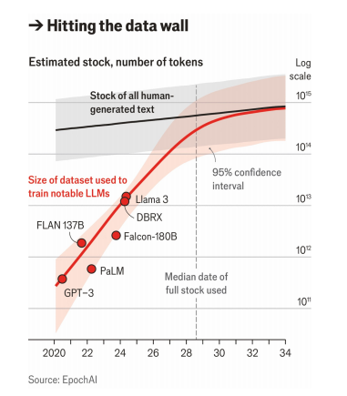

# AI firms will soon exhaust most of the internet’s data

Can they create more?

原文：

In 2006 fei-fei li, then at the University of Illinois, now at Stanford

University, saw how mining the internet might help to transform AI research.

Linguistic research had identified 80,000 “noun synonym sets”, or synsets:

groups of synonyms that described the same sort of thing. The billions of

images on the internet, Dr Li reckoned, must offer hundreds of examples of

each synset. Assemble enough of them and you would have an AI training

resource far beyond anything the field had ever seen. “A lot of people are

paying attention to models,” she said. “Let’s pay attention to data.” The

result was ImageNet.

2006年，当时在伊利诺伊大学，现在在斯坦福大学的李飞飞看到了挖掘互联网可能有助于改变人工智能研究。语言学研究已经确定了80，000个“名词同义词集”，或同义词集:描述同一类事物的同义词组。李博士认为，互联网上的数十亿张图片一定提供了每一个同义词的数百个例子。聚集足够多的图片，你将拥有一个远远超出这个领域所见的人工智能训练资源。“很多人都在关注模型，”她说。“还是关注数据吧。”结果是ImageNet。

原文：

The internet provided not only the images, but also the resources for

labelling them. Once search engines had delivered pictures of what they took

to be dogs, cats, chairs or whatever, these images were inspected and

annotated by humans recruited through Mechanical Turk, a crowdsourcing

service provided by Amazon which allows people to earn money by doing

mundane tasks. The result was a database of millions of curated, verified

images. It was through using parts of ImageNet for its training that, in 2012,

a program called AlexNet demonstrated the remarkable potential of “deep

learning”—that is to say, of neural networks with many more layers than had

previously been used. This was the beginning of the AI boom, and of a

labelling industry designed to provide it with training data.

互联网不仅提供了图片，还提供了标注图片的资源。一旦搜索引擎提供了他们认为是狗、猫、椅子或任何东西的图片，这些图片就会被通过Mechanical Turk招募的人检查和注释，这是亚马逊提供的众包服务，允许人们通过做平凡的任务来赚钱。其结果是一个包含数百万经过整理和验证的图像的数据库。正是通过使用ImageNet的部分内容进行训练，2012年，一个名为AlexNet的程序展示了“深度学习”的非凡潜力——也就是说，神经网络的层数比以前多得多。这是人工智能繁荣的开端，也是旨在为其提供训练数据的标签行业的开端。

学习：

do mundane tasks：做平常的任务

curated：仔细挑选并展览的

原文：

The later development of large language models (LLMs) also depended on

internet data, but in a different way. The classic training exercise for an LLM is

not predicting what word best describes the contents of an image; it is

predicting what a word cut from a piece of text is, on the basis of the other

words around it.

大型语言模型(LLM)后来的发展也依赖于互联网数据，但方式不同。LLM的经典训练练习不是预测哪个词最能描述图像的内容；它是根据周围的其他单词来预测从一段文本中剪下的单词是什么。

原文：

In this sort of training there is no need for labelled and curated data; the

system can blank out words, take guesses and grade its answers in a process

known as “self-supervised training”. There is, though, a need for copious

data. The more text the system is given to train on, the better it gets. Given

that the internet offers hundreds of trillions of words of text, it became to LLMs

what aeons of carbon randomly deposited in sediments have been to modern

industry: something to be refined into miraculous fuel.

在这种训练中，不需要标记和精选的数据；该系统可以在一个被称为“自我监督训练”的过程中，删去单词，进行猜测并给答案打分。然而，这需要大量的数据。系统接受的训练文本越多，效果就越好。鉴于互联网提供了数十万亿字的文本，对于LLMs来说，随机沉积在沉积层中的亿万年碳对于现代工业来说是什么:某种可以提炼为神奇燃料的东西。

学习：

copious：美 [ˈkoʊpiəs] 丰富的；大量的；充足的；

copious data：大量的数据

aeon：美 [ˈiən]  永恒；万古；极长的时期

aeons of carbon：亿万年的碳

sediment：沉积层

miraculous：美 [mɪˈrækjələs] 不可思议的；超自然的；非凡的

原文：

Common Crawl, an archive of much of the open internet including 50bn

web pages, became widely used in AI research. Newer models supplemented

it with data from more and more sources, such as Books3, a widely used

compilation of thousands of books. But the machines’ appetites for text have

grown at a rate the internet cannot match. Epoch AI, a research firm, estimates

that, by 2028, the stock of high-quality textual data on the internet will all

have been used. In the industry this is known as the “data wall”. How to deal

with this wall is one of AI’s great looming questions, and perhaps the one

most likely to slow its progress.

Common Crawl是大部分开放互联网的档案，包括500亿个网页，被广泛用于人工智能研究。更新的模型补充了越来越多来源的数据，如Books3，这是一个广泛使用的数千本书的汇编。但是机器对文本的需求增长速度是互联网无法比拟的。研究公司Epoch AI估计，到2028年，互联网上的高质量文本数据将全部被使用。在业内，这被称为“数据墙”。如何处理这堵墙是人工智能面临的一个重大问题，或许也是最有可能减缓其进展的问题。

学习：

compilation：美 [ˌkɑːmpɪˈleɪʃn] 选编；汇编；选辑

textual data：文本数据

looming：迫在眉睫的

原文：

One approach is to focus on data quality rather than quantity. AI labs do not

simply train their models on the entire internet. They filter and sequence

data to maximise how much their models learn. Naveen Rao of Databricks,

an AI firm, says that this is the “main differentiator” between AI models on the

market. “True information” about the world obviously matters; so does lots

of “reasoning”. That makes academic textbooks, for example, especially

valuable. But setting the balance between data sources remains something of

a dark art. What is more, the ordering in which the system encounters

different types of data matters too. Lump all the data on one topic, like

maths, at the end of the training process, and your model may become

specialised at maths but forget some other concepts.

一种方法是关注数据质量而不是数量。人工智能实验室不是简单地在整个互联网上训练他们的模型。他们对数据进行过滤和排序，以最大化模型的学习量。人工智能公司Databricks的Naveen Rao表示，这是市场上人工智能模型之间的“主要区别”。关于世界的“真实信息”显然很重要；很多“推理”也是如此。例如，这使得学术教科书特别有价值。但是在数据源之间建立平衡仍然是一门黑暗的艺术。此外，系统遇到不同类型数据的顺序也很重要。在训练过程结束时，将所有数据集中在一个主题上，比如数学，你的模型可能会变得专注于数学，但忘记了其他一些概念。

学习：
sequence：按顺序排列；确定顺序；顺序连接；序列化

differentiator：美 [dɪfə'renʃɪeɪtə] 区分者

lump：把…混为一谈；把…归并一起（或合起来考虑）；

原文：

These considerations can get even more complex when the data are not just

on different subjects but in different forms. In part because of the lack of

new textual data, leading models like OpenAI’s GPT-4o and Google’s Gemini

are now let loose on image, video and audio files as well as text during their

self-supervised learning. Training on video is hardest given how dense with

data points video files are. Current models typically look at a subset of

frames to simplify things.

当数据不仅仅是关于不同的主题，而且是以不同的形式出现时，这些考虑会变得更加复杂。部分是因为缺乏新的文本数据，像OpenAI的GPT-4o和谷歌的Gemini这样的领先模型现在可以在自我监督学习过程中自由处理图像、视频和音频文件以及文本。鉴于视频文件的数据点非常密集，视频训练是最困难的。当前的模型通常着眼于帧的子集来简化事情。

学习：

let loose：放开，自由使用

>解释和例子
>
>**Let loose** 在这里的意思是“放开”或“释放”，表示允许某物自由活动或使用。通常用于描述某物被允许在不受限制的环境中运作或表现。
>
>例子
>
>1. **Let loose in a park**:
>   - **原句**: The children were let loose in the park to play freely.
>   - **翻译**: 孩子们被放开在公园里自由玩耍。
>
>2. **Let loose with ideas**:
>   - **原句**: During the brainstorming session, everyone was let loose with their ideas.
>   - **翻译**: 在头脑风暴会议期间，每个人都可以自由表达自己的想法。
>
>3. **Let loose the dogs**:
>   - **原句**: The guard let loose the dogs to chase the intruders.
>   - **翻译**: 保安放开狗去追赶入侵者。

原文：

Whatever models are used, ownership is increasingly recognised as an issue.

The material used in training LLMs is often copyrighted and used without

consent from, or payment to, the rights holders. Some AI models peep behind

paywalls. Model creators claim this sort of thing falls under the “fair use”

exemption in American copyright law. AI models should be allowed to read

copyrighted material when they learn, just as humans can, they say. But as

Benedict Evans, a technology analyst, has put it, “a difference in scale” can

lead to “a difference in principle”.

无论使用何种模式，所有权越来越被视为一个问题。用于训练LLMs的材料通常是有版权的，使用时没有得到权利持有人的同意或支付给权利持有人。一些人工智能模型在付费墙后窥视。模型创造者声称这类事情属于美国版权法中的“合理使用”豁免。他们说，人工智能模型应该被允许在学习时阅读有版权的材料，就像人类一样。但正如技术分析师本尼迪克特·埃文斯所说，“规模上的差异”会导致“原则上的差异”。

学习：

ownership：所有权；物主身份

consent：同意

peep：偷窥；偷看；

*The best labellers can earn up to $100 an hour*

原文：

Different rights holders are taking different tactics. Getty Images has sued

Stability AI, an image-generation firm, for unauthorised use of its image store.

The *New York Times* has sued OpenAI and Microsoft for copyright

infringement of millions of articles. Other papers have struck deals to license

their content. News Corp, owner of the *Wall Street Journal*, signed a deal

worth $250m over five years. (*The Economist* has not taken a position on its

relationship with AI firms.) Other sources of text and video are doing the

same. Stack Overflow, a coding help-site, Reddit, a social-media site, and X

(formerly Twitter) are now charging for access to their content for training.

不同的权利人采取不同的策略。Getty Images起诉图像生成公司Stability AI未经授权使用其图像商店。《纽约时报》已经起诉OpenAI和微软侵犯了数百万篇文章的版权。其他报纸已经达成协议授权其内容。《华尔街日报》的所有者新闻集团签署了一份价值2 . 5亿美元的五年期协议。(《经济学人》尚未就其与人工智能公司的关系表明立场。)其他文字和视频来源也在这么做。一个编码帮助网站Stack Overflow，一个社交媒体网站Reddit和X(以前的Twitter)现在对访问他们的内容用来训练收费。

学习：

sue：起诉

infringement：美 [ɪnˈfrɪndʒmənt] 侵犯；侵权

strike deals：达成协议

原文：

The situation differs between jurisdictions. Japan and Israel have a

permissive stance to promote their AI industries. The European Union has no

generic “fair use” concept, so could prove stricter. Where markets are set up,

different types of data will command different prices: models will need

access to timely information from the real world to stay up to date.

不同管辖区的情况不同。日本和以色列对促进其人工智能产业持宽容态度。欧盟没有通用的“公平使用”概念，所以可能会更严格。在市场建立的地方，不同类型的数据将获得不同的价格:模型将需要从真实世界获得及时的信息以保持更新。

学习：

jurisdictions：美 [ˌdʒuərisˈdikʃənz] 管辖权；司法权；审判权；权限；

原文：

Model capabilities can also be improved when the version produced by self-

supervised learning, known as the pre-trained version, is refined through

additional data in post-training. “Supervised fine-tuning”, for example,

involves feeding a model question-and-answer pairs collected or handcrafted

by humans. This teaches models what good answers look like.

“Reinforcement-learning from human feedback” (RLHF), on the other hand,

tells them if the answer satisfied the questioner (a subtly different matter).

当通过自监督学习产生的版本(称为预训练版本)通过后训练中的额外数据被精炼时，模型能力也可以被提高。例如，“监督微调”涉及向模型输入由人类收集或手工制作的问答对。这教会了模型什么是好的答案。另一方面，“基于人类反馈的强化学习”(RLHF)告诉他们答案是否令提问者满意(这是一个微妙的不同问题)。

学习：

handcrafted：手工制作的；

原文：

In RLHF users give a model feedback on the quality of its outputs, which are

then used to tweak the model’s parameters, or “weights”. User interactions

with chatbots, such as a thumbs-up or -down, are especially useful for RLHF.

This creates what techies call a “data flywheel”, in which more users lead to

more data which feeds back into tuning a better model. AI startups are keenly

watching what types of questions users ask their models, and then collecting

data to tune their models on those topics.

在RLHF中，用户对模型输出的质量给出反馈，然后用于调整模型的参数或“权重”。用户与聊天机器人的交互，如竖起大拇指或点踩，对RLHF特别有用。这就产生了技术人员所说的“数据飞轮”，更多的用户产生更多的数据，这些数据反馈到调整更好的模型中。人工智能初创公司敏锐地观察用户向他们的模型提出什么类型的问题，然后收集数据，根据这些主题调整他们的模型。

学习：

flywheel：飞轮

## **Scale it up**

原文：

As pre-training data on the internet dry up, post-training is more important.

Labelling companies such as Scale AI and Surge AI earn hundreds of millions

of dollars a year collecting post-training data. Scale recently raised $1bn on

a $14bn valuation. Things have moved on from the Mechanical Turk days:

the best labellers earn up to $100 an hour. But, though post-training helps

produce better models and is sufficient for many commercial applications, it

is ultimately incremental.

随着网上预训练数据的枯竭，训练后就更重要了。Scale AI和Surge AI等标签公司每年通过收集post-training数据赚取数亿美元。Scale最近以140亿美元的估值融资10亿美元。Mechanical Turk 时代已经过去了:最好的标注员每小时能赚100美元。但是，尽管post-training有助于产生更好的模型，并且足以满足许多商业应用，但它最终是渐进的。

学习：

data dry up: 数据用完

原文：

Rather than pushing the data wall back bit by bit, another solution would be

to jump over it entirely. One approach is to use synthetic data, which are

machine-created and therefore limitless. AlphaGo Zero, a model produced

by DeepMind, a Google subsidiary, is a good example. The company’s first

successful Go-playing model had been trained using data on millions of

moves from amateur games. AlphaGo Zero used no pre-existing data.

Instead it learned Go by playing 4.9m matches against itself over three days,

noting the winning strategies. That “reinforcement learning” taught it how to

respond to its opponent’s moves by simulating a large number of possible

responses and choosing the one with the best chance of winning.

另一种解决方案是完全跳过数据墙，而不是一点一点地推倒数据墙。一种方法是使用合成数据，这是机器创造的，因此是无限的。谷歌子公司DeepMind生产的模型AlphaGo Zero就是一个很好的例子。该公司首个成功的围棋模型是利用业余棋手数百万步棋的数据训练出来的。AlphaGo Zero没有使用预先存在的数据。相反，它通过在三天内与自己进行490万场对弈来学习围棋，并记录获胜策略。这种“强化学习”通过模拟大量可能的反应，并选择最有可能获胜的反应，教会了它如何应对对手的举动。

学习：

subsidiary：美 [səbˈsɪdieri] 子公司；分公司；附属公司

原文：

A similar approach could be used for LLMs writing, say, a maths proof, step

by-step. An LLM might build up an answer by first generating many first steps.

A separate “helper” AI, trained on data from human experts to judge quality,

would identify which was best and worth building on. Such AI-produced

feedback is a form of synthetic data, and can be used to further train the first

model. Eventually you might have a higher-quality answer than if the LLM

answered in one go, and an improved LLM to boot. This ability to improve the

quality of output by taking more time to think is like the slower, deliberative

“system 2” thinking in humans, as described in a recent talk by Andrej

Karpathy, a co-founder of OpenAI. Currently, LLMs employ “system 1”

thinking, generating a response without deliberation, similar to a human’s

reflexive response.

类似的方法也可以用于LLMs写作，比如说，一步一步地写数学证明。LLM可能通过首先生成许多第一步来构建答案。一个独立的“助手”人工智能，根据来自人类专家的数据进行训练，以判断质量，将确定哪个是最好的，值得建立。这种人工智能产生的反馈是一种合成数据的形式，可以用来进一步训练第一个模型。最终，您可能会得到比LLM一次回答更高质量的答案，并得到一个改进的LLM。OpenAI的联合创始人Andrej Karpathy在最近的一次讲话中描述，这种通过花更多时间思考来提高输出质量的能力就像人类更慢、更谨慎的“系统2”思维。目前，LLM采用“系统1”思维，不经深思熟虑就产生反应，类似于人类的反射反应。

学习:

maths proof：数学证明

in one go：一次性；一下子；一口气

reflexive response：反射反应

原文：

The difficulty is extending the approach to settings like health care or

education. In gaming, there is a clear definition of winning and it is easier to

collect data on whether a move is advantageous. Elsewhere it is trickier.

Data on what is a “good” decision are typically collected from experts. But

that is costly, takes time and is only a patchy solution. And how do you

know if a particular expert is correct?

困难在于将这种方法扩展到医疗保健或教育等领域。在游戏中，赢有一个明确的定义，而且更容易收集一步棋是否有利的数据。其他地方则更棘手。关于什么是“好”决策的数据通常是从专家那里收集的。但是这种方法成本高，耗时长，而且只是一种权宜之计。你如何知道某个专家是否正确？

学习：

patchy：不均匀的；不完全的；不完整的；

>解释和例子
>
>**Patchy** 在这里的意思是“不完整的”或“不全面的”，表示某事物存在不连续的或不一致的部分，不能全面覆盖所需的领域或方面。
>
>例子
>
>1. **Patchy understanding**:
>   - **原句**: His understanding of the subject is patchy, with some concepts well grasped and others completely missed.
>   - **翻译**: 他对这个主题的理解是不完整的，有些概念掌握得很好，而有些则完全没有理解。
>
>2. **Patchy network coverage**:
>   - **原句**: The mobile network coverage in rural areas is patchy, with many regions experiencing frequent signal loss.
>   - **翻译**: 农村地区的移动网络覆盖是不完整的，许多地区经常会出现信号丢失。
>
>3. **Patchy evidence**:
>   - **原句**: The evidence presented in the case was patchy, with crucial information missing from the report.
>   - **翻译**: 案件中提出的证据是不全面的，报告中缺少关键信息。

原文：

It is clear that access to more data—whether culled from specialist sources,

generated synthetically or provided by human experts—is key to

maintaining rapid progress in AI. Like oilfields, the most accessible data

reserves have been depleted. The challenge now is to find new ones—or

sustainable alternatives. ■

很明显，获取更多数据——无论是从专业来源挑选的、合成生成的还是由人类专家提供的——是保持人工智能快速进步的关键。像油田一样，最容易获取的数据储备已经耗尽。现在的挑战是找到新的或者可持续的替代品。■

学习：

culled：美 [kʌlt] 拣选；挑选；剔除；（cull的过去分词）

oilfield：油田

## 后记

2024年8月2日18点29分于上海。

