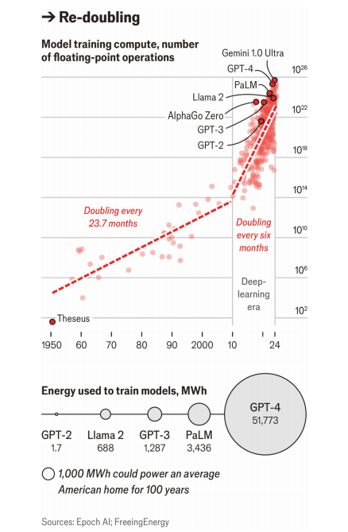

# The race is on to control the global supply chain for AI chips

The focus is no longer just on faster chips, but on more chips clustered together

原文：

In 1958 JACK KILBY at Texas Instruments engineered a silicon chip with a single

transistor. By 1965 Fairchild Semiconductor had learned how to make a

piece of silicon with 50 of the things. As Gordon Moore, one of Fairchild’s

founders, observed that year, the number of transistors that could fit on a

piece of silicon was doubling on a more or less annual basis.

1958年，德州仪器公司的杰克·基尔比设计了一个只有一个晶体管的硅芯片。到1965年，仙童半导体已经学会了如何用50种材料制作一块硅片。正如仙童的创始人之一戈登·摩尔在那一年观察到的那样，一块硅片上可以容纳的晶体管数量以每年大约一倍的速度增长。

学习：

Texas instruments：德州仪器

silicon chip：硅片

transistor：晶体管

Fairchild：仙童

Fairchild Semiconductor：仙童半导体

原文：

In 2023 Apple released the iPhone 15 Pro, powered by the A17 bionic chip,

with 19bn transistors. The density of transistors has doubled 34 times over

56 years. That exponential progress, loosely referred to as Moore’s law, has

been one of the engines of the computing revolution. As transistors became

smaller they got cheaper (more on a chip) and faster, allowing all the hand-

held supercomputing wonders of today. But the sheer number of numbers

that AI programs need to crunch has been stretching Moore’s law to its limits.

2023年，苹果发布了iPhone 15 Pro，由A17仿生芯片驱动，拥有190亿个晶体管。晶体管的密度在56年间翻了34倍。这种指数级的进步，被笼统地称为摩尔定律，是计算机革命的引擎之一。随着晶体管变得越来越小，它们变得越来越便宜(在一个芯片上更多)和更快，使得今天所有的手持超级计算奇迹成为可能。但是人工智能程序需要处理的数据数量已经将摩尔定律延伸到了极限。

学习：

bionic：美 [baɪˈɑnɪk] 仿生学的；仿生技术的

hand-held：手持的；便携的；轻便的；

crunch：解决（问题或困难）；（快速大量地）处理信息

sheer: 庞大的

the sheer number of: 大量的

>解释和例子
>
>**Sheer** 在这里的意思是“纯粹的”或“庞大的”，用来强调数量、程度或规模的巨大。
>
> 例子
>
>1. **Sheer size**:
>   - **原句**: The sheer size of the mountain left the climbers in awe.
>   - **翻译**: 山的庞大规模让登山者们惊叹不已。
>
>2. **Sheer volume**:
>   - **原句**: The sheer volume of data generated by social media platforms each day is staggering.
>   - **翻译**: 社交媒体平台每天生成的庞大数据量令人震惊。
>
>3. **Sheer force**:
>   - **原句**: The sheer force of the hurricane destroyed entire neighborhoods.
>   - **翻译**: 飓风的巨大威力摧毁了整个社区。
>
>4. **Sheer number**:
>   - **原句**: The sheer number of applications for the job overwhelmed the hiring committee.
>   - **翻译**: 庞大的求职申请数量让招聘委员会不堪重负。

原文：

The neural networks found in almost all modern AI need to be trained in order

to ascertain the right “weights” to give their billions, sometimes trillions, of

internal connections. These weights are stored in the form of matrices, and

training the model involves manipulating those matrices, using maths. Two

matrices—sets of numbers arrayed in rows and columns—are used to

generate a third such set; each number in that third set is produced by

multiplying together all the numbers in a row in the first set with all those in

a column of the second and then adding them all up. When the matrices are

large, with thousands or tens of thousands of rows and columns, and need to

be multiplied again and again as training goes on, the number of times

individual numbers have to be multiplied and added together becomes huge.

几乎所有现代AI中的神经网络都需要被训练，以确定正确的“权重”,为它们提供数十亿，有时数万亿的内部连接。这些权重以矩阵的形式存储，训练模型包括使用数学来操作这些矩阵。两个矩阵——按行和列排列的数字集合——用于生成第三个这样的集合；第三个集合中的每个数字都是通过将第一个集合中一行中的所有数字与第二个集合中一列中的所有数字相乘，然后将它们相加而得到的。当矩阵很大，有几千或几万行和列，并且随着训练的进行需要一次又一次地相乘时，单个数字相乘和相加的次数变得巨大。

学习：
ascertain：美 [ˌæsərˈteɪn] 确定；查明；弄清；发现；核实；确证；

原文：

The training of neural nets, though, is not the only objective that requires

lightning-fast matrix multiplication. So does the production of high-quality

video images that make computer games fun to play: and 25 years ago that

was a far larger market. To serve it Nvidia, a chipmaker, pioneered the

design of a new sort of chip, the graphics-processing unit (GPU), on which

transistors were laid out and connected in a way that let them do lots of

matrix multiplications at once. When applied to AI, this was not their only

advantage over the central processing units (CPUs) used for most applications:

they allowed larger batches of training data to be used. They also ate up a lot

less energy.

然而，神经网络的训练并不是需要闪电般快速矩阵乘法的唯一目标。让电脑游戏变得有趣的高质量视频图像的制作也是如此:25年前，这是一个大得多的市场。为了满足这一需求，芯片制造商Nvidia率先设计了一种新型芯片——图形处理器(GPU ),在这种芯片上，晶体管的布局和连接方式可以让它们同时进行大量的矩阵乘法运算。当应用于人工智能时，这不是他们相对于大多数应用程序使用的中央处理器(CPU)的唯一优势:他们允许使用更大批量的训练数据。它们消耗的能量也少了很多。

学习：

objective：目标；目的

lighting-fast：快如闪电的          

chipmaker：芯片制造商

lay out：布局

eat up：消耗

>解释和例子
>
>**Eat up** 在这里的意思是“消耗大量的”。它通常用来表示某个过程或活动需要大量资源，例如时间、精力、金钱或能量。
>
>例子
>
>1. **Energy consumption**:
>   - **原句**: Modern air conditioners eat up a lot of electricity.
>   - **翻译**: 现代空调消耗大量电力。
>
>2. **Time consumption**:
>   - **原句**: The new software update ate up most of the technician's day.
>   - **翻译**: 新的软件更新耗费了技术员大部分的时间。
>
>3. **Resource consumption**:
>   - **原句**: Hosting a large event eats up a significant portion of the company’s budget.
>   - **翻译**: 举办大型活动消耗了公司预算的很大一部分。
>
>4. **Data consumption**:
>   - **原句**: Streaming high-definition videos eats up a lot of mobile data.
>   - **翻译**: 流媒体播放高清影片会消耗大量的移动数据。

*GPUs remain 10-100 times more cost-efficient and up to 1,000 times faster than CPUs*

原文：

Training AlexNet, the model which ushered in the age of “deep learning” in

2012, meant assigning weights to 60m internal connections. That required

4.7 x 10^17 floating-point operations (FLOP); each FLOP is broadly equivalent to

adding or multiplying two numbers. Until then, that much computation

would have been out of the question. Even in 2012, using the best CPUs would

not just have required a lot more time and energy but also simplifying the

design. The system that trained AlexNet did all its phenomenal FLOPping with just two GPUs.

在2012年开创了“深度学习”时代的AlexNet模型的训练，意味着给6000万个内部连接分配权重。这需要4.7倍10^17浮点运算(flop)；每个FLOP大致相当于两个数的相加或相乘。在那之前，这么多的计算是不可能的。即使在2012年，使用最好的CPU不仅需要更多的时间和精力，还需要简化设计。训练AlexNet的系统只用了两个GPU就完成了所有惊人的浮点运算。

学习：

usher in：开创，引入

usher in the age of：开创xxx的时代

out of the question：不可能；办不到；不允许

原文：

A recent report from Georgetown University’s Centre for Emerging

Technology says GPUs remain 10-100 times more cost-efficient and up to

1,000 times faster than CPUs when used for training models. Their availability

was what made the deep-learning boom possible. Large language models

(LLMs), though, have pushed the demand for calculation even further.

乔治城大学新兴技术中心(Centre for Emerging Technology)最近的一份报告称，在用于训练模型时，GPU的成本效率仍是10-100倍，速度比CPU快1000倍。它们的可用性使得深度学习的繁荣成为可能。然而，大型语言模型(LLM)进一步推动了对计算的需求。

## **Transformers are go**

原文：

In 2018 Alec Radford, a researcher at OpenAI, developed a generative pre-

trained transformer, or GPT, using the “transformer” approach described by

researchers at Google the year before. He and his colleagues found the

model’s ability to predict the next word in a sentence could reliably be

improved by adding training data or computing power. Getting better at

predicting the next word in a sentence is no guarantee a model will get better

at real-world tasks. But so far the trend embodied in those “scaling laws” has

held up

2018年，OpenAI的研究员亚历克·拉德福德使用谷歌研究人员前一年描述的“transformer”方法，开发了一种生成性预训练transformer，或GPT。他和他的同事发现，模型预测句子中下一个单词的能力可以通过添加训练数据或计算能力来可靠地提高。更好地预测句子中的下一个单词并不能保证模型在现实世界的任务中也会更好。但到目前为止，体现在这些“scaling law”中的趋势依然存在

学习：

embodied：使具体化；体现；包含；象征；（embody的过去式）          

hold up: 继续适用；保持有效

>解释和例子
>
>**Hold up** 在这里的意思是“保持有效”或“继续适用”。它表示某个理论、趋势或现象在一段时间内仍然有效或成立。
>
>例子
>
>1. **Theoretical validity**:
>   - **原句**: The theory of evolution has held up despite numerous challenges.
>   - **翻译**: 尽管面临众多挑战，进化论依然有效。
>
>2. **Market trend**:
>   - **原句**: The bullish trend in the stock market has held up for the past year.
>   - **翻译**: 过去一年中，股市的牛市趋势一直保持有效。
>
>3. **Scientific findings**:
>   - **原句**: Early findings on the effectiveness of the vaccine have held up after extensive testing.
>   - **翻译**: 在广泛测试后，关于疫苗有效性的早期发现仍然有效。
>
>4. **Technological performance**:
>   - **原句**: The performance of the new engine design has held up under various conditions.
>   - **翻译**: 新引擎设计在各种条件下的表现依然出色。

原文：

As a result LLMs have grown larger. Epoch AI, a research outfit, estimates that

training GPT-4 in 2022 required 2 x 10^25 FLOP, 40m times as many as were used

for AlexNet a decade earlier, and cost about $100m. Gemini-Ultra, Google’s

most powerful model, released in 2024, is reported to have cost twice as

much; Epoch AI reckons it may have required 5 x 10^25 FLOP. These totals are

incomprehensibly big, comparable to all the stars in all the galaxies of the

observable universe, or the drops of water in the Pacific Ocean.

结果，LLM变得越来越大。研究机构Epoch AI估计，2022年训练GPT-4需要2次10^25浮点运算，是10年前AlexNet的4000万倍，花费约1亿美元。据报道，2024年发布的谷歌最强大的型号Gemini-Ultra的价格是它的两倍；Epoch AI估计它可能需要5 x 10^25浮点运算。这些总量大得令人难以理解，堪比可观测宇宙中所有星系的所有stars，或者太平洋中的水滴。

学习：

outfit：机构

research outfit：研究机构

incomprehensibly：不能理解地; 不可思议地

incomprehensibly big：非常大

原文：

In the past the solution to excessive needs for computation has been a

modicum of patience. Wait a few years and Moore’s law will provide by

putting even more, even faster transistors onto every chip. But Moore’s law

has run out of steam. With individual transistors now just tens of nanometres

(billions of a metre) wide, it is harder to provide regular jumps in

performance. Chipmakers are still working to make transistors smaller, and

are even stacking them up vertically to squeeze more of them onto chips.

But the era in which performance increased steadily, while power

consumption fell, is over.

过去，解决过度计算需求的方法是一点耐心。再过几年，摩尔定律将会在每个芯片上安装更多、更快的晶体管。但是摩尔定律已经失去了动力。现在单个晶体管只有几十纳米(一米几十亿)宽，很难在性能上提供有规律的提升。芯片制造商仍在努力将晶体管做得更小，甚至将它们垂直堆叠起来，以便将更多的晶体管集成到芯片上。但是，性能稳步提升而功耗下降的时代已经结束。

学习：

modicum：美 [ˈmɑːdɪkəm] 一点点；小部分；微量

run out of steam： 筋疲力尽；精疲力竭；失去动力；

>**Run out of steam** 在这里的意思是“失去动力”或“不能再继续增长”。它表示某个过程、趋势或现象达到了其极限，无法再继续保持之前的进展或发展速度。
>
>例子
>
>1. **Project momentum**:
>   - **原句**: The project started off strong but has run out of steam due to lack of funding.
>   - **翻译**: 这个项目开始时势头很强，但由于缺乏资金已经失去了动力。
>
>2. **Economic growth**:
>   - **原句**: After several years of rapid expansion, the economy has run out of steam.
>   - **翻译**: 在经历了几年的快速扩张后，经济增长已经停滞。
>
>3. **Sports performance**:
>   - **原句**: The team ran out of steam in the second half and couldn't keep up with their opponents.
>   - **翻译**: 这支球队在下半场失去了动力，无法跟上对手的节奏。
>
>4. **Personal energy**:
>   - **原句**: She was excited about the new project at first, but ran out of steam after a few months.
>   - **翻译**: 她起初对新项目很兴奋，但几个月后就失去了动力。

原文：

As Moore’s law has slowed down and the desire to build ever-bigger models

has taken off, the answer has been not faster chips but simply more chips.

Insiders suggest GPT-4 was trained on 25,000 of Nvidia’s A100 GPUs, clustered

together to reduce the loss of time and energy that occurs when moving data

between chips.

随着摩尔定律放缓，建造更大模型的愿望开始高涨，答案不是更快的芯片，而是更多的芯片。内部人士表示，GPT-4是在25，000个英伟达的A100 GPUs上训练的，这些GPU聚集在一起，以减少在芯片之间移动数据时发生的时间和能量损失。

原文：

Much of the $200bn that Alphabet, Amazon, Meta and Microsoft plan to

invest in 2024 will go on AI-related stuff, up 45% from last year; much of that

will be spent on such clusters. Microsoft and OpenAI are reportedly planning

a $100bn cluster in Wisconsin called Stargate. Some in Silicon Valley talk of

a $1trn cluster within the decade. Such infrastructure needs a lot of energy.

In March Amazon bought a data centre next door to a nuclear power plant

that can supply it with a gigawatt of power.

Alphabet、亚马逊、Meta和微软计划在2024年投资的2000亿美元中的大部分将用于人工智能相关的东西，比去年增长45%；其中很大一部分将用于此类集群。据报道，微软和OpenAI计划在威斯康星州投资1000亿美元建立一个名为Stargate的集群。硅谷的一些人谈到了十年内价值1万亿美元的集群。这样的基础设施需要大量能源。三月份，亚马逊买下了一座核电站旁边的数据中心，该核电站可以为其提供十亿瓦的电力。

学习：

next door to：隔壁

gigawatt：十亿瓦特；千兆瓦          

原文：

The investment does not all go on GPUs and the power they draw. Once a

model is trained, it has to be used. Putting a query to an AI system typically

requires roughly the square root of the amount of computing used to train it.

But that can still be a lot of calculation. For GPT-3, which required 3 x 10^23 FLOP

to train, a typical “inference” can take 3 x 10^11 FLOP. Chips known as FPGAs and

ASICs, tailored for inference, can help make running AI models more efficient

than using GPUs.

投资并不都是在GPU和它们所消耗的能量上。一旦一个模型被训练出来，它就必须被使用。将一个查询放到一个人工智能系统中通常需要训练它的计算量的平方根。但这仍然需要大量的计算。对于GPT-3，它需要3次10^23浮点运算来训练，一个典型的“推理”可以采取3次10^11浮点运算。为推理量身定制的芯片FPGAs和ASICs可以帮助运行人工智能模型，比使用GPU更有效。

原文：

Nevertheless, it is Nvidia that has done best out of the boom. The company

is now worth $2.8trn, eight times more than when ChatGPT was launched in 

\2022. Its dominant position does not only rest on its accumulated know-how

in GPU-making and its ability to mobilise lots of capital (Jensen Huang, its

boss, says Nvidia’s latest chips, called Blackwell, cost $10bn to develop).

The company also benefits from owning the software framework used to

program its chips, called CUDA, which is something like the industry standard.

And it has a dominant position in the networking equipment used to tie the

chips together.

然而，Nvidia在这次繁荣中做得最好。该公司现在的市值为2.8万亿美元，是2022年ChatGPT成立时的8倍。它的主导地位不仅仅在于它在GPU制造方面积累的技术和它调动大量资本的能力(它的老板黄仁勋说Nvidia最新的芯片Blackwell花费了100亿美元来开发)。该公司还受益于拥有用于编程其芯片的软件框架，称为CUDA，这是一种类似于行业标准的东西。它在用于将芯片连接在一起的网络设备中占据主导地位。

学习：

dominant position：统治地位

rest on：依靠；支撑在…上；被支持在…上；基于

know-how：专业技能；专业知识；

mobilise：动员；调动；使流通          

mobilise lots of capital：调动大量资本

## **Supersize me**

原文：

Competitors claim to see some weaknesses. Rodrigo Liang of SambaNova

Systems, another chip firm, says that Nvidia’s postage-stamp-size chips have

several disadvantages which can be traced back to their original uses in

gaming. A particularly big one is their limited capacity for moving data on

and off (as an entire model will not fit on one GPU).

竞争对手声称看到了一些弱点。另一家芯片公司SambaNova Systems的Rodrigo Liang说，Nvidia的邮票大小的芯片有几个缺点，这些缺点可以追溯到它们最初在游戏中的用途。一个特别大的问题是它们移动数据的能力有限(因为一个GPU无法容纳整个模型)。

学习：

postage：邮资；邮费；

原文：

Cerebras, another competitor, markets a “wafer scale” processor that is

21.5cm across. Where GPUs now contain tens of thousands of separate “cores”

running calculations at the same time, this behemoth has almost a million.

Among the advantages the company claims is that, calculation-for

calculation, it uses only half as much energy as Nvidia’s best chip. Google

has devised its own easily customised “tensor-processing unit” (TPU) which

can be used for both training and inference. Its Gemini 1.5 AI model is able to

ingest eight times as much data at a time as GPT-4, partly because of that

bespoke silicon.

另一个竞争对手Cerebras推出了一款21.5厘米宽的“晶圆级”处理器。GPU现在包含数万个同时运行计算的独立“核心”，而这个庞然大物有近百万个。该公司声称的优势之一是，在每次计算中，它使用的能量只有英伟达最好芯片的一半。谷歌设计了自己的易于定制的“张量处理单元”(TPU)，可用于训练和推理。它的Gemini 1.5人工智能模型一次能够接收8倍于GPT 4号的数据，部分原因是定制的硅。

学习：

wafer：美 [ˈweɪfər] 晶圆；电子元件用薄片；

behemoth： 美 [bəˈhiməθ] 巨型企业；巨头；庞然大物；

devise：设计；发明

bespoke：订制的；订做的；专门制作的

calculation-for-calculation：在相同计算量下

>这里的 "calculation-for-calculation" 是一个比较短语，意思是 "在相同计算量下" 或 "每次计算"。它用于比较不同芯片在执行相同计算任务时的效率或能耗。
>
>例子
>
>1. **能效比较**:
>   - **原句**: Calculation-for-calculation, Cerebras's processor uses only half as much energy as Nvidia’s best chip.
>   - **翻译**: 在相同计算量下，Cerebras的处理器仅使用Nvidia最佳芯片一半的能量。
>
>2. **性能比较**:
>   - **原句**: Calculation-for-calculation, our new algorithm is twice as fast as the previous one.
>   - **翻译**: 在相同计算量下，我们的新算法是之前算法的两倍快。
>
>这个短语用于强调在执行相同任务时的性能或效率差异。

原文：

The huge and growing value of cutting-edge GPUs has been seized on for

geopolitical leverage. Though the chip industry is global, a small number of

significant choke-points control access to its AI-enabling heights. Nvidia’s

chips are designed in America. The world’s most advanced lithography

machines, which etch designs into silicon through which electrons flow, are

all made by ASML, a Dutch firm worth $350bn. Only leading-edge foundries

like Taiwan’s TSMC, a firm worth around $800bn, and America’s Intel have

access to this tool. And for many other smaller items of equipment the

pattern continues, with Japan being the other main country in the mix

尽管芯片行业是全球性的，但少数几个重要的瓶颈控制着通往人工智能高度的道路。英伟达的芯片是在美国设计的。世界上最先进的光刻机都是由价值3500亿美元的荷兰公司阿斯麦制造的，这些光刻机将设计蚀刻到电子流过的硅上。只有台积电(市值约8000亿美元)和美国的英特尔(Intel)等领先的代工厂才有机会使用这一工具。对于许多其他较小的设备项目，这种模式仍在继续，日本是组合中的另一个主要国家

学习：

choke-point：瓶颈

lithography：美 [ləˈθɑɡrəfi] 光刻法

lithography machine：光刻机

etch：美 [etʃ] 蚀刻；铭刻；凿出（玻璃、金属等上的文字或图画）

leading-edge：领先优势的；前沿的；尖端的          

原文 ：

These choke-points have made it possible for the American government to

enact harsh and effective controls on the export of advanced chips to China.

As a result the Chinese are investing hundreds of billions of dollars to create

their own chip supply chain. Most analysts believe China is still years

behind in this quest, but because of big investments by companies such as

Huawei, it has coped with export controls much better than America

expected.

这些瓶颈使得美国政府有可能对向中国出口先进芯片实施严厉而有效的控制。因此，中国正在投资数千亿美元来创建自己的芯片供应链。大多数分析师认为，中国在这方面仍落后多年，但由于华为等公司的巨额投资，中国应对出口管制的能力远超美国的预期。

学习：

quest：探求的目标（或任务）；寻求；

cope with：应对

原文：

America is investing, too. TSMC, seen as a potential prize or casualty if China

decided to invade Taiwan, is spending about $65bn on fabs in Arizona, with

about \$6.6bn in subsidies. Other countries, from India (\$10bn) to Germany

(\$16bn) to Japan (\$26bn) are increasing their own investments. The days in	

which acquiring AI chips has been one of AI’s biggest limiting factors may be

numbered. ■

美国也在投资。如果中国决定收复台湾，被视为潜在赢家或受害者的台积电，正斥资约650亿美元在亚利桑那州建造晶圆厂，其中包括约66亿美元的补贴。从印度(100亿美元)、德国(160亿美元)到日本(260亿美元)，其它国家都在增加自己的投资。获得人工智能芯片成为人工智能最大限制因素之一的日子可能屈指可数。■

学习：
casualty： 美 [ˈkæʒuəlti] 遇难者；受害者；

limiting factor：限制因素

## 后记

2024年8月2日21点00分于上海。

