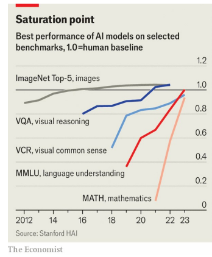

# GPT, Claude, Llama? How to tell which AI model is best

Beware model-makers marking their own homework

原文：

When Meta, the parent company of Facebook, announced its latest open-

source large language model (LLM) on July 23rd, it claimed that the most

powerful version of Llama 3.1 had “state-of-the-art capabilities that rival the

best closed-source models” such as GPT-4o and Claude 3.5 Sonnet. Meta’s

announcement included a table, showing the scores achieved by these and

other models on a series of popular benchmarks with names such as 

MMLU, GSM8K and GPQA.

当脸书的母公司Meta在7月23日宣布其最新的开源大型语言模型(LLM)时，它声称最强大的版本Llama 3.1具有“最先进的能力，可以与GPT-4o和Claude 3.5 Sonnet等最好的闭源模型相媲美”。Meta的公告包括一个表格，显示了这些模型和其他模型在一系列流行的基准测试中取得的成绩，如MMLU，GSM8K和GPQA。

原文：

On MMLU, for example, the most powerful version of Llama 3.1 scored 88.6%,

against 88.7% for GPT-4o and 88.3% for Claude 3.5 Sonnet, rival models

made by OpenAI and Anthropic, two AI startups, respectively. Claude 3.5

Sonnet had itself been unveiled on June 20th, again with a table of

impressive benchmark scores. And on July 24th, the day after Llama 3.1’s

debut, Mistral, a French AI startup, announced Mistral Large 2, its latest LLM,

with—you’ve guessed it—yet another table of benchmarks. Where do such

numbers come from, and can they be trusted?

例如，在MMLU上，最强大的版本Llama 3.1的得分为88.6%，而GPT-4o的得分为88.7%，Claude 3.5 Sonnet的得分为88.3%，这两个版本分别由两家人工智能初创公司OpenAI和Anthropic制作。6月20日，Claude 3.5 Sonnet也发布了，同样是令人印象深刻的基准分数表。7月24日，在Llama 3.1首次亮相后的第二天，法国人工智能初创公司Mistral宣布了其最新的Mistral Large 2，你可能已经猜到了，这是另一个基准表。这样的数字从何而来，是否可信？

原文：

Having accurate, reliable benchmarks for AI models matters, and not just for

the bragging rights of the firms making them. Benchmarks “define and drive

progress”, telling model-makers where they stand and incentivising them to

improve, says Percy Liang of the Institute for Human-Centred Artificial

Intelligence at Stanford University. Benchmarks chart the field’s overall

progress and show how AI systems compare with humans at specific tasks.

They can also help users decide which model to use for a particular job and

identify promising new entrants in the space, says Clémentine Fourrier, a

specialist in evaluating LLMs at Hugging Face, a startup that provides tools for

AI developers.

拥有准确、可靠的人工智能模型基准很重要，不仅仅是为了制造这些模型的公司的吹嘘资本。斯坦福大学以人为中心的人工智能研究所的Percy Liang说，基准“定义并推动进步”，告诉模型制作者他们的立场并激励他们改进。基准测试记录了该领域的整体进展，并显示了人工智能系统在特定任务上与人类相比的表现。为人工智能开发人员提供工具的初创公司Hugging Face评估LLM的专家Clémentine Fourrier表示，它们还可以帮助用户决定特定工作使用哪种模型，并确定该领域有前途的新进入者。

学习：

bragging rights：暂时的优势；炫耀的权利；吹嘘的资本          

chart：记录；追踪（发展、进展）

>
>这里的 "chart" 意思是“记录”或“描绘”。在这种情况下，"chart the field’s overall progress" 意味着记录并描绘AI领域的整体进展情况。
>
>例子：
>- Scientists chart the course of a storm to predict its path and potential impact.（科学家记录风暴的路线，以预测其路径和潜在影响。）
>- The book charts the rise and fall of ancient civilizations, detailing their achievements and eventual decline.（这本书记录了古代文明的兴衰，详细描述了它们的成就和最终的衰落。）
>
>在上述例子中，“chart” 都表示详细记录和描绘事物的发展过程。

原文：

But, says Dr Fourrier, benchmark scores “should be taken with a pinch of

salt”. Model-makers are, in effect, marking their own homework—and then

using the results to hype their products and talk up their company valuations.

Yet all too often, she says, their grandiose claims fail to match real-world

performance, because existing benchmarks, and the ways they are applied,

are flawed in various ways.

但是，Fourrier博士说，基准分数“不能全信”。实际上，模型制作者正在给给自己的作业打分——然后用结果来宣传他们的产品，抬高他们的公司估值。然而，她表示，他们夸大的说法往往与现实世界的表现不符，因为现有的基准以及应用基准的方式存在各种各样的缺陷。

学习：

a pinch of： 一点；一撮；少许          

hype：大肆宣传；炒作；夸大其词

talk up：吹捧；议论起来了, 畅谈,

grandiose：美 [ˈɡrændioʊs] 夸大的；华而不实的；不切实际的

are flawed：存在缺陷

>这里的 "marking their own homework" 意思是“自己给自己的作业打分”。在这种情况下，它比喻的是模型制作者自己评估他们的AI模型，并用这些评估结果来宣传他们的产品和提高公司估值。
>
>"Talk up" 意思是“吹捧”或“夸大”。在这种情况下，它指的是公司通过夸大其产品或服务的优点来提高其价值或声誉。
>
>例子：
>- When students are allowed to mark their own homework, the grades they give themselves might not be accurate.（当学生被允许自己给自己的作业打分时，他们给自己的分数可能不准确。）
>- The company talked up its new software, claiming it would revolutionize the industry, but users found it to be full of bugs.（这家公司吹捧其新软件，声称它将彻底改变行业，但用户发现它充满了漏洞。）
>
>在这些例子中，“marking their own homework” 表示自我评估可能带有偏见，而 “talk up” 表示夸大某事的优点以提升其声誉或价值。

原文：

One problem with benchmarks such as MMLU (massive multi-task language

understanding) is that they are simply too easy for today’s models. MMLU was

created in 2020 and consists of 15,908 multiple-choice questions, each with

four possible answers, across 57 topics including maths, American history,

science and law. At the time, most language models scored little better than

25% on MMLU, which is what you would get by picking answers at random;

OpenAI’s GPT-3 did best, with a score of 43.9%. But since then, models have

improved, with the best now scoring between 88% and 90%.

MMLU(大规模多任务语言理解)等基准测试的一个问题是，对于今天的模型来说，它们太简单了。MMLU创建于2020年，由15908道选择题组成，每道题有四个可能的答案，涵盖57个主题，包括数学、美国历史、科学和法律。当时，大多数语言模型在MMLU上的得分比25%好不了多少，这是你随机挑选答案得到的结果；OpenAI的GPT-3表现最好，得分为43.9%。但自那以后，模型有所改进，现在最好的得分在88%到90%之间。

学习：

multiple-choice questions：多选题

原文：

This means it is difficult to draw meaningful distinctions from their scores, a

problem known as “saturation” (see chart). “It’s like grading high-school

students on middle-school tests,” says Dr Fourrier. More difficult

benchmarks have been devised—MMLU-Pro has tougher questions and ten

possible answers rather than four. GPQA is like MMLU at PhD level, on selected

science topics; today’s best models tend to score between 50% and 60% on

it. Another benchmark, MuSR (multi-step soft reasoning), tests reasoning

ability using, for example, murder-mystery scenarios. When a person reads

such a story and works out who the killer is, they are combining an

understanding of motivation with language comprehension and logical

deduction. AI models are not so good at this kind of “soft reasoning” over

multiple steps. So far, few models score better than random on MuSR

这意味着很难从他们的分数中得出有意义的区别，这个问题被称为“分数饱和”(见图表)。“这就像在中学考试中给高中生打分一样，”Fourrier博士说。更难的基准已经被设计出来——MMLU-Pro有更难的问题和十个可能的答案，而不是四个。GPQA类似于博士级别的MMLU，针对选定的科学主题；当今最好的模型在这方面的得分往往在50%到60%之间。另一个基准是MuSR(多步软推理),它测试推理能力，比如使用神秘谋杀场景。当一个人读到这样一个故事，并想出谁是凶手时，他们是在把对动机的理解与语言理解和逻辑推理结合起来。人工智能模型不太擅长这种多步骤的“软推理”。到目前为止，很少有模型在MuSR上比瞎猜得分更高。

原文：

MMLU also highlights two other problems. One is that the answers in such tests

are sometimes wrong. A study carried out by Aryo Gema of the University

of Edinburgh and colleagues, published in June, found that, of the questions

they sampled, 57% of MMLU’s virology questions and 26% of its logical-fallacy

ones contained errors. Some had no correct answer; others had more than

one. (The researchers cleaned up the MMLU questions to create a new

benchmark, MMLU-Redux.)

MMLU还强调了另外两个问题。一是这类测试的答案有时是错误的。爱丁堡大学的Aryo Gema和他的同事进行的一项研究在6月发表，研究发现，在他们抽样的问题中，MMLU 57%的病毒学问题和26%的逻辑谬误问题包含错误。有些问题没有正确答案；其他问题有不止一个答案。(研究人员清理了MMLU问题，创建了一个新的基准，MMLU-Redux。)

学习：

virology：美 [vaɪˈrɑlədʒi] 病毒学

fallacy：谬误；谬论；

原文：

Then there is a deeper issue, known as “contamination”. LLMs are trained

using data from the internet, which may include the exact questions and

answers for MMLU and other benchmarks. Intentionally or not, the models may

be cheating, in short, because they have seen the tests in advance. Indeed,

some model-makers may deliberately train a model with benchmark data to

boost its score. But the score then fails to reflect the model’s true ability.

One way to get around this problem is to create “private” benchmarks for

which the questions are kept secret, or released only in a tightly controlled

manner, to ensure that they are not used for training (GPQA does this). But then

only those with access can independently verify a model’s scores.

还有一个更深层次的问题，叫做“污染”。LLM使用来自互联网的数据进行训练，这些数据可能包括MMLU和其他基准的确切问题和答案。不管是有意还是无意，模型们可能都在作弊，简而言之，因为它们已经提前看过测试了。事实上，一些模型制作者可能会故意用基准数据来训练模型，以提高其得分。但是这个分数不能反映模型的真实能力。解决这个问题的一个方法是创建“私有”基准，对这些问题保密，或者以严格控制的方式发布，以确保它们不被用于培训(GPQA就是这样做的)。但是只有那些有权限的人才能独立验证一个模型的分数。

学习：
contamination：美 [kənˌtæmɪˈneɪʃn] 污染；污染物；弄脏

get around：绕过，解决

原文：

To complicate matters further, it turns out that small changes in the way

questions are posed to models can significantly affect their scores. In a

multiple-choice test, asking an AI model to state the answer directly, or to

reply with the letter or number corresponding to the correct answer, can

produce different results. That affects reproducibility and comparability.

让事情变得更复杂的是，事实证明，向模型提问的方式上的微小变化会显著影响它们的分数。在多项选择测试中，让一个AI模型直接陈述答案，或者用正确答案对应的字母或数字来回答，可以产生不同的结果。这会影响可复现性和可比性。

学习：

reproducibility：可复现

原文：

Automated testing systems are now used to test models against benchmarks

in a standardised manner. Dr Liang’s team at Stanford has built one such

system, called HELM (holistic evaluation of language models), which generates

leaderboards showing how a range of models perform on various

benchmarks. Dr Fourrier’s team at Hugging Face uses another such system,

EleutherAI Harness, to generate leaderboards for open-source models. These

leaderboards are more trustworthy than the tables of results provided by

model-makers, because the benchmark scores have been generated in a

consistent way

自动化测试系统现在被用来以标准化的方式对照基准测试模型。斯坦福大学梁博士的团队已经建立了一个这样的系统，称为HELM(语言模型的整体评估)，它可以生成排行榜，显示一系列模型在各种基准上的表现。Fourrier博士在Hugging Face的团队使用另一个这样的系统，EleutherAI Harness，为开源模型生成排行榜。这些排行榜比模型制作者提供的结果表更值得信赖，因为基准分数是以一致的方式生成的

学习：

holistic： 美 [hoʊˈlɪstɪk] 整体的；全面的；

## **The greatest trick** **AI** **ever pulled**

原文：

As models gain new skills, new benchmarks are being developed to assess

them. GAIA, for example, tests AI models on real-world problem-solving. (Some

of the answers are kept secret to avoid contamination.) NoCha (novel

challenge), announced in June, is a “long context” benchmark consisting of

1,001 questions about 67 recently published English-language novels. The

answers depend on having read and understood the whole book, which is

supplied to the model as part of the test. Recent novels were chosen because

they are unlikely to have been used as training data. Other benchmarks

assess models’ ability to solve biology problems or their tendency to

hallucinate.

随着模型获得新的技能，新的基准被开发来评估它们。例如，GAIA在现实世界解决问题的过程中测试人工智能模型。(部分答案保密，以免沾染。6月份公布的NoCha(小说挑战)是一个“长语境”基准，由67部最近出版的英语小说的1001个问题组成。答案取决于是否阅读并理解了整本书，这是作为测试的一部分提供给模型的。选择最近的小说是因为它们不太可能被用作训练数据。其他基准评估模型解决生物学问题的能力或产生幻觉的倾向。

原文：

But new benchmarks can be expensive to develop, because they often

require human experts to create a detailed set of questions and answers. One

answer is to use LLMs themselves to develop new benchmarks. Dr Liang is

doing this with a project called AutoBencher, which extracts questions and

answers from source documents and identifies the hardest ones.

但是开发新的基准可能会很昂贵，因为它们通常需要人类专家来创建一组详细的问题和答案。一个答案是使用LLM本身来开发新的基准。梁博士正在通过一个名为AutoBencher的项目进行这项工作，该项目从源文档中提取问题和答案，并识别出最难的问题和答案。

原文：

Anthropic, the startup behind the Claude LLM, has started funding the creation

of benchmarks directly, with a particular emphasis on AI safety. “We are

super-undersupplied on benchmarks for safety,” says Logan Graham, a

researcher at Anthropic. “We are in a dark forest of not knowing what the

models are capable of.” On July 1st the company began inviting proposals

for new benchmarks, and tools for generating them, which it will co-fund,

with a view to making them available to all. This might involve developing

ways to assess a model’s ability to develop cyber-attack tools, say, or its

willingness to provide advice on making chemical or biological weapons.

These benchmarks can then be used to assess the safety of a model before

public release.

Claude LLM背后的初创公司Anthropic已经开始直接资助基准的创建，特别强调人工智能的安全。Anthropic的研究员洛根·格雷厄姆说:“我们在安全基准方面供应严重不足”。"我们处在一片黑暗的森林中，不知道这些模型能做什么."7月1日，该公司开始为新的基准和生成基准的工具征求建议，并共同出资，以期让所有人都能使用。这些基准可以用来在公开发布之前评估模型的安全性。

原文：

Historically, says Dr Graham, AI benchmarks have been devised by

academics. But as AI is commercialised and deployed in a range of fields,

there is a growing need for reliable and specific benchmarks. Startups that

specialise in providing AI benchmarks are starting to appear, he notes. “Our

goal is to pump-prime the market,” he says, to give researchers, regulators

and academics the tools they need to assess the capabilities of AI models,

good and bad. The days of AI labs marking their own homework could soon

be over. ■

格雷厄姆博士说，从历史上看，人工智能基准是由学者设计的。但随着人工智能商业化并部署在一系列领域，对可靠和具体基准的需求越来越多。他指出，专门提供人工智能基准的初创公司开始出现。“我们的目标是刺激市场，”他说，为研究人员、监管者和学者提供他们需要的工具，以评估人工智能模型的能力，无论好坏。人工智能实验室自己批改作业的日子可能很快就要结束了。■

学习：
pump-prime：通过初始投资或资源注入来启动或刺激某个市场

>在这里，“pump-prime”指的是通过初始投资或资源注入来启动或刺激某个市场或行业的发展。这个词源自水泵的操作，意味着先用少量的水或力来启动水泵的运作，进而获得更大的水流。在商业或经济领域，这个术语通常用于描述政府或机构通过初步投资或支持来激活某个市场或行业。
>
>举个例子：
>
>假设政府希望促进绿色能源产业的发展，他们可能会提供初期的补贴或税收优惠给太阳能或风能公司。这种做法就是一种“pump-priming”，目的是通过初期的支持和激励，来推动整个绿色能源市场的发展和成熟。
>
>在这段话中，Dr. Graham的意思是，通过提供AI基准测试的工具和资源，初期支持研究人员、监管机构和学术界，使他们能够更好地评估AI模型的能力，从而推动整个AI基准测试市场的发展。

## 后记

2024年8月3日18点25分于上海。

