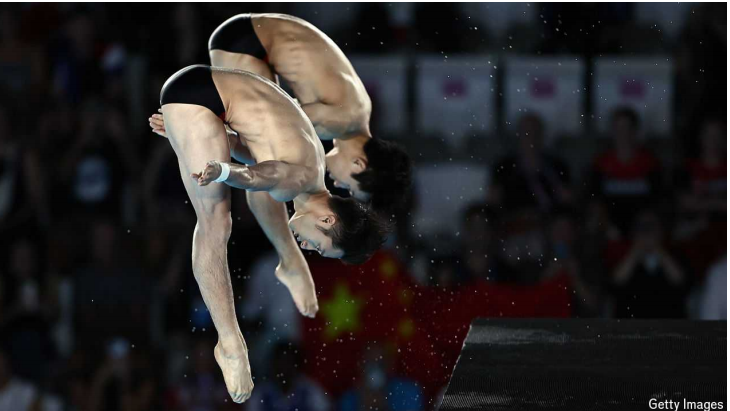
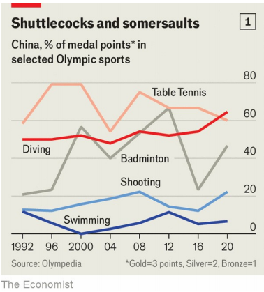
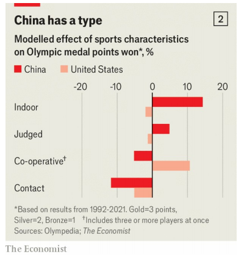

# Which Olympic sports is China good at?

The country’s athletes seem to prefer competing indoors and as individuals

原文：

On July 29th Lian Junjie and Yang Hao (pictured) leapt off a ten-metre-high

platform, twisting and flipping in near-perfect synchronisation. Before the

Olympic judges even posted their marks, Chinese fans celebrated. Then it

became official: the pair had won gold, beating divers from Britain. China

has won 50 gold medals in the sport of diving over the years, more than any

other country.

7月29日，Lian Junjie and Yang Hao(如图)从一个10米高的平台上跳下，以近乎完美的同步旋转和翻转。在奥运会裁判公布他们的分数之前，中国粉丝已经开始庆祝了。然后官方宣布:这对组合击败了英国的跳水运动员，赢得了金牌。多年来，中国在跳水运动中赢得了50枚金牌，比其他任何国家都多。

学习：

leapt：跳；（leap的过去式和过去分词）

divers：潜水员；跳水运动员；

原文：

Olympic medals are a source of prestige for China. The country boycotted

the games for decades because of the participation of Taiwan, which China

claims. When China returned in the 1980s it won fewer medals than its size

seemed to warrant. But as China grew richer, the state poured resources into

the training of athletes. Some have also been accused of doping. The upshot

is that China’s share of gold medals at the summer games has risen from 2%

in 1988 to 11% in 2021.

奥运奖牌是中国威望的来源。因为中国声称台湾的参与，中国抵制了几十年的奥运会。当中国在20世纪80年代回归时，它赢得的奖牌数少于它的规模。但是随着中国越来越富裕，国家投入大量资源训练运动员。有些人还被指控服用兴奋剂。结果是，中国在夏季奥运会上的金牌份额从1988年的2%上升到了2021年的11%。

学习：

prestige：美 [preˈstiːʒ] 声望；威望；威信；名望

pour resources into：投入资源

doping：服药；给…用兴奋剂；给…服麻醉剂；（dope的现在分词形式）

upshot：结果；结局；最终效果

原文：

China’s success tends to be concentrated in a handful of disciplines. Using

statistics compiled by Olympedia, a database of results, we analysed the

country’s performance at the summer games from 1992 to 2021. We

assigned points for each medal handed out (three for gold, two for silver and

one for bronze), then calculated China’s share of these points, or dominance

score, in each sport. A score of one means China won every medal in a

sport; a score of zero indicates that it won none.

中国的成功往往集中在少数几个学科。利用奥林匹克媒体(Olympedia)汇编的统计数据，我们分析了该国在1992年至2021年夏季奥运会上的表现。我们给每一枚奖牌打分(金牌3分，银牌2分和铜牌1分)，然后计算中国在每项运动中所占的分数，或者说优势分数。一分意味着中国赢得了一项运动的所有奖牌；零分表示它一分未得。

学习：

a handful of：一小撮；一把；少数

gold，silver，bronze 美 [brɑːnz]：金银铜

shuttlecocks：毽子；羽毛球；（shuttlecock的复数）

somersaults：筋斗；（somersault的复数）

原文：

China dominates sports such as table tennis and badminton (see chart 1),

winning over half of the Olympic medals ever awarded in the former. In

diving China hopes to win most, if not all, of the eight golds on offer this

year. Elsewhere in the pool, though, Chinese athletes are less buoyant. The

country’s swimming team, which is the focus of doping allegations, won just

7% of medal points in 2021.

中国在乒乓球和羽毛球等项目上占据主导地位(见图表1)，赢得了超过一半的奥运会奖牌。在跳水项目上，中国希望赢得今年八枚金牌中的大部分，如果不是全部的话。然而，在泳池的其他地方，中国运动员就没那么活跃了。该国的游泳队是兴奋剂指控的焦点，在2021年仅获得7%的奖牌。

学习：

badminton：羽毛球

buoyant：美 [ˈbɔɪənt] 有浮力的；漂浮的；能浮起的；轻快的；乐观的

原文：

We wondered if the sports that China was good at had anything in common.

To find out, we sorted events into various (non-exclusive) categories

according to their characteristics, then built a model to see if these categories

could explain China’s performance. Chart 2 shows how China’s dominance

score moves up or down based on a sport’s inclusion in a category, all else

being equal. (We excluded sports introduced since 2016 for lack of data.)

我们想知道中国擅长的运动是否有什么共同之处。为了找到答案，我们根据事件的特点将其分为各种(非排他性)类别，然后建立一个模型，看看这些类别是否可以解释中国的表现。图表2显示了在其他条件相同的情况下，中国的优势分数如何根据一项运动在一个类别中的包含程度而上升或下降。(由于缺乏数据，我们排除了2016年以来引入的运动。)

原文：

China does better in sports played indoors compared with those played

outside. It is bad at sports that involve physical contact between competitors

and at big-team sports (three players or more in our definition). China does

well in events that are scored by judges. We expected the results to show that

it focuses on sports where there are lots of medals up for grabs—the better to

increase its total. But its dominance score actually drops by 0.08 if a sport

features more than five events.

与室外运动相比，中国在室内运动方面做得更好。它不适合运动员之间有身体接触的运动，也不适合大型团队运动(在我们的定义中是三个或更多的运动员)。中国在裁判打分的项目上表现出色。我们预计结果会显示，它专注于有很多奖牌可供争夺的体育项目——这有利于增加奖牌总数。但如果一项运动包含五个以上的项目，它的优势分数实际上会下降0.08。

学习：

physical contact：身体接触

up for grabs：可利用的, 可得到的

原文：

America, in contrast, excels at team sports. Where a sport is played or if it is

judged has no statistically significant effect on the performance of its

athletes. America’s wins are also spread more widely. This may reflect

differences in the countries’ sporting regimes. China relies on a training

system that throws the state’s weight behind a few elite athletes. America

has a more diffuse system which encourages participation in a wide range of

sports.

相比之下，美国擅长团队运动。一项运动在哪里进行或是否被评判对运动员的表现没有统计学上的显著影响。美国的胜利也传播得更广。这可能反映了各国体育体制的差异。中国依靠的是一种训练体系，这种体系将国家的力量投入到少数精英运动员的身后。美国有一个更为分散的体系，鼓励参加各种各样的运动。

学习：

diffuse：扩散的；分散的；

原文：

After five days of competition, China has won more gold medals than

America. But that lead may not last. ■

## 后记

2024年8月4日15点44分于上海。

