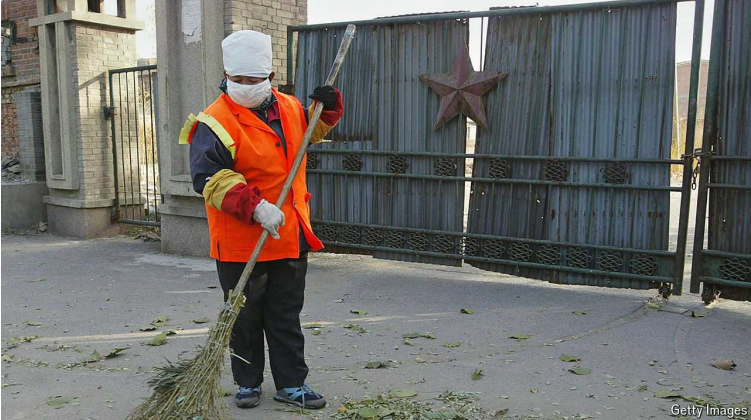
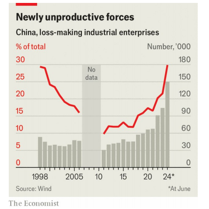

# China’s manufacturers are going broke

Overcapacity is leading to soaring bankruptcies

产能过剩正导致破产企业数量激增

overcapacity：生产能力过剩；产能过剩

原文：

Most news on China’s manufacturers is bad news for rivals around the

world. Foreign governments fear their domestic champions will be

pummelled by low-cost Chinese rivals. But on August 5th the world got a

small reminder that China’s producers face big problems of their own.

Hengchi, an electric-vehicle (EV) maker owned by Evergrande, a failed

property developer, told investors that two of its subsidiaries had been

forced into bankruptcy. The group originally aimed to sell 1m EVs a year by

2025; amid feverish competition it sold just 1,389 last year.

大多数关于中国制造商的消息对世界各地的竞争对手来说都是坏消息。外国政府担心他们的国内冠军企业将被低成本的中国竞争对手重创。但是在8月5日，世界得到了一个小小的提醒:中国的生产商面临着他们自己的大问题。失败的房地产开发商恒大旗下的电动汽车制造商恒驰告诉投资者，其两家子公司已被迫破产。该集团最初的目标是到2025年每年销售100万辆电动汽车；在激烈的竞争中，它去年仅售出1389辆。

学习：

pummelled：美 [ˈpʌməld] 打；用拳头连续揍；（pummel的过去式）

Evergrande：恒大

feverish： 美 [ˈfiːvərɪʃ] 狂热的；激动的；

feverish competition: 激烈的竞争

原文：

The glut in industrial production is not limited to EVs. About 30% of

industrial firms were loss-making at the end of June, rising above the

previous recorded peak during the Asian financial crisis in 1998, according

to the National Bureau of Statistics (see chart). Its survey of more than

500,000 companies shows a startling deterioration in the conditions for

industrial firms in the first half of the year, during which the number of loss-

making companies surged by 44%.

工业生产的过剩不仅限于电动汽车。根据国家统计局的数据，截至6月底，约30%的工业企业处于亏损状态，超过了1998年亚洲金融危机期间的最高纪录(见图表)。它对500，000多家公司的调查显示，今年上半年工业企业的状况出现了惊人的恶化，在此期间，亏损公司的数量激增了44%。

学习：

glut： 美 [ɡlʌt] 过剩；充斥；供应过量；供过于求；

loss-making：亏损的；亏本；赔钱的          

startling：美 [ˈstɑːrtlɪŋ] 惊人的；令人震惊的；引起惊愕的； 使惊讶；使震惊；（startle的现在分词）

原文：

In recent years handouts, cheap loans and direct government investment

have poured into areas of manufacturing favoured by Xi Jinping, China’s

leader, with some remarkable outcomes. On his watch China has become the

world leader in EVs and lithium-ion batteries. But its economy is weakening

and consumption is sagging. Domestic car sales have fallen in recent

months, year on year. Exports in July were below expectations, according to

data released on August 7th. Heavily indebted local governments,

meanwhile, are also becoming stingier with their support for struggling

firms. *The Economist* has examined three of Mr Xi’s most-favoured

industries: EVs, solar modules and semiconductors. The picture that emerges

is grim.

近年来，救济品、低息贷款和政府直接投资涌入中国领导人青睐的制造业领域，并取得了一些显著的成果。在他的领导下，中国已经成为电动汽车和锂离子电池的世界领导者。但是它的经济正在衰弱，消费正在下降。最近几个月，国内汽车销量同比下降。根据8月7日发布的数据，7月份的出口低于预期。与此同时，负债累累的地方政府在支持陷入困境的企业时也变得越来越吝啬。《经济学人》研究了三个行业:电动汽车、太阳能组件和半导体。出现的景象是严峻的。

学习：

sagging：美 ['sægɪŋ] 倒下；瘫倒；下跌；（sag的现在分词）

But its economy is weakening and consumption is sagging：它的经济正在衰弱，消费正在下降

indebted：负债的；欠款的；

stingier：美 [ˈstɪndʒi:ə] 小气的；（stingy的比较级）

原文：

Start with EVs. At least eight large makers of the cars have shut down or

halted production since the start of 2023. The ripples are visible throughout

the supply chain. Qingdao Hi-Tech Moulds, a large auto-parts supplier,

warned in a statement earlier this year that the halting of production at

HiPhi, an automaker, could send its net profit tumbling by up to 60%. 

SAIC Anji Logistics, an auto-industry logistics provider, said in recent bankruptcy

proceedings that it collapsed mainly because Aiways, another troubled

automaker, had failed to pay its bills. The failure of Levdeo, yet another

carmaker, has left 4bn yuan ($550m) in unpaid bills to suppliers, agents and

banks. Some 52,000 EV-related companies shut down in China last year, an

increase of almost 90% on the year before, according to one estimate.

从EVs开始。自2023年初以来，至少有八家大型汽车制造商已经停产或停止生产。供应链中的涟漪随处可见。大型汽车零部件供应商青岛高科技模具公司在今年早些时候的一份声明中警告说，汽车制造商HiPhi的停产可能会导致其净利润下降高达60%。汽车行业物流供应商SAIC安吉物流在最近的破产程序中表示，该公司倒闭主要是因为另一家陷入困境的汽车制造商Aiways无法支付账单。另一家汽车制造商Levdeo的倒闭给供应商、代理商和银行留下了40亿元人民币(合5 . 5亿美元)的未付账单。据估计，去年中国关闭了约52，000家与电动汽车相关的公司，比前一年增加了近90%。

学习：

auto-parts：汽车零部件

automaker：汽车制造商

tumbling：美 [ˈtʌmblɪŋ] 翻滚；翻筋斗；翻跟头（tumble的现在分词）

原文：

China’s solar industry is also grappling with oversupply. This year the prices

of most components of solar modules have fallen below their average

production cost. Many companies in the industry are scaling back

manufacturing. Others have scrapped plans to enter the market. Haitai Solar,

a maker of solar components, has said it expects prices to fall further. The

largest producers in the industry have cash reserves that will help them

survive. The greatest pressure in solar, as with many other manufacturing

industries, is among smaller suppliers that have watched the profits they

make from their components disappear, says Alicia García Herrero of

Natixis, an investment bank.

中国的太阳能行业也在努力应对供应过剩。今年，大多数太阳能组件的价格已经低于平均生产成本。业内许多公司都在缩减生产规模。其他公司已经放弃了进入市场的计划。太阳能组件制造商海泰太阳能表示，预计价格将进一步下跌。业内最大的生产商拥有现金储备，这将有助于他们生存下去。投资银行Natixis的艾丽西娅·加西亚·赫雷罗说，和许多其他制造业一样，太阳能行业面临的最大压力来自那些眼睁睁看着自己从组件中获得的利润消失的小型供应商。

学习：

grapple with：应对

scrapped：废弃；（scrap的过去式）

原文：

A shakeout is occurring in the semiconductor industry, too. Local

governments have focused their investments on low-end chip components in

an effort to “easily win market share”, notes an industry insider. Those parts

are now in great oversupply and many of the companies producing them are

failing. In 2023 nearly 11,000 chip-related firms went out of business,

roughly 30 a day, according to Qichacha, a company that collects corporate

data. It says the figure, which has been reported in Chinese media, is

accurate, but that it can no longer supply such numbers as they have become

“too sensitive”.

半导体行业也在经历一场洗牌。一位业内人士指出，地方政府已将投资重点放在低端芯片组件上，以求“轻松赢得市场份额”。这些零件现在严重供过于求，许多生产它们的公司都倒闭了。根据收集企业数据的公司Qichacha的数据，2023年有近11，000家芯片相关公司倒闭，大约每天30家。它表示，中国媒体报道的数字是准确的，但它不能再提供这样的数字，因为它们已经变得“过于敏感”。

学习：

shakeout：轻度经济衰退；股票市场震动

原文：

China’s central government has started to recognise the pressure the

country’s manufacturers are under. Mr Xi recently acknowledged over-

investment in some green technologies. In late July the minutes from a

meeting of the politburo, a group of senior government leaders, said that

China must avoid “*neijuan*-style vicious competition”. *Neijuan*, often

translated as “involution”, is a term now commonly used in the country to

describe intense, self-harming competition.

中国中央政府已开始意识到该国制造商面临的压力。Xi先生最近承认在一些绿色技术上过度投资。7月下旬，由高级政府领导人组成的政治局会议纪要称，中国必须避免“内卷式的恶性竞争”。内卷，通常被翻译成“内卷”，是一个现在在中国常用来描述激烈的、自我伤害的竞争的术语。

学习：

minutes：备忘录；会议记录；（minute的复数）

politburo：美 [ˈpɑlɪtˌbjʊroʊ] 政治局（共产党中央委员会的执行委员会）

vicious： 美 [ˈvɪʃəs] 恶意的；恶劣的；

involution：美 [ˌɪnvəˈluʃən] 卷入；纠缠；内卷；

原文：

Yet it will be difficult for China to avoid a period of industrial involution.

Mr Xi’s overriding ambition has been to create high-tech champions across a

number of industries that can win in global markets and break his country’s

reliance on foreign intellectual property. State support for this has generally

flowed through local governments, many of which have spent

indiscriminately, resulting in legions of small and uncompetitive suppliers.

然而，中国很难避免一段时间的工业内卷化。Xi最大的抱负是在多个行业打造高科技领军企业，这些企业能够在全球市场上胜出，打破中国对外国知识产权的依赖。国家对此的支持通常是通过地方政府进行的，许多地方政府乱花钱，导致了大量缺乏竞争力的小供应商。

学习：

overriding：首要的；最重要的；主宰的

indiscriminately：美 [ˌɪndɪˈskrɪmɪnətli] 任意地；无差别地

legions of：大量的，一大批

## **Only the strong survive**

原文：

What is more, the debt local governments have piled up is making it more

difficult than in the past for them to rescue troubled industrial firms. Cities

and provinces are now 60trn-odd yuan in debt and many have been told to

curb spending. Failed investments are only making their fiscal positions

worse. The demise of Aikang, a large solar company in Zhejiang province,

has become a concern for leaders there. A local-government investment

vehicle is its main shareholder.

此外，地方政府积累的债务使得他们比过去更难拯救陷入困境的工业企业。各省市目前负债超过60万亿元，许多省市被告知要控制支出。失败的投资只会让他们的财政状况变得更糟。浙江大型太阳能公司艾康的倒闭已经成为当地领导人的担忧。一家地方政府投资机构是其主要股东。

学习：

curb spending：控制支出

demise：美 [dɪˈmaɪz] 死亡；消亡；逝世；终止；灭亡

shareholder：股东；股票持有人；股票投资者；

原文：

The state has started to encourage consolidation. But that will not be

straightforward. Most companies in sectors with oversupply are looking to

trim capacity, not acquire more of it. There will not be many acquisition

targets in the solar industry, says Cosimo Ries of Trivium, a consulting firm.

It is unlikely the dwindling group of successful EV companies will buy failing

brands, which would involve taking responsibility for legacy customers who

can no longer get the software updates needed to keep their cars functioning

国家已经开始鼓励整合。但这并不简单。供应过剩行业的大多数公司都在寻求削减产能，而不是增加产能。咨询公司Trivium的Cosimo Ries说，太阳能行业不会有很多收购目标。越来越少的成功电动汽车公司不太可能收购失败的品牌，这将涉及为那些无法再获得保持汽车正常运行所需的软件更新的老顾客承担责任

学习：

consolidation：美 [kənˌsɑːlɪˈdeɪʃn] 整合；合并

straightforward: 简单的，容易的

>
>这里的 **"straightforward"** 是指 "简单的" 或 "直接的"。在这句话中，它表示鼓励合并并不是一件容易的事情。

trim：削减

trim capacity：削减产能

>**"Trim"** 是指 "削减" 或 "减少"。在这句话中，它表示公司在过剩供应的行业中正在努力削减产能，而不是增加产能。

dwindling：缩减的；逐渐减少的；减少；变小；（dwindle的现在分词形式）

原文：

In its July meeting, China’s politburo said that the market must filter out

weak producers and promote strong ones. In time, that should lead to more

capital and labour being allocated to China’s most productive manufacturers,

making them mightier still. But it will be painful. ■

在7月份的会议上，中国政治局表示，市场必须淘汰弱势生产者，促进强势生产者。假以时日，这将导致更多的资本和劳动力被分配到中国生产率最高的制造商手中，使他们变得更加强大。但是会很痛苦。■

学习：

mightier：美 [ˈmaɪtiər] 巨大的；强有力的；（mighty的比较级）

## 后记

2024年8月11日20点17分于上海。

