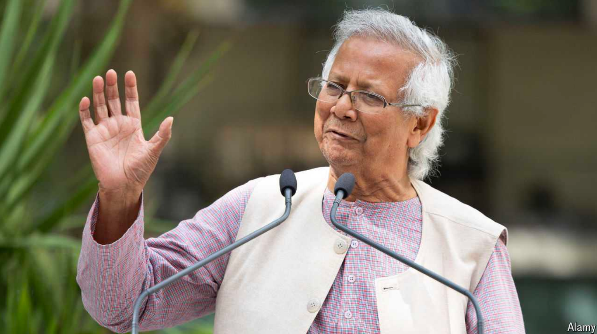

# Bangladesh has achieved its second liberation, says Muhammad Yunus

The interim government’s new leader argues for releasing political prisoners and holding a free election

Interim: 美 [ˈɪntərɪm] 暂时的；临时的；过渡期的

**Editor’s update**: Since this article was published Bangladesh’s president appointed Mr Yunus to lead the new government.

原文：

OVER THE past 30 years Bangladesh has become known for many achievements

and positive characteristics: declining poverty rates; being the birthplace of

microcredit and the Silicon Valley of social entrepreneurship and social

business; developing the concept of holding elections under neutral

caretaker governments to inspire trust in the competing parties; developing

an industry that employs millions of women to export billions of dollars’

worth of garments to clothe the world; and becoming the eighth-most-populous 

country in the world. Only four languages have more native

speakers than our national tongue, Bengali.

过去30年来，孟加拉国以许多成就和积极特征而闻名:贫困率下降；成为小额信贷的发源地和社会企业家和社会企业的硅谷；发展在中立看守政府下举行选举的概念，以激发对竞争政党的信任；发展一个行业，雇佣数百万女性出口价值数十亿美元的服装，为全世界提供服装；成为世界上第八大人口大国。只有四种语言的母语人数超过了我们的国语孟加拉语。

学习：

Bengali：美 [ˌbɛŋˈɡɑli] 孟加拉语

national tongue：国语

原文：

Unfortunately, we have also become known for having our democracy erode

into autocracy, with sham elections in 2014, 2018 and most notoriously 2024

overshadowing the vibrant ones held in 1991, 1996 and 2008. No

Bangladeshi younger than 30 has ever cast a vote in an unrigged national

election. Over the past 15 years the government corrupted many of our

institutions, most tragically the judiciary and education system, at all levels.

不幸的是，我们也因我们的民主侵蚀成专制而闻名，2014年、2018年和最臭名昭著的2024年的虚假选举掩盖了1991年、1996年和2008年举行的充满活力的选举。30岁以下的孟加拉国公民从未在全国选举中投过未被操纵的票。过去15年来，政府腐蚀了我们的许多机构，最悲惨的是各级司法和教育系统。

学习：
sham：美 [ʃæm] 虚假的；假装的；伪造的；假的

unrigged：未被操纵的，公正的
>在这里，"unrigged" 指的是未被操纵的或公正的，"rig" 则指的是操纵或篡改。
>
>详细解释：
>
>- **Unrigged**: 未被操纵的，公正的
>- **Rig**: 操纵或篡改（通常指选举或比赛的结果）
>
>例句：
>英文: An unrigged election is essential for a true democracy.
>中文: 公正的选举对于真正的民主至关重要。

原文：

As a result, many of our talented leaders across every field have left for

other countries. Those who remained faced the choice between pledging

their support to the prime minister, Sheikh Hasina, or being persecuted. I

chose the second option, and as of last week I had 190 court cases pending

against me. One criminal case I am facing has a maximum sentence of life in

prison. I was charged with forgery, embezzlement and money-laundering.

因此，我们各个领域的许多有才华的领导人都去了其他国家。留下来的人面临选择，要么承诺支持总理谢赫·哈西娜，要么受到迫害。我选择了第二种选择，截至上周，我有190起针对我的未决案件。我面临的一个刑事案件最高可判终身监禁。我被指控伪造、挪用公款和洗钱。

学习：
pending：悬而未决的；待定的；迫近的；行将发生的

forgery：美 [ˈfɔːrdʒəri] 伪造（行为）；伪造品；赝品；伪造罪；

embezzlement： [ɪm'bezlmənt] 挪用；盗用；侵吞公款

laundering：洗涤；洗黑钱（把来路可疑的钱弄得貌似合法）；（launder的现在分词形式）

money-laundering：洗钱

原文：

I have spent more time in courtrooms and preparing my legal defence than

on the things that I love, such as designing social businesses that use market-

based approaches to solve urgent social and environmental problems. I am

hardly alone in facing this harassment; just ask the award-winning

photojournalist Shahidul Alam, and many others.

我花了更多时间在法庭上，准备我的法律辩护，而不是在我喜欢的事情上，比如设计使用基于市场的方法来解决紧迫的社会和环境问题的社会企业。面对这种骚扰的不仅仅是我一个人；问问获奖的摄影记者Shahidul Alam和其他许多人就知道了。

学习：
courtrooms：法庭；审判室；（courtroom的复数）

photojournalist：摄影记者

原文：

Over the past month Bangladesh earned its independence from this

autocracy through a student-led movement. Although it originated in

opposition to civil-service quotas, it quickly galvanised the nation to rally

around one demand: the resignation of Sheikh Hasina’s government. On

August 5th the protesters’ demand was met when the prime minister fled the

country. Like virtually all of my fellow citizens, I was overjoyed, even as I

mourned the loss of more than 300 lives to state-sponsored violence against

peaceful protesters and bystanders. We must commit ourselves to ensuring

that those lives weren’t given in vain, but instead usher in a golden era of

democracy, prosperity and unity for Bangladesh.

在过去的一个月里，孟加拉国通过学生领导的运动从独裁统治中赢得了独立。虽然它起源于对公务员配额的反对，但它很快激励全国团结在一个要求周围:谢赫·哈西娜政府辞职。8月5日，抗议者的要求得到了满足，总理逃离了这个国家。几乎和我所有的同胞一样，我欣喜若狂，尽管我为300多人在国家支持的针对和平抗议者和旁观者的暴力中丧生而悲伤。我们必须致力于确保这些生命不会白白牺牲，而是为孟加拉国开创一个民主、繁荣和团结的黄金时代。

学习：
bystanders：看热闹的人；（bystander的复数）

原文：

The next step will be to form an interim government that should release all

political prisoners and ensure a free and fair election is held within a few

months. I am willing to help support this process, and I hope other people

will join me. We urgently need new politicians, and new leaders to step

forward. Above all, we need young people who are not obsessed with

settling scores, as too many of our previous governments were, but are

instead intent on becoming a new generation of leaders focused on the future

of our great nation. The student leaders who were at the forefront of our

second liberation—after the war of independence from Pakistan in 1971—

should continue to provide leadership in all respects.

下一步将是组建一个临时政府，释放所有政治犯，并确保在几个月内举行自由公正的选举。我愿意帮助支持这一进程，也希望其他人能加入我的行列。我们迫切需要新的政治家和新的领导人站出来。最重要的是，我们需要年轻人不要像我们以前的许多政府那样沉迷于清算旧账，而是致力于成为关注我们伟大国家未来的新一代领导人。在1971年脱离巴基斯坦的独立战争之后，我们第二次解放的最前线的学生领袖应该继续在各方面发挥领导作用。

学习：

Settling scores: 报复，算账

>在这里，"settling scores" 指的是报复或算账，特别是指旧有政府中的人们彼此之间的宿怨和纠纷。作者希望新的领导人和年轻一代不要被这些报复心态所困扰，而是要专注于国家的未来和发展。
>
>例句：
>英文: Instead of settling scores, the new administration focused on rebuilding the nation.
>中文: 新政府没有忙于报复，而是专注于重建国家。

原文：

I will wish them well and will continue to support them enthusiastically. I’ll

try to encourage them to work towards creating a world of three zeros: zero

net carbon emissions, zero wealth concentration and zero unemployment.

我将祝愿他们一切顺利，并将继续热情支持他们。我将努力鼓励他们努力创造一个三个零的世界:净零碳排放、零财富集中和零失业。

原文：

I am grateful to the people, institutions and nations that supported the

democratic aspirations of the Bangladeshi people during the dark years

under Sheikh Hasina. Human-rights organisations such as Amnesty

International and the Clooney Foundation for Justice have been especially

helpful. Citizens around the world have made their voices heard in

advocating justice, democracy and freedom of expression for our people.

Members of the Bangladeshi diaspora, especially students and other young

people, have worked tirelessly from abroad to bring justice and liberation to

their native land. I hope some of them will return to help revitalise our

democracy and build our economy.

我感谢在谢赫·哈西娜领导下的黑暗岁月里支持孟加拉人民民主愿望的人民、机构和国家。大赦国际和克鲁尼正义基金会等人权组织尤其有帮助。世界各地的公民在为我们的人民倡导正义、民主和言论自由方面发出了自己的声音。散居国外的孟加拉国人，特别是学生和其他年轻人，从国外不懈努力，为他们的祖国带来正义和解放。我希望他们中的一些人会回来帮助振兴我们的民主和建设我们的经济。

学习：

diaspora：美 [daɪˈæspərə] 流散的民族或群体；移民群体

原文：

Although some countries, such as India, backed the ousted prime minister

and earned the enmity of the Bangladeshi people as a result, there will be

many opportunities to heal these kinds of rifts and to resume bilateral

alliances and close friendships soon. In fact, I hope that our liberation can

revive the suspended South Asian Association for Regional Co-operation

and make it a powerful force for integration in our region and beyond.

虽然一些国家，如印度，支持被驱逐的总理，并因此赢得了孟加拉人民的敌意，但将有许多机会弥合这种裂痕，并很快恢复双边联盟和亲密友谊。事实上，我希望我们的解放能够重振已经停摆的南亚区域合作联盟，使其成为本区域内外一体化的强大力量。

学习：
rifts：裂隙；裂缝；（rift的复数）

原文：For too long, Bangladesh’s politics have been backward-looking. Starting

today, let us focus on building a future together that springs from the second

liberation that occurred on August 5th. A new generation of young leaders

should emerge from among those who led us to this important new victory.

Their energy and vision for the nation can help sanctify the sacrifices of

those who gave their lives for this new opportunity—an opportunity that we

must not squander. ■

长久以来，孟加拉国的政治一直是向后看的。从今天开始，让我们着眼于共同建设一个源于8月5日第二次解放的未来。新一代的年轻领导人应该从领导我们取得这一重要新胜利的人中产生。他们的精力和对国家的远见卓识有助于使那些为这个新机会献出生命的人的牺牲成为神圣，这个机会我们不能浪费。■

学习：
squander：浪费（金钱、时间或资源）；挥霍；

*Muhammad Yunus is a Nobel prizewinning economist and microfinance pioneer.*

## 后记

2024年8月13日晚于上海。

