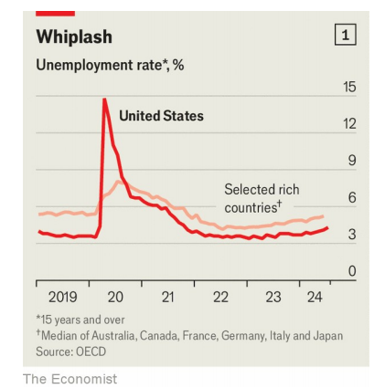
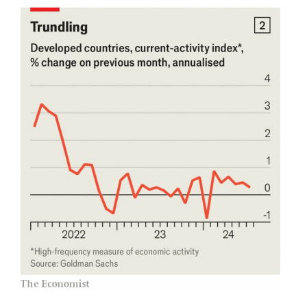

# A global recession is not in prospect

That will be a relief to investors everywhere

原文：

A WEAK JOBS report in America has raised fears that the world’s largest economy

is heading for recession. America’s stockmarkets have tumbled, with fear

spreading to other countries. Japan’s Topix index is 15% off its recent high;

Germany’s main index is down by 7%. When America sneezes, everywhere

catches a cold.

美国疲软的就业报告引发了人们对世界最大经济体走向衰退的担忧。随着恐惧蔓延到其他国家，美国股市暴跌。日本东证指数较近期高点下跌了15%；德国的主要指数下跌了7%。当美国打喷嚏时，到处都感冒。

学习：

tumbled：暴跌；（tumble的过去分词）

sneezes：美 [s'nizɪz] 打喷嚏；（sneeze的第三人称单数）

catch a cold：感冒

原文：

But a look at the latest data suggests that the global economy is not in

danger, and that the market panic may be misplaced. Turn first to the labour

market. America’s unemployment rate has risen from a low of 3.4% in April

2023 to 4.3% in July. Indeed, history suggests that an increase of this size

tends to accompany a drop in economic output—leading, in turn, to a further

rise in unemployment, bankruptcies and falling incomes.

但看看最新的数据表明，全球经济并没有处于危险之中，市场恐慌可能是错误的。首先谈谈劳动力市场。美国失业率已从2023年4月的低点3.4%升至7月的4.3%。事实上，历史表明，这种规模的增长往往伴随着经济产出的下降，从而导致失业、破产和收入下降的进一步上升。

原文：

This cycle may be different, though, as labour markets in other parts of the

rich world suggest. For months unemployment has been slowly rising almost

everywhere (see chart 1). Germany’s jobless rate has increased from a recent

low of 2.9% to 3.4% today. Britain’s has risen from 3.6% to 4.4%, while

Australia’s has gone from 3.5% to 4.1%. Some of this uptick has a common

cause: a loosening of the extraordinarily tight labour market at the end of the

covid-19 pandemic. Not long ago employers, struggling with labour

shortages and sky-high demand, would take on practically anybody they

could. Now, with everything more settled, they can be discerning.

然而，正如富裕世界其他地区的劳动力市场所显示的那样，这个周期可能会有所不同。几个月来，几乎所有地方的失业率都在缓慢上升(见图表1)。德国的失业率已经从最近的2.9%的低点上升到今天的3.4%。英国从3.6%上升到4.4%，澳大利亚从3.5%上升到4.1%。这种上升有一个共同的原因:在新冠肺炎疫情结束时，异常紧张的劳动力市场有所松动。不久前，雇主们还在努力应对劳动力短缺和极高的需求，他们几乎可以雇佣任何人。现在，随着一切都尘埃落定，他们可以明辨是非了。

学习：

jobless rate = unemployment rate：失业率

uptick：小幅上升；轻微增长；小幅增加

discerning：有洞察力的；有识别能力的；有眼力的；辨别的

原文：

On top of this, unemployment is rising in part because of changes to the rich

world’s labour force. The OECD’s working-age labour-force-participation rate

recently hit an all-time high. Those who had once been on the economic

sidelines are now actively looking for work—something which, in the short

run at least, can raise the unemployment rate. These people have reason to

think they will soon find a post. Job growth remains pretty strong. Over the

past quarter employment has risen by 0.8% in Australia and 0.6% in Canada.

Although Japanese employment fell by 0.03%, this is the exception in the

rich world. It is also hard to square supposed labour-market weakness with

wage growth that, across advanced economies, easily exceeds the rate of

inflation.

除此之外，失业率上升的部分原因是富裕国家劳动力的变化。经合组织的适龄劳动力参与率最近创下历史新高。那些曾经置身于经济边缘的人现在正在积极寻找工作——这至少在短期内会提高失业率。这些人有理由认为他们很快就会找到工作。就业增长仍然相当强劲。在过去的一个季度里，澳大利亚的就业率上升了0.8%，加拿大上升了0.6%。虽然日本就业下降了0.03%，但这在富裕国家中是例外。在发达经济体中，工资增长很容易超过通货膨胀率，这也很难与假定的劳动力市场疲软相一致。

学习：
on top of：除…之外还有；另外；

sideline：（体育比赛中的）边界线

economic sidelines：破产的边缘

post：岗位；职位；

find a post：找到工作

square：使一致，使相符

>在这里，"square" 的意思是使一致或使相符。具体来说，“it is also hard to square supposed labour-market weakness with wage growth that, across advanced economies, easily exceeds the rate of inflation” 的意思是很难将所谓的劳动力市场疲软与跨发达经济体中工资增长轻松超过通货膨胀率的事实相一致或相符。
>
>详细解释：
>- **Square**: 使一致，使相符。例如：It's hard to square his explanation with the facts. 很难将他的解释与事实相符。
>
>例句：
>英文: It's difficult to square the company's reported profits with its recent layoffs.  
>中文: 很难将公司报告的利润与其最近的裁员相符。
>
>在这段话中，作者指出，虽然有迹象显示劳动力市场疲软，但发达经济体的工资增长明显超过了通货膨胀率，这两个事实难以一致或相符。

原文：

If the story about jobs is reasonably subtle, the story about output is less so.

Our judgment, from looking at a range of data, is that there is not much

evidence of a slowdown. In a typical recession company profits plunge, but

for now firms across the rich world are doing well. Research by Deutsche

Bank suggests that in the first quarter of this year global corporate-earnings

growth reached its highest level in seven quarters. The strong performance

appears to have continued in the second quarter. American companies’

earnings look set to have grown by more than 10% year on year. On August

6th Uber, a ride-hailing app, reported good results. A healthy share of

European companies are beating analysts’ expectations for profits. In South

Korea second-quarter earnings were better than expected.

如果说关于就业的故事相当微妙，那么关于产出的故事就没那么微妙了。从一系列数据来看，我们的判断是，没有太多证据表明经济放缓。在典型的经济衰退中，公司利润大幅下降，但目前富裕国家的公司表现良好。德意志银行的研究表明，今年第一季度，全球企业收益增长达到了七个季度以来的最高水平。强劲的表现似乎在第二季度得以延续。美国公司的收益看起来比去年同期增长了10%以上。8月6日，打车应用优步公布了不错的结果。相当一部分欧洲公司的利润超出了分析师的预期。韩国第二季度收益好于预期。

学习：

plunge：突然下降；突然跌落；骤然下跌；急剧跌落

Deutsche：美 ['dɔɪtʃ] 德意志联邦共和国

Deutsche Bank：德意志银行

ride-hailing：打车

look set to: “看起来很可能”或“预计”

>在这里，"look set to" 的意思是“看起来很可能”或“预计”。它用于表示某事在未来很有可能发生。
>
>详细解释：
>- **Look set to**: 看起来很可能，预计。例如：The team looks set to win the championship this year. 这支球队看起来很可能今年赢得冠军。
>
>例句：
>英文: The weather forecast suggests that it looks set to rain tomorrow.  
>中文: 天气预报显示明天很可能会下雨。
>
>在这段话中，作者指出，美国公司的收益预计同比增长超过 10%。这表明，美国公司的业绩看起来很有可能实现超过 10% 的年增长率。

trundle: 美 [ˈtrəndl]  缓慢而沉重的移动；滚动

原文：

The economy at large offers a similar story. A weekly tracker of American

economic activity, produced by the Federal Reserve Bank of Dallas, shows

little sign of weakness. A global composite “purchasing managers’ index”

that tracks economic conditions remains strong. Although the rate of

expansion slowed in July, it remained among the best registered over the

past year. A “current-activity indicator” produced by Goldman Sachs, a

bank, gives another reason for optimism. Published at a high frequency and

compiled from a range of sources, it provides a hint of where GDP across the

rich world is going. The indicator, if anything, looks slightly stronger than it

did for most of last year (see chart 2). Some economies are struggling with

weak growth, including Austria and France. But they have looked sickly for

at least a year—and the situation is a lot better than it was a few months ago.

总体经济情况类似。由达拉斯美联储银行制作的美国经济活动每周跟踪报告显示，美国经济几乎没有疲软迹象。追踪经济状况的全球综合“采购经理人指数”依然强劲。尽管7月份的扩张速度有所放缓，但仍是过去一年中表现最好的。高盛银行制作的“当前活动指标”给出了另一个乐观的理由。这份报告以很高的频率发布，并从一系列的来源进行汇编，它提供了一个富裕国家GDP走向的线索。如果有什么不同的话，这个指标看起来比去年大部分时间都要稍强一些(见图表2)。包括奥地利和法国在内的一些经济体正在增长乏力中挣扎。但是他们看起来病怏怏的至少有一年了——现在的情况比几个月前好多了。

学习：

composite：混合的；复合的；由多种成分或部分构成的； 复合指数（如股市指数）

sickly：体弱多病的；病态的；常生病的；不健康的

原文：

The inflation picture is improving as well. After peaking at 10% in late

2022, inflation in the median OECD country has steadily fallen. In June median

prices across the bloc rose by 2.6% year on year—close to central banks’

targets of 2%. About a quarter of OECD countries have now reduced inflation to

that level or below. Annual inflation in Italy is less than 1%, while

consumer-price growth in France and Germany is pretty much bang on

target. It is ironic that concerns about recession have spread just as the rich

world appears set to pull off a “soft landing”, in which central banks bring

down inflation to target without causing much economic damage.

通货膨胀情况也在改善。在2022年末达到10%的峰值后，中等经合组织国家的通胀率稳步下降。6月，整个欧元区的中间价格同比上涨了2.6%，接近央行2%的目标。大约四分之一的经合组织国家现在已经将通货膨胀率降低到这个水平或更低。意大利的年通胀率不到1%，而法国和德国的消费价格增长几乎完全符合目标。具有讽刺意味的是，正当富裕国家似乎要实现“软着陆”之际，对衰退的担忧却在蔓延。在软着陆中，各国央行将通胀降至目标水平，而不会对经济造成太大损害。

学习：

bang on：完全正确；完全符合          

pull off：成功完成；办成；做成（困难的事情）；

appear set to：似乎，看起来

原文：

Worries about the economy can, in time, become self-fulfilling. As

stockmarkets tumble, households might start to fret about the future or feel

poorer, leading them to pull back on spending. Skittish companies might

also cancel their investment plans. Inflation is not yet defeated, even if it has

come down, and with commodity prices volatile it could increase once

again. High interest rates continue to bite. Yet, for now, the global economy

remains in decent health. ■

对经济的担忧最终会自我实现。随着股市暴跌，家庭可能会开始对未来感到焦虑或感到更穷，导致他们减少支出。不安的公司也可能取消他们的投资计划。通货膨胀还没有被击败，即使它已经下降，而且随着商品价格的波动，它可能会再次上升。高利率继续带来负面影响。然而，就目前而言，全球经济仍然相当健康。■

学习：

fret：焦虑；苦恼；忧虑

skittish：美 [ˈskɪdɪʃ] 受惊的；胆怯的

>**Skittish**：指的是容易受惊的，神经质的。在这里，它指的是公司因为不稳定的经济环境而变得谨慎，可能会取消投资计划。
>
>例如：Investors became skittish after the unexpected market volatility. 在市场意外波动后，投资者变得神经质。

self-fulfilling: 自我实现的

>**Self-fulfilling**：指的是自我实现的。在这个语境中，它指的是对经济的担忧可能会导致实际的经济问题，因为人们的行为会因这些担忧而改变，从而使担忧成为现实。
>
>例如：The fear of a bank run can become self-fulfilling if enough people withdraw their money. 如果足够多的人提款，银行挤兑的恐慌就会自我实现。

tumble：大幅下跌

>**Tumble**：指的是大幅下跌。在这里，它指的是股市大幅下跌。
>
>例如：The stock prices tumbled after the disappointing earnings report. 在令人失望的财报发布后，股票价格大幅下跌。

pull back：减少，撤回

>**Pull back**：指的是撤回或减少。在这里，它指的是家庭因为担忧未来或感觉变得更贫穷而减少消费支出。
>
>例如：Consumers pulled back on spending due to economic uncertainties. 由于经济不确定性，消费者减少了开支。

bite：产生影响，造成痛苦

>**Bite**：指的是产生影响或造成痛苦。在这里，它指的是高利率继续对经济造成负面影响。
>
>例如：High interest rates are beginning to bite, affecting consumer spending. 高利率开始产生影响，影响消费者支出。

## 后记

2024年8月14日19点13分于上海。

