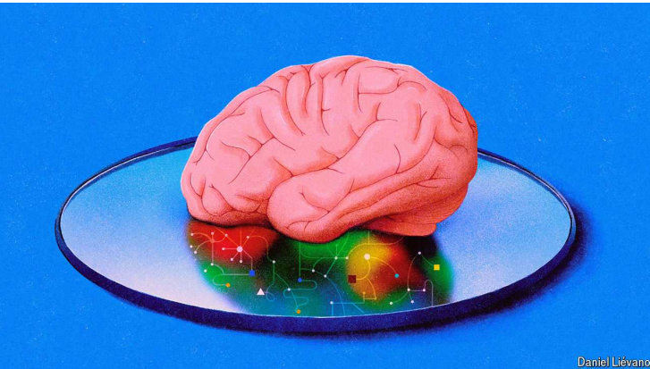

# AI scientists are producing a host of new theories of how our brains learn

The challenge for neuroscientists is how to test them

原文：

Five DECADES of research into artificial neural networks have earned

Geoffrey Hinton the moniker of the Godfather of artificial intelligence (AI).

Work by his group at the University of Toronto laid the foundations for

today’s headline-grabbing AI models, including ChatGPT and LaMDA. These can

write coherent (if uninspiring) prose, diagnose illnesses from medical scans

and navigate self-driving cars. But for Dr Hinton, creating better models was

never the end goal. His hope was that by developing artificial neural

networks that could learn to solve complex problems, light might be shed on

how the brain’s neural networks do the same.

五十年来对人工神经网络的研究为杰弗里·辛顿赢得了人工智能(AI)教父的称号。他在多伦多大学的团队的工作为今天引人注目的人工智能模型奠定了基础，包括ChatGPT和LaMDA。它们可以写出连贯的(如果没有启发性的)散文，通过医学扫描诊断疾病，并驾驶无人驾驶汽车。但是对于辛顿博士来说，创造更好的模型从来都不是最终目标。他希望通过开发能够学习解决复杂问题的人工神经网络，可以揭示大脑神经网络是如何做到这一点的。

学习：
moniker：美 [ˈmɑnəkər] 姓名；绰号；别名

laid the foudations：奠定基础

headline-grabbing：抓住新闻头条的； 引人注目的

end goal：最终目标

light might be shed on：可能阐明

>这里的 **"light might be shed on"** 是一个短语，意思是“可能揭示”或“可能阐明”。这个短语常用于表达通过研究或发现，使某个问题或现象变得更加清晰和易于理解。
>
>在这段话中，**"light might be shed on how the brain’s neural networks do the same"** 的意思是：
>
>“他的希望是，通过开发能够学习解决复杂问题的人工神经网络，可以揭示大脑的神经网络是如何做到这一点的。”
>

原文：

Brains learn by being subtly rewired: some connections between neurons,

known as synapses, are strengthened, while others must be weakened. But

because the brain has billions of neurons, of which millions could be

involved in any single task, scientists have puzzled over how it knows which

synapses to tweak and by how much. Dr Hinton popularised a clever

mathematical algorithm known as backpropagation to solve this problem in

artificial neural networks. But it was long thought to be too unwieldy to have

evolved in the human brain. Now, as AI models are beginning to look

increasingly human-like in their abilities, scientists are questioning whether

the brain might do something similar after all.

大脑通过微妙的重新布线来学习:神经元之间的一些连接，即所谓的突触，得到了加强，而另一些必须被削弱。但是，由于大脑有数十亿个神经元，其中数百万个可能参与任何一项任务，科学家们对它如何知道哪些突触需要调整以及调整多少感到困惑。Hinton博士推广了一种被称为反向传播的聪明的数学算法来解决人工神经网络中的这个问题。但长期以来，人们认为它过于笨重，不可能在人脑中进化。现在，随着人工智能模型的能力越来越像人类，科学家们开始质疑大脑是否会做类似的事情。

学习：
synapse：美 [ˈsɪnˌæps]  突触

unwieldy：美 [ˌənˈwildi] 笨拙的；笨重的；操作困难的；不方便的

原文：

Working out how the brain does what it does is no easy feat. Much of what

neuroscientists understand about human learning comes from experiments

on small slices of brain tissue, or handfuls of neurons in a Petri dish. It’s

often not clear whether living, learning brains work by scaled-up versions of

these same rules, or if something more sophisticated is taking place. Even

with modern experimental techniques, wherein neuroscientists track

hundreds of neurons at a time in live animals, it is hard to reverse-engineer

what is really going on.

弄清楚大脑是如何工作的并不容易。神经科学家对人类学习的理解大多来自于对大脑组织切片的实验，或者培养皿中的一把把神经元。通常不清楚活着的学习大脑是否按照这些相同规则的放大版本工作，或者是否发生了更复杂的事情。即使使用现代实验技术，神经科学家一次跟踪活体动物的数百个神经元，也很难逆向工程出真正发生了什么。

学习：

tissue：英 [ˈtɪʃuː] （人、动植物体内的）组织；细胞组织；纸巾；手帕纸；卫生纸；

Petri dish：培养皿；皮氏培养皿；细菌培养皿

原文：

One of the most prominent and longstanding theories of how the brain learns

is Hebbian learning. The idea is that neurons which activate at roughly the

same time become more strongly connected; often summarised as “cells that

fire together wire together”. Hebbian learning can explain how brains learn

simple associations—think of Pavlov’s dogs salivating at the sound of a bell.

But for more complicated tasks, like learning a language, Hebbian learning

seems too inefficient. Even with huge amounts of training, artificial neural

networks trained in this way fall well short of human levels of performance.

关于大脑如何学习的最突出和最长久的理论之一是赫布学习。这个想法是，几乎同时激活的神经元变得更加紧密相连；通常被总结为“一起激活的细胞连在一起”。赫比学习可以解释大脑如何学习简单的联想——想想巴甫洛夫的狗听到铃声就流口水。但是对于更复杂的任务，比如学习一门语言，Hebbian学习似乎效率太低。即使进行了大量的训练，以这种方式训练的人工神经网络也远低于人类的表现水平。

学习：
salivating：美 ['sælɪvetɪŋ] 分泌唾液；（salivate的现在分词形式）

原文：

Today’s top AI models are engineered differently. To understand how they

work, imagine an artificial neural network trained to spot birds in images.

Such a model would be made up of thousands of synthetic neurons, arranged

in layers. Pictures are fed into the first layer of the network, which sends

information about the content of each pixel to the next layer through the AI

equivalent of synaptic connections. Here, neurons may use this information

to pick out lines or edges before sending signals to the next layer, which

might pick out eyes or feet. This process continues until the signals reach the

final layer responsible for getting the big call right: “bird” or “not bird”.

今天的顶级人工智能模型是以不同的方式设计的。为了理解它们是如何工作的，想象一个经过训练的人工神经网络来识别图像中的鸟类。这样一个模型将由成千上万个分层排列的合成神经元组成。图片被馈入网络的第一层，该层通过相当于突触连接的人工智能将每个像素的内容信息发送到下一层。在这里，神经元可以使用这些信息来挑选线条或边缘，然后将信号发送到下一层，下一层可能会挑选出眼睛或脚。这一过程一直持续到信号到达负责做出正确判断的最后一层:“鸟”或“不是鸟”。

学习：
spot：看出；识别；

spot birds in images：在图片中识别出鸟类

原文：

Integral to this learning process is the so-called backpropagation-of-error

algorithm, often known as backprop. If the network is shown an image of a

bird but mistakenly concludes that it is not, then—once it realises the gaffe

—it generates an error signal. This error signal moves backwards through

the network, layer by layer, strengthening or weakening each connection in

order to minimise any future errors. If the model is shown a similar image

again, the tweaked connections will lead the model to correctly declare:

“bird”.

这个学习过程的一个组成部分是所谓的误差反向传播算法，通常称为反向传播。如果网络看到的是一只鸟的图像，但错误地得出结论认为不是，那么——一旦它意识到过失——它就会产生一个错误信号。这个误差信号通过网络一层一层地向后移动，加强或削弱每一个连接，以最小化任何未来的误差。如果模型再次显示类似的图像，调整后的连接将使模型正确地声明:“鸟”。

学习：

gaffe：美 [ɡæf] 失礼；失言；失态；过失

原文：

Neuroscientists have always been sceptical that backpropagation could work

in the brain. In 1989, shortly after Dr Hinton and his colleagues showed that

the algorithm could be used to train layered neural networks, Francis Crick,

the Nobel laureate who co-discovered the structure of DNA, published a

takedown of the theory in the journal *Nature*. Neural networks using the

backpropagation algorithm were biologically “unrealistic in almost every

respect” he said.

神经科学家一直对反向传播在大脑中的作用持怀疑态度。1989年，在Hinton博士和他的同事展示了该算法可用于训练分层神经网络后不久，共同发现DNA结构的诺贝尔奖获得者Francis Crick在《自然》杂志上发表了对该理论的反驳。他说，使用反向传播算法的神经网络在生物学上“几乎在每个方面都是不现实的”。

学习：
laureate：美 [ˈlɔːriət] 获奖者 **注意发音**

takedown：反驳

publish a takedown of the theory：反驳这个理论

原文：

For one thing, neurons mostly send information in one direction. For

backpropagation to work in the brain, a perfect mirror image of each

network of neurons would therefore have to exist in order to send the error

signal backwards. In addition, artificial neurons communicate using signals

of varying strengths. Biological neurons, for their part, send signals of fixed

strengths, which the backprop algorithm is not designed to deal with.

首先，神经元主要向一个方向发送信息。因此，为了让反向传播在大脑中发挥作用，每个神经元网络都必须有一个完美的镜像，以便将错误信号反向发送。此外，人工神经元使用不同强度的信号进行通信。就生物神经元而言，它们发送固定强度的信号，而反向传播算法不是为处理这种信号而设计的。

原文：

All the same, the success of neural networks has renewed interest in whether

some kind of backprop happens in the brain. There have been promising

experimental hints it might. A preprint study published in November 2023,

for example, found that individual neurons in the brains of mice do seem to

be responding to unique error signals, one of the crucial ingredients of

backprop-like algorithms long thought lacking in living brains.

尽管如此，神经网络的成功重新激起了人们对大脑中是否存在某种反向传播的兴趣。已经有一些有希望的实验暗示它可能会。例如，2023年11月发表的一项预印本研究发现，小鼠大脑中的单个神经元似乎确实对独特的错误信号做出了反应，这是长期以来被认为在活体大脑中缺乏的反向传播算法的关键组成部分之一。

学习：
renew interest：重新激起兴趣

原文：

Scientists working at the boundary between neuroscience and AI have also

shown that small tweaks to backprop can make it more brain-friendly. One

influential study showed that the mirror-image network once thought

necessary does not have to be an exact replica of the original for learning to

take place (albeit more slowly for big networks). This makes it less

implausible. Others have found ways of bypassing a mirror network

altogether. If artificial neural networks can be given biologically realistic

features, such as specialised neurons that can integrate activity and error

signals in different parts of the cell, then backprop can occur with a single

set of neurons. Some researchers have also made alterations to the backprop

algorithm to allow it to process spikes rather than continuous signals.

致力于神经科学和人工智能之间的边界的科学家们也表明，对反向传播的微小调整可以使它对大脑更加友好。一项有影响力的研究表明，曾经被认为是必要的镜像网络并不一定是学习发生的原始网络的精确复制品(尽管对于大型网络来说更慢)。这使得它不那么难以置信。其他人已经找到了完全绕过镜像网络的方法。如果人工神经网络可以被赋予生物学上的现实特征，例如可以整合细胞不同部分的活动和错误信号的专门神经元，那么反向传播可以通过一组神经元发生。一些研究人员还对反向传播算法进行了修改，使其能够处理脉冲信号，而不是连续信号。

学习：
make alteration：修改

原文：

Other researchers are exploring rather different theories. In a paper

published in *Nature Neuroscience* earlier this year, Yuhang Song and

colleagues at Oxford University laid out a method that flips backprop on its

head. In conventional backprop, error signals lead to adjustments in the

synapses, which in turn cause changes in neuronal activity. The Oxford

researchers proposed that the network could change the activity in the

neurons first, and only then adjust the synapses to fit. They called this

prospective configuration.

其他研究人员正在探索完全不同的理论。在今年早些时候发表在《自然神经科学》上的一篇论文中，牛津大学的Yuhang Song和他的同事们提出了一种翻转反向传播head的方法。在传统的反向传播中，错误信号导致突触的调整，进而导致神经元活动的变化。牛津大学的研究人员提出，该网络可以首先改变神经元的活动，然后调整突触以适应。他们称之为预期配置。

学习：
laid out a method：提出一种方法

原文：

When the authors tested out prospective configuration in artificial neural

networks they found that they learned in a much more human-like way—

more robustly and with less training—than models trained with backprop.

They also found that the network offered a much closer match for human

behaviour on other very different tasks, such as one that involved learning

how to move a joystick in response to different visual cues.

当作者在人工神经网络中测试预期配置时，他们发现，与用反向传播训练的模型相比，他们的学习方式更像人类，更鲁棒，训练更少。他们还发现，该网络在其他非常不同的任务上为人类行为提供了更接近的匹配，例如涉及学习如何根据不同的视觉线索移动操纵杆的任务。

学习：

joystick：（电脑游戏的）游戏杆；（飞机的）操纵杆；控制杆

## **Learning the hard way**

原文：

For now though, all of these theories are just that. Designing experiments to

prove whether backprop, or any other algorithm, is at play in the brain is

surprisingly tricky. For Aran Nayebi and colleagues at Stanford University

this seemed like a problem AI could solve.

但是现在，所有这些理论都只是理论。设计实验来证明backprop或任何其他算法是否在大脑中起作用是令人惊讶的棘手。对于斯坦福大学的Aran Nayebi和他的同事来说，这似乎是一个人工智能可以解决的问题。

原文：

The scientists used one of four different learning algorithms to train over a

thousand neural networks to perform a variety of tasks. They then monitored

each network during training, recording neuronal activity and the strength of

synaptic connections. Dr Nayebi and his colleagues then trained another

supervisory meta-model to deduce the learning algorithm from the

recordings. They found that the meta-model could tell which of the four

algorithms had been used by recording just a couple of hundreds of virtual

neurons at various intervals during learning. The researchers hope such a

meta-model could do something similar with equivalent recordings of a real

brain.

科学家们使用四种不同的学习算法中的一种来训练一千多个神经网络来执行各种任务。然后，他们在训练期间监控每个网络，记录神经元活动和突触连接的强度。然后，Nayebi博士和他的同事训练了另一个监督元模型，从记录中推导出学习算法。他们发现，元模型可以通过在学习过程中的不同时间间隔记录数百个虚拟神经元来判断四种算法中的哪一种被使用了。研究人员希望这样的元模型可以对真实大脑的记录做类似的事情。

原文：

Identifying the algorithm, or algorithms, that the brain uses to learn would

be a big step forward for neuroscience. Not only would it shed light on how

the body’s most mysterious organ works, it could also help scientists build

new AI-powered tools to try to understand specific neural processes. Whether

it could lead to better AI algorithms is unclear. For Dr Hinton, at least,

backprop is probably superior to whatever happens in the brain. ■

识别大脑用来学习的算法将是神经科学的一大进步。它不仅可以揭示人体最神秘的器官是如何工作的，还可以帮助科学家建立新的人工智能工具，试图了解特定的神经过程。尚不清楚这是否会带来更好的人工智能算法。至少对辛顿博士来说，反向传播可能优于大脑中发生的任何事情。■

## 后记

2024年8月16日17点46分于上海。

