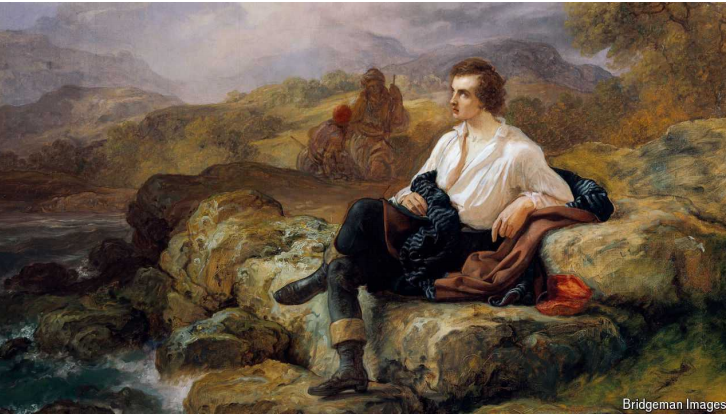

# Two centuries after his death, why is Lord Byron still seductive?

The poet is celebrated where he spent his period of exile

seductive：美 [sɪˈdʌktɪv] 吸引人的；迷人的；有魅力的；

celebrated：著名的；有名的；受人尊敬的 ；被称赞

exile：美 [ˈeksaɪl] 流亡；流放；放逐；

在他去世两个世纪后，为什么拜伦仍然充满魅力？这位诗人在他度过流亡时期的地方仍被人们所颂扬。

原文：

Even before rumours of his affair with his half-sister spread, Lord Byron had

a reputation for scandal. His lover Lady Caroline Lamb famously described

him as “mad, bad and dangerous to know”. That did not stop women

besotted with his poetry from sending letters, invitations to parties and

requests for locks of his hair. “I have been more ravished myself than

anybody since the Trojan war,” Byron insisted.

甚至在他和他同父异母妹妹的绯闻传开之前，拜伦就已经有了丑闻的名声。他的情人卡洛琳·兰姆女士对他的著名描述是“疯狂、恶劣、危险”。这并没有阻止痴迷于他诗歌的女人们写信、邀请参加聚会，并要求得到他的几绺头发。“自从特洛伊战争以来，我比任何人都更陶醉于自己，”拜伦坚持说。

学习：

affair：风流韵事；外遇；私通

half-sister：同父异母（或同母异父）的姐妹          

besotted：美 [bəˈsɑdəd] 痴迷的；沉醉的；烂醉的

ravished：美 ['rævɪʃt] 使狂喜；使陶醉；使入迷；

原文：

Despite the breakdown of his marriage, he might have stayed in England,

but the rumours of incest (probably true) and sodomy (also true) turned

British society against him. The celebrated poet had become a monster. In

1816 Byron went into exile. For seven years he roamed Italy, frequenting

Venice’s carnival, taking lovers, and studying Armenian with monks. He

then sailed to Greece to lend his support to the Greek fight for independence

from Ottoman rule. He died there, in Missolonghi, of a fever on April 19th

1824, aged 36.

尽管婚姻破裂，他本可以留在英国，但乱伦(可能是真的)和鸡奸(也是真的)的谣言让英国社会开始反对他。这位著名的诗人变成了一个怪物。1816年，拜伦流亡海外。七年来，他漫游意大利，经常光顾威尼斯的狂欢节，带着情人，和僧侣一起学习亚美尼亚语。然后他航行到希腊，支持希腊从奥斯曼帝国统治下独立出来的斗争。1824年4月19日，36岁的他因发烧死在了米索隆吉。

学习：

breakdown：（关系或谈判的）破裂；

breakdown of marriage：婚姻破裂

incest： 美 [ˈɪnˌsɛst] 乱伦

sodomy：美 [ˈsɑdəmi] 鸡奸 (指男性与男性之间的肛交性行为)

roamed: 美 [rəumd] 漫游；徜徉；闲逛；（roam的过去式和过去分词）

frequenting：美 ['frikwəntɪŋ] 常到；常去；（frequent的现在分词）

carnival：美 [ˈkɑːrnɪvl] 嘉年华；狂欢节；盛大庆典

原文：

The Greeks, who adored him, kept his lungs and larynx in an urn; the rest of

Byron was returned to England, against his wishes. (“Let not my body be

hacked, or sent to England,” he had ordered.) Westminster Abbey refused to

accept a man of “questionable morality”, so he was buried at a local church

in Nottinghamshire, near his ancestral home. Within a month of his death his

remaining friends burned his memoirs, judging them too scandalous.

崇拜他的希腊人把他的肺和喉保存在瓮中；拜伦的其余部分违背了他的意愿，被送回了英国。(“不要让我的身体被砍，或送到英国，”他下令。)威斯敏斯特教堂拒绝接收一个“道德有问题”的人，所以他被安葬在诺丁汉郡的一个当地教堂，就在他的祖居附近。在他去世后的一个月内，他剩下的朋友们认为他的回忆录太可耻，将其烧毁。

学习：

larynx：美 [ˈlɛrɪŋks] 喉部；喉；声门；喉头

urn：美 [ərn] 壶；瓮；骨灰盒

abbey：美 [ˈæbi] 修道院；大修道院；

ancestral：美 [ænˈsestrəl] 祖传的；祖先的

scandalous：美 [ˈskændləs] 引起公愤的；可耻的；不可原谅的；

原文：

Two centuries later, the poet is mostly recalled in the context of the Byronic

hero: a dark, brooding, sexy rebel, derived partly from Byron’s celebrity

persona and also from his works, such as his autobiographical masterpiece,

“Don Juan”. In England the bicentenary has been marked by new books and

events. But many are also taking place abroad, in the countries that hosted

his self-imposed exile.

两个世纪后，人们大多在拜伦式英雄的背景下回忆这位诗人:一个黑暗、忧郁、性感的反叛者，这部分源于拜伦的名人形象，也源于他的作品，如他的自传体杰作《唐璜》。在英国，200周年纪念日以新书和事件为标志。但是许多也发生在国外，在那些接受他自我流放的国家。

学习：

brooding：忧思的；沉思的；

Juan：美 [hwɑn] **注意发音**

Don Juan：唐璜

bicentenary：美 [ˌbaɪsɛnˈtɛnəri] 二百周年纪念的

原文：

In Italy, where he wrote some of his greatest works, including “Don Juan”,

he is claimed as something of a national poet. The Keats-Shelley House, at

the foot of the Spanish Steps in Rome, is holding a year-long festival of

readings, exhibitions and performances. “Byron’s Italy: An Anglo-Italian

Romance” emphasises how his Italian experiences shaped his poetry.

在意大利，他创作了一些最伟大的作品，包括《唐璜》，他被称为民族诗人。位于罗马西班牙台阶脚下的济慈-雪莱故居正在举办为期一年的阅读、展览和表演节。“拜伦的意大利:英意罗曼史”强调了他在意大利的经历如何塑造了他的诗歌。

学习：
national poet：民族诗人

原文：

“I love the language, that soft bastard Latin, / Which melts like kisses from a

female mouth,” Byron wrote in “Beppo”, a satirical poem set at the Venetian

carnival. It was his first attempt at *ottava rima,* an Italian rhyming stanza

form. In “Childe Harold’s Pilgrimage”, a moody wanderer journeys through

Italy’s crumbling beauty, “a ruin amidst ruins”. It doubled as a travel guide,

inspiring British and American tourists. The Byronic hero is, it turns out, an

early travel influencer.

“我喜欢这种语言，那种柔软的混账拉丁语，/它像来自女性嘴里的吻一样融化，”拜伦在《Beppo》中写道，这是一首以威尼斯狂欢节为背景的讽刺诗。这是他第一次尝试ottava rima，一种意大利押韵诗节形式。在《恰尔德·哈罗德的朝圣》中，一个多愁善感的的流浪者穿越意大利摇摇欲坠的美景，“废墟中的废墟”。它还兼作旅游指南，激励着英国和美国的游客。事实证明，拜伦式英雄是早期旅行的影响者。

学习：

satirical：美 [səˈtɪrɪkl] 讽刺的；讥讽的；嘲讽的

ottava rima：八行诗

stanza：美 [ˈstænzə] 诗节；节；

pilgrimage：美 [ˈpɪlɡrɪmɪdʒ] 朝圣；朝圣之旅；参拜之行；瞻仰之旅；

travel guide：旅游指南

原文：

In “Don Juan” Byron turned the womanising Spaniard into a victim seduced

by women: “What men call gallantry, and gods adultery, / Is much more

common where the climate’s sultry,” his hero observes. Don Juan eventually

lands in England, allowing Byron various jabs at the British aristocracy from

the comfort of his Italian refuge.

在《唐璜》中，拜伦把好色的西班牙人变成了被女人诱惑的受害者:“男人所谓的勇敢，上帝所谓的通奸，在气候闷热的地方更为常见，”他的主人公评论道。唐璜最终在英国着陆，让拜伦在他舒适的意大利避难所里对英国贵族进行各种抨击。

学习：

womanize：追求女色；玩弄女性

Spaniard：美 [ˈspænjərd] 西班牙人

seduced：引诱；诱惑；诱奸；勾引；（seduce的过去式）

gallantry：美 [ˈɡæləntri] 英勇；勇敢；勇气

adultery：美 [əˈdəlt(ə)ri] 通奸；婚外性行为；不贞行为

sultry：闷热的；湿热的

jabs：刺；猛击；戳；（jab的第三人称单数）

aristocracy：美 [ˌærɪˈstɑːkrəsi] 贵族阶层；贵族统治；上层社会

refuge：美 [ˈrefjuːdʒ] 避难所；收容所；

原文：

Greece also tries to claim the poet. A suburb of Athens, Vyronas, is named

in his honour. At the Acropolis Museum in Athens, an exhibition notes that

Byron was one of the earliest critics of Lord Elgin’s seizure of the Parthenon

marbles. In “The Curse of Minerva”, Byron savaged Elgin as a “spoiler”

worse than the Turks and the Goths. If that was not enough to make Byron a

hero, his commitment to Greece’s independence sealed the deal. A

passionate believer in liberty (political as well as sexual), Byron lent his

celebrity and wealth to the Greek fight for freedom, selling his estate to raise

money for the effort.

希腊也试图认领这位诗人。雅典的一个郊区维罗纳斯就是以他的名字命名的。在雅典卫城博物馆，一个展览指出，拜伦是最早批评埃尔金勋爵侵占帕台农神庙大理石浮雕的人之一。在《密涅瓦的诅咒》中，拜伦痛斥埃尔金是比土耳其人和哥特人更坏的“搅局者”。如果这还不足以让拜伦成为英雄，那么他对希腊独立的承诺则最终确定他是英雄。拜伦是自由(政治自由和性自由)的狂热信仰者，他把自己的名望和财富借给了希腊争取自由的斗争，卖掉了自己的财产来筹集资金。

学习：

Acropolis: 美 [əˈkrɑpələs] 雅典卫城

Athens:  雅典（希腊首都）

seizure:  美 [ˈsiːʒər] 占领；没收；

Parthenon: 美 [ˈpɑrθəˌnɑn] 神庙；帕提农神庙；帕特农神庙；

marbles: 美 [ˈmɑ:blz] 大理石；（marble的复数）

savaged: 美 ['sævɪdʒd] 激烈抨击；乱咬；（savage的过去式和过去分词）

estate: 美 [ɪˈsteɪt] 财产；（尤指）遗产；大片私有土地

seal the deal: 最终确定
>这里的 **"seal the deal"** 意思是“最终确立”或“敲定”。在这段话中，它指的是拜伦对希腊独立的坚定承诺，使他最终成为希腊的英雄。这一行动巩固了他在希腊人民心中的地位，不仅因为他对自由的热情信仰，还因为他为希腊自由斗争贡献了自己的名声和财富。

原文：

Though the struggle against Ottoman rule reflected his Romantic ideals of

freedom and rebellion, it also offered Byron a chance to redeem his

tarnished reputation by dedicating himself to a greater cause. After his death,

the *Greek Chronicles,* a newspaper, mourned the loss of Greece’s “precious

benefactor”. Dionysios Solomos, the national poet, eulogised him in verse.

The Byronic hero may have been a libertine, but he was a liberator, too. ■

虽然反对奥斯曼帝国统治的斗争反映了他自由和反叛的浪漫理想，但它也给拜伦提供了一个通过献身于更伟大的事业来挽回自己名誉受损的机会。他死后，一份名为《希腊编年史》的报纸哀悼希腊“珍贵的恩人”的损失。民族诗人狄俄尼索斯·索罗莫斯用诗歌赞美他。拜伦式英雄可能是个浪荡子，但他也是个解放者。■

学习：

Ottoman：美 [ˈɑdəmən] 土耳其人的；奥斯曼王朝的；奥斯曼帝国的

redeem：美 [rɪˈdiːm] 挽回（名誉、地位等）；救赎

redeem his reputation：挽回名誉

benefactor： 美 [ˈbenɪfæktər] 捐助人；赞助人；施惠者；施主；恩人；

verse：诗；诗歌；韵文

libertine：美 [ˈlɪbərˌtin] 放荡不羁的人；浪荡子

liberator：美 [ˈlɪbəˌretɚ] 解放者

## 拜伦介绍

**George Gordon Byron, 6th Baron Byron (1788-1824)**, commonly known as Lord Byron, was a leading figure of the Romantic movement in English literature. His works are characterized by a passionate embrace of liberty, individualism, and nature, alongside a critical perspective on societal injustices. Byron's dashing persona and romantic spirit have made him a legendary figure in literary history.

### Historical Context

Byron was born in 1788, during a period of significant upheaval in Britain due to the Industrial Revolution and the Napoleonic Wars. These societal changes and political conflicts deeply influenced Byron's writing. After the Napoleonic Wars, Europe saw the emergence of nationalism and liberal ideas, which Byron fervently supported.

### Major Works

Byron's oeuvre includes poetry, long narrative poems, and plays. Some of his major works include:

1. **"Childe Harold's Pilgrimage"**: This poem chronicles the travels of a young nobleman across Europe, expressing Byron's discontent with the social and political landscape of the time and his longing for freedom. It established Byron's reputation as a Romantic poet.

2. **"Don Juan"**: A long satirical narrative poem, "Don Juan" humorously and ironically tells the story of the Spanish nobleman Don Juan. Unlike traditional portrayals, Byron's Don Juan is a passive lover, ensnared by various women, through which Byron critiques societal norms and political situations.

3. **"Prometheus"**: A short poem that celebrates Prometheus' heroic act of stealing fire for humanity, it reflects Byron's admiration for defiance against oppression and his advocacy for freedom.

4. **"The Giaour"**: An Oriental tale and narrative poem, it tells a story of revenge and is imbued with exotic elements and Romantic ideals.

### "Don Juan" Synopsis

"Don Juan" presents the adventures of the titular character, Don Juan, a Spanish nobleman who, contrary to traditional depictions, is a passive participant in romantic escapades. Through Juan's exploits, Byron satirizes contemporary social customs and political conditions, while also reflecting his own libertarian and rebellious spirit. The poem is known for its complex structure, witty dialogue, and satirical humor, making it one of Byron's most significant works.

### Honors and Legacy

Byron was not only celebrated in literary circles but also admired for his political and social activism. Some of his major honors and contributions include:

1. **Leader of the Romantic Movement**: Byron's works and ideas significantly influenced the Romantic movement, establishing him as a central figure.

2. **Supporter of Greek Independence**: In 1823, Byron actively participated in the Greek War of Independence, using his wealth and influence to support the cause. He died in Greece in 1824, becoming a national hero for his dedication to Greek independence.

3. **Literary Contributions**: Byron's works hold a crucial place in English literature, and his style has left a lasting impact on subsequent literary creations. He is recognized as a major Romantic poet, with his works continuing to be widely read and studied.

Byron's life was marked by adventure and controversy, and his works reflect both his personal beliefs and the spirit of his time. Through his rich and varied writings, Byron has etched his name indelibly into the annals of literary history.

**拜伦（George Gordon Byron, 6th Baron Byron, 1788-1824）**是英国浪漫主义时期的重要诗人之一。他的作品充满了对自由、个人主义和自然的热情，以及对社会不公的强烈批判。他以其风流倜傥的形象和浪漫主义精神成为了文学史上的传奇人物。

### 生活年代背景

拜伦出生于1788年，正值英国社会在工业革命和拿破仑战争的影响下发生剧变的时期。这个时代的社会动荡和政治变革深刻影响了拜伦的创作。在拿破仑战争结束后的欧洲，民族主义和自由主义思想开始萌芽，拜伦也是这些思想的热情支持者。

### 主要代表作

拜伦的作品涵盖了诗歌、长诗和戏剧等多种体裁。以下是他的一些主要代表作：

1. **《恰尔德·哈罗尔德游记》（Childe Harold's Pilgrimage）**：这部诗作记录了一位贵族青年在欧洲大陆漫游的经历，表达了拜伦对当时社会和政治状况的不满和对自由的渴望。它奠定了拜伦作为浪漫主义诗人的地位。

2. **《唐璜》（Don Juan）**：这是一部长篇讽刺叙事诗，拜伦在其中以幽默和讽刺的笔调讲述了西班牙贵族唐璜的冒险故事。唐璜在拜伦的笔下成为了一个被动的情场浪子，经历了各种离奇的冒险。

3. **《普罗米修斯》（Prometheus）**：这是一首短诗，歌颂了普罗米修斯为人类偷取火种的英勇行为，表达了对反抗压迫和追求自由的赞美。

4. **《希腊战歌》（The Giaour）**：这是拜伦的一部东方题材叙事诗，讲述了一个复仇的故事，充满了东方异域风情和浪漫主义色彩。

### 唐璜的主要内容

《唐璜》讲述了西班牙贵族青年唐璜的冒险故事，但与传统的唐璜故事不同，拜伦的唐璜是一个被动的情人，他被各种女人所爱，但并非主动寻求情感和冒险。通过唐璜的经历，拜伦讽刺了当时的社会风俗和政治局势，同时也反映了他的自由思想和反叛精神。全诗结构庞大、情节复杂，充满了机智的对白和讽刺的幽默，被视为拜伦最重要的作品之一。

### 荣誉

拜伦不仅在文学界享有盛誉，他在政治和社会活动中的表现也使他赢得了广泛的尊敬。以下是他的一些主要荣誉：

1. **浪漫主义运动的领袖之一**：拜伦的作品和思想对浪漫主义运动产生了深远影响，他被视为该运动的核心人物之一。

2. **希腊独立战争的支持者**：拜伦在1823年积极投身于希腊独立战争，贡献了自己的财力和影响力。他在1824年病逝于希腊，为希腊的独立事业作出了巨大牺牲，因此被希腊人视为民族英雄。

3. **文学贡献**：拜伦的作品在英国文学史上占有重要地位，他的诗歌和散文风格对后来的文学创作产生了深远的影响。他被公认为浪漫主义文学的杰出代表，其作品至今仍被广泛阅读和研究。

拜伦的一生充满了传奇色彩，他的作品不仅反映了个人的思想和情感，也折射出整个时代的精神风貌。通过他丰富多彩的创作，拜伦将自己不朽的名字镌刻在了文学史册上。

## 补充拜伦的时代背景

**1788年**，正值英国社会在工业革命和拿破仑战争的影响下发生剧变的时期。这个时代背景可以从以下几个方面来介绍：

工业革命

**工业革命**从18世纪中期开始，至19世纪初达到顶峰。这场革命带来了巨大的社会和经济变化，具体表现在以下几点：

1. **技术创新**：蒸汽机、纺织机械等新技术的发明和应用极大地提高了生产效率，促进了工业化进程。
2. **城市化进程**：大量农村人口涌入城市寻找工作，城市规模迅速扩大，形成了新的社会结构和生活方式。
3. **交通革新**：铁路和蒸汽船的出现大大改善了交通运输条件，促进了商品流通和人员流动。
4. **经济增长**：工业生产的扩大带动了经济的快速增长，英国成为世界上第一个工业化国家。

 拿破仑战争

**拿破仑战争**（1803-1815年）是由拿破仑·波拿巴领导的法国与欧洲其他国家之间的一系列战争。这段时期对英国和整个欧洲产生了深远的影响：

1. **军事动员**：为了应对法国的军事威胁，英国加强了军事力量，进行了广泛的军事动员。
2. **经济制裁**：拿破仑实行大陆封锁政策，试图通过经济制裁削弱英国的经济力量，这对英国的贸易产生了一定的冲击。
3. **民族主义**：战争激发了欧洲各国的民族主义情绪，推动了各国人民对自由和独立的追求。
4. **外交与联盟**：为了抗衡法国，英国与其他欧洲国家建立了广泛的军事和外交联盟，这些联盟在战后欧洲的重建中发挥了重要作用。

 社会与文化变化

在工业革命和拿破仑战争的双重影响下，英国社会和文化也发生了显著变化：

1. **社会分层**：工业化带来了财富的集中和社会阶层的分化，工人阶级和资产阶级之间的矛盾日益加剧。
2. **思想解放**：启蒙思想和自由主义在社会上广泛传播，人们对传统权威和教条产生质疑，追求个人自由和民主权利。
3. **文化繁荣**：文学、艺术和科学领域涌现出大量杰出人物和作品，浪漫主义文学在此时期达到了高峰，代表人物包括拜伦、雪莱和华兹华斯等。

1788年的英国，正处于这样一个激荡变革的时代，这些社会、经济和政治背景深刻地影响了当时的文人和思想家，包括乔治·戈登·拜伦在内的浪漫主义诗人们。他们的作品不仅反映了个人的情感和理想，也折射出时代的精神和变迁。

## 后记

2024年8月16日19点01分于上海。

