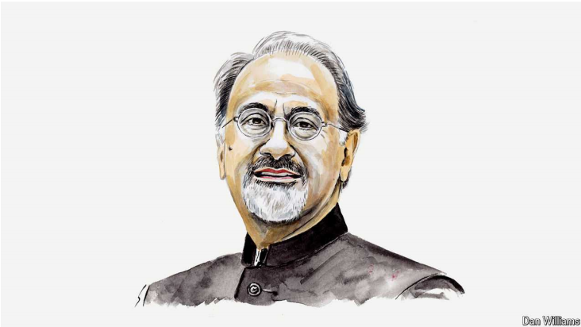

# Indermit Gill on what China and India must do to join the rich club

First invest, then infuse foreign technology and then innovate, says the World Bank’s chief economist

原文：

“TO GET RICH is glorious” is the maxim that inspired one of the most

successful development strategies of the past 50 years. It’s an aspiration

widely shared across developing countries—and for good reason. When

countries become wealthier, the results can be glorious. Living standards

rise. Poverty recedes. The propensity to pollute dwindles, as products and

production methods improve.

“致富光荣”是激励过去50年最成功发展战略之一的格言。这是发展中国家的普遍愿望——而且理由充分。当国家变得更加富裕时，结果可能是辉煌的。生活水平提高了。贫困消退。随着产品和生产方法的改进，污染的倾向减少了。

学习：

maxim：美 [ˈmæksɪm] 格言；箴言；警句；

living standards：生活水平

propensity：美 [prəˈpensəti] （行为方面的）倾向；习性

dwindles：美 ['dwɪndlz] 缩小；（dwindle的第三人称单数）

原文：

That’s why a growing number of developing countries are setting national

deadlines to become developed economies: China by 2035, Vietnam by

2045, India by 2047. In the absence of a miracle, their chances of success

are slim—because of a distinctive affliction that strikes countries as they

climb the income ladder. In the coming decades the fate of the world will

depend on whether it can be cured.

这就是为什么越来越多的发展中国家正在设定成为发达经济体的国家最后期限:中国到2035年，越南到2045年，印度到2047年。在没有奇迹的情况下，他们成功的机会很小——因为在他们攀登收入阶梯时，一种独特的痛苦袭击着这些国家。未来几十年，世界的命运将取决于它能否被治愈。

学习：
slim：少量的；机会渺茫的

chances are slim：机会很小

affliction：美 [əˈflɪkʃn] 痛苦；苦难；折磨；悲痛

原文：

In their drive for wealth, few countries get anywhere near the top. Economic

growth in developing countries tends to level off during the middle-income

stage. It’s what the World Bank calls “the middle-income trap”. This idea

has been disputed over the past decade or so. Yet the latest evidence is

compelling: since 1970 the average per-person income of middle-income

countries has never risen above 10% of the level in America.

在追求财富的过程中，很少有国家接近顶端。发展中国家的经济增长在中等收入阶段趋于平稳。这就是世界银行所说的“中等收入陷阱”。这个想法在过去十年左右的时间里一直受到争议。然而最新的证据令人信服:自1970年以来，中等收入国家的人均收入从未超过美国水平的10%。

学习：

level off：数字趋向平缓；数量趋向平缓；物价趋于稳定；

compelling：美 [kəmˈpelɪŋ] 令人信服的；有说服力的；

evidence is compelling：证据令人信服

原文：

Since 1990 only 34 economies have managed to move up from middle- to

high-income status—and more than a third of those were beneficiaries of

either integration into the European Union or previously undiscovered oil.

The number of people living in these economies is less than 250m—roughly

the population of Pakistan.

自1990年以来，只有34个经济体成功从中等收入国家上升到高收入国家——其中超过三分之一是加入欧盟或以前未发现的石油的受益者。生活在这些经济体中的人口不到2 . 5亿，大约相当于巴基斯坦的人口。

学习：

manage to：设法；努力；达成；成功完成；

原文：

Today middle-income countries (defined by the World Bank as having gross

national income per person of between roughly \$1,150 and \$14,000) are

home to about 6bn people and nearly two-thirds of those who struggle in

extreme poverty. They produce about 40% of the world’s economic output

and nearly two-thirds of its carbon emissions. In short, the global effort to

end extreme poverty and spread prosperity and liveability will largely be

won or lost in these countries.

如今，中等收入国家(根据世界银行的定义，人均国民总收入约在1150美元至14000美元之间)拥有约60亿人口，其中近三分之二生活在极端贫困中。它们的经济产出约占全球的40%，碳排放量占全球的近三分之二。简言之，终结极端贫困、扩大繁荣和宜居性的全球努力将在很大程度上取决于这些国家的成败。

学习：

liveability：宜居性

原文：

Middle-income countries now face far heavier burdens than their

predecessors did: ageing populations, geopolitical and trade frictions, and

the need to speed up growth without fouling the environment. Yet most

remain wedded to an approach out of the last century: policies focused

heavily on attracting investment. That’s the equivalent of driving a car

entirely in first gear: it will take forever to get to the destination. A few try

to leapfrog to innovation. That’s the equivalent of shifting from first gear to

fifth and stalling the car.

中等收入国家现在面临着比其前辈更沉重的负担:人口老龄化、地缘政治和贸易摩擦，以及在不污染环境的情况下加快增长的需要。然而，大多数人仍坚持上世纪的做法:政策重点是吸引投资。这相当于完全以第一档驾驶一辆汽车:到达目的地需要很长时间。少数人试图跨越式创新。这相当于从一档换到五档，然后让车熄火。

学习：

trade friction：贸易摩擦

fouling：弄脏；（foul的现在分词）

foul the environment：污染环境

in first gear：一档

原文：

There is a better way. The World Bank proposes a sequenced, three-pronged

plan.

学习：

prong：（政策等的）方面；〈喻〉（作战）分支；队

three-pronged：三管齐下的，三个方面的

原文：

Low-income countries are best served by a strategy focused mainly on

attracting investment. Once they become lower-middle-income countries,

they need a more sophisticated approach. Investment must be supplemented

by the deliberate infusion of technology from abroad. That means acquiring

modern technologies and business models and diffusing them domestically

to enable enterprises to become global suppliers of goods and services.

主要侧重于吸引投资的战略最适合低收入国家。一旦它们成为中低收入国家，它们就需要更复杂的方法。投资必须辅之以有意识地引进国外技术。这意味着获取现代技术和商业模式，并在国内传播，使企业成为商品和服务的全球供应商。

学习：

infusion of technology：引进技术

business models：商业模式

原文：

Infusion requires an ever-larger talent pool: more engineers, scientists,

managers and other highly skilled professionals. To expand the pool, skills

must be sharpened across the workforce. One of the most self-defeating

attributes of middle-income economies is their proclivity to sideline women

by limiting their educational and economic opportunities. The payoff can be

immense when such practices are halted. In America, for example, more

than a third of the growth that occurred between 1960 and 2010 can be

attributed to decreasing racial and gender discrimination in education and

the workforce. Without these changes, America’s income per person would

now be \$50,000, not the \$80,000 it is.

引进技术需要更大的人才库:更多的工程师、科学家、经理和其他高技能专业人士。为了扩大人才库，必须提高劳动力的技能。中等收入经济体最自我拆台的属性之一是它们倾向于通过限制女性的教育和经济机会来排斥女性。当这种做法停止时，回报可能是巨大的。比如，在美国，1960年至2010年间超过三分之一的增长可以归因于教育和劳动力中种族和性别歧视的减少。如果没有这些变化，美国人均收入现在将是5万美元，而不是现在的8万美元。

学习：

talent pool：人才库

proclivity：美 [proʊˈklɪvədi] 倾向；倾向性；偏好；

sideline：使靠边；使退出比赛；使不能参加活动；

原文：

Once a country has mastered both investment and infusion, it is ready for the

final push—towards global innovation. South Korea stands out in all three

categories. In 1960 its per-person income stood at just $1,200. By the end of

2023 it had climbed to $33,000. No other country has managed to pull off a

performance like that.

一旦一个国家掌握了投资和注入技术，它就准备好了最后一搏——走向全球创新。韩国在这三个方面都很突出。1960年，韩国的人均收入仅为1200美元。到2023年底，这一数字已攀升至3.3万美元。没有哪个国家能取得这样的成绩。

学习：

pull off：成功完成；办成；做成（困难的事情）

原文：

South Korea began with a simple set of policies to increase public

investment and spur private investment. That morphed in the 1970s into an

industrial policy that encouraged South Korean firms to adopt foreign

technology and more cutting-edge production methods. Samsung, once a

local trading company dealing in dried fish and noodles, began making

televisions using technologies licensed from Japanese companies.

韩国从一套简单的增加公共投资和刺激私人投资的政策开始。这在20世纪70年代演变成一项产业政策，鼓励韩国企业采用外国技术和更先进的生产方法。三星曾经是一家经营鱼干和面条的当地贸易公司，开始使用从日本公司获得许可的技术生产电视机。

原文：

Samsung’s success fuelled demand for engineers, managers and other skilled

professionals. The South Korean government did its bit to help the economy

meet this demand. The education ministry, for instance, set targets and

increased funding for public universities to help develop the new skills

sought by domestic firms. The results are clear to see. Today Samsung is an

innovation powerhouse—one of the world’s two largest smartphone

manufacturers and its largest memory-chip manufacturer.

三星的成功刺激了对工程师、经理和其他专业技术人员的需求。韩国政府尽力帮助经济满足这一需求。例如，教育部为公立大学设定了目标并增加了资助，以帮助发展国内企业所需的新技能。结果显而易见。如今，三星是一个创新引擎——世界上两大智能手机制造商之一，也是最大的内存芯片制造商。

学习：

did its bit to：尽力做某事

powerhouse：强大的集团（或组织）；

原文：

To make the transitions necessary to reach high-income status, governments

in middle-income countries must enact competition policies that create a

healthy balance between large corporations, mid-sized firms and startups.

The benefits will be greatest when policymakers focus less on the size of the

company and more on the value it brings to the economy, and when they

encourage the upward mobility of all of their citizens instead of fixating on

zero-sum policies to reduce income inequality

为了进行必要的转型以达到高收入水平，中等收入国家的政府必须制定竞争政策，在大企业、中型企业和初创企业之间建立健康的平衡。当政策制定者不那么关注公司的规模，而是更多地关注它给经济带来的价值时，当他们鼓励所有公民向上流动，而不是专注于零和政策以减少收入不平等时，好处将会最大

学习：

 large corporations, mid-sized firms and startups.大企业、中型企业和初创企业

fixating：美 [ˈfikseitɪŋ] 注视；（fixate的现在分词）

upward mobility of citizens: 公民向上流动

原文：

They should also seize opportunities arising from the need to tackle climate

change—by producing and exporting electric vehicles, wind turbines, solar

panels and so on. Middle-income countries should not be expected to

immediately forgo the use of all fossil fuels in their quest for faster

economic growth. But they should be expected to become more energy-

efficient and cut emissions.

他们还应该抓住应对气候变化的机遇——生产和出口电动汽车、风力涡轮机、太阳能电池板等等。不应指望中等收入国家在寻求更快的经济增长时立即放弃使用所有化石燃料。但人们应该期待它们变得更加节能，减少排放。

学习：

forgo：美 [fɔːrˈɡoʊ] 放弃；舍弃

原文：

If they stick to the old approach, most developing countries will miss their

target of reaching high-income status by the middle of this century. On

current trends it will take China another 11 years to reach just one-quarter of

America’s income per person. It will take Indonesia 69 years and India 75.

By adopting a “3i” strategy—first investment, then infusion, then innovation

—they can multiply their odds of getting there. The rest of the world would

benefit, too, because policies that reward merit and efficiency enable growth

that is quicker, kinder and cleaner. ■

如果他们坚持旧的方法，大多数发展中国家将无法实现到本世纪中叶达到高收入国家的目标。按照目前的趋势，中国还需要11年才能达到美国人均收入的四分之一。印度尼西亚需要69年，印度需要75年。通过采用“3i”战略——首先投资，然后注入技术，然后创新——他们可以成倍增加成功的几率。世界其他地区也将从中受益，因为奖励功绩和效率的政策能够实现更快、更友好和更清洁的增长。■

学习：

miss the target：完不成目标

Indermit Gill is chief economist and senior vice-president of the World Bank Group.

## 后记

2024年8月17日12点49分于上海。

