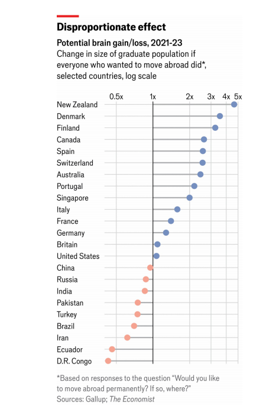
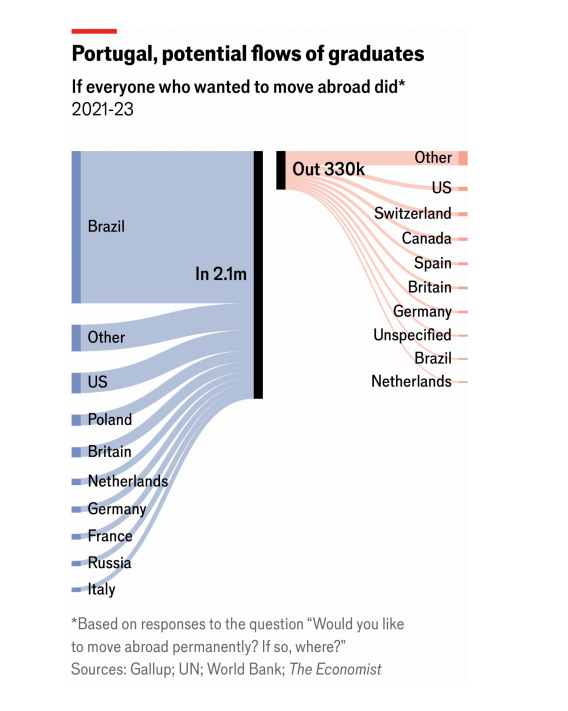

# Talent is scarce. Yet many countries spurn it

There is growing competition for the best and the brightest migrants

spurn：美 [spərn] 轻蔑地拒绝；藐视地拒绝；摒弃；唾弃；冷落；拒之门外

原文：

Zeke Hernandez was worried. His 12-year-old son, Lucas, had not grown for

two years. The family paediatrician told him to eat more, but it didn’t work.

Eventually, after a battery of tests, another doctor diagnosed Lucas with

celiac disease, which was damaging his small intestine. The solution was to

stop eating wheat.

齐克·赫尔南德斯很担心。他12岁的儿子卢卡斯已经两年没有长高了。家庭儿科医生让他多吃点，但没用。最终，经过一系列测试后，另一名医生诊断卢卡斯患有乳糜泻，这种疾病正在损害他的小肠。解决办法是停止吃小麦。

学习：

paediatrician：英 [ˌpi:diəˈtrɪʃn] 儿科医师

a battery of：一连串的          

celiac disease：美 [ˈsiliˌæk] 乳糜泻

>**乳糜泻**（英语：coeliac disease 或 celiac disease）又称**麸质敏感性肠病**（gluten-sensitive enteropathy）[[15\]](https://zh.wikipedia.org/wiki/乳糜泻#cite_note-15)，是具有遗传倾向，对含[麦胶](https://zh.wikipedia.org/wiki/麦胶)食物不耐受而导致的肠源性吸收障碍的小肠[自身免疫性疾病](https://zh.wikipedia.org/wiki/自體免疫性疾病)[[10\]](https://zh.wikipedia.org/wiki/乳糜泻#cite_note-NIH2015-10)[[16\]](https://zh.wikipedia.org/wiki/乳糜泻#cite_note-16)。
>
>典型的症状包含胃肠道症状，像是慢性[腹泻](https://zh.wikipedia.org/wiki/腹瀉)、[腹胀](https://zh.wikipedia.org/wiki/腹部脹氣)、[吸收不良](https://zh.wikipedia.org/wiki/吸收不良)、降低食欲，以及使孩童[生长迟缓](https://zh.wikipedia.org/w/index.php?title=生長遲緩&action=edit&redlink=1)。这个病通常发生在六个月大到两岁之间[[1\]](https://zh.wikipedia.org/wiki/乳糜泻#cite_note-Fasano2005Pediatric-1)。不典型的症状比较常见，尤其是病人年纪大于两岁时[[8\]](https://zh.wikipedia.org/wiki/乳糜泻#cite_note-ESPGHAN2012-8)[[17\]](https://zh.wikipedia.org/wiki/乳糜泻#cite_note-Newnham2017-17)[[18\]](https://zh.wikipedia.org/wiki/乳糜泻#cite_note-TonuttiBizzaro2014-18)。肠胃道症状可能轻微或没有表现，另外也可能会有许多[症状影响到身体任何部位](https://zh.wikipedia.org/w/index.php?title=全身性疾病&action=edit&redlink=1)，或甚至是没有显著症状表现[[1\]](https://zh.wikipedia.org/wiki/乳糜泻#cite_note-Fasano2005Pediatric-1)。乳糜泻刚开始是被发现于孩童身上[[8\]](https://zh.wikipedia.org/wiki/乳糜泻#cite_note-ESPGHAN2012-8)[[6\]](https://zh.wikipedia.org/wiki/乳糜泻#cite_note-Cic2015-6)，但其实任意年纪都可以发病[[1\]](https://zh.wikipedia.org/wiki/乳糜泻#cite_note-Fasano2005Pediatric-1)[[8\]](https://zh.wikipedia.org/wiki/乳糜泻#cite_note-ESPGHAN2012-8)。此病常常和其他[自身免疫性疾病](https://zh.wikipedia.org/wiki/自體免疫性疾病)共病，如[1型糖尿病](https://zh.wikipedia.org/wiki/1型糖尿病)和[甲状腺炎](https://zh.wikipedia.org/wiki/甲状腺炎)等[[6\]](https://zh.wikipedia.org/wiki/乳糜泻#cite_note-Cic2015-6)。
>
>Source: https://zh.wikipedia.org/wiki/%E4%B9%B3%E7%B3%9C%E6%B3%BB

intestine:  美 [ɪnˈtestɪn] 肠道；小肠；大肠；肠子

small intestine: 小肠

wheat：英 [wiːt] 小麦； **注意发音**

原文：

Mr Hernandez, who teaches at Wharton business school, tells this story to

illustrate a point about immigration. His (now healthy) son owes a debt to

Alessio Fasano, an Italian-born doctor who helped improve understanding of

gluten intolerance in America. Dr Fasano migrated from a country where

celiac disease is common (Italy) to one where it was thought to be rare

(America). Having grown up surrounded by sufferers, he wondered if the

condition was really so uncommon in his new homeland, or simply

underdiagnosed. In a landmark study in 2003, he proved that celiac disease

afflicts Americans just as much as Europeans. Diagnosis and treatment have

now markedly improved.

在沃顿商学院任教的埃尔南德斯先生讲了这个故事来说明移民的一个观点。他的(现在健康的)儿子欠阿莱西奥·法萨诺一笔债，他是一位出生于意大利的医生，帮助提高了美国对麸质不耐受的理解。法萨诺博士从一个乳糜泻很常见的国家(意大利)移居到一个被认为很罕见的国家(美国)。在被患者包围的环境中长大，他想知道这种情况在他的新祖国是否真的如此罕见，或者仅仅是诊断不足。在2003年的一项里程碑式的研究中，他证明了乳糜泻对美国人和欧洲人的影响一样大。诊断和治疗现在有了明显的改善

学习： 

gluten：英 [ˈɡluːt(ə)n] 谷蛋白；谷胶；麸质

sufferers：患者；受害者；受难者；（sufferer的复数）

原文：

Clever immigrants like Dr Fasano bring huge benefits to the countries where

they relocate. Yet many governments make it hard for them to settle or turn

them away outright. Even governments receptive to skilled immigrants often

bungle the job of attracting them. Some, however, do it ruthlessly and reap

big rewards.

像法萨诺博士这样聪明的移民给他们移居的国家带来了巨大的利益。然而，许多政府让他们很难定居，或者直接拒绝他们。即使是接受技术移民的政府也经常在吸引他们的工作上搞砸。然而，有些国家坚决地去做，并获得丰厚的回报。

学习：

turn away：赶走

outright：立即；当场；彻底地；完全地；直率地

bungle：把…搞糟；完不成任务

## **Brain germane**

germane：美 [dʒərˈmeɪn] 相关的；切题的；有密切关系的；相关联的

原文：

When brainy immigrants arrive in a country, they do not just bring their

brains. They bring fresh ways of looking at things. They know things that

locals don’t, and can tap foreign-language sources that locals can’t. So in a

variety of fields, from business to science, their skills are likely to be

unusually beneficial. “Immigrants are different in useful ways,” argues Mr

Hernandez in “The Truth about Immigration”, a new book.

当聪明的移民来到一个国家时，他们不仅仅带来了他们的智慧。他们带来了看待事物的新方式。他们知道当地人不知道的事情，可以利用当地人不知道的外语资源。因此，在各种领域，从商业到科学，他们的技能可能会异常有益。“移民在有用的方面是不同的，”埃尔南德斯先生在新书《移民的真相》中说道。

原文：

A study by Shai Bernstein of Harvard University and others found an

original way to measure this. They looked at what happens to scientists

when a colleague with whom they have collaborated dies prematurely

(before the age of 60). Naturally, any such tragedy makes the surviving

scientists less productive. But intriguingly, the death of an immigrant

colleague hurts more. The number of patents subsequently received by the

surviving scientists falls by nearly twice as much (17% versus 9%).

哈佛大学的Shai Bernstein和其他人的一项研究发现了一种新颖的测量方法。他们观察了当与他们合作的同事过早死亡(60岁之前)时，科学家们会发生什么。自然，任何这样的悲剧都会降低幸存科学家的生产力。但有趣的是，一位移民同事的死亡更令人伤心。幸存科学家随后获得的专利数量下降了近两倍(17%对9%)。

原文：

“Immigrant inventors are more likely to rely on foreign technologies, to

collaborate with foreign inventors, and to be cited in foreign markets, thus

contributing to the… diffusion of ideas across borders,” the authors

conclude. Immigrants are 14% of the population in America, 16% of

inventors and directly produce over 23% of innovation, measured by patents,

patent citations and the economic value of those patents, the authors

estimate. Taking into account how they make their native-born collaborators

more productive, they are responsible for a staggering 36% of total

innovation.

“移民发明家更有可能依赖外国技术，与外国发明家合作，并在外国市场被引用，从而有助于……思想的跨境传播，”作者总结道。作者估计，按照专利、专利引用和这些专利的经济价值来衡量，移民占美国人口的14%，占发明家的16%，直接创造了超过23%的创新。考虑到他们如何让本土合作者更具生产力，他们对总创新的贡献率高达36%。

学习：

staggering：令人震惊的；难以置信的

原文：

Given the advantages that highly skilled immigrants bring, you might think

that countries would compete as vigorously to attract the best and brightest

as companies do. Many governments say they want to lure the world’s top

talent. China’s ruling party recently vowed to “improve the support

mechanisms for recruiting talent from overseas”, perhaps by allowing

foreign scientists permanent residence. In America Joe Biden’s

administration has promised to streamline the process for admitting talented

foreigners, especially those with skills in AI. Donald Trump has said that

anyone who graduates from an American college should “automatically” get

a green card (ie, permanent residence).

鉴于高技能移民带来的优势，你可能会认为各国会像公司一样激烈竞争以吸引最优秀和最聪明的人才。许多政府表示，他们希望吸引世界顶尖人才。中国执政党最近发誓要“改善从海外招募人才的支持机制”，也许是通过允许外国科学家永久居留。在美国，乔·拜登政府已经承诺简化引进有才能的外国人的程序，尤其是那些拥有人工智能技能的人。唐纳德·特朗普曾表示，任何从美国大学毕业的人都应该“自动”获得绿卡(即永久居留)。

学习：

streamline：简化

streamline the process：简化程序

原文：

The smartest people are highly mobile. Only 3.6% of the world’s population

are migrants. But of the 1,000 people with the highest scores in the entrance

exam for India’s elite institutes of technology, 36% migrate after graduation.

Among the top 100, 62% do. Among the top 20% of AI researchers in the

world, 42% work abroad, according to MacroPolo, a think-tank in Chicago.

最聪明的人流动性很强。世界人口中只有3.6%是移民。但在印度精英理工学院入学考试中得分最高的1000人中，36%的人在毕业后移民了。在前100名中，有62%的人这样做。根据芝加哥智库MacroPolo的数据，全球顶尖的20%人工智能研究人员中，有42%在国外工作。

原文：

Yet few governments think systematically about luring talent, as a corporate

recruiter would. Many have schemes to attract people with specific skills, in

medicine or AI, say, but these are often piecemeal and bureaucratic. China’s

“Thousand Talents” programme, which involved big cash gifts to lure

academics from abroad, enrolled only 8,000 scientists and engineers

between 2008 and 2018, mostly of Chinese origin. In many countries, far

more political energy is expended keeping out the huddled masses than

enticing the excellent. Indeed, though some governments fight fiercely for

footloose talent, others actively harm their own cause. Consider how

America treated Deedy Das, a young AI whizz.

然而，很少有政府像企业招聘人员那样系统地考虑吸引人才。许多公司都有吸引具有特定技能的人的计划，比如在医学或人工智能领域，但这些计划往往是零敲碎打、官僚主义的。中国的“千人计划”在2008年至2018年期间仅招收了8000名科学家和工程师，其中大部分来自中国。该计划涉及巨额现金奖励，以吸引海外学者。在许多国家，更多的政治精力花在了阻止大众上，而不是吸引精英。事实上，尽管一些政府激烈争夺自由流动的人才，但另一些政府却积极损害自己的事业。想想美国是如何对待年轻的人工智能天才Deedy Das的。

学习：
piecemeal：不连贯的；不系统的；零散的；零碎的

huddled：挤成一团的

huddled masses：拥挤的人群

footloose：自由自在的；无拘无束的；行动自如的

footloose talent：自由流动的人才

whizz：美 [wɪz] 行家；善于…的人；（同whiz）

原文：

Mr Das, a Cornell graduate, has worked for Google (on search) and was part

of the founding team at Glean, a startup that created an AI assistant and is

now worth over $2bn. He is precisely the kind of immigrant that both Mr

Biden and Mr Trump say they want.

达斯毕业于康奈尔大学(Cornell ),曾在谷歌(Google)工作(从事搜索业务),是初创公司Glean的创始团队成员，该公司开发了一款人工智能助手，目前市值超过20亿美元。他正是拜登和特朗普都说他们想要的那种移民。

原文：

Yet when he wanted permanent residence, he faced a snag. America

mandates that no country may receive more than 7% of green cards in a

given year. This is tricky for applicants from populous countries, such as the

Indian-born Mr Das. A typical Indian applicant can expect to wait 134 years

for approval, estimates the Cato Institute, a think-tank. That the system is

still paper-based, when even much poorer countries such as Pakistan and

Zambia have shifted to digital, does not help.

然而，当他想要永久居留时，他面临着一个障碍。美国规定任何国家在一年内获得的绿卡不得超过7%。这对于来自人口众多国家的申请者来说有些棘手，比如印度出生的达斯先生。智囊团卡托研究所估计，一个典型的印度申请者可能要等134年才能获得批准。尽管巴基斯坦和赞比亚等更为贫穷的国家已经转向数字化，但美国的系统仍然是基于纸张的，这并没有帮助。

学习：
snag：障碍；（尤指潜在的、意外的、不严重的）问题；困难；

原文：

So Mr Das applied for what is colloquially known as the “genius visa”. He

had to send 926 pages detailing his technical and commercial

accomplishments to bureaucrats who struggled to understand either. He was

rejected on what he calls “nonsensical” grounds: for failing to provide

evidence he had, in fact, provided. He appealed and was eventually granted

a visa.

因此，达斯先生申请了俗称的“天才签证”。他不得不把926页详细描述他的技术和商业成就的文件发给那些难以理解的官僚们。他被拒绝的理由是他所谓的“荒谬的”:因为他没有提供他实际上已经提供的证据。他提出上诉，最终获得了签证。

学习：

colloquially：美 [kə'loʊkwɪrlɪ] 用白话地；用通俗语地；口语地

原文：

The process “stifles innovation”, he says. Certainly, it repels talent. A hefty

73% of foreign graduates of American universities say they would stay in

the country if a visa were readily available. But it often isn’t, so only 41%

actually stay, according to the Economic Innovation Group, a think-tank.

This may also be why, although American universities are widely considered

the world’s best, America has been losing market share to Australia and

Canada over the past two decades.

他说，这一过程“扼杀了创新”。当然，它排斥人才。高达73%的美国大学外国毕业生表示，如果签证容易获得，他们会留在美国。但事实往往并非如此，因此根据智库经济创新集团的数据，只有41%的人真正留了下来。这也可能是为什么，尽管美国大学被广泛认为是世界上最好的，但在过去的二十年里，美国的市场份额一直在被澳大利亚和加拿大夺走。

## **Brain retain**

原文：

Contrast this with how Dubai welcomed Simon Williams, a British banker

with HSBC. It took him a week and minimal hassle to get a residency visa. The

United Arab Emirates (of which Dubai is part) almost never allows

foreigners to become citizens, but work permits for well-paid professionals

are straightforward. Anyone who earns more than 50,000 dirhams ($13,600)

a month is eligible for a “golden visa”, valid for up to ten years, as are

scientists, inventors and even some artists.

与迪拜欢迎汇丰银行英国银行家西蒙·威廉姆斯的方式形成鲜明对比。他花了一周时间，不费吹灰之力就拿到了居留签证。阿拉伯联合酋长国(迪拜是其中的一部分)几乎从来不允许外国人成为公民，但高薪专业人士的工作许可证是很容易的。任何月收入超过5万迪拉姆(1.36万美元)的人都有资格获得“黄金签证”，有效期长达十年，科学家、发明家甚至一些艺术家也是如此。

学习：
hassle：麻烦事；困扰；冲突；纠纷；

United Arab Emirates：阿拉伯联合酋长国，阿联酋

原文：

Settling in is simple, too. Mr Williams says it took him only a week to obtain

a local ID, driving licence, phone number, bank account, credit card and a

licence to buy alcohol, which devout locals shun. A “super-efficient” airport

helps. Mr Williams contrasts “the dreaded 90-minute queue at a US airport to

deal with an immigration officer who rarely seems pleased you’ve come to

visit” with the UAE’s high-tech system. Arriving in Dubai, “My passport stays

in my pocket, the camera recognises me, the screen says, ‘Hello Simon J.

Williams’ and the gate opens.” He feels both more welcome and more

secure.

安顿下来也很简单。威廉姆斯先生说，他只花了一周的时间就获得了当地身份证、驾照、电话号码、银行账户、信用卡和买酒许可证，而虔诚的当地人对买酒避而远之。一个“超级高效”的机场会有所帮助。威廉姆斯将阿联酋的高科技系统与“在美国机场排90分钟的长队，与一名似乎不太喜欢你来访的移民官员打交道”进行了对比。到达迪拜，“我的护照在我的口袋里，相机认出了我，屏幕上写着，‘你好，西蒙·j·威廉姆斯’，大门打开了。”他觉得自己更受欢迎，也更有安全感。

学习：

devout： 美 [dəˈvaʊt] 虔诚的；笃信宗教的；

shun：（故意）避开；回避；避免

dreaded：可怕的；令人恐惧的

原文：

To estimate how much footloose talent countries might gain if they were

more open to it, *The Economist* analysed data from the Gallup World Poll.

This is an annual survey of nearly 200,000 people from more than 150

countries and territories. Among other things, it asks people whether they

would like to move abroad permanently if they had the chance and if so,

where? As a proxy for talent, we considered only respondents who said they

had completed an undergraduate degree. Using data from 2010-23

(excluding 2019 and 2020, when few surveys were conducted), we estimated

how many graduates each country could expect to gain and lose if moving

were easy.

为了估计如果这些国家更加开放，将会获得多少自由流动的人才,《经济学人》分析了盖洛普世界民意测验的数据。这是一项针对来自150多个国家和地区的近20万人的年度调查。除了其他方面，它还询问人们如果有机会，他们是否愿意永久移居国外，如果愿意，移居到哪里？作为人才的代表，我们只考虑那些说他们已经完成了本科学位的回答者。使用2010-23年的数据(不包括2019年和2020年，当时很少进行调查)，我们估计了如果迁移容易，每个国家预计会有多少毕业生受益和损失。

原文：

Three big, rich, English-speaking countries are the most powerful magnets

(see chart above). If there were no barriers to entry, 23m graduates would

move to America, 17m to Canada and 9m to Australia, we estimate. Taking

account of the number who would consider leaving these countries, global

free movement for graduates would raise the number of them in the 

US by 7%(see chart below). Canada, Australia and Switzerland would see their

graduate populations rise by a factor of around 2.5; New Zealand by over

fourfold.

三个富裕的讲英语的大国是最强大的磁铁(见上图)。我们估计，如果没有进入壁垒，2300万毕业生将移居美国，1700万去加拿大，900万去澳大利亚。考虑到考虑离开这些国家的人数，全球毕业生自由流动将使美国的毕业生人数增加7%(见下图)。加拿大、澳大利亚和瑞士的毕业生人数将增长约2.5倍；新西兰增长了四倍多。

学习：

Switzerland：英 [ˈswɪtsələnd] 瑞士

原文：

At the other end of the scale, China and India would lose the largest number

of graduates in absolute terms (14m and 12m respectively). In relative terms,

however, places like Iran, Ecuador and the Democratic Republic of Congo

would see the biggest net outflows. The UAE would see only a modest inflow.

A port in the desert is not inherently attractive—it is policy that makes it so.

在天平的另一端，中国和印度将失去最多的绝对数量的毕业生(分别为1400万和1200万)。然而，相对而言，伊朗、厄瓜多尔和刚果民主共和国等地将出现最大的净流出。阿联酋将只会看到适度的流入。沙漠中的港口本身并不吸引人，而是政策使然。

原文：

Many things that make a country attractive are beyond a government’s

control. Belgium cannot aspire to New Zealand’s scenic beauty, nor New

Zealand to Belgium’s location. The most important pull factor—the quality

of job opportunities—is hard to change in the short run.

许多让一个国家变得有吸引力的事情是政府无法控制的。比利时不能向往新西兰的美景，新西兰也不能向往比利时的位置。最重要的拉动因素——工作机会的质量——在短期内很难改变。

原文：

Places where talent clusters have an enormous advantage, since high-flyers

like to work with other high-flyers in the same field. This is why, for

example, 57% of the top 20% of AI researchers worked in America in 2022.

China is catching up fast, largely because it trains a huge number of AI

experts at home. But more than half of elite Chinese AI researchers work

outside China, whereas America hosts nearly twice as many elite AI

researchers as it trains.

人才聚集具有巨大优势的地方，因为有抱负的人喜欢与同一领域的其他有抱负的人一起工作。例如，这就是为什么2022年前20%的人工智能研究人员中有57%在美国工作。中国正在快速追赶，主要是因为它在国内培养了大量人工智能专家。但超过一半的中国精英人工智能研究人员在国外工作，而美国拥有的精英人工智能研究人员几乎是其培养的两倍。

学习：

high-flyer：能干的人；非常优秀的人才

>在这里，"high-flyer" 指的是在某个领域中非常优秀或有才华的人。这些人通常在他们的职业中表现出色，并且被认为是未来的领导者或创新者。在这个语境中，它描述了那些顶尖的人工智能研究人员，他们喜欢与其他顶尖人才一起工作，这使得人才聚集地具有巨大的优势。
>
>详细解释：
>
>High-flyer: 在某个领域中非常优秀或有才华的人。例如：The company is looking to hire more high-flyers to lead their innovative projects. 这家公司正在寻找更多的顶尖人才来领导他们的创新项目。

原文：

Still, whatever their starting-point, there are plenty of things governments

can do to make their countries more appealing to foreign talent. They can

simplify the processes by which highly skilled workers enter the country,

and foreign graduates of local universities enter the workplace. They can

treat foreigners with respect. They can adapt to changes in global labour

markets, such as the rise of digital nomads. And they can make it easier to

build infrastructure to accommodate newcomers.

尽管如此，无论他们的出发点是什么，政府可以做很多事情来让他们的国家对外国人才更具吸引力。他们可以简化高技能工人进入本国的程序，以及当地大学的外国毕业生进入工作场所的程序。他们可以尊重外国人。他们能够适应全球劳动力市场的变化，比如数字游牧民的兴起。他们可以更容易地建立基础设施来容纳新来者。

学习：

starting-point：起点；出发点；起跑点

原文：

Portugal is something of a model in this respect. Only a decade and a half

ago, it was considered a backwater. By *The Economist*’s calculations, using

survey data from 2010-12, if all graduates who had wanted to move there

had done so, its graduate population would have increased by just 1%. But

repeating the calculation using survey data from 2021-23, its graduate

population swells by 140%.

葡萄牙在这方面可以说是一个典范。仅仅在15年前，它还被认为是闭塞的环境。根据《经济学人》的计算，使用2010-12年的调查数据，如果所有想搬到那里的毕业生都这样做了，其毕业生人口只会增加1%。但是使用2021-23年的调查数据重复计算，其毕业生人数膨胀了140%。

学习：

backwater：闭塞的环境；不发达地区；落后地区；停滞状态；

原文：

In some ways, the global financial crisis helped. The country was so broke it

needed a bail-out. The government had to sell the national airline, and the

new private owners initiated many more flights to the United States, putting

Portugal on the map for many Americans. More broadly, the Portuguese

government had to think harder about how to foster growth, and opted to

open up to talented and rich immigrants. “It has made a real effort to make it

easier to get visas [for skilled workers],” says André Filipe of Critical

TechWorks, a Portuguese firm that designs software for BMW. “There’s much

less red tape.”

在某些方面，全球金融危机有所帮助。这个国家太穷了，需要纾困。政府不得不出售国家航空公司，新的私人所有者开办了更多飞往美国的航班，使葡萄牙在许多美国人的心目中崭露头角。更广泛地说，葡萄牙政府不得不更加努力地思考如何促进增长，并选择向有才华的富裕移民开放。为宝马设计软件的葡萄牙公司Critical TechWorks的André Filipe说:“为了让技术工人更容易获得签证，它做出了真正的努力。”。“繁文缛节少多了。”

学习：

broke：破产的；贫穷的；没有钱的

原文：

Portugal is also adept at integrating skilled newcomers into the labour force.

A study by Lighthouse Reports found that college-educated migrants in

Portugal were more likely than those in other EU countries to be doing jobs

that matched their skills. Many governments do not recognise qualifications

earned abroad, or make the process difficult. As covid-19 was spreading,

Jeanne Balatova and Michael Fix of the Migration Policy Institute estimated

that there were 165,000 foreign-trained nurses and doctors in America

whose skills were being wasted.

葡萄牙也擅长将有技能的新移民融入劳动力大军。Lighthouse Reports的一项研究发现，葡萄牙受过大学教育的移民比其他欧盟国家的移民更有可能从事与其技能相匹配的工作。许多政府不承认在国外获得的资格，或者使这一过程变得困难。随着新冠肺炎病毒的传播，移民政策研究所的Jeanne Balatova和Michael Fix估计，美国有165，000名外国培训的护士和医生的技能被浪费了。

原文：

Portugal has made shrewd use of other advantages, too, such as a mild

climate and tasty but healthy cuisine. For example, NOVA, a business school,

relocated from the centre of Lisbon to a new campus by the beach in 2018. It

entices foreign students not only with instruction in English and a rigorous

curriculum, but also because “It’s nice to live here,” as Pedro Oliveira, the

dean, puts it. Overlooking the main concourse is a jaunty, turquoise statue of

an executive in a business suit, barefoot and carrying a surfboard. A

walkway leads to the sea. Half the staff and 70% of master’s students are

foreign, with Germans and Italians forming the largest contingents. The

diversity of perspectives in the classroom enriches debate, says Mr Oliveira.

葡萄牙也精明地利用了其他优势，比如温和的气候和美味但健康的菜肴。例如，商学院NOVA于2018年从里斯本市中心迁至海边的新校区。它吸引外国学生不仅仅是因为用英语授课和严格的课程，还因为“住在这里真好”，正如院长佩德罗·奥利维拉所说。俯瞰中央大厅的是一座活泼的蓝绿色雕像，一位高管穿着西装，光着脚，拿着冲浪板。一条走道通向大海。一半的教职员工和70%的硕士生是外国人，德国人和意大利人是最大的群体。奥利维拉表示，课堂上观点的多样性丰富了辩论。

学习：

shrewd： 美 [ʃruːd] 精明的；敏锐的；高明的；

dean：（某些大学的）学院院长；系主任

concourse：美 [ˈkɑnˌkɔrs] 大厅；广场；集会地点

jaunty： 英 [ˈdʒɔːnti] 生气勃勃的；轻松活泼的；无忧无虑的；

turquoise：美 [ˈtɜːrkwɔɪz] 绿松石；青绿色；天蓝色；绿松石色

barefoot：赤脚的；未穿鞋的；光脚的

原文：

Portugal’s population of legal immigrants has shot up, from fewer than

400,000 in 2015 to more than 1m today. On June 3rd the new prime

minister, Luis Montenegro, came to NOVA to unveil a new immigration policy

that aims to make Portugal even more alluring to young, highly skilled

migrants.

葡萄牙的合法移民人口已从2015年的不到40万激增至如今的逾100万。6月3日，新任总理Luis Montenegro来到NOVA公布了一项新的移民政策，旨在使葡萄牙对年轻的高技能移民更具吸引力。

学习：

shoot up：迅速上升；迅速成长；陡增猛涨；猛增；

## **Brain campaign**

原文：

Lowering barriers is more effective than offering carrots. Raj Choudhury of

Harvard Business School and others used a data set of work-related

migration reforms in 15 countries over 26 years and found that policies

discouraging inventors from moving had a large negative effect on patenting

by multinational firms. Policies designed to encourage such mobility had a

positive but much smaller effect.

降低壁垒比提供胡萝卜更有效。哈佛商学院的Raj Choudhury和其他人使用了超过26年的15个国家与工作相关的移民改革的数据集，发现阻止发明者移民的政策对跨国公司的专利申请有很大的负面影响。旨在鼓励这种流动性的政策产生了积极但小得多的效果。

原文：

In some countries, such as Canada, Sweden and the UAE, getting a work visa is

relatively easy for the highly skilled. Some places make it easy for foreign

students to enter the workplace, too: graduates of Danish universities

automatically get a three-year work permit, for instance. Simple, objective

rules speed things up: allowing in anyone who earns more than a certain

sum, for example, or giving applicants points for such things as youth,

qualifications or linguistic proficiency.

在一些国家，如加拿大、瑞典和阿联酋，高技能人才获得工作签证相对容易。一些地方也让外国学生很容易进入工作场所:例如，丹麦大学的毕业生自动获得三年工作许可。简单、客观的规则加速了事情的进展:例如，允许任何收入超过一定数额的人进入，或者根据申请人的年轻程度、资历或语言熟练程度给他们加分。

学习：

highly skilled：高技能人士

linguistic proficiency：语言熟练程度

原文：

Giving bureaucrats too much discretion tends to have the opposite effect.

Whereas Finland uses AI to issue residence permits to students who meet

certain criteria, reserving human immigration officials only for difficult

cases, Italy has a government commission to decide which startups are

innovative enough to merit an investor visa. “It’s insane,” says Chris Kaelin

of Henley and Partners, a consultancy. “Governments are no good at judging

business plans. It would be much better to say, ‘Invest 500,000 euros and

you’re in.’”

给官僚太多的自由裁量权往往会产生相反的效果。芬兰利用人工智能向符合特定标准的学生发放居留许可，只有在困难的情况下才会保留人类移民官员，而意大利有一个政府委员会来决定哪些初创公司足够创新，值得投资者签证。“这太疯狂了，”咨询公司Henley and Partners的Chris Kaelin说。“政府不擅长判断商业计划。如果说‘投资50万欧元，你就进去了’会好得多。"

学习：

discretion：自由裁决权

issue：发放

issue residence permits：发放居留许可

原文：

Fragomen, a law firm, compiles indices on more than 100 countries’

immigration systems. On its index of “restrictive practices”, America is

rated second-worst, after Iraq. Another measure looks at how long it takes,

on average, to obtain a visa for a foreign employee. The range in rich

countries is astonishingly wide, from 34 days in Israel to 232 in Italy.

一家名为Fragomen的律师事务所编制了100多个国家移民系统的指数。在“限制性惯例”指数上，美国排在第二位，仅次于伊拉克。另一个衡量标准是外国雇员获得签证平均需要多长时间。富裕国家的差距大得惊人，从以色列的34天到意大利的232天。

原文：

Delays deter not only jobseekers but also potential employers, notes Mr

Hernandez. Suppose a firm in America has a crucial vacancy that needs

filling right now, and has found the perfect candidate. Alas, she is foreign, so

she needs an H-1B visa (for highly skilled workers). The firm must apply to

the Department of Labour, showing it has tried to find an American citizen

and will not undercut local wages. If the Labour Department approves, the

firm must then apply to the immigration authorities, which will sit on the

application until the following April, when they hold a lottery. At this stage

three-quarters of applications—all for professionals with firm job offers, on

average pay of $130,000 a year—are rejected. If the firm is unlucky, which

it will not know until May, it has paid an immigration lawyer serious cash

for no result.

埃尔南德斯先生指出，延误不仅让求职者望而却步，也让潜在雇主望而却步。假设一家美国公司有一个急需填补的关键职位空缺，并且已经找到了最佳人选。唉，她是外国人，所以她需要H-1B签证(针对高技术工人)。该公司必须向劳工部申请，表明它已经试图找到一个美国公民，不会降低当地工资。如果劳工部批准，公司必须向移民局提出申请，移民局将搁置申请，直到第二年四月举行抽签。在这一阶段，四分之三的申请被拒绝，这些申请都是专业人士申请的，平均年薪为13万美元。如果这家公司运气不好(这要到5月份才能知道)，它已经向一位移民律师支付了一大笔现金，却没有任何结果。

原文：

If the company wins the lottery, it must wait until the following October to

fill the post. Even then, the visa is valid for only three years, and renewing it

is complicated. “[G]iven the choice between a prostate exam and sponsoring

a work visa, hiring managers will probably choose the former,” suggests Mr

Hernandez. An analysis by the *Washington Post* found that it would be

easier for a skilled worker to get a work permit by crossing the border

illegally and claiming asylum.

如果公司赢得抽签，它还必须等到同年十月才能填补这个职位。即便如此，签证只有效三年，续签过程也非常复杂。Hernandez建议：“[在]进行前列腺检查和赞助工作签证之间做选择时，招聘经理可能会选择前者。”《华盛顿邮报》的一项分析发现，非法越境并申请庇护的技术工人更容易获得工作许可证。

学习：

prostate：美 [ˈprɑsˌteɪt] 前列腺（男性泌尿系统的一个部分）

原文：

The randomness of the lottery does at least make it easier to study its baleful

effects. Jun Chen of Renmin University and others looked at 17,000 startups

based in America and backed by venture capital between 2003 and 2016.

Over a third petitioned for at least one H-1B visa, but on average they were

granted barely half the visas they wanted. By comparing firms that won the

lottery with those that didn’t, Mr Chen and his co-authors found that getting

more visas improved a firm’s “financial performance, likelihood of going

public, and quantity and quality of innovation”.

抽签的随机性至少让人们更容易研究它的有害影响。2003年至2016年间，中国人民大学的Jun Chen等人调查了17000家由风险投资支持的美国初创企业。超过三分之一的人申请至少一个H-1B签证，但平均来说，他们得到的签证只有他们想要的一半。通过比较中签和未中签的公司，陈先生和他的合著者发现获得更多的签证可以改善公司的“财务表现、上市的可能性以及创新的数量和质量”。

学习：

baleful：美 [ˈbeɪlfəl] 恶意的；险恶的；凶兆的；致命的；威胁的；

petitioned：美 [piˈtiʃənd] 请求；申请（petition的过去式和过去分词）

原文：

Many high-flyers do not fly alone. To woo them, countries need to consider

their families, too. In Dubai holders of a golden visa can sponsor their

spouses for a work visa, as well as an “unlimited” number of domestic staff.

“It was only two hours’ work to get our nanny a visa,” gushes one expat.

Add cheaper property and zero income tax and his family is much more

comfortable in the UAE than they were in London, he says.

许多有能力的人不会独自飞行。为了吸引他们，国家也需要考虑他们的家庭。在迪拜，持有黄金签证的人可以资助他们的配偶申请工作签证，以及“无限”数量的家政人员。“我们的保姆只花了两个小时就拿到了签证，”一位外籍人士兴奋地说。他说，加上更便宜的房产和零所得税，他的家人在阿联酋比在伦敦舒服多了。

学习：

woo： 美 [wuː] 求爱；追求（异性）； 招揽（顾客）；诱导（投资）

nanny：保姆（照顾儿童的女性）；育儿嫂

gush：兴奋地说

## **Brain disdain**

distain：鄙视

原文：

In America, in contrast, skilled migrants may find that their children are

deported when they reach adulthood and are no longer deemed dependants.

Fedora Castelino, for instance, moved to the US at the age of six. In 2015 her

father, who works for a life-sciences firm, applied for a green card, which

would grant permanent residence to him and his dependants. But like Mr

Das, he is an Indian citizen, so the wait could be excruciating. In November,

when Ms Castelino turns 21, she may have to leave the country she calls

home and pursue her career—she hopes to be a doctor—elsewhere. She is

considering Canada.

相比之下，在美国，技术移民可能会发现他们的孩子在成年后被驱逐出境，不再被视为dependants。例如，Fedora Castelino六岁时移居美国。2015年，她在一家生命科学公司工作的父亲申请了绿卡，这将授予他和他的家属永久居留权。但是和达斯先生一样，他也是印度公民，所以等待可能会非常痛苦。11月，当卡斯特利诺女士21岁时，她可能不得不离开这个她称之为家的国家，去别处追求她的事业——她希望成为一名医生。她正在考虑加拿大。

学习：

reach adulthood：成年

dependant：依赖于他人（通常是父母）以获得签证或居留权的人

>在这段话里，"dependant" 指的是依赖于他人（通常是父母）以获得签证或居留权的人，通常是指未成年子女或在法律上被认为依赖于父母的年轻成年人。
>
>在这段话中，Fedora Castelino 的父亲申请绿卡时，包括她在内的家属被视为“dependants”，即依赖者。然而，当她年满21岁后，她将不再被视为依赖者，这可能会导致她被驱逐出境。

excruciating：英 [ɪkˈskruːʃieɪtɪŋ] 极度痛苦的；极其尴尬的；极度厌烦的；折磨人的

原文：

Treating foreigners with respect ought to be easy. But many governments are

so obsessed with security that they fail. China under Xi Jinping has become

far more prickly. Expats have to register with the police every time they

leave and come back. Hotels must alert the authorities when a foreigner

checks in; many small ones simply turn foreigners away to avoid the hassle,

as your correspondent discovered when half a dozen refused him a bed on a

snowy night in Hebei province. Official campaigns warn Chinese women

that their foreign boyfriends could be spies.

尊重外国人应该很容易。但是许多政府对安全如此着迷，以至于失败了。外国人每次离开和回来都必须向警方登记。当有外国人入住时，酒店必须通知当局；许多小旅馆只是为了避免麻烦而拒绝外国人，正如我们的记者在河北省的一个夜晚发现的那样，六个人拒绝给他一个床位。官方活动警告中国女性，她们的外国男友可能是间谍。

学习：

hassle：麻烦事；困扰

原文：

China’s reputation as a land of opportunity for expats is “long gone”, says

Jens Eskelund of the European Union Chamber of Commerce in China. “Ten

years ago, you needed to have China on your CV. [Now] people will ask,

‘Why are you in China, couldn’t you find anything better?’ [There’s a]

perception that it’s difficult to live [here], and that is exacerbated when you

arrive at the airport and you cannot pay for anything unless you have a

Chinese app…You cannot even buy a cup of coffee.”

中国欧盟商会(European Union Chamber of Commerce in China)的延斯埃斯科伦德(Jens Eskelund)表示，对外籍人士而言，中国是一片充满机遇的土地的名声“早已不复存在”。“十年前，你需要在简历中加入中国。(现在)人们会问，‘你为什么在中国，你不能找到更好的吗？’人们有一种在这里生活很难的感觉，当你到达机场时，这种感觉会加剧，除非你有一个中国应用程序，否则你无法支付任何费用……你甚至无法买一杯咖啡。"

学习：
Chamber：议会；（议会的）议院

exacerbated：美 [ɪgˈzæsəˌbeɪtid] 使恶化；使加剧；（exacerbate的过去式）

原文：

There is little public appetite for immigration. In 2020 a proposal to ease the

path to residency for rich or skilled foreigners faced a populist backlash,

with men promising to protect Chinese women from immigrants. The head

of a think-tank which promoted the scheme was vilified online as a traitor.

Small wonder that, as a study by MERICS, a think-tank, concluded, China “has

not been very successful” in attracting talent that does not already have

strong ties to the country.

公众对移民没什么兴趣。2020年，一项为富有或有技能的外国人放宽居留路径的提案面临民粹主义反弹，男性承诺保护中国女性免受移民的影响。推动该计划的一个智囊团的负责人在网上被诽谤为叛徒。不足为奇的是，正如智库MERICS的一项研究得出的结论，中国在吸引与该国没有紧密联系的人才方面“不太成功”。

学习：

backlash：强烈抵制；集体反对

vilified：美 [ˈvɪləˌfaɪd] 中伤；（vilify的过去式和过去分词）

traitor：叛徒；背叛者；

原文：

Even Hong Kong, the most open part of China, has lost much of its appeal

for expats. A banker who was in Hong Kong during the pandemic recalls the

misery of ultra-strict lockdowns, homeschooling three children in his flat

and being forced to wear a mask indoors or risk being reported by his

neighbours. He contrasts Hong Kong’s “atmosphere of mistrust” with Dubai,

where he now lives. “You talk to any Emirati and they say ‘Do you like it

here? What can we do make you like it better?’”

即使是中国最开放的地区香港，对外籍人士也失去了很多吸引力。一位疫情时期在香港的银行家回忆起极度严格封锁的痛苦，他在自己的公寓里在家教育三个孩子，被迫在室内戴口罩，否则就有被邻居举报的风险。他将香港的“不信任气氛”与他现在居住的迪拜进行了对比。“你和任何一个酋长国人交谈，他们都会问‘你喜欢这里吗？“我们能做些什么让你更喜欢它，”"

原文：

Helal al-Marri, the director-general of Dubai’s Department of Economy and

Tourism, offers a trivial but revealing example. Some expats complained

that a local rule barred them from walking their dogs on beaches. Emirati

officials had thought the rule uncontroversial (and many Muslims consider

dogs unclean). But on realising that it bothered foreigners, they reached a

compromise. Some beaches are now dedicated to dog-walkers.

迪拜经济和旅游部主任Helal al-Marri举了一个微不足道但很有启发性的例子。一些外籍人士抱怨说，当地的一项规定禁止他们在海滩上遛狗。阿联酋官员认为这条规定没有争议(许多穆斯林认为狗不干净)。但是当意识到这让外国人感到困扰时，他们达成了妥协。一些海滩现在是专门为遛狗者准备的。

学习：

dog-walker：遛狗的人

原文：

Since covid-19 revealed that many white-collar jobs could be done remotely,

many countries have tried to attract digital nomads. Dozens offer remote

worker visas. Growth in the number of American digital nomads has slowed

since the height of the pandemic, according to MBO Partners, a consultancy,

but a hefty 11% of American workers describe themselves as such. They

tend to be younger than average, and happier with their work.

自从新冠肺炎透露许多白领工作可以远程完成后，许多国家都试图吸引数字游民。许多公司提供远程工作者签证。根据咨询公司MBO Partners的数据，自疫情高峰期以来，美国数字游牧民的数量增长已经放缓，但仍有高达11%的美国员工这样描述自己。他们往往比平均年龄更年轻，对自己的工作更满意。

原文：

The places that lure them best often have low taxes or a pleasant lifestyle

and relatively easy entry requirements. Vivek Shankar, a content marketing

strategist for financial firms, has been a digital nomad since 2019. He tried

living in Dubai but found it “very consumerist”. “The minute you land you

are bombarded with messages saying you need to buy this or that, and …

need to have a certain income or you’re not worth much.” So he moved to

Portugal, which is “more normal”. There are places to hang out and meet

people without spending money, he says. And he can surf in his spare time.

最能吸引他们的地方往往是低税收或舒适的生活方式，以及相对容易的入境要求。金融公司的内容营销策略师Vivek Shankar自2019年以来一直是一名数字流浪者。他尝试在迪拜生活，但发现那里“非常消费主义”。“你一下飞机，就会收到大量信息，说你需要买这个或那个，还需要有一定的收入，否则你就不值钱了。”于是他搬到了“更正常”的葡萄牙。他说，有些地方可以出去闲逛，结识朋友，而不需要花钱。他可以在业余时间冲浪。

学习：

bombarded：美 [bɑːmˈbɑːrdɪd] 炮击；轰炸；（bombard的过去分词）

原文：

Places that compete for digital nomads typically hope to persuade them to

stick around. This can be hard. A study of nomads in America found that

they stay on average only 71 days in a city. However, a study of a scheme to

attract such people to Tulsa, Oklahoma found that it helps to make them feel

part of a community, for example by helping them with office space and

encouraging them to join school boards. Three-quarters of the participants

stayed at least two years.

争夺数字游牧民的地方通常希望说服他们留下来。这可能很难。一项对美国游牧民族的研究发现，他们平均只在一个城市停留71天。然而，一项关于吸引这些人到俄克拉荷马州塔尔萨的计划的研究发现，这有助于让他们感到自己是社区的一部分，例如，帮助他们获得办公空间，鼓励他们加入学校董事会。四分之三的参与者至少呆了两年。

学习：

stick around：逗留；停留；不离开；呆在原处；留下来

原文：

One problem with migrants is that they need somewhere to live. If lots of

well-heeled ones arrive in a place where housing supply is limited, they can

drive up prices, infuriating locals and creating a backlash. This has happened

in many places, from Sydney to Singapore. It is especially likely if

governments offer visas to those who simply buy a property, as happens in

Greece, Hungary and Malta. Such schemes have recently been scrapped in

Ireland, Spain and Portugal.

移民的一个问题是他们需要一个住的地方。如果大量富人来到一个住房供应有限的地方，他们可能会推高房价，激怒当地人并引发抵制。从悉尼到新加坡，许多地方都发生了这种情况。如果政府向那些只是购买房产的人发放签证，这种可能性尤其大，就像希腊、匈牙利和马耳他发生的情况一样。此类计划最近在爱尔兰、西班牙和葡萄牙被取消。

学习：

well-heeled：阔绰的；有钱的；殷实          

scrapped：废弃；（scrap的过去式）

原文：

House-price inflation is one reason why Australia and Canada, previously

welcoming places, have recently sought to curb the inflow of immigrants.

However, house prices can be kept in check by allowing more construction.

Dubai has far less land than Australia or Canada, but its government is

confident that it can cope with the population more than doubling by 2040.

房价上涨是澳大利亚和加拿大这两个先前欢迎移民的地方最近试图抑制移民流入的原因之一。然而，可以通过允许更多的建设来控制房价。迪拜的土地比澳大利亚或加拿大少得多，但其政府有信心应对2040年翻一番多的人口。

原文：

This year is the biggest election year in history, with countries that are home

to 4.2bn people holding ballots. That bodes ill for talent mobility, says Julia

Onslow-Cole of Fragomen. Candidates for office often promise to tighten

immigration policies, sometimes using rhetoric that puts off top talent from

abroad. The first promise of Mr Trump’s manifesto is to “SEAL THE

BORDER”. “We’re gaming what a second Trump administration might look

like and it’s bleak on legal immigration,” says Ms Onslow-Cole.

今年是历史上最大的选举年，拥有42亿人口的国家将举行投票。Fragomen的Julia Onslow-Cole说，这对人才流动来说不是好兆头。政府的候选人经常承诺收紧移民政策，有时使用的言辞会吓跑国外的顶尖人才。特朗普宣言的第一个承诺是“封锁边境”。昂斯洛-科尔表示:“我们正在博弈第二个特朗普政府可能会是什么样子，而合法移民的前景黯淡。”。

学习：

bodes： 美 [boʊdz] 预示；（bide的过去式）

bleak：黯淡无光的；令人沮丧的；无望的；令人心灰意冷的

原文：

Which hardly sounds like a recipe for making America great again. To adapt

Damon Runyan, the race is not always to the swift nor the greatest success

to the country that attracts the most human capital—but that’s how the smart

money bets. ■

这听起来不像是让美国再次伟大的秘诀。为了适应达蒙·伦延的情况，比赛并不总是跑得最快，也不总是最成功的国家吸引了最多的人力资本——但这就是精明的投资者下注的方式。■

学习：

>Damon Runyan（常拼写为Damon Runyon）是一位美国记者和作家，以其庆祝纽约市百老汇世界的短篇小说而闻名。他创造了一种独特的对话风格，描绘了赌徒、拳击手、演员和黑帮的多彩生活。他的一句名言，被你的引文所引用，意思是“比赛不总是最快的获胜，战争不总是最强的胜利，但聪明的钱会押在它们身上。”
>
>在这个语境中，提到Damon Runyan强调了这样一个观点：虽然吸引最多人才的国家不一定会取得最大的成功，但这却是未来成功的一个强有力的指标，就像聪明的钱会押在这一点上一样。
>
>Damon Runyan (often spelled Damon Runyon) was an American newspaperman and author known for his short stories celebrating the world of Broadway in New York City. He created a distinctive style of dialogue and wrote about gamblers, boxers, actors, and gangsters in a colorful, colloquial manner. One of his famous lines, paraphrased in your excerpt, is "The race is not always to the swift, nor the battle to the strong, but that's the way to bet."
>
>In this context, the reference to Damon Runyan emphasizes the point that, while success isn't guaranteed to the country that attracts the most human capital, it's a strong indicator of future success, aligning with where the "smart money" would bet.

>GPT4o生成：
>
>这四个小标题分别以押韵的方式呈现，通过不同的角度探讨了各国对人才的态度和措施。以下是对每个小标题的解释：
>
>1. **Brain Germane**：
>   - **解释**：这里的“germane”意为“相关的，恰当的”，这个小标题可能是指与人才相关的政策和措施。
>   - **意义**：这个部分可能会探讨如何制定与吸引和保留人才相关的政策，以及这些政策如何与国家的需求和目标相一致。
>
>2. **Brain Retain**：
>   - **解释**：这里的“retain”意为“保留”，这个小标题指的是保留人才的措施和挑战。
>   - **意义**：这一部分可能会讨论各国如何留住本国和外来的人才，包括提供良好的工作条件、生活环境和职业发展机会等。
>
>3. **Brain Campaign**：
>   - **解释**：这里的“campaign”意为“活动，运动”，这个小标题指的是吸引人才的努力和行动。
>   - **意义**：这一部分可能会描述各国为吸引顶尖人才所采取的宣传、招聘和政策措施，例如简化签证程序、提供研究经费和创建创新生态系统等。
>
>4. **Brain Disdain**：
>   - **解释**：这里的“disdain”意为“轻视，鄙视”，这个小标题指的是对人才的忽视或不重视。
>   - **意义**：这一部分可能会探讨某些国家或地区在吸引和保留人才方面的失败，或是由于政策、文化或其他因素而导致的人才流失问题。
>
>这些小标题通过押韵的方式增强了文章的吸引力，并且分别从不同的角度对人才流动的现象进行了探讨。

## 后记

2024年8月17日17点44分于上海。

