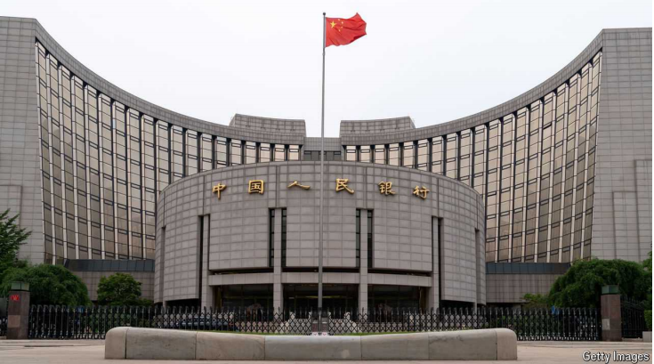
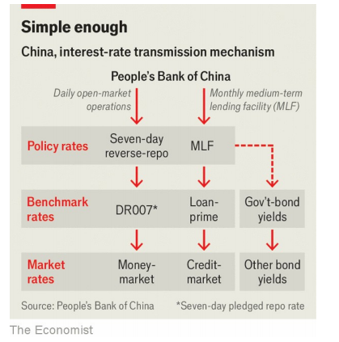

# What is behind China’s perplexing bond-market intervention?

perplexing：使人困惑的；令人困惑的；令人费解的

bond-market：债券市场

The central bank seems to think the government’s debt is too popular

原文：

Many governments live in fear of bond-market “vigilantes”, investors who

punish errant policies by aggressively selling the sovereign’s debt, driving

down its price and thereby pushing up its yield. Financial regulators also

worry about bond-market malfunctions, such as unsettled trades, when one

party to a transaction fails to honour its promises. These mishaps can send

ripples of anxiety through an entire financial system.

许多政府生活在对债券市场“义务警员”的恐惧中，这些投资者通过积极出售主权债务来惩罚错误的政策，压低其价格，从而推高其收益率。金融监管者还担心债券市场失灵，比如当交易的一方未能兑现承诺时，未结算的交易。这些灾难会给整个金融系统带来焦虑的涟漪。

学习：
vigilantes：美 [ˌvidʒiˈlæntiz] 自发组织的治安维持者；治安委员会成员；（vigilante的复数）

drive down：压低

malfunctions：故障；失灵；（malfunction的复数）；

honour：履行；信守；遵守；表彰；兑现（支票）

honour its promises：兑现承诺

mishaps：美 [ˈmɪsˌhæps] 灾祸；（mishap的复数） **注意发音**

原文:

Such fears do not seem to apply to China’s financial authorities. On August

9th regulators in the southern province of Jiangxi ordered several rural banks

not to settle their recent purchases of government bonds, according to

Bloomberg, a news service. Similar lenders elsewhere have also been

reported to the People’s Bank of China (PBoC), the country’s central bank, for

using their own accounts to buy bonds on behalf of others. Rural banks have

been instructed to stick to their main business of lending to local enterprises,

rather than to the central government.

这种担忧似乎并不适用于中国金融当局。据新闻机构彭博报道，8月9日，南方省份江西的监管者命令几家农村银行不要结算他们最近购买的政府债券。中国央行中国人民银行(PBoC)也收到了其他地方类似银行的举报，称其利用自己的账户代他人购买债券。农村银行已经接到指示，要坚持向地方企业贷款的主要业务，而不是向中央政府贷款。

学习：

news service：新闻机构

原文：

The measures are part of an attempt by the central bank to stem a relentless

rally in the government’s bonds. Earlier this month yields dropped below

2.1% on ten-year securities, down from almost 2.6% at the start of the year.

The causes are clear: China’s economy has slowed, borrowers have retreated

and inflation has vanished. Nonetheless, officials have been warning since

April that yields would not stay low for ever. In July the PBoC unveiled plans

to sell government securities borrowed from other financial institutions if

required. The central bank was, in other words, “preparing to short its own

government’s bonds”, as Adam Wolfe of Absolute Strategy Research, a

consultancy, put it. In the end, the bank left the vigilantism to other members

of its posse. On August 5th state-owned banks sold bonds heavily, driving

the price down and the yield back up a notch.

这些措施是央行遏制政府债券持续上涨的努力的一部分。本月早些时候，十年期证券的收益率从年初的近2.6%降至2.1%以下。原因很明显:中国经济增长放缓，借款人减少，通胀消失。尽管如此，自4月份以来，官员们一直警告称，收益率不会永远保持在低位。7月，中国人民银行公布了出售从其他金融机构借入的政府证券的计划，如果需要的话。换句话说，正如咨询公司Absolute Strategy Research的亚当沃尔夫(Adam Wolfe)所言，央行正“准备卖空本国政府债券”。最后，银行把治安维持会留给了其他成员。8月5日，国有银行大举抛售债券，压低了价格，收益率回升了一个档次。

学习：
rally：上涨

stem: 阻止；遏制；遏止

yields: 收益率

posse：美 [ˈpɑsi] 一群人，尤其是指有共同目的或任务的人群

>**Posse**: 在这个背景下是指那些协助中央银行实现其目标的其他金融机构或实体。在这里，这些实体是国有银行，它们通过卖出债券来帮助提高收益率。
>
>- **意思**: 一群人，尤其是指有共同目的或任务的人群。在法律背景下，它指由执法官员召集来帮助维持治安的临时队伍。
>- **例如**: The sheriff formed a posse to hunt down the escaped prisoner.（治安官召集了一群人来追捕逃犯。）

notch：等级；档次；

vigilantism：私自执法
>**Vigilantism**: 在这里指的是中央银行没有直接采取行动，而是把“执法”行动留给了其他金融机构。这里的“执法”是指通过卖出债券来干预市场。
>
>- **意思**: 私自执法，指个人或团体在没有合法授权的情况下采取执法行动。
>- **例如**: The neighborhood watch group was accused of vigilantism after they apprehended a suspect without involving the police.（社区守望小组在没有报警的情况下逮捕了一名嫌疑人，因此被指控为私自执法。）

原文：

Most analysts assume they were acting at the instigation of the PBoC. Pan

Gongsheng, its governor, has portrayed the buying and selling of

government bonds as one of several necessary reforms to its monetary

policy apparatus. Even by the standards of a hands-on government, that

apparatus has an extravagant number of knobs and dials (see diagram). The

central bank sets a seven-day interest rate via reverse repos (buying

securities from financial institutions that need cash with an agreement to sell

them back seven days later). But it also provides a “medium-term lending

facility” that offers one-year loans to banks each month. This heavily

influences banks’ “loan-prime rates”, which are supposed to be the interest

rate they charge their best customers.

大多数分析师认为，他们是在中国央行的授意下采取行动的。央行行长Pan Gongsheng将政府债券的买卖描述为其货币政策机构的几项必要改革之一。即使以一个亲力亲为的政府的标准来看，这个机器也有大量的旋钮和刻度盘(见图表)。央行通过逆回购(从需要现金的金融机构购买证券，并同意在7天后出售)设定7天利率。但它也提供“中期贷款工具”，每月向银行提供一年期贷款。这严重影响了银行的“贷款优惠利率”，这是他们向最好的客户收取的利率。

学习：

instigation：美 [ˌɪnstəˈɡeɪʃ(ə)n] 煽动；怂恿；唆使；鼓动；发起；策划

apparatus：美 [ˌæpəˈrætəs] 装置；（尤指政党或政府的）机构；机关；组织；系统

hands-on：亲自动手的；亲身实践的；动手实践的；动手操作的          

reverse repos：逆回购

原文：

Mr Pan would like to settle on a single policy rate, the seven-day reverse

repo rate—in the process downplaying the role of the medium-term lending

facility. He also wants to improve the “transmission” of changes in this

policy rate to other prices and yields in the financial markets. To this end, he

has narrowed the corridor within which short-term bank borrowing costs can

fluctuate. The reduction in volatility should make it easier for futures

markets to operate, according to Mr Wolfe. In other countries, financial

markets map out an expected path for policy rates into the medium term.

Therefore a central bank’s tweaks to a one-week rate is able to influence

even distant maturities.

Pan Gongsheng希望确定一个单一的政策利率，即7天期逆回购利率——在这个过程中，中期借贷工具的作用被淡化了。他还希望改善这一政策利率向金融市场其他价格和收益率的“传导”。为此，他缩小了短期银行借贷成本的波动区间。沃尔夫表示，波动性的降低应该会让期货市场更容易操作。在其他国家，金融市场规划了中期政策利率的预期路径。因此，央行对一周利率的微调甚至能够影响远期利率。

学习：

corridor：英 [ˈkɒrɪdɔː] 通道；（建筑物内的）过道；（火车上的）走道

map out：绘制出；划出；标出

原文：

Yet, on the face of it, the central bank’s new eagerness to throw its weight

around in the bond market contradicts its other reforms. Even as officials

aspire to make the seven-day rate their principal policy lever, they are not

content to let market forces set the price of other longer-term instruments.

As a consequence, the PBoC evidently has a semi-official policy on the ten

year government-bond yield, too.

然而，从表面上看，央行最近急于在债券市场施展影响力，这与其其它改革相矛盾。尽管官员们渴望将7天期利率作为他们的主要政策杠杆，但他们并不满足于让市场力量来决定其它较长期工具的价格。因此，中国人民银行显然也对十年期政府债券收益率采取半官方政策。

原文：

What explains the approach? There are three possible answers, each

somewhat flawed in its reasoning. Mr Pan has said he is worried about a

repeat on China’s shores of last year’s Silicon Valley Bank debacle in

America. If financial institutions buy too many bonds, will they be able to

withstand the losses when interest rates rise and bond prices drop? But the

prospect of rate hikes in China is so distant that this danger seems remote.

And the threat would be best resolved through bank regulation, not bond

market manipulation.

如何解释这种方法？有三种可能的答案，每一种的推理都有些缺陷。Pan表示，他担心去年美国硅谷银行的崩溃会在中国重演。如果金融机构买了太多的债券，当利率上升，债券价格下降时，他们是否能够承受损失？但中国加息的前景如此遥远，以至于这种危险似乎也很遥远。解决这一威胁的最佳方式是银行监管，而不是债券市场操纵。

学习：
debacle：彻底失败；惨败；崩溃

原文：

A second fear may be a weakening yuan. China’s interest rates are much

lower than America’s, which is putting downward pressure on the country’s

currency. PBoC policymakers may feel that the exchange rate is particularly

sensitive to bond yields. That would help explain why it is clumsily

propping them up, even as it tentatively brings interest rates down.

第二个担忧可能是人民币贬值。中国的利率比美国低得多，这给该国货币带来了下行压力。中国人民银行的政策制定者可能觉得汇率对债券收益率特别敏感。这将有助于解释为什么它笨拙地支撑他们，即使它暂时降低利率。

学习：

exchange rate：汇率

tentatively：暂时地；试验性地；

原文：

The central bank’s third fear may be flat, rather than low, yields. During the

Bank of Japan’s long experiments in monetary easing, its policymakers

worried that the yields on long-maturity bonds were falling into line with

those on short maturities, rather than sitting comfortably above them. This

flattening undermined the profitability of financial institutions that “lend

long” and “borrow short”. The PBoC may be trying to avert a similar danger.

Central banks should “maintain a normal upward-sloping yield curve”, Mr

Pan said in a speech in June. But if the central bank wants financial

institutions to profit from the yield on long-term bonds, why is it so worried

about banks buying them?

央行的第三个担忧可能是收益率持平，而不是偏低。在日本银行的长期货币宽松实验中，其政策制定者担心长期债券的收益率会与短期债券的收益率持平，而不是轻松地高于短期债券。这种扁平化削弱了“长期放贷”和“短期借贷”的金融机构的盈利能力。中国人民银行可能正试图避免类似的危险。Pan在6月份的一次讲话中表示，各国央行应该“保持正常的向上倾斜的收益率曲线”。但如果央行希望金融机构从长期债券的收益率中获利，为什么它如此担心银行购买这些债券？

学习：
yield curve：收益率曲线          

upward-sloping：向上倾斜的

原文：

In the long run, the best way to lift yields is to warm up the economy, which

is likely to require more borrowing and spending from the central

government. Its fiscal stimulus would be more powerful if the central bank

supports spending with further interest-rate cuts. In other words, yields may

have to fall before they can rise. If China’s government is to succeed in

reflating the economy, the PBoC will need to act like an accomplice, not a

vigilante. ■

从长期来看，提高收益率的最佳方式是让经济升温，这可能需要中央政府增加借贷和支出。如果央行通过进一步降息来支持支出，其财政刺激将更加有力。换句话说，收益率可能必须先下降，然后才能上升。如果中国政府要成功地再让经济增长，中国人民银行将需要像一个帮手，而不是不配合。■

学习：
accomplice：美 [əˈkɑːmplɪs] 同谋者；帮凶；从犯；共犯；

>在这段话中，“vigilante” 是用来形容中国人民银行（PBoC）的角色及其行为方式。具体来说：
>
>- **Vigilante** 通常指的是一个自发执行法律或秩序的人，而不是正式的执法者。这些人常常采取激进行动，以达到他们认为正确的目标。
>
>在文中的意思是，如果中国政府要成功地使经济复苏，中国人民银行需要像一个 **“accomplice”** （共谋者）一样，积极配合政府的财政刺激措施，而不是像一个 **“vigilante”** （义务警员）一样，独自采取可能与政府政策不一致的行动。
>
>- **Accomplice**：在这里是指中国人民银行应当积极支持和配合政府的经济刺激措施，通过进一步降息来促进经济增长。
>- **Vigilante**：在这里是指中国人民银行如果独自采取行动（比如抛售债券以推高收益率），可能会与政府的经济刺激目标相违背。
>
>所以，文中的“vigilante” 强调的是一种独立且激进的行为方式，而不是与政府协同合作的态度。

>
>
>“yields may have to fall before they can rise” 的逻辑是：
>
>为了提升收益率（yields），首先需要通过降低利率来刺激经济增长。具体的逻辑如下：
>
>1. **降息刺激经济**：通过降息，可以降低借贷成本，鼓励企业和个人更多地借贷和投资，从而促进经济活动和消费。
>
>2. **经济增长**：随着经济活动的增加，经济逐渐复苏，带来更多的经济产出和需求。
>
>3. **增加通胀预期**：经济复苏通常会伴随着通胀压力的增加，市场对未来的经济增长和通胀预期上升。
>
>4. **提高收益率**：在通胀预期上升的背景下，债券市场的投资者会要求更高的收益率来抵消通胀带来的风险，从而推动债券收益率上升。
>
>所以，“收益率可能需要先下降再上升”的意思是，短期内需要通过降息来刺激经济，使经济回暖，最终带动收益率的上升。这是一种通过先行的货币宽松政策（降息）来实现长期收益率上升的策略。

问题：降息为什么收益率下降？

回答：GPT4o

>降息会导致收益率下降的原因如下：
>
>1. **债券价格和收益率的关系**：债券价格和收益率（利率）是反向关系。当利率下降时，现有债券的票面利率相对于新的低利率债券来说更有吸引力，因此现有债券的价格会上升。由于收益率是债券的固定收益和价格的比值，当价格上升时，收益率就会下降。
>
>2. **借贷成本降低**：降息意味着借贷成本降低，企业和个人更愿意借钱进行投资和消费，市场上对债券的需求增加，推动债券价格上升，收益率下降。
>
>3. **投资者行为**：在降息环境下，银行存款和短期金融工具的收益下降，投资者为了追求更高的回报，可能会转向购买长期债券或其他投资产品，增加对债券的需求，推动债券价格上升，从而使收益率下降。
>
>4. **央行政策传导**：当央行降息时，通常会购买大量债券来增加市场流动性，这也会增加债券需求，推动债券价格上升，收益率下降。
>
>通过这些机制，降息会导致债券市场的收益率下降。

## 后记

2024年8月18日18点43分于上海。

