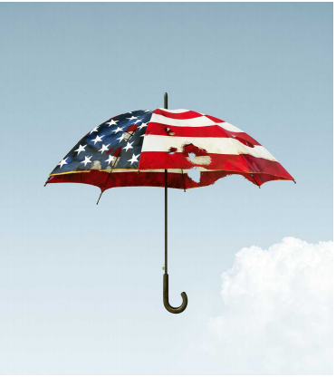

# Reluctantly, America eyes building more nuclear weapons

The superpower faces more adversaries, new technologies and less-confident allies

原文：

The nuclear de-escalation that followed the cold war is over, the Pentagon

warned this month. In its place is a new rivalry among nuclear and almost-

nuclear powers, some of them paranoid. It is more complex and less

predictable than the old, bipolar contest between America and the Soviet

Union. That makes it more dangerous.

五角大楼本月警告说，冷战后的核降级已经结束。取而代之的是核国家和准核国家之间的新一轮竞争，其中一些国家颇为偏执。这比过去美国和苏联之间的两极竞争更复杂，也更难预测。这就更加危险了。

学习：
de-escalation：降级；减低战争的范围或强度          

Pentagon：五角大楼（美国国防部所在地）；美国国防部          

paranoid：偏执的；多疑的；妄想的；患偏执症的

原文：

Facing new nuclear threats will be a test for America, even as its resources

are strained and its politics have grown more isolationist. It must reassure

allies that its nuclear umbrella still protects them. And, unfortunately, it will

have to expand its nuclear arsenal. Falter on either count and this will fuel

proliferation among enemies and friends alike, making America and the

world less secure.

面对新的核威胁将是对美国的一次考验，尽管美国资源紧张，政治更加孤立。它必须让盟国放心，它的核保护伞仍在保护它们。不幸的是，它将不得不扩大核武库。任何一个方面出现动摇，都会助长敌人和朋友之间的扩散，使美国和世界变得不安全。

学习：

resources are strained：资源紧张

reassure： 使放心；使…安心；安慰

arsenal：美 [ˈɑːrsənl] 兵工厂；军火库；武器库；资源库

falter：犹豫；踌躇；动摇

>"Falter on either count" 的意思是指在提到的两个方面中，任何一个方面出现问题或失败。在这段文字中，"either count" 指的是两个关键任务：**一是**美国需要向盟友保证其“核保护伞”仍然能够保护他们，**二是**美国不幸地还需要扩大其核武库。 
>
>因此，"Falter on either count" 的意思是，如果美国在这两个任务中的任何一个方面出现失误或失败，都会导致敌人和盟友之间的核扩散，使得美国和全球的安全形势更加恶化。

原文：

Evidence of new dangers is everywhere. China is building hundreds of

missile silos in its northern deserts. Vladimir Putin blusters about using

nuclear weapons and threatens to aim more Russian missiles at Europe.

Even as it is poised to launch another conventional attack on Israel, Iran is

closer to a bomb than it was five years ago, having reportedly recently made

advances in weaponisation, the process of turning enriched uranium into

warheads. North Korea says it is “bolstering” its nuclear programme. This

week Donald Trump claimed he would build an “Iron Dome” missile shield

to protect America. “It just takes one maniac,” he explained.

新危险的证据随处可见。中国正在北部沙漠建造数百个导弹发射井。弗拉基米尔·普京扬言要使用核武器，并威胁将更多的俄罗斯导弹瞄准欧洲。尽管伊朗准备对以色列发动另一场常规袭击，但与五年前相比，它更接近于拥有一枚核弹。据报道，伊朗最近在武器化方面取得了进展，武器化是指将浓缩铀转化为弹头的过程。朝鲜表示正在“支持”其核计划。本周，唐纳德·特朗普声称他将建造一个“铁穹”导弹防御系统来保护美国。“只需要一个疯子，”他解释道。

学习：
silos： 美 ['saɪloʊs] 发射井；筒仓；（silo的复数）

bluster：咆哮着说；气势汹汹地说；愤慨地说；扬言

uranium：美 [jʊˈreɪniəm] 铀（放射性化学元素）

enriched uranium：浓缩铀      

warheads：弹头；（warhead的复数）

it is poised to：准备xxxx

bolstering：美 ['boʊlstərɪŋ] 支撑；支持

Iron Dome：铁穹

missile shield：导弹网；导弹防御；

maniac：美 [ˈmeɪniˌæk] 疯子；狂人；狂热分子；精神病患者

原文：

All this is a big shift. Between 1986 and 2023 the number of warheads

worldwide fell from 70,000 to 12,000 as the end of the cold war ushered in

defence cuts and arms control. America slimmed its arsenal while keeping a

powerful deterrent. Today it has a smaller “triad” of nuclear weapons that

could be launched from land, air or under the sea. Many of its warheads are

aimed at its adversaries’ warheads. And it offers “extended deterrence”: a

promise to defend allies if required. As recently as 2009 Barack Obama still

hoped for “a world without nuclear weapons”. When he became president,

Joe Biden aspired to re-energise arms control after the chaos of the Trump

administration.

所有这些都是一个巨大的转变。1986年至2023年间，随着冷战的结束带来了防务削减和军备控制，全球核弹头数量从7万枚降至1.2万枚。美国在保持强大威慑力的同时削减了其核武库。今天，它拥有一个更小的“三合一”核武器，可以从陆地、空中或海底发射。它的许多弹头都瞄准了对手的弹头。它还提供了“延伸威慑”:承诺在必要时保护盟友。就在2009年，巴拉克·奥巴马仍然希望“一个没有核武器的世界”。当选总统后，乔·拜登(Joe Biden)渴望在特朗普政府陷入混乱后重振军备控制。

学习：
deterrent：美 [dɪˈtɜːrənt] 威慑力量；制止因素

原文：

Instead, nuclear threats have proliferated and mutated. The number of

warheads is rising again, as China’s arsenal expands from a few hundred a

decade ago to perhaps 1,000 by 2035. This will create a third nuclear

superpower for the first time. Meanwhile, technology is spreading into new

domains and hands. Russia plans to put a bomb in space; North Korean

warheads can reach the continental United States. Militias such as those of

the Houthis have sophisticated missiles (albeit conventionally armed).

China, Iran, Russia and North Korea are co-operating on military matters

and could collude on missile technology, too.

相反，核威胁已经扩散和变异。随着中国的核武库从十年前的几百枚扩大到2035年的大约1000枚，核弹头的数量再次上升。这将首次创造第三个核超级大国。与此同时，技术正在传播到新的领域和手中。俄罗斯计划在太空放置炸弹；朝鲜的弹头可以打到美国本土。像胡塞这样的民兵组织拥有先进的导弹(尽管是常规武器)。中国、伊朗、俄罗斯和朝鲜在军事上合作，也可能在导弹技术上勾结。

学习：
militias：美 [məˈlɪʃəz] 民兵组织；武装（militia的复数）

collude：美 [kəˈlud] 串通；勾结；共谋；

原文：

The Pentagon fears all this will stretch America’s arsenal thin—will it have

enough warheads to deter China, Russia and North Korea at the same time?

—and further complicate the psychology of brinkmanship. It also makes

extended deterrence more difficult. When America first brought South

Korea under its nuclear umbrella, for example, North Korea had no nukes

and no long-range missiles. Now it has nuclear missiles that could incinerate

American cities. The hope that Iron Dome shields, of the kind used in Israel

and Ukraine, can protect America is misplaced: they work less well against

long-range missiles. For any American president, the question looms: would

you sacrifice Los Angeles to avenge Seoul? And do your enemies believe

you would?

五角大楼担心这一切会使美国的武器库捉襟见肘——它会有足够的弹头同时威慑中国、俄罗斯和朝鲜吗？——并进一步使边缘政策的心理复杂化。这也使得延伸威慑更加困难。例如，当美国首次将韩国纳入其核保护伞之下时，朝鲜没有核武器，也没有远程导弹。现在它拥有可以毁灭美国城市的核导弹。寄希望于在以色列和乌克兰使用的那种铁穹护盾能够保护美国是错误的:它们在对付远程导弹时效果不佳。对于任何一位美国总统来说，问题都迫在眉睫:你会牺牲洛杉矶来为首尔报仇吗？你的敌人相信你会吗？

学习：
brinkmanship：边缘政策；边缘外交          

nukes：美 [nuk] 核武器；核能发电厂；（nuke的复数）

incinerate：美 [ɪnˈsɪnəˌreɪt] 焚烧；烧成灰烬；烧毁；火化

misplaced：错误的

stretch xxx thin

>"Stretch [something] thin" 的意思是让某物变得过于分散或稀少，以至于无法有效应对需求或负担。在你提到的句子中，"stretch America’s arsenal thin" 是指美国的核武库可能会因为同时面对中国、俄罗斯和朝鲜的威胁而变得不足，难以同时威慑这些国家。
>
>这意味着美国的核武器可能会因为要应对多个威胁而不够充足，从而使得美国在这些国家之间的威慑力变得不那么有效。

原文：

Allies face tough questions, too. They know isolationist populism isn’t going

away in America, regardless of who occupies the Oval Office next year.

They understand that America’s forces are stretched and its promise of

extended deterrence is less credible than it was. If South Korea doubts

America’s umbrella, it might build its own bomb—and 70% of South

Koreans think it should. Japan might follow a similar logic. Europe is

discussing whether British and French nuclear weapons are enough to deter

Russia if America abandons NATO. If Iran gets the bomb, so might Saudi

Arabia. Proliferation would be destabilising. With more fingers on more red

buttons, the chance of miscalculation increases. The odds of conventional

war may rise, too, if countries try to stop their enemies from crossing the

nuclear threshold.

盟友也面临着棘手的问题。他们知道，不管明年谁将入主总统办公室，孤立主义民粹主义都不会在美国消失。他们明白美国的力量已经捉襟见肘，其延伸威慑的承诺也不如以前可信。如果韩国怀疑美国的保护伞，它可能会制造自己的核弹——70%的韩国人认为应该这样做。日本可能会遵循类似的逻辑。欧洲正在讨论如果美国放弃北约，英国和法国的核武器是否足以威慑俄罗斯。如果伊朗得到了核弹，沙特阿拉伯也可能得到。扩散会破坏稳定。随着更多的手指按在更多的红色按钮上，误判的几率会增加。如果各国试图阻止他们的敌人跨过核门槛，常规战争的可能性也会增加。

原文：

How should America respond? Arms-control talks have stalled. Russia has

suspended its participation in New START, a pact which expires in 2026. China,

never much interested in nuclear-risk reduction talks with America, halted

them in July. North Korea has spurned offers to talk; Iran is mercurial. It

would be unwise to give up on arms control. But if these foes return to the

table, they are more likely to negotiate seriously if they know America is in

a strong position.

美国应该如何应对？军备控制谈判已经停滞。俄罗斯已暂停参与《新削减战略武器条约》(New START)，该条约将于2026年到期。中国，从来没有对与美国的核风险削减谈判感兴趣，在7月停止了谈判。朝鲜拒绝了会谈的提议；伊朗是反复无常的。放弃军备控制是不明智的。但是，如果这些敌人回到谈判桌前，如果他们知道美国处于强势地位，他们更有可能认真谈判。

学习：
stall：停滞

pact：契约；盟约；和约

spurn：藐视；摒弃

foe：敌人

原文：

That means America should be prepared to build a larger and more diverse

arsenal, once New START expires. Mr Biden’s Pentagon has already begun the

pivot, embracing new weapons such as a sea-launched nuclear-armed cruise

missile. It is exploring how to “upload” warheads quickly to existing

launchers, should Russia and China sprint ahead. A President Trump would

probably continue the build-up.

这意味着，一旦《新削减战略武器条约》到期，美国应该准备建立一个更大、更多样化的武器库。拜登先生的五角大楼已经开始转向，拥抱新的武器，如海上发射的核武装巡航导弹。它正在探索如何将弹头快速“上传”到现有的发射器上，如果俄罗斯和中国在这方面领先的话。特朗普总统可能会继续扩军。

学习：
pivot：美 [ˈpɪvət]转向

>Pivot: 这里的 "pivot" 意思是转向或转变方向。结合上下文，这句话的意思是，拜登政府的五角大楼已经开始转向，接受新的武器系统，以应对未来的威胁。
>
>例句：The company decided to pivot towards sustainable products to meet the growing demand.（公司决定转向可持续产品，以满足不断增长的需求。）

sprint：（短距离）冲刺；快速奔跑；全速跑；

## **Mutually assured disruption**

原文：

But a lack of bipartisan agreement over extended deterrence creates

uncertainty. Mr Biden has rightly sought to reassure allies by sending more

nuclear-capable bombers and submarines to Europe and Asia, and by

consulting them more closely, so they understand how weapons might be

used and feel confident that America’s promises are not idle.

但两党在延伸威慑上缺乏一致造成了不确定性。拜登先生通过向欧洲和亚洲派遣更多有核能力的轰炸机和潜艇，并与它们进行更密切的磋商，正确地寻求让盟友放心，这样他们就知道武器可能会如何使用，并对美国的承诺不会落空感到有信心。

学习：

idle：无用的；无效的；

原文：

Mr Trump and some isolationist Republicans may argue that none of this is

necessary to protect America. They are wrong. Extended deterrence is both

essential and in its narrow self-interest. Counterintuitively, America chooses

to make its homeland more vulnerable in order to protect allies thousands of

miles away. In so doing, it helps avert destabilising nuclear proliferation.

This logic has kept America, and perhaps even its adversaries, safer for 80

years. In a dangerous world, it would be reckless to let America’s nuclear

umbrella fray.■

特朗普和一些孤立主义共和党人可能会辩称，这些都不是保护美国所必需的。他们错了。延伸威慑既是必要的，也符合其狭隘的自身利益。与直觉相反，美国选择让自己的国土变得更加脆弱，以保护数千英里之外的盟友。这样做有助于避免破坏稳定的核扩散。这一逻辑让美国，甚至可能是它的对手，在80年里更加安全。在一个危险的世界里，让美国的核保护伞崩溃是鲁莽的。■

学习：

avert：避免（危险、坏事）；防止；

fray: 开始瓦解

>这里的 "fray" 意思是变得脆弱或开始瓦解。结合上下文，这句话的意思是，如果美国的核保护伞开始变得脆弱或不再有效，这将是非常危险的。
>
>例句：As tensions increased, the alliance between the two countries began to fray.（随着紧张局势加剧，这两个国家之间的联盟开始变得脆弱。）

## 后记

2024年8月21日17点44分于上海。

