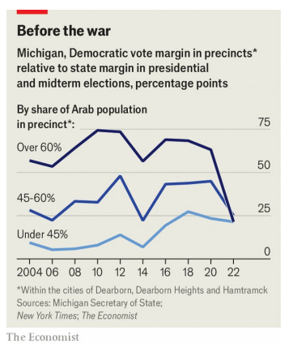
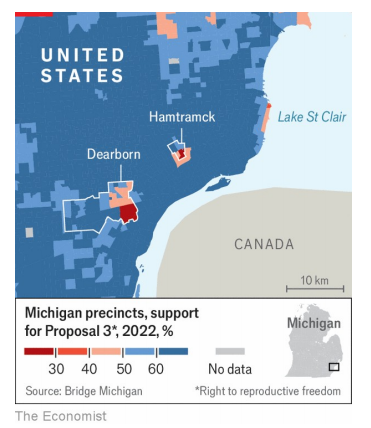

# Can Kamala Harris win Michigan without Arab-American voters?

The Democratic nominee will have tricky territory to navigate at next week’s party convention

Arab：美 [ˈɛrəb] 阿拉伯的；阿拉伯人的 **注意发音**

原文：

Kamala Harris’s first encounter with pro-Palestinian protesters since

becoming the Democratic nominee unfolded at a campaign rally in a

Michigan suburb on August 7th. As Ms Harris spoke to thousands of

buoyant supporters, the dissenters disrupted the party vibe: “Kamala,

Kamala, you can’t hide! We won’t vote for genocide!” Ms Harris

acknowledged their right to speak, but as they carried on, she lost patience:

“You know what? If you want Donald Trump to win, then say that.

Otherwise, I’m speaking.”

8月7日，在密歇根州郊区的一次竞选集会上，卡玛拉·哈里斯首次遭遇亲巴勒斯坦抗议者。当哈里斯女士对数千名热情的支持者讲话时，反对者扰乱了聚会的气氛:“卡玛拉，卡玛拉，你们不能躲起来！我们不会投票支持种族灭绝！”哈里斯女士承认他们有说话的权利，但随着他们的继续，她失去了耐心:“你知道吗？如果你希望唐纳德·特朗普赢，那就说出来。否则，我说话。”

学习：

buoyant：充满活力的；振奋的；轻松愉快的；

dissenters：美 [dɪ'sentəz] 反对者；持异议者；（dissenter的复数）

vibe： 氛围；气氛；情绪；

原文：

The setting for the confrontation was hardly surprising. Michigan gave birth

to the movement that encouraged Democrats to cast “uncommitted” ballots

during the primaries, to protest against Joe Biden’s handling of the war in

Gaza. Some 13% of voters in Michigan’s Democratic primary did so. The

protest vote was most pronounced on college campuses and in the city of

Dearborn, where a majority of residents are of Arab heritage. In nearly half

of Dearborn’s precincts the uncommitted vote beat Mr Biden. In Michigan, a

swing state, Mr Biden’s poll numbers sank well below the support he

enjoyed in 2020, when he won by 2.8 points.

这场对抗的背景并不令人惊讶。密歇根州催生了一场运动，鼓励民主党人在初选期间投出“非承诺”票，以抗议乔·拜登对加沙战争的处理。密歇根州民主党初选中约有13%的选民这样做了。抗议投票在大学校园和迪尔伯恩市最为明显，那里的大多数居民都是阿拉伯裔。在迪尔伯恩将近一半的选区，未承诺的选票击败了拜登先生。在摇摆州密歇根州，拜登的民调数字远低于他在2020年获得的支持，当时他以2.8个百分点的优势获胜。

学习：

confrontation：对抗；冲突；对峙

precincts：美 [p'risɪŋkts] 周围地区；四周空地；（precinct的复数）

原文：

In a close election, young pro-Palestinian voters and the small but

changeable Arab-American electorate in Michigan may be decisive. But Ms

Harris is doing better in the state, for now. A *New York Times*/Siena College

poll of likely voters has her up by four points. There is evidence that she is

not being as widely blamed as Mr Biden was for the bloodshed in Gaza.

在一场势均力敌的选举中，年轻的亲巴勒斯坦选民和密歇根州人数不多但多变的阿拉伯裔美国选民可能是决定性的。但目前哈里斯女士在该州表现更好。纽约时报/锡耶纳学院对潜在选民的民意调查显示她领先了4个百分点。有证据表明，在加沙的流血事件中，她并没有像拜登先生那样受到广泛的指责。

学习：
close election：胜负难分的选举          

bloodshed：美 [ˈblədˌʃɛd] 流血事件；暴力冲突；杀戮；

原文：

Democratic weakness among Michigan’s Arab-American voters—2-3% of

the state’s electorate—predates Gaza. Their preferences track America’s

forever wars and culture wars. George W. Bush won a majority of the state’s

Arab vote in 2000. But after September 11th 2001 and the invasion of Iraq,

Arab-Americans drifted towards Democrats. For the next five presidential

elections Democratic strength among these voters seemed unshakable. In

2020 mostly-Arab precincts in Dearborn favoured Mr Biden by a 67-point

margin.

在加沙之前，密歇根州的阿拉伯裔美国选民(占该州选民的2-3%)中就存在民主党的弱点。他们的偏好追踪美国的永恒战争和文化战争。乔治·w·布什在2000年赢得了该州大多数阿拉伯人的选票。但是在2001年9月11日和入侵伊拉克之后，阿拉伯裔美国人转向了民主党。在接下来的五次总统选举中，这些选民中的民主党力量似乎是不可动摇的。2020年，迪尔伯恩的阿拉伯选区以67个百分点的优势支持拜登先生。

原文：

But in the 2022 midterms, long before the war in Gaza, the vote moved back

towards Republicans (see chart). The culture wars had come for Dearborn.

Concerns that the school library stocked young-adult books with gay

characters turned school-board meetings combative. “Republicans were

gaining a foothold,” recalls Abed Hammoud, a Democrat and founder of the

Arab American Political Action Committee.

但在2022年中期选举中，远在加沙战争之前，投票又回到了共和党人一边(见图表)。迪尔伯恩爆发了文化战争。人们担心学校图书馆藏有同性恋角色的青少年书籍，这使得校董事会会议变得剑拔弩张。“共和党人正在获得一个立足点，”民主党人、阿拉伯裔美国人政治行动委员会的创始人Abed Hammoud回忆道。

学习：
combative：美 [kəmˈbætɪv] 好斗的；好战的；好争论的

foothold：立足点；支撑点；根据地

原文：

A referendum that year to enshrine abortion rights in Michigan’s constitution

won statewide by 13 points. But it lost outright in some Dearborn precincts

and the city of Hamtramck (see map), which is home to a large Yemeni

population. Gretchen Whitmer, a Democrat, won re-election as governor but

saw her vote share fall by 22 points in majority-Arab precincts in Dearborn

compared with four years earlier.

那年，将堕胎权写入密歇根州宪法的全民公决以13个百分点的优势赢得了全州的支持。但是它在一些迪尔伯恩选区和哈姆川克市(见地图)彻底落败，哈姆川克是大量也门人口的家园。民主党人格雷琴·惠特默赢得了州长连任，但与四年前相比，她在迪尔伯恩阿拉伯人占多数的选区的选票份额下降了22个百分点。

学习：

referendum： 美 [ˌrefəˈrendəm] 全民投票；公民投票；全民公决；公投；

enshrine：美 [ɪnˈʃraɪn] 将（权利、传统）确立起来；把…庄严地载入

outright：彻底地；完全地；

Yemeni：美 ['jeməni] 也门人

原文：

Then came the war in Gaza. “You had a fire that was simmering, and

somebody poured gasoline on it,” says Mr Hammoud. “At this point

everything is seen through the lens of Gaza,” he added. As the devastation

there mounted, opposition to Mr Biden intensified. Yet since she has become

the nominee, Ms Harris appears much better positioned to withstand the

protests.

然后是加沙战争。哈穆德表示:“你有一把正在燃烧的火，有人给它浇上了汽油。”。“在这一点上，一切都是通过加沙的镜头来看的，”他补充说。随着灾难的加剧，反对拜登的声音也越来越大。然而，自从哈里斯成为提名人以来，她似乎更有能力抵御抗议。

学习：
simmer：炖；煨；保持微沸；

devastation：美 [ˌdevəˈsteɪʃn] 荒废；毁坏

原文：

In June some 65% of Democrats who said they were more sympathetic to

the Palestinians in the Israel-Palestinian conflict said they had a favourable

view of Ms Harris. In the first poll conducted after Mr Biden dropped out,

favourable views of her among this group rose by 14 points. And she has

also improved her support among Democrats more sympathetic to Israel,

whose favourable assessment of Ms Harris rose from 73% to 89%.

六月，约65%的民主党人表示他们更同情巴以冲突中的巴勒斯坦人，他们对哈里斯女士有好感。在拜登先生退出后进行的第一次民意调查中，该群体对她的好感度上升了14个百分点。此外，她在更同情以色列的民主党人中的支持率也有所提高，对哈里斯女士的支持率从73%上升到89%。

原文：

Next week Democrats will gather in Chicago to hail Ms Harris as their

nominee. Protesters are also expected. A group that puzzlingly still calls

itself the Abandon Biden campaign will hold a convention in the city

headlined by two pro-Palestinian third-party candidates, Jill Stein and

Cornel West. The “uncommitted” movement hopes to organise the handful

of delegates it won in the primaries to show support inside the Democratic

convention for an arms embargo, something Ms Harris’s campaign has

rejected. Ms Harris will be speaking, but will she be listening? ■

下周，民主党人将聚集在芝加哥，欢呼哈里斯女士成为他们的提名人。抗议者也在意料之中。令人困惑的是，一个仍自称为放弃拜登运动的团体将在这座城市举行大会，由两位亲巴勒斯坦的第三党候选人吉尔·斯坦和康奈尔·韦斯特领衔。“未承诺”运动希望组织它在初选中赢得的少数代表，在民主党大会中显示对武器禁运的支持，这是哈里斯女士的竞选团队所拒绝的。哈里斯女士将发言，但她会听吗？■

学习：
hail：热情欢迎； 呼叫；迎接；

embargo：贸易禁令；封港令；禁止出口（或进口）；禁止贸易

## 后记

2024年8月21日18点49分于上海。

