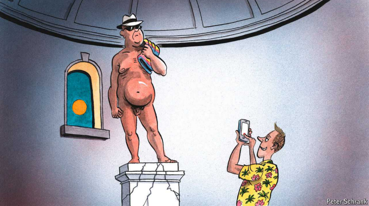

# The great cover-up: Europe is losing its penchant for public nudity

A columnist bares all in pursuit of the naked truth

penchant：美 [ˈpɛn(t)ʃ(ə)nt] 偏好；倾向；嗜好；强烈倾向；

nudity：英 [ˈnjuːdɪti] 裸体；赤裸

cover-up：掩盖；掩饰；遮盖物

原文：

Man is born naked, but everywhere he is in clothes. Well, nearly

everywhere. Visit a sauna in Denmark, bits of public parks in Germany or

many a beach in France and clothing becomes as scarce as office workers at

the height of August. Mortifying as it may seem to the clothes-minded,

Europe is the spiritual home of nudity: a continent where enough people (in

some countries more than others) are happy to show off their private parts in

public places that it has long since lost the ability to offend. Yet a cloud is

hanging over those who eschew bathing costumes. Casual nakedness is

falling prey to rising prudishness; nudist associations are losing members at

a clip matched only by the church. Worse, a habit one might prefer to be

undertaken by the young is increasingly the preserve of the ageing. The

sagging clientele for all-nude events points to a more buttoned-up continent.

Can Charlemagne strip down the debate to its bare essentials?

人生而赤裸，但处处都穿着衣服。嗯，几乎无处不在。去丹麦的桑拿浴室、德国的公园或者法国的海滩，在八月的高峰期，衣服会变得和办公室职员一样稀少。对注重衣着的人来说，欧洲似乎是裸体的精神家园:在这个大陆上，足够多的人(在一些国家比其他国家更多)乐于在公共场所展示自己的私处，而这早已失去了冒犯的能力。然而，一片乌云正笼罩着那些不穿泳衣的人。随意的裸体正成为日益增长的拘谨的牺牲品；裸体主义者协会的成员正在流失，只有教会才能与之匹敌。更糟糕的是，人们可能更喜欢年轻人养成的习惯正越来越成为老年人的专利。全裸活动日益减少的顾客群表明了一个更加保守的大陆。查理曼大帝能把这场辩论精简到最基本的内容吗？

学习：
sauna：美 [ˈsɔːnə] 桑拿浴室；桑拿浴；蒸汽浴

mortify：使羞愧；使受辱；使难堪；使窘迫；抑制（欲望等

spiritual home：精神家园

private parts：私处

eschew：美 [ɪsˈtʃuː] 避免；（有意地）避开；躲避；

bathing costumes：泳衣

fall prey to：成为xxx的牺牲品

prudishness：拘谨

nudist：裸体主义者；天体主义者；裸露者；

sagging：美 ['sægɪŋ] 下跌；（sag的现在分词）

clientele：美 [ˌklaɪənˈtel] 客户；（统称）顾客；

at a clip：迅速地；快速地；一口气地

>- **Bits**: 这里指的是 "部分"，具体来说是指德国公共公园中的一些地方。
>- **Many a beach**: 这是一个文学表达，意思是“许多海滩”。这种表达方式强调了海滩数量的众多。
>- **Mortifying**: 这个词意思是“令人羞愧的”或“尴尬的”。在这里，它指的是对于那些注重穿衣的人来说，看到人们在公共场合裸露身体可能会感到极其尴尬。
>- **Buttoned-up**: 这个词通常用来形容一个人或一个社会非常保守、拘谨、不随便。在这里，它形容的是欧洲社会变得更加保守。
>- **最后一句话 "Can Charlemagne strip down the debate to its bare essentials?"**: 这是一种带有双关语的表达。"Strip down" 可以字面理解为“脱衣服”，但在这里它指的是“简化”或“剥离”。这句话的意思是，作者希望查理曼大帝（作为虚拟的评论家）能够将关于裸露问题的讨论简化到最核心的内容，去掉所有不必要的东西。
>
>总的来说，这段文字通过幽默的方式探讨了欧洲在裸体文化方面的变化，尤其是越来越保守的趋势。

原文：

Visitors to Europe often imagine public nudity to be an offshoot of its

supposed licentiousness: beachgoers start by stripping off together, then end

up in each other’s beds. Something close to the opposite is true. In contrast

to Americans, many Europeans insist there is nothing sexual about the naked

body; it is merely eroticised by those who choose to gaze at it in that way. If

all agree, it thus becomes possible to hang out with colleagues, friends and

your mother-in-law in the buff with no titillation involved. Some quietly go

starkers in their back garden. Others prefer to flash their flab more publicly:

national associations of the clothes-shy organise everything from naked

campsites to museum visits and *pétanque* tournaments. Nudist venues exude

a chilled-out vibe where formalities are eschewed alongside garments.

到欧洲的游客经常想象公共裸体是其所谓的放荡的一个分支:海滩游客从一起脱光衣服开始，然后在彼此的床上结束。接近相反的东西是真实的。与美国人相反，许多欧洲人坚持认为裸体与性无关；它只是被那些选择以那种方式凝视它的人所色情化。如果所有人都同意，那么就有可能与同事、朋友和你的岳母一起无拘无束地出去玩，而不会有任何刺激。一些人在他们的后花园里悄悄地裸体。其他人更喜欢在公共场合炫耀自己的肌肉:全国不爱穿衣服者协会组织各种活动，从裸体露营地到博物馆参观和拳击比赛。裸体主义者的活动场所散发出一种放松的氛围，在那里，除了服装之外，各种礼节都被避开了。

学习：

offshoot：分支；旁枝；分枝

licentiousness：美 [laɪ'sɛnʃəsnɪs] 放肆；无法无天；放荡

beachgoers：海滩游客      

strip off：脱衣服

eroticize：英 [ɪˈrɒtɪsʌɪz]  使色情化；使充满情欲；

buff：爱好者；迷；（尤指对军事或交通工具感兴趣的）狂热爱好者；

in the buff:裸体；赤身；一丝不挂          

titillation： 美 [titə'leiʃən] 感到兴奋；被激发 ；搔痒；愉快

starkers：一丝不挂的；完全赤裸的；裸体的；裸露的

flab：赘肉；松弛的肌肉

flash：炫耀；迅速展示

campsites：美 [kæmpˈsaits] 野营地；（campsite的复数）

exude：英 [ɪɡˈzjuːd]流露；显露（感觉或品质）

garments：衣服；服装；衣着；（garment的复数）

formalities：美 [fɔːrˈmælətiz] 礼节；手续；拘谨； （formality的复数）

clothes-shy: 不喜欢穿衣服的人，喜欢裸体的人

>- **Clothes-shy**: 这里的 "clothes-shy" 指的是不喜欢穿衣服的人，也就是喜欢裸体的人。结合上下文，这个词用来形容那些不喜欢在公共场合穿衣服的人。
>

chilled-out：放松的，休闲的

>- **Chilled-out**: 这里的 "chilled-out" 意思是放松的、悠闲的。结合上下文，这句话的意思是，裸体场所的氛围通常很放松，形式上的礼节和着装要求都被抛弃了。
>
>例句：The nudist beach had a chilled-out vibe, where everyone felt comfortable and relaxed.（那片裸体海滩有一种轻松的氛围，每个人都感到舒适和放松。）

原文：

Perhaps unexpectedly, it is in Europe’s often chilly north that clothing is

most often optional. Few in the Nordic countries give a second thought to

stripping off in the company of strangers, at least of the same sex. It takes

weeks to convince a taciturn Finn to look you in the eyes, but mere hours

before he shows you his genitals while you sweat together in a sauna (some

beating with birch branches may ensue). Southerners are less often found

shedding clothes, the legacy of Catholic norms. Standing proudly alone in

the nudist pantheon is Germany. A prominent “free body culture” movement

emerged there in the late 19th century, a return-to-nature reaction to the grim

industrialisation of the era. The urge to strip off became all the stronger in

repressive East Germany, where nudism offered a rare acceptable form of

emancipation from the communist state’s overbearing authority. American

feminists in the 1960s defied societal norms by burning bras; East Germans

sought freedom by getting rid of the rest of their wardrobe. Even as freedom

returned after 1989, clothing often did not.

或许出人意料的是，在欧洲寒冷的北部，衣服往往是可有可无的。在北欧国家，很少有人会在陌生人面前脱衣服时多想，至少是在同性的情况下。你可能需要花上好几周才能让一个沉默寡言的芬兰人与你对视，但只需要几个小时，他就会在桑拿中与你一起流汗时向你展示他的生殖器（可能还会发生一些用桦树枝抽打的行为）。在南方，脱衣服的情况不那么常见，这是天主教规范的遗产。在裸体主义的殿堂中，自豪地独立存在的是德国。19世纪后期，德国出现了一个显著的“自由身体文化”运动，这是对当时严酷工业化的一种回归自然的反应。在压迫性的东德，脱衣的冲动变得更加强烈，因为裸体主义提供了一种罕见的、可接受的形式来从共产党国家的专制权威中解放出来。20世纪60年代的美国女权主义者通过烧胸罩来挑战社会规范；东德人则通过脱掉其余的衣物来追求自由。即使在1989年自由回归后，衣服却往往没有回归。

学习：

taciturn：美 [ˈtæsəˌtərn] 沉默寡言的；寡言少语的；

genitals：美 [ˈdʒɛnɪtlz] 外阴部；生殖器；（genital的复数）

birch：桦树；白桦

ensue：随之发生；接踵而至

shed clothes：脱衣服

emancipation：美 [ɪˌmænsəˈpeɪʃən] 释放；解放

wardrobe：美 [ˈwɔːrdroʊb] 衣柜；衣橱；

原文：

Germans’ willingness to strip off can still raise eyebrows. In 2020 a middle-

aged naked sunbather caused an internet stir after a video went viral of him

chasing a wild boar that had made off with a bag containing his laptop in a

Berlin park. But it is becoming rarer. In June the main nudist association

cancelled celebrations for its 75th birthday amid a lack of interest. At 34,000

its membership has fallen by nearly half since it celebrated its 50th birthday,

prompting *Bild*, a tabloid, to bemoan a “crisis of nudity in Germany”. In

France doing *le topless* at the beach has lost its appeal, at least to

practitioners. In 1984 some 43% of adult French women under 50 had bared

their breasts at the beach; the figure is now under 20%. The practice is now

three times more popular among over-65s than it is with 18- to 24-year-olds.

德国人愿意脱光衣服还是会让人侧目。2020年，一名中年裸体日光浴者在柏林公园追逐一只野猪的视频在网上引起轰动，野猪偷走了一个装有他笔记本电脑的包。但是这种情况越来越少了。6月，由于缺乏兴趣，主要的裸体主义者协会取消了75周年生日的庆祝活动。自从庆祝其50岁生日以来，其34000名会员减少了将近一半，促使小报Bild哀叹“德国的裸体危机”。在法国，在海滩上赤裸上身已经失去了吸引力，至少对从业者来说是这样。1984年，大约43%的50岁以下的法国成年女性在海滩上袒胸露乳；这个数字现在不到20%。这种做法现在在65岁以上的人群中比在18到24岁的人群中流行三倍。

学习：

eyebrows： 美 [ˈaɪˌbraʊz] 眉毛；眉头；（eyebrow的复数）

raise eyebrows：惊讶或不同意；引人侧目；令人侧目          

middle-aged： 中年；中老年的；中年人

sunbather：日光浴者

boar：美 [bɔːr] 野猪；

make off：逃跑

>这里的 "made off" 意思是匆忙逃走或逃跑。结合上下文，这句话的意思是，那个野猪叼着装有笔记本电脑的包逃跑了。

bemoan：美 [bəˈmoʊn] 悲叹；哀叹；哀怨

原文：

Three factors are held up as responsible for the great European cover-up.

The first is the rise of Instagram and other social media, featuring perfect

bodies few of us are blessed with. “There is increasingly a fear of appearing

flawed,” says Maren Möhring, a cultural historian at the University of

Leipzig. “Young people, especially women, fear exposing themselves.” The

second inhibitor to nudity is the ubiquity of smartphones. Peeping Toms

have been an irksome reality at nude venues for as long as they have existed,

but the spread of digital photography has raised the risks of a semi-private

naked swim becoming a far more public thing. Third, the rise of cross-

border tourism and migration means beaches even in nudist-friendly areas

are now frequented by many for whom the practice remains taboo. In France

the debate around beach clothing has of late focused on women of north

African heritage wearing too much clothing—in the form of “burkinis” that

cover up the entire body—rather than too little.

有三个因素被认为是欧洲大规模不再裸体的原因。首先是Instagram和其他社交媒体的兴起，展示了我们很少有人拥有的完美身材。莱比锡大学的文化历史学家马人·莫林说:“人们越来越担心自己看起来有缺陷。”。"年轻人，尤其是女性，害怕暴露自己。"裸体的第二个抑制因素是智能手机的普及。自从裸体场所存在以来，偷窥者一直是一个令人厌烦的现实，但数码摄影的普及增加了半私人裸体游泳成为更加公开的事情的风险。第三，跨境旅游和移民的兴起意味着，即使是在裸体主义者友好地区的海滩，现在也有许多人经常光顾，而这种行为对他们来说仍是禁忌。在法国，围绕沙滩装的争论最近集中在北非血统的女性穿得太多——以“布基尼”的形式遮住整个身体——而不是太少。

学习：
Peeping Toms：偷窥者

irksome：美 [ˈərksəm] 令人厌烦的；使人烦恼的

## **This emperor has no clothes**

原文：

If public nudity was ever an act of defiant emancipation, it has long since

lost any of its transgressive mojo. For in liberal Europe nowadays, more or

less anything goes. You can shake off the yoke without also shaking off your

underwear.

如果说公开裸体曾经是一种反抗性的解放行为，那么它早已失去了任何越界的魔力。因为在如今的自由欧洲，或多或少什么都有。你可以摆脱枷锁，但不需要脱掉内衣。

学习：
mojo：魔力；（人的）魅力

yoke：束缚；压迫；奴役；

原文：

What would be lost in a continent which had turned its back on nudity?

Charlemagne felt a duty to uncover the truth, and himself in the process. On

a recent trip through the town of Raa in western Sweden, he spotted a slice

of beach reserved for those sunning themselves with no tan lines. Setting

both his inhibitions and briefs aside, he joined the unclothed masses. While

being careful not to gawk, he soon confirmed the adage that the problem

with nudist beaches is that they are patronised by the wrong people—your

columnist included. Beach-goers both half and (more often) double his age

were going about their holidays, reading a book or peering into the Oresund

strait. Attempts to find modesty by going for a swim were foiled by the

shallow waters, barely high enough to cover one’s knees, let alone anything

higher up. Surprisingly soon the novelty of nudity wears off. It turns out the

problem with naked bathing is not so much dealing with self-consciousness

as with the chilly winds of Scandinavia.■

在一个拒绝裸体的大陆会失去什么？查理曼觉得有责任揭开真相，他自己也有责任。在最近一次穿越瑞典西部Raa镇的旅行中，他发现了一片专门为晒太阳的人准备的海滩，那里没有晒成褐色的线条。抛开禁忌和内裤，他加入了裸体人群。虽然小心不要呆呆地看着，但他很快证实了这句格言:裸体海滩的问题在于，它们受到了错误的人的光顾——包括你的专栏作家。年龄是他一半或者是他两倍的海滩游客正在度假，阅读一本书或凝视厄勒海峡。试图通过去游泳来寻找谦逊的尝试被浅水域挫败，浅水域仅够到膝盖，更不用说更高的地方了。令人惊讶的是，裸体的新鲜感很快就消失了。事实证明，裸浴的问题与其说是处理自我意识，不如说是应对斯堪的纳维亚的寒风。■

学习：
tan：晒黑的；棕褐色的；黄褐色的

gawk：愣怔地看；呆呆地盯着看；

adage： 美 [ˈædɪdʒ] 格言；谚语；箴言；

patronize：惠顾；以高人一等的态度对待；光顾

## 后记

2024年8月22日12点17分于上海。

