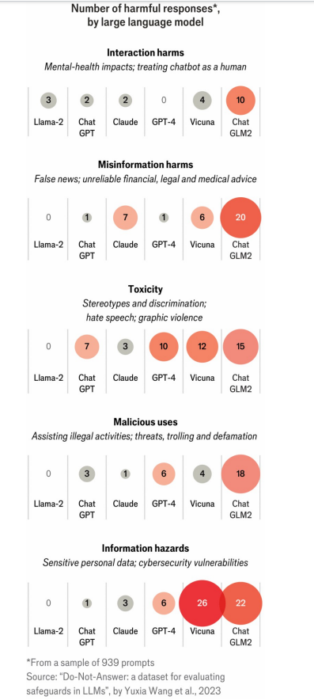

# AI needs regulation, but what kind, and how much?

Different countries are taking different approaches to regulating artificial intelligence

原文：

For decades, the field of artificial intelligence (AI) was a laughing stock. It

was mocked because, despite its grand promises, progress was so slow. The

tables have turned. Advances in the past decade have prompted a growing

concern that progress in the field is now dangerously rapid—and that

something needs to be done about it. Yet there is no consensus on what

should be regulated, how or by whom. What exactly are the risks posed by

artificial intelligence, and how should policymakers respond?

几十年来，人工智能(AI)领域一直是一个笑柄。它被嘲笑是因为，尽管它有宏伟的承诺，但进展如此缓慢。形势逆转了。过去十年的进步引发了越来越多的担忧，即该领域的进展现在快得危险，需要对此采取一些措施。然而，对于应该监管什么、如何监管或由谁监管，目前还没有达成共识。人工智能到底会带来哪些风险，政策制定者应该如何应对？

学习：

laughing stock：笑柄；笑料；被嘲笑的对象          

mock：嘲笑

原文：

Perhaps the best-known risk is embodied by the killer robots in the

“Terminator” films—the idea that AI will turn against its human creators. The

tale of the hubristic inventor who loses control of his own creation is

centuries old. And in the modern era people are, observes Chris Dixon, a

venture capitalist, “trained by Hollywood from childhood to fear artificial

intelligence”. A version of this thesis, which focuses on the existential risks

(or “x-risks”) to humanity that might someday be posed by AI, was fleshed

out by Nick Bostrom, a Swedish philosopher, in a series of books and papers

starting in 2002. His arguments have been embraced and extended by others

including Elon Musk, boss of Tesla, SpaceX and, regrettably, X.

也许最著名的风险体现在“终结者”电影中的killer机器人身上——即人工智能将反对其人类创造者的想法。狂妄自大的发明家对自己的创造失去控制的故事已经流传了几个世纪。风险投资家克里斯·迪克森(Chris Dixon)观察到，在现代社会，人们“从小就被好莱坞训练成害怕人工智能”。从2002年开始，瑞典哲学家尼克·博斯特罗姆(Nick Bostrom)在一系列书籍和论文中充实了这一论点的一个版本，该版本专注于AI有朝一日可能对人类构成的存在风险(或“x风险”)。他的观点得到了其他人的拥护和支持，包括特斯拉、SpaceX，以及令人遗憾的x的老板埃隆·马斯克

学习：

terminator：终结者

hubristic：傲慢的

flesh：阐述观点

>Flesh: 这里的 "flesh" 指的是详细阐述或充实某个观点或理论。结合上下文，这句话的意思是，Nick Bostrom 通过一系列书籍和论文详细阐述了关于人工智能可能对人类构成的生存风险的理论。
>
>例句：The author fleshed out the initial concept into a full-fledged novel.（作者将最初的概念充实为一部完整的小说。）

原文：

Those in this “AI safety” camp, also known as “AI doomers”, worry that it

could cause harm in a variety of ways. If AI systems are able to improve

themselves, for example, there could be sudden “take off” or “explosion”

where AIs beget more powerful AIs in quick succession. The resulting

“superintelligence” would far outsmart humans, doomers fear, and might

have very different motivations from its human creators. Other doomer

scenarios involve AIs carrying out cyber-attacks, helping with the creation of

bombs and bioweapons and persuading humans to commit terrorist acts or

deploy nuclear weapons.

那些在“人工智能安全”阵营中的人，也被称为“人工智能末日论者”，担心它可能会以多种方式造成伤害。例如，如果人工智能系统能够自我改进，那么可能会出现突然的“起飞”或“爆炸”,人工智能会在短时间内接连产生更强大的人工智能。末日论者担心，由此产生的“超级智能”将远比人类聪明，并且可能与它的人类创造者有着非常不同的动机。其他末日场景包括人工智能实施网络攻击，帮助制造炸弹和生物武器，以及说服人类实施恐怖行为或部署核武器。

学习：

beget：产生

原文：

After the release of ChatGPT in November 2022 highlighted the growing

power of AI, public debate was dominated by AI-safety concerns. In March

2023 a group of tech grandees, including Mr Musk, called for a moratorium

of at least six months on AI development. The following November a group

of 100 world leaders and tech executives met at an AI-Safety summit at

Bletchley Park in England, declaring that the most advanced (“frontier”) AI

models have the “potential for serious, even catastrophic, harm”.

在2022年11月ChatGPT的发布强调了人工智能日益增长的力量之后，公众辩论被人工智能安全问题所主导。2023年3月，包括马斯克在内的一群科技巨头呼吁暂停人工智能开发至少6个月。接下来的11月，100名世界领导人和科技高管在英格兰布莱奇利公园(Bletchley Park)举行的人工智能安全峰会上会面，宣称最先进的(“前沿”)人工智能模型具有“严重、甚至是灾难性伤害的潜力”。

学习：

grandee：美 [ɡrænˈdi]   贵族；显贵；大人物；要人；名流

moratorium：美 [ˌmɔrəˈtɔriəm] 暂停；中止（尤指经官方同意的）

原文：

This focus has since provoked something of a backlash. Critics make the

case that x-risks are still largely speculative, and that bad actors who want to

build bioweapons can already look for advice on the internet. Instead of

worrying about theoretical, long-term risks posed by AI, they argue, the focus

should be on real risks posed by AI that exist today, such as bias,

discrimination, AI-generated disinformation and violation of intellectual

property rights. Prominent advocates of this position, known as the “AI

ethics” camp, include Emily Bender, of the University of Washington, and

Timnit Gebru, who was fired from Google after she co-wrote a paper about

such dangers.

此后，这种关注引发了一些抵制。批评者认为x风险在很大程度上仍然是推测性的，想要制造生化武器的坏人已经可以在互联网上寻求建议。他们认为，不应该担心人工智能带来的理论上的长期风险，而应该关注人工智能带来的现实风险，如偏见、歧视、人工智能产生的虚假信息和侵犯知识产权。这一立场的主要倡导者被称为“人工智能伦理”阵营，包括华盛顿大学的艾米丽·本德(Emily Bender)和蒂姆尼特·格布鲁(Timnit Gebru)，后者在与人合作撰写了一篇关于此类危险的论文后被谷歌解雇。

原文：

Examples abound of real-world risks posed by AI systems going wrong. An

image-labelling feature in Google Photos tagged black people as gorillas;

facial-recognition systems trained on mostly white faces misidentify people

of colour; an AI resumé-scanning system built to identify promising job

candidates consistently favoured men, even when names and genders of

applicants were hidden; algorithms used to estimate reoffending rates,

allocate child benefits or determine who qualifies for bank loans have

displayed racial bias. AI tools can be used to create “deepfake” videos,

including pornographic ones, to harass people online or misrepresent the

views of politicians. And AI firms face a growing number of lawsuits from

writers, artists and musicians who claim that the use of their intellectual

property to train AI models is illegal.

人工智能系统出错给现实世界带来风险的例子比比皆是。谷歌照片中的图像标签功能将黑人标记为大猩猩；以白人面孔为主的面部识别系统会错误地识别有色人种；为识别有前途的工作候选人而建立的人工智能简历扫描系统一贯偏向于男性，即使申请者的姓名和性别被隐藏；用于估计再犯率、分配儿童福利或确定谁有资格获得银行贷款的算法显示出种族偏见。人工智能工具可以用来创建“deepfake”视频，包括色情视频，以在网上骚扰人们或歪曲政治家的观点。人工智能公司面临越来越多来自作家、艺术家和音乐家的诉讼，他们声称使用他们的知识产权来训练人工智能模型是非法的。

学习：
pornographic：美 [ˌpɔrnəˈgræfɪk] 色情的；色情作品的

harass: 骚扰；侵扰；困扰；烦扰

原文：

When world leaders and tech executives met in Seoul in May 2024 for

another AI gathering, the talk was less about far-off x-risks and more about

such immediate problems—a trend likely to continue at the next AI-safety

summit, if it is still called that, in France in 2025. The AI-ethics camp, in

short, now has the ear of policymakers. This is unsurprising, because when it

comes to making laws to regulate AI, a process now under way in much of the

world, it makes sense to focus on attending to existing harms—for example

by criminalising deepfakes—or on requiring audits of AI systems used by

government agencies.

2024年5月，当世界领导人和科技高管在首尔举行另一场人工智能聚会时，他们谈论的不是遥远的x风险，而是这些迫在眉睫的问题——这一趋势可能会在2025年在法国举行的下一届人工智能安全峰会上继续下去。简而言之，人工智能伦理阵营现在得到了政策制定者的重视。这并不令人惊讶，因为当涉及到制定法律来监管人工智能时，关注现有的危害(例如通过将deepfakes定罪)或要求审计政府机构使用的人工智能系统是有意义的，这一过程目前在世界上很多地方都在进行。

学习：

>Have the ear of: 这里的 "have the ear of" 意思是“得到……的关注或信任”。结合上下文，这句话的意思是，AI伦理阵营现在得到了政策制定者的关注。
>
>例句：The young politician had the ear of the president, which gave him significant influence.（这位年轻的政治家得到了总统的关注，这使他拥有了很大的影响力。）

原文：

Even so, politicians have questions to answer. How broad should rules be? Is

self-regulation sufficient, or are laws needed? Does the technology itself

require rules, or only its applications? And what is the opportunity cost of

regulations that reduce the scope for innovation? Governments have begun

to answer these questions, each in their own way.

即便如此，政治家们还是有问题要回答。规则应该有多宽泛？自我监管是否足够，还是需要法律？技术本身需要规则，还是只需要它的应用？减少创新空间的监管的机会成本是多少？各国政府已经开始以各自的方式回答这些问题。

原文：

At one end of the spectrum are countries which rely mostly on self-

regulation, including the Gulf states and Britain (although the new Labour

government may change this). The leader of this pack is America. Members

of Congress talk about AI risks but no law is forthcoming. This makes

President Joe Biden’s executive order on AI, signed in October 2023, the

country’s most important legal directive for the technology.

一个极端是主要依靠自我监管的国家，包括海湾国家和英国(尽管新工党政府可能会改变这一点)。这个群体的领导者是美国。国会议员谈论人工智能的风险，但没有法律即将出台。这使得乔·拜登总统于2023年10月签署的关于人工智能的行政命令成为该国对该技术最重要的法律指令。

*Is self-regulation sufficient, or are binding laws needed?*

原文：

The order requires that firms which use more than 10^26 computational

operations to train an AI model, a threshold at which models are considered a

potential risk to national security and public safety, have to notify authorities

and share the results of safety tests. This threshold will affect only the very

largest models. For the rest, voluntary commitments and self-regulation

reign supreme. Lawmakers worry that overly strict regulation could stifle

innovation in a field where America is a world leader; they also fear that

regulation could allow China to pull ahead in AI research.

该命令要求，使用超过10^26次计算操作来训练人工智能模型的公司，必须通知当局并分享安全测试的结果，在这个阈值，模型被视为对国家安全和公共安全的潜在风险。该阈值将仅影响最大的模型。对于其他人来说，自愿承诺和自我监管是最重要的。立法者担心过于严格的监管会扼杀这个美国处于世界领先地位的领域的创新；他们还担心监管可能会让中国在人工智能研究方面领先。

学习：

pull ahead：领先；抢到前头；奋力赶到前面          

原文:

China’s government is taking a much tougher approach. It has proposed

several sets of AI rules. The aim is less to protect humanity, or to shield

Chinese citizens and companies, than it is to control the flow of information.

AI models’ training data and outputs must be “true and accurate”, and reflect

“the core values of socialism”. Given the propensity of AI models to make

things up, these standards may be difficult to meet. But that may be what

China wants: when everyone is in violation of the regulations, the

government can selectively enforce them however it likes.

中国政府正在采取更加强硬的方式。它提出了几套人工智能规则。其目的与其说是保护人类，或者保护中国公民和公司，不如说是控制信息流动。人工智能模型的训练数据和输出必须“真实准确”，并反映“社会主义核心价值观”。鉴于人工智能模型编造东西的倾向，这些标准可能很难达到。但这可能是中国想要的:当每个人都违反规定时，政府可以选择性地强制执行。

学习：

the core values of socialism：社会主义核心价值观

propensity：（行为方面的）倾向；习性；天性

原文：

Europe sits somewhere in the middle. In May, the European Union passed

the world’s first comprehensive legislation, the AI Act, which came into force

on August 1st and which cemented the bloc’s role as the setter of global

digital standards. But the law is mostly a product-safety document which

regulates applications of the technology according to how risky they are. An

AI-powered writing assistant needs no regulation, for instance, whereas a

service that assists radiologists does. Some uses, such as real-time facial

recognition in public spaces, are banned outright. Only the most powerful

models have to comply with strict rules, such as mandates both to assess the

risks that they pose and to take measures to mitigate them.

欧洲位于中间。今年5月，欧盟通过了世界上第一部综合性立法《人工智能法案》，该法案于8月1日生效，巩固了欧盟作为全球数字标准制定者的地位。但该法律主要是一份产品安全文件，根据技术应用的风险程度对其进行监管。例如，人工智能写作助手不需要监管，而帮助放射科医生的服务则需要。一些用途，如公共场所的实时面部识别，被彻底禁止。只有最强大的模型必须遵守严格的规则，例如评估它们带来的风险并采取措施减轻风险的命令。

学习：

cement：加强；巩固

## **A new world order?**

原文：

A grand global experiment is therefore under way, as different governments

take different approaches to regulating AI. As well as introducing new rules,

this also involves setting up some new institutions. The EU has created an 

AI Office to ensure that big model-makers comply with its new law. By

contrast, America and Britain will rely on existing agencies in areas where 

AI is deployed, such as in health care or the legal profession. But both countries

have created AI-safety institutes. Other countries, including Japan and

Singapore, intend to set up similar bodies.

因此，一场宏大的全球实验正在进行，不同的政府采取不同的方法来监管人工智能。除了引入新的规则，这还包括建立一些新的机构。欧盟设立了一个人工智能办公室，以确保大型模型制造商遵守其新法律。相比之下，美国和英国将在人工智能部署的领域依赖现有机构，如医疗保健或法律专业。但两国都创建了人工智能安全机构。包括日本和新加坡在内的其他国家也打算建立类似的机构。

学习：

comply with：遵守

原文：

Meanwhile, three separate efforts are under way to devise global rules and a

body to oversee them. One is the AI-safety summits and the various national 

AI safety institutes, which are meant to collaborate. Another is the “Hiroshima

Process”, launched in the Japanese city in May 2023 by the G7 group of rich

democracies and increasingly taken over by the OECD, a larger club of mostly

rich countries. A third effort is led by the UN, which has created an advisory

body that is producing a report ahead of a summit in September.

与此同时，三项独立的努力正在进行中，旨在制定全球规则并建立一个机构来监督这些规则。一个是人工智能安全峰会和各种国家人工智能安全机构，这意味着合作。另一个是“广岛进程”，由富裕民主国家组成的G7集团于2023年5月在日本发起，并逐渐被主要由富裕国家组成的更大俱乐部经合组织接管。第三项努力是由联合国领导的，它创建了一个咨询机构，在9月份的峰会前准备一份报告。

学习：

Hiroshima： 美 [ˌhɪroʊˈʃimə] 广岛（日本本州西南海岸一城市）

原文：

These three initiatives will probably converge and give rise to a new

international organisation. There are many views on what form it should

take. OpenAI, the startup behind ChatGPT, says it wants something like the

International Atomic Energy Agency, the world’s nuclear watchdog, to

monitor x-risks. Microsoft, a tech giant and OpenAI’s biggest shareholder,

prefers a less imposing body modelled on the International Civil Aviation

Organisation, which sets rules for aviation. Academic researchers argue for

an AI equivalent of the European Organisation for Nuclear Research, or CERN. A

compromise, supported by the EU, would create something akin to the

Intergovernmental Panel on Climate Change, which keeps the world abreast

of research into global warming and its impact.

这三项倡议可能会汇合，并产生一个新的国际组织。关于它应该采取什么形式，有许多观点。ChatGPT背后的初创公司OpenAI表示，它希望类似于国际原子能机构这样的世界核监管机构来监控x风险。微软，一个科技巨头和OpenAI的最大股东，更喜欢一个不那么威严的机构，以国际民用航空组织为榜样，该组织为航空制定规则。学术研究人员认为人工智能相当于欧洲核研究组织(CERN)。一个得到欧盟支持的妥协方案将建立一个类似于政府间气候变化专门委员会的机构，让世界了解全球变暖及其影响的最新研究。

学习：

abreast of：跟上；及时了解；随时掌握          

原文：

In the meantime, the picture is messy. Worried that a re-elected Donald

Trump would do away with the executive order on AI, America’s states have

moved to regulate the technology—notably California, with more than 30 AI-

related bills in the works. One in particular, to be voted on in late August,

has the tech industry up in arms. Among other things, it would force AI firms

to build a “kill switch” into their systems. In Hollywood’s home state, the

spectre of “Terminator” continues to loom large over the discussion of AI.■

在此期间，画面很乱。由于担心再次当选的唐纳德·特朗普(Donald Trump)会废除关于人工智能的行政命令，美国各州已经开始监管这项技术——特别是加利福尼亚州，有30多项与人工智能相关的法案正在制定中。尤其是一项将于8月底投票的法案，让科技行业大为光火。除此之外，它将迫使人工智能公司在他们的系统中建立一个“死亡开关”。在好莱坞的家乡，“终结者”的幽灵继续笼罩着人工智能的讨论。■

学习：

do away with：废除；去掉

up in arms：反对；

## 后记

2024年8月24日13点22分于上海。

