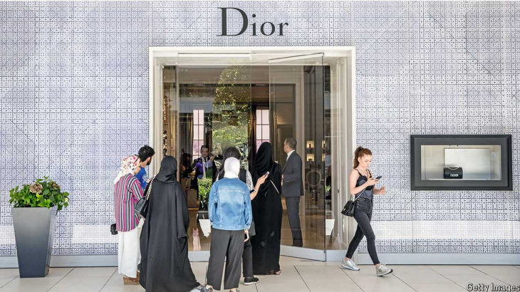

# Turkey’s asset-price boom is good for some but terrible for most

The rich are getting richer

Turkey：土耳其

原文：

On a weekday afternoon the boutiques of Istanbul’s Istinye Park shopping

centre are elegantly buzzing. The city’s Michelin-starred restaurants are

booked out for months, and the yacht marinas are full. Signs of an

astounding wealth boom are everywhere in Turkey’s biggest city, as the

consumption of luxury goods surges. The rich are getting richer: the number

of ultra-high net worth individuals (those with a value of $30m or more) in

Turkey rose by 10% between 2022 and 2023. Yet ask the average Turk

whether they feel they are getting wealthier, and the answer will almost

certainly be no.

工作日的下午，伊斯坦布尔Istinye Park购物中心的精品店优雅地热闹非凡。这座城市的米其林星级餐厅数月前就被预订一空，游艇码头也客满。随着奢侈品消费的激增，在土耳其最大的城市，到处都是令人震惊的财富繁荣的迹象。富人越来越富:2022年至2023年间，土耳其超高净值个人(价值3000万美元或以上)的数量增加了10%。然而，如果问普通土耳其人，他们是否觉得自己变得越来越富有，答案几乎肯定是否定的。

学习：

boutiques：美 [bu:ˈti:ks] 精品店；（boutique的复数）

buzz：美 [bʌz]  热闹气氛；活跃的气氛

yacht： 英 [jɒt] 游艇；

marina：美 [məˈrinə]   游艇停靠区；港湾设施

astounding：美 [əˈstaʊndɪŋ] 令人吃惊的；使大吃一惊的；难以置信的；

luxury goods：奢侈品

ultra-high net worth：超高净值

Turk：土耳其人；

原文：

The figures are astonishing. According to a report from UBS, a bank, average

wealth (financial and property assets minus debts) per Turkish adult

increased by 158% in terms of the lira, Turkey’s currency, between 2022 and

2023—the highest rise by far of any country. Turkey’s inflation rate, which

stood at 61.8% annually in July, is far outpacing the devaluation of the lira,

which fell by 19% against the dollar in the same period. One result is that

property prices are soaring even in dollar terms, as Turks scramble to invest

their savings in assets that they hope will hold their value. Those who have

had access to credit have often been able to get wealthier by taking out a

loan at deeply negative real rates.

这些数字是惊人的。根据瑞士联合银行(UBS)的一份报告，2022年至2023年间，以土耳其货币里拉计算，土耳其成年人的平均财富(金融和房地产资产减去债务)增长了158%，是迄今为止增长最快的国家。土耳其7月份的年通胀率为61.8%，远远超过了同期里拉对美元贬值19%的速度。一个结果是，即使以美元计算，房地产价格也在飙升，因为土耳其人争相将其储蓄投资于他们希望能够保值的资产。那些有机会获得信贷的人往往能够通过获得实际利率为负的贷款变得更加富有。

学习：

astonishing：惊人的；令人惊讶的

scramble：争夺；竞争，竞相

hold value：保值

>
>
>这段话描述了土耳其的通货膨胀率远远超过了土耳其里拉对美元的贬值速度，这是一个经济学和金融学中的关键概念。
>
>**理解方法：**
>
>1. **通货膨胀率 (Inflation Rate):**
>   通货膨胀率是衡量物价水平上升速度的指标。在这里，土耳其的年通货膨胀率为61.8%，这意味着在一年内，平均物价水平上涨了61.8%。
>
>2. **货币贬值 (Currency Depreciation):**
>   货币贬值指的是一个国家的货币对外币的相对价值下降。文中提到里拉对美元贬值了19%，表示里拉在这一期间相对美元贬值了19%。
>
>**解释：**
>
>从金融基本原理来看，如果一个国家的通货膨胀率高于其货币的贬值率，意味着该国的国内物价上涨速度快于其货币相对于其他货币的贬值速度。这会产生以下影响：
>
>1. **实际购买力下降 (Real Purchasing Power):** 
>   通货膨胀率高于货币贬值率意味着国内居民的实际购买力下降得比预期更快。换句话说，即使里拉的价值相对美元下降了19%，但是由于物价上涨了61.8%，土耳其人民用里拉购买商品和服务的能力下降得更快。
>
>2. **资产价格上涨 (Asset Price Inflation):**
>   为了保护他们的财富免受通胀影响，土耳其居民可能会将资金投入到能够保值的资产中，如房地产。这会导致资产价格快速上涨，即使以美元计价也是如此。
>
>3. **负实际利率 (Negative Real Interest Rates):**
>   由于通胀率远高于利率，借款人可以以负实际利率借款，这意味着他们借来的钱在未来的还款中，由于通货膨胀的影响，实际价值会降低。这让借款人在高通胀环境下变得更富有，尤其是如果他们投资于能够保值或升值的资产。
>
>总结而言，这段话反映了在高通胀和货币贬值的环境下，土耳其居民通过投资房产和其他资产来对抗货币贬值和保持财富的行为。

原文：

Well-off asset-holders may be watching their stash balloon. But for average

people, the effect is less pleasant. Although whatever wealth they have is

rising on paper, in the supermarkets their purchasing power has cratered;

nominal average wages actually fell between 2022 and 2023. Turkey’s new

treasury team, led by Mehmet Simsek since last year’s election, is seeking to

rein in inflation by bringing orthodoxy back to an economy that was

scrambled by President Recep Tayyip Erdogan’s years-long insistence on

low interest rates and easy credit.

富裕的资产持有者可能正在关注他们的储蓄增加。但是对于普通人来说，效果就不那么令人愉快了。尽管账面上他们拥有的财富在增加，但在超市里，他们的购买力已经下降；名义平均工资在2022年至2023年间实际下降了。自去年大选以来，由穆罕默德·辛塞克领导的土耳其新财政团队正寻求通过让正统观念回归土耳其经济来抑制通胀。土耳其经济因雷杰普·塔伊普·埃尔多安总统多年来坚持低利率和宽松信贷而陷入困境。

学习：

stash：储备；

stash ballon: 财富（他们的“储藏”或“积蓄”）正在迅速膨胀或增加

>“Stash balloon” 这里的意思是指资产持有者所拥有的财富（他们的“储藏”或“积蓄”）正在迅速膨胀或增加。这种“膨胀”通常是指资产（如房地产或金融投资）在价值上的快速增长，尤其是在高通货膨胀的环境下。虽然他们的财富在名义上增加了，但对于普通人来说，这种效果就不太乐观了，因为尽管他们的财富在纸面上有所增加，但实际购买力却大大下降了。

crater：失败；突然落下

purchasing power craters：购买力下降

rein in：遏制；严控；控制

rein in inflation：控制通胀

years-long：多年的；常年的；长久的          

原文：

Thus the central bank has held the base rate at 50% since March, following a

series of big rises, and banks are slashing credit limits. Big nominal

increases in the minimum wage have been discontinued; there was no mid-

year rise in July, as there had been in the previous two years. Turks who do

not own their homes are being slammed by rents that are rising with

inflation.

因此，在一系列大幅加息之后，央行自3月以来一直将基本利率保持在50%，银行也在大幅削减信贷限额。最低工资的大幅名义增长已经停止；7月份没有像前两年那样出现年中上涨。没有自有住房的土耳其人正受到随着通货膨胀而上涨的房租的冲击。

学习：

slash：大大降低；

slam：猛烈抨击；激烈攻击；

原文：

“Those who can hedge get richer, and those who can’t get poorer,” says

Murat Ucer, an economist and former adviser to Turkey’s economy minister.

The new money is being splurged in the fashionable neighbourhoods of

Istanbul and the celebrity-packed resorts of Bodrum. A burgeoning domestic

wealth-management industry has also emerged to serve the country’s new

super-rich: the value of Turkish assets under management is predicted to hit

$123bn by the end of this year. Much of that is in the hands of dynasties;

95% of businesses in Turkey are family-owned, but wealth is often lost

between the generations if it is not guarded carefully.

“能对冲的人变得更富，不能对冲的人变得更穷，”经济学家、土耳其经济部长前顾问Murat Ucer说。新的资金正被挥霍在伊斯坦布尔的时尚街区和博德勒姆的名人云集的度假胜地。一个新兴的国内财富管理行业也应运而生，为该国的新超级富豪服务:预计到今年年底，土耳其管理的资产价值将达到1230亿美元。大部分都掌握在王朝手中；土耳其95%的企业都是家族企业，但如果不小心保护，财富往往会在几代人之间流失。

学习：

resorts:  美 [rɪˈzɔːrts] 度假村；旅游胜地；度假胜地 **注意发音**

原文：

“The biggest families are already well looked-after, but there are now

others,” says Ozge Dogan, the founder of Karman Beyond, Turkey’s first

multi-family private office firm, and herself someone from second

generation wealth. “We are more conservative with our wealth, but the

understanding is developing.”

土耳其第一家多家族私人办公室公司Karman Beyond的创始人奥兹格·多安说:“最大的家族已经得到了很好的照顾，但现在还有其他家族，”她本人也是第二代财富的一员。“我们对自己的财富更加保守，但这种理解正在形成。”

原文：

The central bank thinks that annualised inflation will fall to 38% by the end

of 2024: good news for ordinary Turks. Meanwhile Ms Dogan’s clients are

looking outside Turkey for longer term investment options. Her own family,

as it happens, is buying properties in London. ■

中央银行认为，到2024年底，年通货膨胀率将降至38%:这对普通土耳其人来说是个好消息。与此同时，多安的客户正在土耳其以外寻找更长期的投资选择。碰巧的是，她自己的家庭正在伦敦购置房产。■

## 后记

2024年8月28日15点09分于上海。

