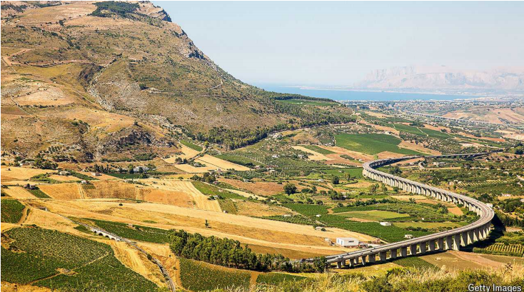

# How Italy’s Mezzogiorno is benefiting from a flood of EU aid

It can’t spend it fast enough

Mezzogiorno ：英 [ˌmɛtsəʊˈdʒɔːnəʊ] 梅佐乔尔诺（意大利南部地区）

原文：

Aldo Altomonte sensed that something was wrong. The man claiming to be

a postman and asking to be let in said that he had Mr Altomonte’s renewed

driving licence. But Mr Altomonte had applied for it only three days before.

And in Italy—let alone in Reggio Calabria, the main city of Italy’s poorest

region, Calabria—nothing bureaucratic ever happens in three days. It took a

neighbour who knew the postman to convince the elderly Mr Altomonte that

it was all true.

奥尔多·阿尔托蒙特感觉到有些不对劲。自称是邮递员的男子要求进来，说他有阿尔托蒙特先生更新的驾驶执照。但是阿尔托蒙特先生三天前才申请的。在意大利——更不用说在意大利最贫困地区卡拉布里亚的主要城市雷焦卡拉布里亚——三天内没有任何官方的事情发生。一个认识邮递员的邻居说服了老阿尔托蒙特先生这一切都是真的。

原文：

What the players in this little drama experienced was one of many effects of

the EU’s post-pandemic recovery project, known as the NGEU, on Italy’s less

developed south. With access to €194bn ($216bn) from the main 

NGEU fund,Italy is by far the biggest beneficiary. This offers it a historic opportunity to

narrow the wealth gap between the Mezzogiorno (the southern mainland,

Sardinia and Sicily) and the rest of the country. In 2022, the Mezzogiorno’s

GDP per person was less than two-thirds the national average.

这部小剧中的演员所经历的是欧盟疫情后复苏项目(即NGEU)对意大利欠发达南部地区的诸多影响之一。意大利从主要的NGEU基金获得了1940亿欧元(合2160亿美元)的资金，是迄今最大的受益者。这为缩小Mezzogiorno(南部大陆，撒丁岛和西西里岛)和该国其他地区的贫富差距提供了一个历史性的机会。2022年，Mezzogiorno人均GDP不到全国平均水平的三分之二。

学习：

beneficiary：英 [ˌbenɪˈfɪʃəri] 受益人；受益者；

原文：

Part of the strategy of the European Commission was to use the NGEU fund to

“level up” Europe. But it was “designed to close the gaps at the national

level, not at the sub-national level,” says Marco Buti, who was the *chef de*

*cabinet* of the economics commissioner, Paolo Gentiloni, when the scheme

was launched. In 2021, however, Mario Draghi’s government earmarked a

disproportionate 40% share for the Mezzogiorno, which has less than 34%

of Italy’s population.

欧盟委员会的部分战略是利用NGEU基金“提升”欧洲。但该计划“旨在缩小国家层面的差距，而不是次国家层面的差距，”该计划启动时担任保罗·真蒂洛尼经济专员办公室主任的马尔科·布蒂(Marco Buti)表示。然而，2021年，马里奥·德拉吉(Mario Draghi)政府将不成比例的40%份额划给了人口不到意大利34%的Mezzogiorno。

学习：

earmark：美 [ˈɪrˌmɑrk]  指定；拨款；

原文：

EU money from the new fund is going towards building a new railway line

from Naples to Bari and a wind farm off Sicily. Crèches are being set up in a

bid to increase the low rate of female employment, long a weakness of the

southern economy. And digitisation is speeding administrative procedures,

including the renewal of Mr Altomonte’s licence.

来自新基金的欧盟资金将用于建设一条从那不勒斯到巴里的新铁路线和西西里岛附近的一个风力发电厂。托儿所的建立是为了提高女性的低就业率，这是南方经济的一个长期弱点。数字化加速了行政程序，包括阿尔托蒙特先生执照的更新。

学习：

wind farm：风力发电场；风力发电站；

creches: 托儿所

>“Crèches” 是指托儿所或幼儿园，通常用于照顾幼儿的设施。在这段话中，提到建立托儿所是为了提高女性的就业率，这是南方经济长期以来的一个弱点。通过提供托儿服务，可以帮助更多的女性参与工作，因为她们可以放心地把孩子送到托儿所照顾。

原文：

An early fear was that the Mezzogiorno’s mafias would grab much of the

cash. That has not so far happened. “If you try to defraud the recovery plan,

you’re an idiot,” says Mr Altomonte’s son, Carlo, who teaches European

economics at Bocconi University in Milan. Projects, he notes, are each

subject to four separate checks, and officials in Brussels are legally liable for

greenlighting dodgy proposals, a risk they do not face in vetting the EU’s

ordinary regional-aid projects.

早期的担心是Mezzogiorno的黑手党会攫取大部分现金。迄今为止，这种情况还没有发生。“如果你试图欺骗复苏计划，你就是个白痴，”阿尔托蒙特先生的儿子卡洛说，他在米兰博科尼大学教欧洲经济学。他指出，每个项目都要接受四项独立的检查，布鲁塞尔的官员们要对批准不可靠的提案负法律责任，而在审查欧盟普通的地区援助项目时，他们不会面临这种风险。

学习：

mafia：美 [ˈmæfiə]  黑手党（the Mafia，尤其活跃于意大利西西里以及美国）；（mafia）团伙；小集团

defraud：美 [dɪˈfrɔːd] 欺诈；诈骗（…的钱财）

dodgy：美 [ˈdɑdʒi] 狡猾的；不可靠的；危险的；有风险的；

vetting：审查；彻底审查；（vet的现在分词）          

原文：

Another big concern was that the south did not have the capacity at local

level to design and manage projects. That doubt remains and has, if

anything, grown. The previous government under Mr Draghi aimed to tackle

the problem by hiring around a thousand people to provide technical

assistance to local authorities. But they were given relatively modest salaries

and three-year contracts.

另一个大问题是，意大利南方没有能力在地方一级设计和管理项目。如果说有什么不同的话，那就是这种怀疑依然存在，而且有所增长。德拉吉领导下的上届政府旨在通过雇佣约1000人向地方当局提供技术援助来解决这一问题。但他们的薪水相对较低，合同期为三年。

学习：

tackle the problem：解决问题

relatively modest salary：比较低的薪水

原文：

“We don’t know how many of those contracts are still in force. But we do

know that many [of the people recruited to help] have left,” says Gustavo

Piga, an economics professor at Tor Vergata University in Rome who runs a

project monitoring the use of the recovery fund. Giorgia Meloni’s

government has taken a different tack. It has centralised the decision

making, limiting the involvement of local authorities, and spent more of the

cash on subsidies that are aimed at promoting the recovery fund’s goals,

such as making Europe greener and more digital. That requires less technical

and administrative capacity. And it should be able to ensure that the money

gets spent faster.

“我们不知道这些合同中有多少仍然有效。但我们确实知道，许多(被招募来帮忙的人)已经离开了，”罗马Tor Vergata大学的经济学教授Gustavo Piga说，他负责一个项目，监督复苏基金的使用。乔治·梅洛尼政府采取了不同的策略。它集中了决策权，限制了地方当局的参与，并把更多的现金花在了旨在促进复苏基金目标的补贴上，比如让欧洲变得更加绿色和数字化。这需要较少的技术和行政能力。它应该能够确保钱花得更快。

原文：

Brussels normally dishes out cash from the fund only when it is satisfied that

the country in question has made the reforms and investments it wants by

the deadlines it sets. Italy has done well on that score. But its biggest

challenge—and not just in the Mezzogiorno—is the commission’s insistence

that allocations must be spent by the end of 2026. Other countries, including

Poland, are also struggling.

通常情况下，布鲁塞尔只有在对相关国家在设定的最后期限前完成了改革和投资感到满意时，才会从该基金中拨款。意大利在这方面做得很好。但是它最大的挑战——不仅仅是在Mezzogiorno——是委员会坚持拨款必须在2026年底前用完。包括波兰在内的其他国家也在苦苦挣扎。

学习：

dish out：拨款

原文：

Mr Piga’s monitoring group estimated last month that, by the end of 2023,

Italy had spent only €43bn of the €102bn it had been allotted. At that rate,

the group found, it is unlikely to get through more than €100bn by the

deadline—and risks losing the remaining €94bn. ■

皮加的监督小组上月估计，到2023年底，意大利只花掉了430亿欧元，而意大利获得了1020亿欧元拨款。该组织发现，按照这种速度，不太可能在最后期限前完成超过1000亿欧元的花费，并有可能失去剩余的940亿欧元资助。■

## 后记

2024年8月28日15点34分于上海。

