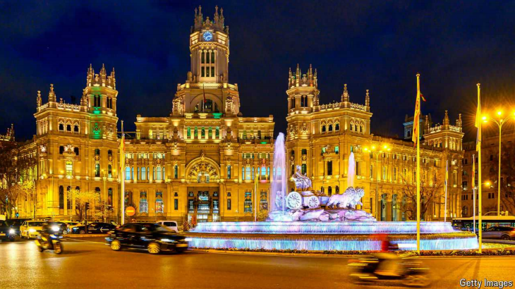

# Madrid, Europe’s fourth-largest city, deserves more appreciation

It is now the subject of a comprehensive new biography

**Madrid.** By Luke Stegemann. *Yale University Press; 480 pages; $35 and £25*

原文：

ROME HAS captured the imagination for millennia, London and Paris for

centuries, and Berlin for decades. But another major European capital has

attracted similar attention only in recent years. “Madrid” by Luke

Stegemann, an Australian historian, aims to explain why the Spanish

capital’s profile is rising. This is not the first English-language history of the

city, but in a curiously thin field, it is the most ambitious chronicle of a city

elbowing its way to Europe’s front rank.

几千年来，罗马吸引了人们的想象力；几个世纪以来，伦敦和巴黎吸引了人们的想象力；几十年来，柏林吸引了人们的想象力。但是另一个主要的欧洲首都直到最近几年才吸引了类似的关注。澳大利亚历史学家卢克·斯蒂格曼的《马德里》旨在解释为什么西班牙首都的形象正在上升。这不是这座城市的第一部英语历史，但在一个奇怪的狭窄领域，这是一座城市挤身欧洲前列的最雄心勃勃的编年史。

学习：

millennia：美 [məˈleniə] 一千年；（millennium的复数）

attract attention：吸引了关注

thin filed：小众的领域，狭窄的领域

chronicle：美 [ˈkrɑːnɪkl] 编年史；年代记；历史；历史记录；记述；

elbow: 通过努力或强行挤进某个位置或地位的动作

>这里的 "elbow" 是指通过努力或强行挤进某个位置或地位的动作，表达了马德里通过自己的努力或竞争在欧洲的首都中占据重要地位的意思。
>
>**例子**：
>- 英文：She had to elbow her way through the crowd to reach the front of the line.
>- 中文：她不得不挤过人群，才到达队伍的前面。

原文：

Madrid is not the ancient heart of its country, like Paris or London. Its old

buildings are few. It became the capital only when King Felipe II made it the

seat of his court in 1561. The king did not record exactly why, though there

are many theories: its central location was a bonus, and it lacked powerful

rivals to the king (nearby Toledo had an influential archbishopric). Madrid

was not quite a backwater village, as is sometimes said, but it is the only

European capital with an Islamic foundation. (Muslims built up a humble

village, Mayrit, into an important fortified town against counter-attacking

Christians around the mid-10th century.)

马德里不像巴黎或伦敦那样是其国家的古老中心。它的旧建筑很少。直到1561年国王费利佩二世把它定为宫廷所在地，它才成为首都。国王没有记录下确切的原因，尽管有许多理论:它的中心位置是一个额外的奖励，它缺乏强大的对手(附近的托莱多有一个有影响力的大主教)。马德里并不像人们有时说的那样是一个穷乡僻壤，但它是唯一一个有伊斯兰基础的欧洲首都。(穆斯林在10世纪中叶将一个不起眼的村庄Mayrit建成了一个重要的设防城镇，以抵御反攻的基督徒。)

学习：

archbishopric：美 [ˌɑrtʃˈbɪʃəprɪk] 大主教的职位；大主教辖区；大主教管区

backwater：闭塞的环境；不发达地区；落后地区；

backwater village：落后的村庄，穷乡僻壤

humble：简朴的；朴素的；不起眼的

humble village：不起眼的村庄

fortified： 美 [ˈfɔːrtɪfaɪd] 加强的；增强的

原文：

Those not mad about Madrid often repeat a slander: that it is merely a

beneficiary of its status as the seat of government, forever taking more from

the rest of Spain than it gives back. Mr Stegemann argues this is not the

case. From the 16th to the early 19th century, as Madrid went from

improvised capital to centre of the world’s biggest empire, artistic star-power

followed the political kind.

那些对马德里不太热衷的人常常重复一种诽谤：认为它不过是因为身为政府所在地而受益，永远从西班牙其他地区获取的比回馈的多。斯特格曼先生认为事实并非如此。从16世纪到19世纪初，随着马德里从一个临时首都发展成为世界上最大帝国的中心，艺术的明星效应也随之而来。

学习：

slander：（口头）诽谤；中伤；污蔑

mad：特别喜欢的；着迷的；狂热的

>这里的 "mad" 是 "热衷于" 或 "对某事非常感兴趣" 的意思。句中 "not mad about Madrid" 可以理解为 "对马德里不太热衷" 或 "对马德里不太感兴趣"。

improvised：临时的

improvised capital：临时首都

>
>
>"Seat" 在这里指的是 "政府所在地" 或 "首都"。在这句话中，"the seat of government" 意思是 "政府所在地"，也就是马德里作为西班牙的首都。

原文：

Few places at any time in history can match the cultural output of Madrid in

the *siglo de oro*, a golden age coinciding with the rise and decline of the

Habsburg dynasty that featured Diego Velázquez on canvas and Miguel de

Cervantes and Félix Lope de Vega on the page and stage. The next centuries

saw Spain’s decline as a global power, but Madrid still drew geniuses,

including Francisco Goya, to the court.

历史上很少有哪个地方能与siglo de oro的文化输出相媲美，这是一个黄金时代，与哈布斯堡王朝的兴衰相吻合，在画布上展示了迭戈·委拉斯开兹，在页面和舞台上展示了米格尔·德·塞万提斯和费利克斯·洛卜·德·维加。接下来的几个世纪见证了西班牙作为全球强国的衰落，但马德里仍然吸引了包括弗朗西斯科·戈雅在内的天才来到宫廷。

学习：

golden age：黄金时代

the rise and decline：兴衰

原文：

Mr Stegemann’s book is filled with pen-portraits showing how Madrid has

both bred fine minds and made the careers of arrivals from elsewhere. Spain

is not short of great cities, but the trajectories of Velázquez (from Seville)

and Goya (from Zaragoza) seem improbable without Madrid. Among the

achievements of the book is to situate the city in European cultural currents

rather than treating it as some kind of Iberian exception; Spanish kings have

also ruled big chunks of Europe, which is one reason the Prado museum is

so well stocked with works by Bosch, Rubens, Titian and others

斯缇格曼先生的书里充满了钢笔画，展示了马德里是如何培养出优秀的人才并成就了来自其他地方的移民的事业。西班牙并不缺少伟大的城市，但委拉斯开兹(来自塞维利亚)和戈雅(来自萨拉戈萨)的发展轨迹如果没有马德里似乎是不可能的。这本书的成就之一是将这座城市置于欧洲文化潮流中，而不是将其视为某种伊比利亚的例外；西班牙国王也统治了欧洲的大部分地区，这也是普拉多博物馆收藏了大量博施、鲁本斯、提香等人作品的原因之一。

学习：

bred：培养；导致；（breed的过去式和过去分词）          

breed fine minds：培养人才

原文：

Today Madrid is drawing ever more tourists (the Prado is only the most

famous of several outstanding museums). Meanwhile, migrants from the rest

of Spain continue streaming in thanks to the capital’s increasingly dominant

economy. Readers looking for dates and designers of this tourist attraction

and that neighbourhood, however, will have to consult a guidebook or

Wikipedia. “Madrid” also has surprisingly little to say about the

internationalisation of the economy or the city’s ambition to be a capital—if

not the capital—of the wider Spanish-speaking world, attracting huge

numbers of Latin Americans.

今天，马德里吸引了越来越多的游客(普拉多只是几个杰出博物馆中最著名的一个)。与此同时，由于首都经济日益占据主导地位，来自西班牙其他地区的移民继续涌入。然而，寻找这个旅游景点和那个街区的日期和设计师的读者将不得不查阅指南或维基百科。令人惊讶的是,“马德里”对经济的国际化或这座城市成为更广泛的西班牙语世界的首都(如果不是首都的话)的雄心几乎只字未提，吸引了大量的拉丁美洲人。

学习：

tourist attraction：旅游景点

原文：

But still, this is an impressive, century-spanning urban biography. The

author is interested in the irrepressible flow of life through the city, from

peasants washing offal in streams in the 13th century to King Felipe IV

travelling by gondola in the underground waterways to see his mistresses in

the 17th. More authors are surely planning tributes to London and Paris.

This is not Madrid’s last comprehensive chronicle and tribute. Nor should it

be. ■

但是，这仍然是一部令人印象深刻的、跨越世纪的城市传记。作者感兴趣的是这个城市中不可抑制的生活流，从13世纪农民在溪流中清洗废弃物，到17世纪国王费利佩四世乘坐贡多拉在地下水道中看望他的情妇。肯定会有更多的作者计划向伦敦和巴黎致敬。这不是马德里最后一次全面的编年史和致敬。也不应该。■

学习：

irrepressible：英 [ɪrɪˈprɛsɪb(ə)l] 压抑不住的；约束不了的；控制不住的；

peasants：美 [ˈpezənts] 农民；乡下人；农夫；（peasant的复数）

offal：美 [ˈɔfəl]

>这里的 "offal" 指的是动物屠宰后不适合食用的部分，如内脏、下水、杂碎等。这句话中的 "peasants washing offal in streams" 描述的是农民在小溪中清洗这些不适合食用的动物内脏或杂碎的场景。

gondola：美 [ˈɡɑndələ] 贡多拉船（威尼斯的一种传统划船）；

mistresses：美 [ˈmistrisiz] 主妇；情妇；情人（美国一电视剧名）；（mistress的复数）

tribute：美 [ˈtrɪbjuːt] 致敬

## 后记

2024年8月30日13点59分于上海。

