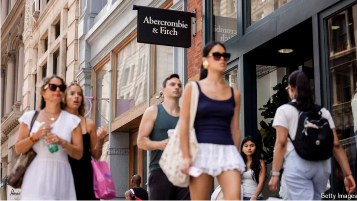

# How Abercrombie & Fitch got hot again

The once-troubled brand is now a favourite of millennials and gen-Zs alike

>Abercrombie & Fitch（简称A&F）是一家美国著名的时尚品牌，成立于1892年。最初，A&F以其高端户外服装和运动装备而闻名，专为探险家和运动爱好者设计。后来，品牌逐渐转型，成为面向年轻人群的休闲时尚品牌。
>
>在20世纪90年代至2000年代初期，A&F凭借其标志性的性感营销、时尚的服装风格以及浓郁的品牌文化，迅速在全球年轻消费者中获得了巨大人气。A&F的商店设计独特，店内环境昏暗，伴随着大声的音乐和浓烈的“Fierce”古龙水香味，营造出一种独特的购物体验。
>
>然而，随着时间的推移，A&F因其过度的排他性、过度性化的广告以及多次涉及种族和性别歧视的诉讼，引发了大量的争议，品牌形象逐渐受损。近年来，A&F进行了大规模的品牌重塑，放弃了过去的营销策略，转向更加包容和现代的形象，并重新赢得了包括千禧一代和Z世代在内的年轻消费者的喜爱。该品牌现在致力于提供高质量的时尚产品，主打简洁、时尚且实用的设计。

>**Millennials** (or Generation Y) generally refer to people born between 1981 and 1996. They grew up during the rise of the internet and social media and tend to be tech-savvy, value work-life balance, and are often characterized by their adaptability to change.
>
>**Gen-Zs** (or Generation Z) refers to those born from around 1997 to 2012. This generation has grown up with smartphones, social media, and constant connectivity. They are known for being highly digital, socially conscious, and valuing authenticity and diversity.
>
>Both generations are important consumer groups, influencing trends in various industries, including fashion, technology, and entertainment.

原文：

For many, 2023 was the year of the chip. Just ask anyone holding shares in

Nvidia, whose stock rose by 246%. But it was also the year of the Sloane

Pant. The popular tailored trouser helped send the shares of Abercrombie &

Fitch, a 132-year-old clothing firm, up by 274% (see chart).

对许多人来说，2023年是芯片年。只要问问任何持有英伟达股票的人，他们的股票上涨了246%。但这也是Sloane Pant的一年。流行的定制裤子使得有着132年历史的服装公司Abercrombie & Fitch的股票上涨了274%(见图表)。

学习：

Sloane Pant: 一种裤型

>Sloane Pant 是一种时尚裤型，通常设计简洁且剪裁合身，适合日常穿着或休闲场合。它的特点包括高腰设计、修身的裤腿以及舒适的面料，通常由棉、聚酯纤维或弹性面料制成。Sloane Pant 既可以搭配正式的上衣，也适合与休闲的T恤或毛衣搭配，兼具时尚感和舒适性，是现代女性衣橱中的百搭单品。

trouser：裤子

clothing firm：服装公司

原文：

A decade ago Abercrombie’s brand was toxic. Now it is all the rage. The

company has been through one of the fashion industry’s most remarkable

glow-ups. Gone are the sexualised black-and-white catalogues and snooty

staff. It still sells its famous “Fierce” cologne, but no longer pumps it

through the air ducts. On August 28th the company lifted its forecast for

revenue growth for the year to 13%. Although the market had hoped for

more—its shares fell on the news—that growth would far outpace the 0-2%

that McKinsey, a consulting firm, predicts for America’s fashion industry.

Even after the stumble, Abercrombie’s shares are up by around 50% this

year.

十年前，Abercrombie的品牌形象是很糟糕。现在它风靡一时。该公司经历了时尚界最引人注目的一次辉煌。性感的黑白目录和傲慢的员工已经一去不复返了。它仍然出售其著名的“烈性”香水，但不再通过空气管道输送。8月28日，该公司将今年的收入增长预期上调至13%。尽管市场期望更多——其股票在新闻中下跌——这一增长将远远超过咨询公司麦肯锡对美国时装业0-2%的预测。即使在跌跌撞撞之后，Abercrombie的股价今年仍上涨了约50%。

学习：

toxic: 品牌形象非常糟糕

> 这里的 "toxic" 指的是品牌形象非常糟糕或有害，通常意味着该品牌在公众眼中有负面影响，甚至令人反感。形容 Abercrombie 十年前的品牌形象“有毒”，是指那时的品牌因为其营销策略、文化或产品等原因而受到广泛批评或排斥，导致其形象在公众中非常负面。

all the rage：风靡一时, 流行

glow-up: 形象或状态的显著改善或提升

>**Glow-up**: “Glow-up” 指的是形象或状态的显著改善或提升，通常指外表的变得更好或更有吸引力。它可以用来形容个人、品牌或事物的“蜕变”或“变好”。
>
>例子：
>
>- 英文: "She had a major glow-up after high school."
>- 中文: “她在高中毕业后发生了巨大的变化，变得更好看了。”

fashion industry：时尚界

sexualized：性感化的

snooty： 英 [ˈsnuːti] 傲慢的；自大的

cologne：美 [kəˈloʊn] 古龙香水；科隆香水； **注意发音**

duct：美 [dʌkt]  管道；通道；

pump: 通过管道输送或喷出

>**Pump**: 在这个句子里，"pump" 是指“通过管道输送或喷出”。以前，Abercrombie 会通过空调系统把香水（如“Fierce”）喷洒到店铺空气中，让顾客一进店就能闻到浓烈的香味。
>
>例子：
>
>- 英文: "The company used to pump fragrance through the store's air ducts."
>- 中文: “公司过去常常通过店铺的通风管道喷洒香水。”

原文：

This is not Abercrombie’s first reinvention. In 1992 Mike Jeffries, a retail

executive, was tasked with turning around what was then a faded sporting-

goods seller, which he did by targeting teenagers with preppy, tight and low-

cut clothing. In 2006 Mr Jeffries summed up its strategy in an interview:

“Candidly, we go after the cool kids...Are we exclusionary? Absolutely.”

这不是Abercrombie的第一次改造。1992年，零售主管迈克·杰弗里斯(Mike Jeffries)受命扭转当时衰落的体育用品销售商的局面，他的目标是穿着学院派紧身低胸服装的青少年。2006年，杰弗里斯先生在一次采访中总结了它的战略:“坦率地说，我们追求酷孩子...我们排外吗？绝对是。”

学习：

turn around：扭转局面

sporting-good：体育用品

preppy：学院派风格的          

low-cut：开得低的；低胸的；鞋帮弄的很低的          

candidly：坦白地；率直地；

exclusionary：排斥（性）的；排除在外的          

原文：

That attitude gradually came to grate on shoppers. Mr Jeffries refused to

stock women’s sizes beyond a ten (a British 14)—and anything in black or

purple. He also wrote a 29-page “Look Book” for employees. His obsession

with policing appearance led to discrimination lawsuits from employees.

The company fought one claim, by a Muslim employee whose hijab violated

the company’s policy, all the way to America’s Supreme Court, where it lost.

这种态度逐渐惹恼了购物者。杰弗里斯先生拒绝库存超过10码(英国14码)的女性尺码，以及任何黑色或紫色的衣服。他还为员工写了一本29页的“样书”。他对外表监管的痴迷导致了员工的歧视诉讼。该公司与一名穆斯林雇员的索赔案进行了斗争，该雇员的头巾违反了公司的政策，一直打到美国最高法院，最终败诉。

学习：

grate：使人烦躁；使感到不快

>
>
>**Grate on**: 这里的 “grate on” 表示“让人厌烦”或“使人恼火”。意思是说，Mr. Jeffries 的态度逐渐让顾客感到厌烦。例如：
>
>- **英文**: The constant noise from the construction site started to grate on the residents.
>- **中文**: 建筑工地的噪音让居民们感到越来越烦躁。

hijab：美 [hɪˈdʒɑb] 头巾；面纱；穆斯林头巾；

Look Book:  一本指南，通常用于展示某个品牌或公司的标准外观或穿着风格	

>
>
>**Look Book**: 这里的 “Look Book” 指的是一本指南，通常用于展示某个品牌或公司的标准外观或穿着风格。在这种情况下，它指的是 Mr. Jeffries 为员工编写的 29 页指南，规定了员工的外貌要求。例如：
>
>- **英文**: The fashion brand released a new Look Book to guide its customers on how to style the latest collection.
>- **中文**: 这家时尚品牌发布了新的 Look Book，指导顾客如何搭配最新系列的服装。

police: 严格监督，控制

>
>
>**Police**: 这里的 “police” 指的是“严格监督”或“控制”。意思是 Mr. Jeffries 对员工的外貌进行了严格的监督和控制。例如：
>
>- **英文**: The company decided to police the use of social media among its employees to avoid any inappropriate content being shared.
>- **中文**: 公司决定严格监督员工使用社交媒体，以避免任何不适当的内容被分享。

原文：

Mr Jeffries also made the brand rigid. He crafted intricate back stories for its

product lines: RUEHL was all about “the great American kid who moves to New

York to be successful”; Gilly Hicks, a lingerie line, was named for a

character who lived in an Australian manor house.

杰弗里斯先生也使品牌僵化。他为其产品线精心设计了复杂的背景故事:鲁尔是关于“伟大的美国孩子搬到纽约获得成功”；Gilly Hicks是一个内衣品牌，以一个住在澳大利亚庄园的人物命名。

学习： 

rigid:  僵化的，死板的

>
>
>这里的“**rigid**” 指的是“僵化的”或“缺乏灵活性的”。在这个上下文中，意思是说，Mr. Jeffries 将品牌变得过于死板和不灵活，缺乏应对市场变化的弹性。他为产品线设计了复杂的背景故事，使得品牌形象和产品定位变得固定化，难以适应消费者需求的变化。

intricate：复杂难懂的；难以理解的；

product line：产品线

lingerie：美 [ˌlɑn(d)ʒəˈreɪ] 女内衣；女睡衣

manor：庄园；领地；庄园宅第；

原文：

Whereas Mr Jeffries told consumers what they wanted, Fran Horowitz, who

took over as chief executive in 2017 after 15 consecutive quarters of

shrinking sales, is listening instead. She talks up Abercrombie’s “chase

capabilities”—industry-speak for keeping inventory low and pouncing on

trends. On her watch the company has made better use of data to understand

what products to offer and which customers to target, notes Dana Tesley of

Tesley Advisory Group, a consultancy.

杰弗里斯告诉消费者他们想要什么，而在连续15个季度销售萎缩后于2017年接任首席执行官的弗兰·霍洛维茨(Fran Horowitz)却在倾听。她谈到了Abercrombie的“追逐能力”——保持低库存和抓住趋势的行业术语。咨询公司Tesley Advisory Group的Dana Tesley指出，在她的监督下，该公司已经更好地利用数据来了解提供什么产品和瞄准哪些客户。

学习：

industry-speak：行业用语

inventory：库存

keep inventory low：低库存

pounce on：扑向，抓住

pounce on trends：抓住趋势

原文：

Instead of going after teens, Abercrombie now targets 25- to 40-year-olds—

many of whom might once have spent their babysitting money on its

camisoles. But gen-Z customers love it, too, says Casey Lewis, who blogs

about youth culture. “It’s just seen as…an ‘it’ brand,” she says. Young

consumers may turn to fast-fashion firms such as Shein for the cheapest

wares, but they look to Abercrombie for stylish clothes at reasonable prices.

And leopard print—as seen on TikTok. Abercrombie’s spotted cardigan is

selling fast. ■

Abercrombie现在的目标是25至40岁的年轻人，而不是青少年，他们中的许多人可能曾经把保姆的钱花在它的背心上。但是Z世代的顾客也喜欢它，写青年文化博客的凯西·刘易斯说。“它只是被视为……一个爆款品牌，”她说。年轻消费者可能会转向像Shein这样的快时尚公司购买最便宜的商品，但他们会选择价格合理的时尚服装。和豹纹——就像在TikTok身上看到的一样。Abercrombie的斑点羊毛衫卖得很快。■

学习：

babysitting：当临时保姆；临时代为照看孩子；（babysit的现在分词）          

camisole：美 [ˈkæməˌsoʊl]  女用吊带背心；背心式女内衣；

wares：货物；商品；制品；（ware的复数）

leopard print：豹纹

cardigan：美 [ˈkɑːrdɪɡən] （无领）开襟毛衣；开襟羊毛衫；

>1. **It brand**：在时尚行业中，“it brand”指的是那些在特定时间段内非常受欢迎并且备受关注的品牌。这样的品牌通常被认为是时尚和潮流的引领者，能够迅速吸引年轻消费者的兴趣。例如，Abercrombie在品牌形象重塑后成为了一个“it brand”，受到了年轻一代的青睐。
>
>2. **Leopard print**：指的是豹纹图案，在时尚界是一种经典且时常流行的图案，通常用于服装、配饰等。豹纹图案能够赋予穿戴者一种时尚且大胆的形象。比如在TikTok上，Abercrombie的豹纹开衫正在热销，这就是豹纹图案的一种实际应用。
>
>**例子**：
>- 英文：Abercrombie's leopard print cardigan has become a must-have item this season, making it a standout "it brand" among young fashion enthusiasts.
>- 中文：Abercrombie的豹纹开衫在本季成为了必备单品，使其在年轻时尚爱好者中成为了一个突出的“it brand”。

## 后记

2024年8月31日13点56分于上海。

