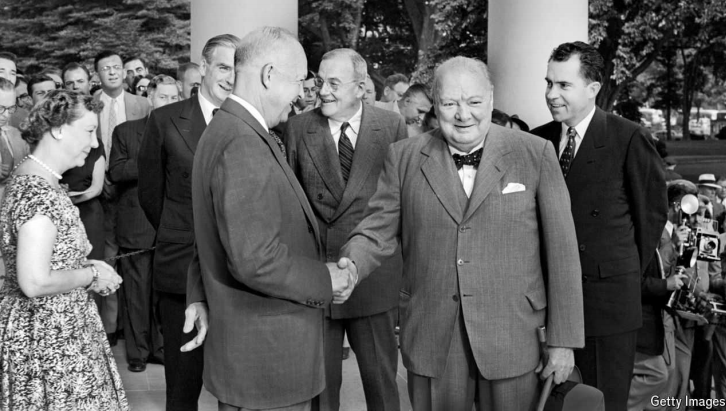

# Nudity, drinking, smoking: Winston Churchill’s unusual diplomacy

His time at the White House serves as a case study in getting what you want

unusual：不寻常的；特别的；罕见的；独特的

nudity：裸体；赤裸          

**Mr Churchill in the White House.** By Robert Schmuhl. *Liveright; 384 pages; $32. W.W. Norton; £25.99*

原文：

SOME QUESTIONS of diplomatic protocol are tricky. Others are not. For instance,

should one meet a head of state clothed or nude? Winston Churchill,

Britain’s former prime minister and the puckish hero of a new history, often

chose to grin—and bare it.

外交礼仪的一些问题很棘手。其他的不是。例如，一个人应该穿衣服还是裸体见国家元首？英国前首相温斯顿·丘吉尔是新历史的恶作剧英雄，他经常选择咧嘴笑，并坦诚相对。

学习：

nude：裸体的；裸体者的；赤裸的

puckish：美 [ˈpəkɪʃ] 淘气的；顽皮的；恶作剧的；

grin：露齿笑；咧嘴笑；

diplomatic protocol：外交礼仪

>在这段话中，**"protocol"** 指的是外交或正式场合中的礼仪或行为规范，而 **"bare"** 在这里是一个双关语，既可以指“暴露”或“裸露”，也可以理解为“坦诚相对”。
>
>**例子:**
>
>1. **Protocol:**
>   - **英文:** Diplomatic protocol dictates that one must bow when meeting the queen.
>   - **中文:** 外交礼仪规定，见到女王时必须鞠躬。
>
>2. **Bare:**
>   - **英文:** The artist decided to bare his emotions in the painting, revealing his deepest feelings.
>   - **中文:** 艺术家决定在画作中坦露他的情感，展现他最深的感受。

原文：

He made quite an impression during his time as the guest of two presidents.

The chief usher at the White House recalled that “In his room, Mr Churchill

wore no clothes at all most of the time during the day.” Churchill’s

bodyguard remarked how President Franklin Roosevelt knocked on the door

of the prime minister’s suite during Churchill’s first White House visit in

December 1941, only to find that “Winston Churchill was stark naked, a

drink in one hand, a cigar in the other.” Roosevelt, clearly flustered, offered

to leave, but Churchill demurred: “You see, Mr President, I have nothing to

hide.” The two leaders then spoke for an hour.

作为两位总统的客人，他给人留下了深刻的印象。白宫的首席招待员回忆说，“在他的房间里，丘吉尔先生白天大部分时间都不穿衣服。”丘吉尔的保镖描述了1941年12月丘吉尔第一次访问白宫时，富兰克林·罗斯福总统敲开首相套房的门，结果发现“温斯顿·丘吉尔一丝不挂，一手拿着饮料，一手拿着雪茄。”罗斯福显然很慌张，提出要离开，但丘吉尔表示反对:“你看，总统先生，我没有什么可隐瞒的。”两位领导人接着谈了一个小时。

学习：

make an impression：给人留下深刻印象

usher：引座员；迎宾员；接待员

bodyguard：保镖；随身警卫；警卫员

remark：评论；谈论；（remark的过去式和过去分词）

knock on the door：敲门

suite： [swiːt] 套房；套间 **注意发音**

was stark naked：一丝不挂

flustered：激动不安的；慌张的

demur：英 [dɪˈməː] 提出异议；表示反对；

原文：

Born to an American mother and possessing lifelong Atlanticist instincts,

Churchill stayed at the White House four times during Roosevelt’s three

terms in office (along with another four visits to Hyde Park, Roosevelt’s

redoubt in upstate New York) and once during Dwight Eisenhower’s

presidency. Even allowing for the time and trouble of a long sea crossing,

his visits were often protracted; the first lasted from December 22nd 1941 to

January 14th 1942. It is doubtful that any foreign leader since has spent

more time as a guest at the White House.

丘吉尔的母亲是美国人，他一生都有大西洋主义的本能，在罗斯福三任总统期间，他曾四次入住白宫(此外，他还四次造访海德公园，这是罗斯福在纽约北部的堡垒)，在德怀特·艾森豪威尔任总统期间，他也曾入住白宫。即使考虑到长途渡海的时间和麻烦，他的访问也常常是旷日持久的；第一次从1941年12月22日持续到1942年1月14日。令人怀疑的是，自那以后，是否有任何一位外国领导人在白宫做客的时间更长。

学习：

lifelong：终身的；毕生的          

redoubt：美 [rəˈdaʊt] 堡垒；防御工事；据点；

upstate：（美国某些州的）北部地区；在州北部；

原文：

Churchill stayed in what is today known as the Queens’ bedroom. He was

not the easiest houseguest, keeping odd hours and working and talking into

the early hours of the morning. Eleanor Roosevelt said it “always took” her

husband “several days to catch up on sleep after Mr Churchill left”. Padding

around the White House halls barefoot in his “siren suit” (a romper that he

began wearing during air raids on London), Churchill earned the admiration

of the White House staff for his prodigious appetite. A Secret Service officer

said that he “consumed brandy and scotch with a grace and enthusiasm that

left us all open-mouthed in awe”.

丘吉尔住在今天被称为女王卧室的地方。他不是一个容易相处的客人，作息时间不固定，工作和聊天到凌晨。埃莉诺·罗斯福说，她的丈夫“总是在丘吉尔先生离开后，花上几天时间来补觉”。丘吉尔光着脚穿着他的“警服”(一种他在空袭伦敦时开始穿的连衫裤)在白宫大厅里走来走去，他惊人的食欲赢得了白宫工作人员的钦佩。一名特勤局官员说，他“优雅而热情地喝着白兰地和苏格兰威士忌，让我们所有人都惊叹不已”。

学习：

houseguest：在家过夜或暂住的来客

the early hours：凌晨；清晨；黎明时分；早晨

catch up on：弥补；补做

catch up on sleep：补觉

pad：蹑手蹑脚地走；

barefoot：赤脚地；光着脚；不穿鞋地

siren：美 [ˈsaɪrən] 警报器；汽笛；警笛；警报声

siren suit：防空服；警报服；连体服；

romper：连身衣；连衫裤

raids：突然袭击；抢劫；劫掠；（raid的复数）

air raids：空袭

earn the admiration：赢得xxx的钦佩

prodigious：美 [prəˈdɪdʒəs] 巨大无比的；惊人的

prodigious appetite：惊人的食欲，惊人的饭量

Secret Service：特勤局

scotch: (Scotch）苏格兰威士忌酒

open-mouthed: 张着嘴的；目瞪口呆的；惊讶得说不出话的

awe: 敬畏；畏惧；惊叹

原文：

Roosevelt and Churchill worked differently: the president was circumspect,

restrained and cagey, while the prime minister was effusive, commanding

and far more experienced in military affairs. Nonetheless, their meetings

were productive: Churchill’s first visit laid the groundwork for a unified

Allied command; his second, after the crushing defeat at Tobruk, for future

operations in Europe; and the third for the landings at Normandy

罗斯福和丘吉尔的工作方式不同:总统谨慎、克制、小心翼翼，而首相热情洋溢、发号施令，在军事事务上更有经验。尽管如此，他们的会晤还是富有成效的:丘吉尔的第一次访问为盟军联合司令部奠定了基础；他的第二次，在托布鲁克惨败后，为未来在欧洲的行动；第三次是诺曼底登陆

学习：

circumspect：谨慎的；小心翼翼的；慎重的

restrained：克制的

cagey：美 [ˈkeɪdʒi] 谨慎的；狡猾的；机敏的；

effusive：热情洋溢的

lay the groundwork：奠定了基础

Normandy：诺曼底（法国西北部地区）

landings at Normandy：诺曼底登陆

原文：

The fourth visit to Roosevelt was brief, lasting just 32 hours. Roosevelt had

been sidelining—and at least once openly mocked—Churchill in an effort to

get closer to Josef Stalin. Churchill’s last visit, to Eisenhower, had a funereal

cast. He was starting to show his age, and both the British Empire and

Britain’s place in the world were much diminished. Churchill tried but failed

to arrange a summit between himself, the president and Stalin. Despite

Eisenhower’s respect for Churchill, he was yesterday’s man.

对罗斯福的第四次访问很短暂，仅持续了32个小时。为了接近约瑟夫·斯大林，罗斯福一直排挤——至少有一次公开嘲笑——丘吉尔。丘吉尔最后一次拜访艾森豪威尔时，参加了葬礼。他开始显示出他的年龄，大英帝国和英国在世界上的地位都大大降低了。丘吉尔试图安排他自己、总统和斯大林之间的最高级会谈，但失败了。尽管艾森豪威尔尊重丘吉尔，但他已是明日黄花。

学习：

brief：短暂的；短时间的

visit is brief：短暂拜访

原文：

Yet Churchill still had his personal magnetism, and in essence this book is a

case study in the savvy deployment of political “soft skills”. Churchill knew

when to push and when to flatter, when to lead and when to follow (or at

least give the impression of following), how to charm and how to inspire. He

also knew the value of good publicity: whatever he actually felt about

Roosevelt and Eisenhower, it suited him to have the world believe they were

great friends, so that was the story he promulgated to the press and in public.

然而，丘吉尔仍有他的个人魅力，从本质上说，这本书是政治“软技能”精明部署的案例研究。丘吉尔知道什么时候该施压，什么时候该奉承，什么时候该领导，什么时候该跟随(或者至少给人一种跟随的印象)，如何施展魅力，如何鼓舞人心。他也知道良好宣传的价值:无论他对罗斯福和艾森豪威尔的真实感受如何，让世界相信他们是伟大的朋友对他来说是合适的，所以这就是他向媒体和公众公布的故事。

学习：

magnetism： 美 [ˈmæɡnətɪzəm] 磁性；磁力；吸引力；魅力；

personal magnetism：个人魅力

in essence： 本质上；实质上；基本上          

savvy：理解力；洞察力；了解；见识；实际知识；有洞察力的；精明能干的；懂行的

how to charm and how to inspire：如何施展魅力，如何鼓舞人心

publicity：宣传；推广；关注；公众的关注

promulgated：美 [ˈprɑːmlɡeɪtɪd] 传播；公布；（promulgate的过去分词）

原文：

That not only kept the presidents onside and ensured he was kept in the loop,

but it also made “the chubby little man with the fat black cigar”, as one

newspaper described him, deeply popular across America. Such popularity

has endured: American historians are still writing books about him nearly 80

years after his last White House visit. ■

这不仅让总统们不越轨，确保了他在圈子里的地位，也让一家报纸形容他的“胖胖的、叼着黑雪茄的小个子男人”在美国深受欢迎。这种受欢迎程度经久不衰:在他最后一次访问白宫近80年后，美国历史学家仍在撰写关于他的书籍。■

学习：

onside：不越位的；非越位的；在合法位置的；

in the loop：在圈内；知情；参与决策；在内部圈子里          

chubby：圆润的；丰满的；胖乎乎的；微胖的；

## 后记

2024年8月31日18点32分于上海。

