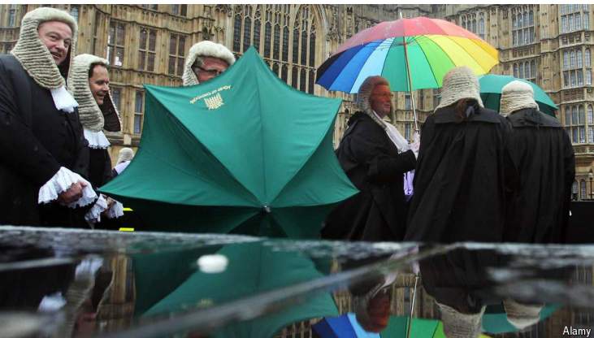

# A language guide for judges is a window into modern Britain

And into the mind of the judiciary

原文：

A WELSHMAN, A Sikh and a transgender woman walk up to the bar. It sounds like a

joke, but in this instance the “bar” separating the judge from a courtroom has

served as a synonym for the legal world since the 14th century. In July the

Judicial College, which is responsible for the training of judges in England

and Wales, issued its latest triennial update of the “Equal Treatment Bench

Book” (ETBB). Its advice on how judges should address different litigants and

witnesses is more than just a training guide. The ETBB offers a portrait of

modern Britain.

一名威尔士人、一名锡克教徒和一名变性妇女走向bar。这听起来像一个笑话，但在这种情况下，自14世纪以来，分隔法官和法庭的“bar”一直是法律世界的同义词。7月，负责英格兰和威尔士法官培训的司法学院发布了最新的三年一次的“平等待遇基准书”(ETBB)。它关于法官应该如何对待不同的诉讼当事人和证人的建议不仅仅是一个培训指南。ETBB提供了现代英国的肖像。

学习：

Sikh：锡克教教徒；锡克人；信奉锡克教的人

transgender：变性的

courtroom：审判室；法庭；

triennial：美 [traɪˈɛniəl] 每三年的；三年一次的；

litigants： 美 [ˈlɪtɪgənts] 诉讼当事人；（litigant的复数）

witnesses：目击者；证人；证据；见证人；（witness的复数）

原文：

The main chapters deal with characteristics such as disability, race and sex.

An appendix of shorter sections includes pen portraits of Jains, Jehovah’s

Witnesses and other religious groups, as well as various nationalities and

health conditions that a judge may come across. It explains that Indian

Hindus should not be addressed by family names; that a Rastafarian should

not be asked to remove his head covering; and, helpfully, that “belief or non-

belief in religion should not be confused with having, or not having, a moral

compass.”

主要章节涉及残疾、种族和性别等特征。一个较短部分的附录包括耆那教徒，耶和华见证会和其他宗教团体的肖像画，以及法官可能遇到的各种国籍和健康状况。它解释说，印度的印度教徒不应该用姓来称呼；不应要求一个拉斯特法里教徒脱去他的头巾；而且，有益的是，“信仰或不信仰宗教不应该与有或没有道德混为一谈。”

学习：

come across：碰上；碰见；

Hindus：美 [ˈhɪnˌduz] 印度教徒；（Hindu的复数）

原文：

Many of the ETBB’s 350-odd pages concern language. The book explains that

the Welsh may unintentionally come across as rude in English if they are

used to thinking and speaking in Welsh. That is because Welsh uses

politeness forms, like a formal pronoun for “you” (*chi*), that do much of the

job of “please” in English—which Welsh-speakers may therefore omit. (The

guide also explains that Welsh does not typically use “yes”, so that when a

Welsh-speaker is asked if he saw something he may reply “I did” without

meaning to sound stilted.)

ETBB的350多页中有许多都与语言有关。这本书解释说，如果威尔士人习惯用威尔士语思考和说话，他们可能会无意中用英语表现出粗鲁。这是因为威尔士语使用礼貌的形式，像“你”(chi)的正式代词，在英语中做了很多“请”的工作——因此威尔士语使用者可能会省略。(该指南还解释说，威尔士语通常不用“是”，所以当一个说威尔士语的人被问及他是否看到了什么时，他可以回答“我看到了”，而不是故意显得生硬。)

学习：

stilted： 美 [ˈstɪltəd] （风格、言谈、行为等）生硬的；做作的；夸张的；

原文：

It’s not just the Welsh who may inadvertently appear to lack proper

reverence for the court. Deaf people may appear “blunter or more

demonstrative” than hearing ones; their gestures should not be taken as a

sign of rudeness. When a witness “is sweating and goes red, or appears over

anxious, emotional or vague in her evidence”, judges are warned that “may

be attributable in certain cases to menopausal symptoms”. Defendants who

are representing themselves may (rather forgivably) “be unskilled in

advocacy” and “lack objectivity” about their cases.

不仅仅是威尔士人可能无意中表现出对法庭缺乏应有的尊重。耳聋的人可能比听力正常的人显得“更迟钝或更情绪化”;他们的手势不应被视为粗鲁的表现。当证人“出汗、脸红，或在她的证词中显得过度焦虑、情绪激动或含糊不清”时，法官被警告“在某些情况下可能是由于更年期症状”。为自己辩护的被告可能(相当可原谅地)“不擅长辩护”并且对他们的案件“缺乏客观性”。

学习：

inadvertently：非故意地；疏忽地          

reverence： 美 [ˈrevərəns] 尊敬；敬畏；

blunter：更钝的，更不锋利的；更生硬的；更直率的；（blunt的比较级）          

demonstrative：感情外露的；爱意流露的；

goes red：脸红

menopausal：美 [ˌmenə'pɔzl] 更年期的；绝经期的

advocacy：辩护

原文：

The ETBB is inevitably a battlefield in the culture wars. One section details

studies showing that black people face systematic discrimination in law

enforcement. For some, the two pages on this subject are not enough; for

conservative critics, they are sufficient to smuggle a contentious ideology

into what is supposed to be neutral guidance for judges. The chapter in the

previous edition that was called “Gender” has been renamed “Sex” for this

one, in a change advocated by “gender-critical” feminists (ie, opponents of

some transgender activists’ views).

ETBB不可避免地成为文化战争的战场。其中一节详细介绍了一些研究，表明黑人在执法中面临系统性歧视。对一些人来说，关于这个问题的两页纸是不够的；对于保守派批评家来说，它们足以将一种有争议的意识形态带入本应是对法官的中立指导中。前一版中被称为“性别”的章节在这一版中被重新命名为“性”，这是“性别批判”女权主义者(即一些跨性别支持者观点的反对者)倡导的一项变革。

学习：

law enforcement：执法

smuggle：秘密携带；私运；非法贩运；悄悄进行；秘密进行

contentious：有争议的

原文：

This revised chapter still counsels judges to respect litigants’ and witnesses’

gender identities, including names and pronouns, for “most” purposes. But

judges are now warned that a victim of a crime committed by a transgender

woman may have known the accused as a male. Requiring a witness to refer

to that person as “she” may not only be upsetting but could affect the quality

of their testimony. And a witness may similarly become confused and

unreliable if everyone else in the courtroom uses “she” to refer to the

accused as well.

修订后的这一章仍然建议法官出于“大多数”目的尊重诉讼当事人和证人的性别身份，包括姓名和代词。但是现在法官们被警告说，一名变性妇女所犯罪行的受害者可能知道被告是男性。要求证人用“她”来称呼那个人不仅会令人不安，还会影响他们证词的质量。如果法庭上的其他人都用“她”来称呼被告，证人同样会变得困惑和不可靠。

学习：

counsels：劝告；建议；（counsel的第三人称单数）          

原文：

It is impossible to please everyone. But the ETBB has done an admirable job of

the attempt. Its editors brought its bulk down by more than 200 pages since

the edition of 2021, culling citations of old studies and cases while including

up-to-date supporting material. It serves as a window not just into Britain

but also into the minds of judges, whose ways of speaking and thinking are

too often impenetrable.

不可能让每个人都满意。但是ETBB在这方面做得非常出色。自2021年版以来，它的编辑将它的篇幅减少了200多页，剔除了旧研究和案例的引用，同时包括了最新的支持材料。它不仅是了解英国的一扇窗，也是了解法官思想的一扇窗，他们的说话方式和思维方式往往令人费解。

学习：

bulk：大部分；主体；

culling：美 ['kʌlɪŋ]选择；大批物品中剔出劣质货；挑选；选出；（cull的现在分词）          

impenetrable：难以理解的；晦涩的；

原文：

The ETBB instructs them that some groups—children, people who are

representing themselves and so on—may need legal language like “*inter*

*alia*” replaced with more comprehensible phrases like “amongst other

things”. On why the courts should not speak plain English to everybody, the

book is silent. ■

ETBB指示他们，一些群体——儿童、代表自己的人等等——可能需要用“amongst other things”这样更容易理解的短语来代替“inter alia”这样的法律用语。关于为什么法庭不应该对每个人说简单的英语，这本书没有涉及。■

学习：

inter alia：除其他事项外；其中包括；尤其是；在其他事物中          

## 后记

2024年9月1日18点34分于上海。

