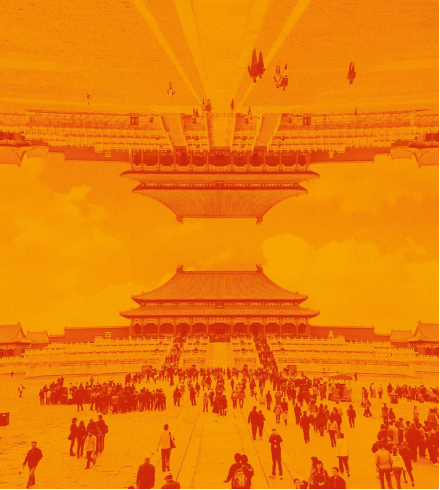

# Bad information is a grave threat to China’s economy

The country risks making some of the mistakes the Soviet Union did

原文：

China’S giant economy faces an equally giant crisis of confidence—and a

growing deficit of accurate information is only making things worse. Even

as the country wrestles with a property crash, the services sector slowed by

one measure in August. Consumers are fed up. Multinational firms are

taking money out of China at a record pace and foreign China-watchers are

trimming their forecasts for economic growth.

中国巨大的经济面临着同样巨大的信任危机——准确信息的日益缺乏只会让事情变得更糟。就在这个国家与房地产崩盘搏斗的时候，服务业在8月份放缓了一项指标。消费者受够了。跨国公司正以创纪录的速度将资金撤出中国，外国中国观察人士正在下调他们对中国经济增长的预测。

学习：

crisis of confidence：信任危机；信心危机          

wrestle：斗争；

fed up：厌烦的；受够了；厌倦的

trim：下调

原文：

The gloom reflects real problems, from half-built houses to bad debts. But it

also reflects growing mistrust of information about China. The government

is widely believed to be massaging data, suppressing sensitive facts and

sometimes offering delusional prescriptions for the economy. This void

feeds on itself: the more fragile the economy is, the more knowledge is

suppressed and the more nerves fray. This is not just a cyclical problem of

confidence. By backtracking on the decades-long policy of partially

liberalising the flow of information, China will find it harder to complete its

ambition of restructuring the economy around new industries. Like the

Soviet Union, it risks instead becoming an example of how autocratic rule is

not just illiberal but also inefficient.

这种悲观情绪反映了现实问题，从尚未完工的房屋到坏账。但这也反映出人们对中国信息越来越不信任。人们普遍认为，政府篡改数据，隐瞒敏感事实，有时还为经济开出妄想的药方。这种空虚自我滋生:经济越脆弱，知识越被隐瞒，神经越紧张。这不仅仅是信心的周期性问题。通过放弃长达数十年的部分放开信息流动的政策，中国将更难实现围绕新兴产业重组经济的雄心。与苏联一样，它反而有可能成为一个例子，说明专制统治不仅不自由，而且效率低下。

学习：

gloom：忧郁；黑暗；幽暗；昏暗；愁闷；无望；沮丧；阴沉；

bad debts：坏账

massage：篡改（数字）；改动；

massage data：篡改数据

suppress：隐瞒（消息）

delusional：妄想的          

原文：

The tightening of censorship under President Xi Jinping is well known.

Social-media accounts are ever more strictly policed. Officials are warier of

candid debate with outsiders. Scholars fear they are watched and business

people mouth Communist Party slogans. Less familiar is the parallel

disappearance of technical data, especially if it is awkward or embarrassing

for the party. Figures for youth unemployment, a huge problem, have been

“improved and optimised”—and lowered. Balance-of-payments statistics

have become so murky that even America’s Treasury is baffled. On August

19th stock exchanges stopped publishing daily numbers on dwindling

foreign-investment inflows. As the economic dashboard dims, the private

sector is finding it harder to make good decisions. Officials probably are,

too.

主席加强审查是众所周知的。社交媒体账户受到越来越严格的监管。官员们对与局外人进行坦率的辩论更加谨慎。学者们担心他们会被监视，而商人会喊出共产党的口号。不太熟悉的是技术数据的平行消失，特别是如果它对当事人来说是尴尬的。年轻人失业这一大问题的数据已经得到了“改善和优化”——并且有所下降。国际收支统计变得如此模糊，甚至连美国财政部都感到困惑。8月19日，证券交易所停止发布外国投资流入减少的每日数据。随着经济仪表板变暗，私营部门发现更难做出好的决策。官员们可能也是如此。

学习：

police：监管

wary：谨慎的

candid：坦白的；直率的；坦诚的；直言不讳的

murky：晦涩的；隐晦的；难以理解的

is baffled：困惑

dashboard：仪表板；控制板

原文：

To understand the significance of this shift, look back to the mid-20th

century. Witnessing the totalitarianism of the 1930s and 1940s, liberal

thinkers such as Karl Popper and Friedrich Hayek argued that political

freedom and economic success go hand in hand: decentralised power and

information prevent tyranny and allow millions of firms and consumers to

make better decisions and live better lives. The collapse of the Soviet Union

proved them right. In order to maintain political dominance, its rulers

ruthlessly controlled information. But that required brutal repression, starved

the economy of price signals and created an edifice of lies. By the end, even

the Soviet leadership was deprived of an accurate picture.

要理解这一转变的意义，回顾一下20世纪中期。见证了20世纪30年代和40年代的极权主义，卡尔·波普尔(Karl Popper)和弗里德里希·哈耶克(Friedrich Hayek)等自由主义思想家认为政治自由和经济成功密不可分:去中心化的权力和信息可以防止暴政，让数百万公司和消费者做出更好的决策，过上更好的生活。苏联的解体证明他们是对的。为了保持政治优势，其统治者无情地控制信息。但这需要残酷的镇压，使经济缺乏价格信号，并创造了一个谎言的大厦。到最后，甚至苏联领导层都被剥夺了一个准确的画面。

学习：

totalitarianism：美 [toʊˌtælə'teərɪrnɪzəm] 极权主义

tyranny：美 [ˈtɪrəni] 暴政；暴虐；苛政；

collapse of Soviet Union：苏联解体

starve：使匮乏；

edifice:  英 [ˈɛdɪfɪs] 建筑物；大厦；宏伟建筑；

原文：

As China grew more open in the late 1990s and 2000s, its leaders hoped to

maintain control while avoiding the Soviet Union’s mistakes. For many

years they allowed technical information in business, the economy and

science to flow far more freely. Think of Chinese firms with listed share

prices disclosing information to investors in New York, or scientists sharing

new research with groups abroad. Technology seemed to offer a more

surgical way to censor mass opinion. The internet was intensively policed,

but it was not banned.

随着中国在20世纪90年代末和21世纪初变得更加开放，其领导人希望保持控制，同时避免苏联的错误。多年来，他们允许商业、经济和科学领域的技术信息更加自由地流动。想想上市的中国公司向纽约的投资者披露信息，或者科学家与国外团体分享新的研究成果。技术似乎提供了一种更为外科手术式的方式来审查大众意见。互联网受到严密监管，但并未被禁止。

原文：

China’s top leadership also redoubled its efforts to know what was going on.

For decades, it has run a system known as *neican*, or internal reference, in

which journalists and officials compile private reports. During the

Tiananmen Square protests, for example, the leadership received constant

updates. Techno-utopian party loyalists reckoned that big data and artificial

intelligence could improve this system, creating a high-tech panopticon for

the supreme leader that would allow the kind of enlightened central planning

the Soviets failed at.

学习：

loyalist： （尤指在变动时期对统治者、政府或政党）忠诚的人

panopticon：美 [pæˈnɑptɪˌkɑn]  全景监狱；环形监狱；全监视系统；

原文：

It is this vision of a partially open, hyper-efficient China that is now in

doubt. Amid a widening culture of fear and a determination to put national

security before the economy, the party has proved unable or unwilling to

limit the scope of its interference in information flows. Monetary-policy

documents and the annual reports of China’s mega-banks now invoke Xi

Jinping Thought. Deadly-dull foreign management consultants are treated as

spies. This is happening despite the fact that China’s increasingly

sophisticated economy requires more fluid and complex decision-making.

正是这种部分开放、超高效的中国的愿景现在受到了质疑。在日益扩大的恐惧文化和将国家安全置于经济之上的决心中，中国共产党已被证明无法或不愿限制其对信息流动的干预范围。中国大型银行的货币政策文件和年度报告现在都援引Xi思想。极其迟钝的外国管理顾问被视为间谍。尽管中国日益复杂的经济需要更加灵活和复杂的决策，但这种情况仍在发生。

原文：

An obvious result is the retreat of individual liberty. In a reversal of its

partial opening, China has become a more repressive place. Many Chinese

still have liberal views and enjoy debate but stick to private gatherings. They

present no immediate danger to the party.

一个明显的结果是个人自由的倒退。与部分开放相反，中国已经成为一个更加压抑的地方。许多中国人仍然有自由的观点，喜欢辩论，但坚持私人聚会。他们对该党没有直接威胁。

学习：

retreat：倒退

原文：

The information void’s other effects pose more of a threat. As price signals

dim, the allocation of capital is getting harder. This comes at a delicate

moment. As its workforce shrinks, China must rely more on boosting

productivity to grow. That is all about using resources well. The country

needs to pivot away from cheap credit and construction to innovative

industries and supplying consumers. That is why capital spending is pouring

into electric vehicles, semiconductors and more. Yet if investment is based

on erroneous calculations of demand and supply, or if data on subsidies and

profits are suppressed, then the odds of a successful transition are low.

信息空白的其他影响构成了更大的威胁。随着价格信号的减弱，资本配置变得越来越困难。这发生在一个微妙的时刻。随着劳动力减少，中国必须更多地依靠提高生产率来实现增长。这都是关于善用资源。该国需要从廉价信贷和建筑业转向创新产业和供应消费者。这就是资本支出涌入电动汽车、半导体等行业的原因。然而，如果投资是基于对需求和供给的错误计算，或者如果补贴和利润数据被隐瞒，那么成功转型的几率就很低。

原文：

China’s admirers might retort that the country’s key decision-makers still

have good information with which to steer the economy. But nobody really

knows what data and reports Mr Xi sees. Moreover, as the public square

empties it is a good bet that the flow of private information is becoming

more distorted and less subject to scrutiny. No one wants to sign a memo

that says one of Mr Xi’s signature policies is failing.

中国的崇拜者可能会反驳说，中国的关键决策者仍然掌握着引导经济的良好信息。但是没有人真正知道主席看到了什么数据和报告。此外，随着公共广场的空无一人，私人信息的流动很可能变得更加扭曲，更少受到审查。没有人愿意签署一份备忘录，声称主席的一项标志性政策正在失败。

学习：

retort：反驳；（生气或幽默地）回嘴；还击；

原文：

After the horrors of the mid-20th century, liberal thinkers understood that

free-flowing information improves decision-making, reduces the odds of

grave mistakes and makes it easier for societies to evolve. But when

information is suppressed, it turns into a source of power and corruption.

Over time, the distortions and inefficiencies mount. China has big

opportunities but it also faces immense problems. A fully informed citizenry,

private sector and government would be far better equipped to take on the

challenges ahead. ■

在经历了20世纪中期的恐怖之后，自由主义思想家明白了自由流动的信息可以改善决策，降低严重错误的几率，让社会更容易发展。但是当信息被隐瞒时，它就变成了权力和腐败的来源。随着时间的推移，扭曲和效率低下的现象越来越多。中国有巨大的机遇，但也面临巨大的问题。充分知情的公民、私营部门和政府将更有能力应对未来的挑战。■

学习：

citizenry：美 [ˈsɪtɪzənri] 全体市民（或公民）

## 后记

2024年9月6日09点51分于上海。

