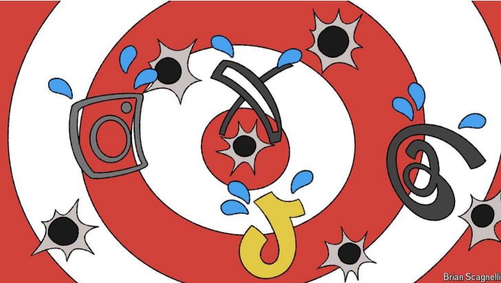

# As Brazil bans Elon Musk’s X, who will speak up for free speech?

Free expression has become a culture war, and those who should defend it are staying quiet

原文：

In Brazil JUDGES have blocked access to X, one of the country’s most

popular social networks. In France prosecutors have banned the head of

Telegram from leaving the country while they investigate the messaging

platform. In Britain judges are sentencing social-media users to prison for

messages posted online during recent riots. In America there are plans to ban

TikTok, a wildly popular Chinese-owned app. Arguments about free

expression are beginning to boil over, as governments clamp down on

speech online.

在巴西，法官已经禁止访问该国最受欢迎的社交网络之一X。在法国，检察官禁止Telegram的负责人在调查该消息平台期间离开该国。在英国，法官判处社交媒体用户监禁，因为他们在最近的骚乱中在网上发布消息。在美国，有计划封杀TikTok，一个非常受欢迎的中国应用。随着政府取缔网上言论，关于言论自由的争论开始升温。

学习：

riots：英 [ˈraɪəts] 骚乱；暴动；（riot的复数）**注意发音**

free expression：言论自由

boil over：情绪爆发；感情爆发；激动失控

clamp down on：取缔；整治；打压          

原文：

In some instances the crackdown is justified. France’s case against

Telegram, a Russian-founded app which has 50% more users worldwide

than X, focuses on its policing of illegal content. The app, which has only

about 50 employees, has long been seen as an easy place to share material

involving child abuse and advertise drugs and other contraband. Telegram

calls the French charges “absurd” and says it conforms with European digital

norms. Whatever the investigation concludes, it is at least targeting

something that is illegal.

在某些情况下，镇压是合理的。法国对Telegram的诉讼集中在它对非法内容的监管上，Telegram是一个俄罗斯创建的应用程序，其全球用户比X多50%。该应用程序只有大约50名员工，长期以来一直被视为一个分享涉及虐待儿童的材料以及宣传毒品和其他违禁品的简单场所。Telegram称法国的指控是“荒谬的”,并表示这符合欧洲数字标准。不管调查的结论是什么，它至少针对的是非法的东西。

学习：

justified：合理的；正当的；有充分理由的

policing on illegal content：监管非法内容

contraband：美 [ˈkɑntrəˌbænd] 违禁品；走私货；禁运品；非法物品

原文：

America’s draconian strike against TikTok is also defensible. The app is

enjoyed by more than 1bn people worldwide and has shaken up an

uncompetitive market. But with a parent company based in Beijing, it is

vulnerable to manipulation by the Chinese Communist Party—which

matters, given how many users treat TikTok as their source of news.

Individuals have a right to freedom of speech, but foreign governments do

not. Banning TikTok is a reasonable last resort if the firm cannot sever its

ties with Beijing.

美国对TikTok的严厉打击也是可以辩护的。这款应用在全球有超过10亿人使用，并撼动了一个缺乏竞争的市场。但由于母公司位于北京，它很容易受到中国共产党的操纵——考虑到许多用户将TikTok视为他们的新闻来源，这一点很重要。个人有言论自由的权利，但外国政府没有。如果该公司不能断绝与中国的关系，禁止TikTok是合理的最后手段。

学习：

draconian：美 [drəˈkoʊniən] 极其严厉的；严苛的；苛刻的

draconian strike：严厉打击

sever： 美 [ˈsevər] 切断；断开；割断；

sever ties with：切断联系

原文：

Yet other recent cases seek to censor and punish speech that should be

within the law. Brazil has banned X over its refusal to comply with opaque

court orders to remove dozens of accounts, including those belonging to

members of its Congress; users trying to access the platform face ruinous

fines (see Americas section). India, the United Arab Emirates and others are

seeking to weaken encryption (see International section); Malaysia has said

that posts about religion must be cleared by the Department of Islamic

Development.

然而，最近的其他案件试图审查和惩罚应该在法律范围内的言论。巴西禁止了X，因为它拒绝服从不透明的法院命令，删除了几十个账户，包括那些属于国会议员的账户；试图访问该平台的用户将面临毁灭性的罚款(参见美洲部分)。印度、阿拉伯联合酋长国和其他国家正在寻求削弱加密技术(参见国际部分)；马来西亚表示，有关宗教的帖子必须由伊斯兰发展部清除。

学习：

opaque：美 [oʊˈpeɪk] 难以理解的；晦涩的；不清楚的

原文：

Rich democracies are also reaching more often for the censor’s scissors. The

European Union is investigating X for fostering misinformation and racism

—both bad, but not appropriate targets for the law. Britain is right to jail

those who clearly incite violence and to expect platforms to observe the law,

but when it convicted a man for posting a tweet deemed simply “grossly

offensive”, it strayed into unjustified censorship. Even in America, which

has the world’s strongest free-speech tradition, Facebook has accused the

White House of leaning on it to remove satire about covid-19.

富裕的民主国家也更频繁地使用审查剪刀。欧盟正在调查X助长错误信息和种族主义——这两者都不好，但不是法律的合适目标。英国监禁那些明显煽动暴力的人并期望平台遵守法律是正确的，但当它因一名男子发布被认为只是“严重冒犯”的推文而将其定罪时，它误入了不合理的审查制度。即使在拥有世界上最强大的言论自由传统的美国，脸书也指责白宫依靠它来删除对新冠肺炎的讽刺。

学习：

stray：迷路；走失；走神；走离；偏离；

原文：

Arguments about speech and the law have been raging since the invention of

the book, never mind Facebook. Our long-standing position is clear: only

with the freedom to be wrong can societies advance slowly towards what is

right. What has changed is that today the loudest objections to the

crackdown on free speech come from right-wingers such as Elon Musk, X’s

boss, while many self-described liberals applaud what they see as a blow

against Trump-supporting billionaires. As speech becomes a culture-war

battleground, those who disagree with the politics of Mr Musk and his allies

have become relaxed about the onslaught.

自从书籍发明以来，关于言论和法律的争论一直很激烈，更不用说脸书了。我们的长期立场是明确的:只有拥有犯错的自由，社会才能慢慢走向正确。发生了变化的是，如今对压制言论自由最强烈的反对来自X的老板埃隆马斯克(Elon Musk)等右翼人士，而许多自称自由主义者的人则为他们认为是对支持特朗普的亿万富翁的打击而欢呼。随着言论成为文化战争的战场，那些不同意马斯克及其盟友政治观点的人对这场冲击已经放松了。

学习：

objection：反对

self-described：自称为；自诩；自我标榜为

onslaught： 美 [ˈɑːnslɔːt] 攻击；猛攻；冲击；强烈抨击     

> 这里的 **book** 并非指具体的书，而是象征“知识”或“思想表达”的媒介。文中提到的“Arguments about speech and the law have been raging since the invention of the book” 意味着，自从书籍的发明以来，关于言论和法律的争论就一直存在。这表明，人们在如何平衡言论自由与法律限制的问题上，争论由来已久。
>
> **例子**：
>
> - **英文**：Debates about censorship have existed since the invention of the book, as societies struggle to balance free expression and societal norms.
> - **中文**：自从书籍发明以来，关于审查制度的争论就一直存在，因为社会在努力平衡言论自由与社会规范。  

原文：

They should wake up. The tightening curbs on what is said affect everyone

who uses online platforms, not just the billionaires who own them. What’s

more, freedom of expression is hardly safe in the hands of fair-weather

libertarians like Mr Musk, who sues those he disagrees with, bans words he

dislikes from his platform and is cordial with Vladimir Putin, whose

favoured content-moderation tool is Novichok. The ability to speak freely is

perhaps the essential liberal value. It is time for true liberals to speak up and

defend it. ■

他们应该醒了。对言论的限制越来越严格，影响到了所有使用在线平台的人，而不仅仅是拥有这些平台的亿万富翁。更重要的是，言论自由在马斯克这样的自由意志主义者手中很难得到保障，他起诉那些他不同意的人，禁止他不喜欢的词出现在他的平台上，并且对弗拉基米尔·普京很友好，他最喜欢的内容调节工具是Novichok。自由表达的能力也许是自由主义的基本价值。是时候让真正的自由主义者站出来捍卫它了。■

学习：

curb：约束；控制；抑制

fair-weather：只适用于好天气的；不可共患难的          

sue：起诉

## 后记

2024年9月8日14点41分于上海。

