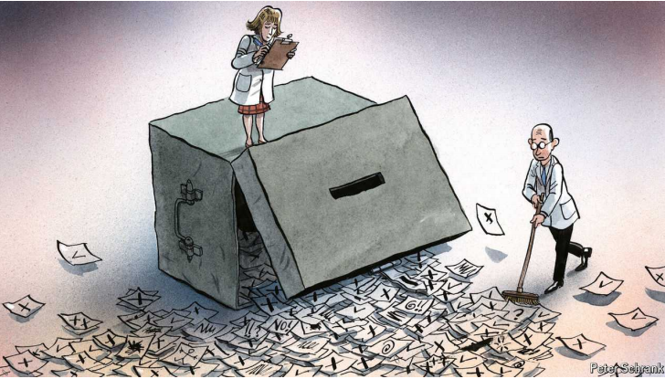

# Europe must beware the temptations of technocracy

Experts are increasingly crowding out flailing politicians

temptations：美 [tempˈteiʃənz] 诱惑物；诱惑；（temptation的复数）

technocracy：美 [tɛkˈnɑkrəsi] 技术统治；技术官僚政治；

crowding out：挤出效应；排挤效应；排挤效果   

flail：美 [fleɪl]  挥舞（双臂或工具）；乱动；打击；鞭打       

