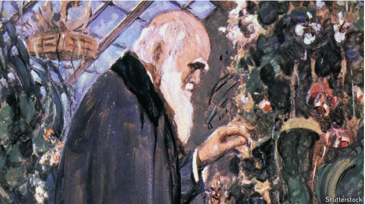

# The Oxford debate where evolution triumphed over creationism

A turning-point in the history of science

theory of evolution：进化论

creationism：创造论（认为宇宙和生命起源于神的创造）；神创论

triumph over：战胜

**Origin Story.** By Howard Markel. *W.W. Norton; 368 pages; $35 and £25*

原文：

IT USUALLY TAKES a rather long time for a worldview to become outmoded and

replaced by a new one. But in the eyes of many scientists, a monumental

shift took place on one day: June 30th 1860. It was then, at the Oxford

University Museum of Natural History, that Thomas Huxley, an English

biologist and representative of the new theory of evolution, bested in debate

Samuel Wilberforce, the city’s bishop and (unsurprisingly) a biblical

creationist.

一种世界观变得过时并被新的取代通常需要相当长的时间。但是在许多科学家看来，一个巨大的转变发生在一天:1860年6月30日。就在那时，在牛津大学自然历史博物馆，英国生物学家、新进化论的代表托马斯·赫胥黎在辩论中击败了该市的主教、圣经创世论者塞缪尔·威尔伯福斯。

学习：

worldview：世界观

outmoded：过时的；老式的；不流行的；

monumental：重大的；历史性的；不朽的；巨大的

theory of evolution：进化论

bested：打败；胜过；（best的过去式和过去分词）；

bishop：美 [ˈbɪʃəp] 主教；

biblical：美 [ˈbɪblɪk(ə)l] 《圣经》中的；有关《圣经》的；

creationist： 上帝论者；特创论者（即相信万物皆由上帝一次造成者）

原文：

In retrospect, the mythmakers are right, for in the spin game that followed

the debate the evolutionists came out on top, the bishop’s reputation was

badly tarnished and Huxley acquired the sobriquet “Darwin’s bulldog”. But

as to what actually happened that day, no minutes were taken and

recollections varied. So Howard Markel, a doctor and historian, has

ransacked correspondence, newspaper archives and the memoirs of

participants to put together a plausible reconstruction of events.

回想起来，神话制造者是对的，因为在辩论后的旋转游戏中，进化论者脱颖而出，主教的声誉严重受损，赫胥黎获得了“达尔文的斗牛犬”的绰号。但是对于那天到底发生了什么，没有记录，回忆也各不相同。因此，医生兼历史学家霍华德·马克尔(Howard Markel)翻遍了信件、报纸档案和参与者的回忆录，试图对事件进行可信的重建。

学习：

spin game:

>
>
>这里的 **"spin game"** 指的是在辩论或事件之后，参与者或支持者对事件的解释或包装，以便塑造公众的看法。这种“旋转”通常是为了让某一方看起来更好或更有利，尽管事实可能不完全如此。换句话说，**"spin game"** 是指人们通过策略性的宣传或解读来控制舆论导向和影响公众认知的过程。
>
>在这个语境中，辩论结束后，演化论者通过这种“spin game”赢得了胜利，尽管实际发生的事情并没有确切记录，回忆各不相同，但舆论最终有利于演化论者，损害了主教的声誉，并给了赫胥黎“达尔文的斗犬”的称号。

tarnish: 损坏（名声等）；败坏（声誉等）

reputation was badly tarnished：声誉严重受损

Huxley：英 [ˈhʌksli] 赫胥黎

sobriquet：美 [ˈsoʊbrəˌkeɪ] 绰号；外号；别名； **注意发音**

bulldog：斗牛犬；牛头犬；坚定的支持者

recollections：回忆；往事；记忆；（recollection的复数）          

minutes：备忘录；会议记录；（minute的复数）

ransack：彻底搜索；洗劫；翻箱倒柜；把…翻个底朝天

correspondence：通信；信件；往来书信；信函；

原文：

Seven months before the debate a naturalist called Charles Darwin had

published a book catchily entitled “On the Origin of Species by Means of

Natural Selection, or the Preservation of Favoured Races in the Struggle for

Life”. It not only asserted that species were not the individual creations of

God, but also proposed an alternative, non-supernatural mechanism for their

creation. June 1860 marked the first time the British Association for the

Advancement of Science had met since the book’s publication. It was

therefore the first opportunity to debate Darwin’s ideas in what was, in those

days, a parliament of science.

在这场辩论的七个月前，一位名叫查尔斯·达尔文的博物学家出版了一本引人注目的书，书名为《通过自然选择的方式，或在生存斗争中保护优势种族的物种起源》。它不仅断言物种不是上帝单独创造的，而且还提出了一种替代的、非超自然的创造机制。自该书出版以来，1860年6月是英国科学促进协会第一次召开会议。因此，这是第一次有机会在当时的科学议会中讨论达尔文的思想。

学习：

naturalist： 美 [ˈnætʃ(ə)rələst] 自然学者；博物学家；自然观察者

Charles Darwin：达尔文

原文：

Books about “On the Origin of Species” are at no risk of going extinct: as Dr

Markel observes, there is a thriving “Darwin industry” in publishing. By

making the debate its centrepiece, though, “Origin Story” brings something

new to the literary selection. The author sets things off with insightful pen-

portraits of Darwin and his milieu, including friends (his best mate, Joseph

Hooker, a botanist; Charles Lyell, a noted Scottish geologist; and Huxley

himself, a self-made scientific gadfly), adversaries (such as Wilberforce) and

colleagues (John Murray, the publisher of the “big species book”).

关于《物种起源》的书籍没有灭绝的危险:正如马克尔博士所观察到的，出版业中有一个欣欣向荣的“达尔文产业”。然而，《起源故事》将这场辩论作为其核心，为文学选择带来了一些新的东西。作者对达尔文和他的环境，包括朋友(他最好的朋友，植物学家约瑟夫·胡克；查理斯·莱尔，一位著名的苏格兰地质学家；还有赫胥黎本人，一个白手起家的科学牛虻)、对手(如威尔伯福斯)和同事(约翰·默里，《大物种书》的出版商)。

学习：

centrepiece：核心；重点；主要特色；

milieu： 美 [mɪlˈju] 环境；背景；社会环境；生活圈子

botanist：美 [ˈbɑːtənɪst] 植物学家

geologist：英 [dʒiˈɒlədʒɪst] 地质学家

self-made：白手起家          

gadfly：美 [ˈɡædˌflaɪ] 牛虻；虻；批评者；挑战者；搅局者；

原文：

Dr Markel also examines the treatment of Alfred Russel Wallace, a

professional specimen collector who came up with the idea of natural

selection independently while travelling in the Malay Archipelago in 1858.

Dr Markel subscribes to the view that Wallace was genteelly sidelined by

Darwin and his friends when the two men’s ideas were presented jointly to a

meeting of the Linnean Society in 1858. But, if that was what did happen,

Wallace seems to have borne no grudge—and, indeed, went on to fame and

respect almost as great as that enjoyed by Darwin.

马克尔博士还研究了阿尔弗雷德·罗素·华莱士如何被对待，他是一名专业的标本收集者，1858年在马来群岛旅行时独立提出了自然选择的观点。马克尔博士赞同这样的观点，即当达尔文和他的朋友们在1858年的一次林奈学会会议上共同提出他们的观点时，华莱士被他们体面地边缘化了。但是，如果那确实发生了，华莱士似乎并没有怀恨在心——事实上，他获得了几乎和达尔文一样的声誉和尊重。

学习：

>
>
>这里的 **"treatment"** 指的是“对待方式”或“处理方式”，在这个上下文中，特指阿尔弗雷德·拉塞尔·华莱士（Alfred Russel Wallace）在与达尔文和他朋友的关系中被如何对待，尤其是在他提出自然选择理论时所受到的对待。
>
>**英文**: The treatment of women in the workplace has improved significantly over the past decades.
>
>**中文**: 在过去的几十年里，女性在职场上受到的对待方式有了显著改善。

specimen：美 [ˈspesɪmən] 样本；标本；样品；

genteelly：美 [dʒɛn'tili] 文雅地ˌ有教养地

sideline：边缘化

grudge： 美 [ɡrʌdʒ] 怨恨；嫉妒；不满；积怨；

borne：bear过去分词，心怀

>
>
>**"borne"** 是 **"bear"** 的过去分词形式，这里表示“忍受”或“心怀”，意思是华莱士没有因此感到怨恨或不满。
>
>**英文**: Despite the harsh criticism, she bore no ill will towards her detractors.
>
>**中文**: 尽管受到了严厉的批评，她对批评者并没有心怀怨恨。

went on to fame and respect：获得声誉和尊重

原文：

With his physician’s hat on, Dr Markel also weighs in on the question of

Darwin’s mysterious and sometimes convenient illness. (It was this, for

example, that stopped him facing the inquisition personally at the Oxford

meeting.) Looking at the man’s diet—as evidenced by his wife Emma’s

recipe books—and rigorously analysing his ailments, he concludes it was

probably lactose intolerance, whose symptoms were triggered by many

dairy-rich meals.

戴上医生的帽子，马克尔博士也加入了对达尔文神秘的、有时是恰巧发作的疾病的质疑。(例如，正是这一点阻止了他在牛津会议上亲自面对宗教裁判所。)看着这个男人的饮食——他妻子艾玛的食谱证明了这一点——并严格分析了他的疾病，他得出结论，这可能是乳糖不耐症，其症状是由许多富含乳制品的膳食引发的。

学习：

>
>
>这里的 **"convenient illness"** 指的是达尔文的疾病在某些关键时刻显得“恰巧”发作，帮助他避免了不想面对的局面。例如，达尔文在牛津会议上没有亲自面对质询，这被归因于他的疾病发作，因此这个疾病似乎在某种程度上为他提供了一种方便的借口来避免不适或紧张的情况。
>
>在这种语境下，"convenient" 暗示疾病的出现似乎对达尔文有某种好处，帮助他回避面对批评或质询。

ailments：美 [ˈeilmənts] 小病；小病（ailment复数形式）；疾病；

lactose：美 [ˈlækˌtoʊs] 乳糖；

原文：

If true, that is ironic. Lactose, a sugar found in milk, is easily digested by

babies, but adults generally struggle to stomach it. The exceptions tend to

live in cattle-raising societies, such as Europe, where milk from stock

animals is routinely drunk. Here, natural selection favours adults who retain

lactose digestion. The intolerance did not, in the end, affect Darwin’s

contribution to the gene pool (he and Emma raised seven children to

adulthood). But gastric troubles no doubt prevented him from feeling the

fittest. ■

如果是真的，那就太讽刺了。乳糖是牛奶中的一种糖，婴儿很容易消化，但成年人通常很难消化。例外倾向于生活在养牛的社会，例如欧洲，在那里家畜的奶经常被饮用。在这里，自然选择有利于保留乳糖消化能力的成年人。最终，这种乳糖不耐受并没有影响达尔文对基因库的贡献(他和艾玛养育了7个孩子到成年)。但是胃病无疑使他感觉不到自己是最健康的。■

学习：

stomach：消化（食物）

cattle-raising：养牛

stock animals：家畜

digestion：消化能力；吸收能力；

lactose digestion：乳糖消化能力

gene pool：基因库；基因池；遗传基因库

gastric：美 [ˈɡæstrɪk] 胃的；胃部的；与胃相关的

## 后记

2024年9月13日13点55分于上海。

