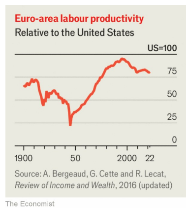

# Mario Draghi’s best ideas are those Europe finds least comfortable

The danger is that it picks the easy ones

原文：

Adam SMITH thought that achieving spectacular economic growth required little

more than “peace, easy taxes and a tolerable administration of justice”.

Don’t tell Mario Draghi, who has just penned almost 400 pages on boosting

European “competitiveness”, meaning economic growth. This is the second

technocratic door-stopper commissioned by the European Union as it tries to

bring stagnation to an end. As Mr Draghi observes in our online By

Invitation column, an ageing population means that, if productivity growth

does not rise, Europe’s economy will be no bigger in 2050 than it is today.

亚当·斯密认为，实现惊人的经济增长只需要“和平、宽松的税收和可容忍的司法”。不要告诉马里奥·德拉吉，他刚刚写了近400页关于提高欧洲“竞争力”的文章，意思是经济增长。这是欧盟委任的第二个试图终结停滞的技术官僚写的文件。正如德拉吉在我们的在线邀请专栏中所观察到的，人口老龄化意味着，如果生产率增长没有提高，2050年的欧洲经济将不会比现在更大。

学习：
Adam Smith：亚当斯密

pen：写；写作

>这里的 **"door-stopper"** 是指一本非常厚重、内容繁多的书或文件，形容该文件体积大、内容多，就像能够用来挡住门的物件一样。在这个例子中，**"door-stopper"** 指的是马里奥·德拉吉（Mario Draghi）撰写的近400页的文件，形容它非常厚重且内容庞杂。
>
>举个例子：
>
>- **英语**: "The research report on climate change was such a door-stopper that it took days to read through all the data and conclusions."
>- **中文**: “那份关于气候变化的研究报告厚得像块挡门石，读完所有数据和结论花了好几天。”

原文：

By the standards of such reports, Mr Draghi’s is commendably plain-spoken.

The former Italian prime minister and president of the European Central

Bank writes with authority and much of what he calls for is desirable. That

includes more integrated markets, so that startups can benefit from scale

among their customers and their financial backers. Mr Draghi also wants to

unify decision-making on public investments; to pare back the thickets of

regulation ensnaring Europe’s firms; and to link up electricity grids.

按照这类报道的标准，德拉吉的直言不讳值得称赞。这位意大利前总理兼欧洲央行(ECB)行长的文章颇具权威性，他呼吁的很多东西都是可取的。这包括更加一体化的市场，这样初创公司就可以从客户和金融支持者的规模中受益。德拉吉还希望统一公共投资的决策；削减束缚欧洲公司的错综复杂的规章制度；并连接电网。

学习：

commendably：很好地；值得赞赏地          

plain-spoken：直言不讳的；坦率的；直率的

desirable：吸引人的；值得拥有的；值得做的

pare：美 [per] 修剪（指甲、树枝等）；削减；逐步减少

thicket：美 [ˈθɪkɪt]  丛林；密林；杂木林

the thickets of regulation：繁杂的规章

原文：

The biggest question was how much he would endorse the interventionist

policies many politicians crave. Here Mr Draghi is too sympathetic to the

mercantilists and their calls for subsidies for “strategic” industries, such as

carmaking, the relaxation of competition and state-aid rules, and tariffs on

imports from China. He pays little heed to Europe’s high-tech success

stories, which owe more to markets than governments. Even the academic

papers Mr Draghi cites in support of his case are generally agnostic about

whether state support brings aggregate benefits to an economy, rather than

just helping favoured sectors.

最大的问题是他会在多大程度上支持许多政客渴望的干涉主义政策。在这一点上，德拉吉先生对重商主义者及其对“战略性”产业的补贴的呼吁过于同情，比如汽车制造业，放松竞争和国家援助规则，以及对来自中国的进口商品征收关税。他很少关注欧洲高科技的成功故事，这些故事更多地归功于市场而不是政府。就连德拉吉为支持自己的观点而引用的学术论文，也普遍不知道政府支持是否会给一个经济体带来总体利益，而不仅仅是帮助受支持的行业。

学习：

crave：渴望；热望；强烈希望；迫切需要

mercantilist：重商主义

relaxation：减轻；放宽（规定或限制）

heed：留心；密切关注；关注

pay little heed to：很少关注xxx

agnostic：不可知的

原文：

Yet Mr Draghi is no crude protectionist. He admits, for example, that in

some industries Europe should not attempt to match foreign subsidies on

exports but instead allow “foreign taxpayers to contribute to higher

consumption by European consumers”. He often appeals to national security,

which is a more solid basis for intervening than attempts to boost growth. If

Europe follows his advice, its industrial policy will at least be thoughtful and

guarded.

然而，德拉吉并不是粗鲁的保护主义者。例如，他承认，在某些行业，欧洲不应该试图在出口上匹配外国补贴，而是应该允许“外国纳税人为欧洲消费者的更高消费做出贡献”。他经常诉诸国家安全，这是一个比刺激增长更坚实的干预基础。如果欧洲听从他的建议，它的产业政策至少会是深思熟虑和谨慎的。

学习：

appeal to：呼吁

guarded：谨慎的；有保留的；警惕的

原文：

Mr Draghi’s most headline-grabbing analysis is that Europe needs

investment by the private and public sectors to rise from today’s 22% of GDP

to 27%. Germany, especially, needs this spending. Well-executed subsidies

for R&D might work at a continental level. But northern Europe has little

desire for more joint spending, a subject that Mr Draghi dances around.

德拉吉最引人注目的分析是，欧洲需要私人和公共部门的投资从目前占GDP的22%上升到27%。尤其是德国，需要这笔支出。对R&D实施良好的补贴可能会在整个欧洲层面发挥作用。但是北欧对更多的联合支出没有什么兴趣，这是德拉吉绕来绕去的话题。

学习：

headline-grabbing：引人注目的，吸引人眼球的

dance around: 避而不谈、绕开某个问题或话题

>
>
>这里的 **"dance around"** 是指避而不谈、绕开某个问题或话题，不正面直接讨论。在这个例子中，指马里奥·德拉吉（Mr Draghi）在他的分析中没有正面讨论北欧国家对更多联合支出的不情愿，而是采取了回避或间接的方式。
>
>举个例子：
>
>- **英语**: "The politician danced around the question of tax increases, offering vague answers instead of addressing it directly."
>- **中文**: “那位政治家回避了关于加税的问题，用模糊的回答代替了正面的讨论。”

原文：

Another problem is that Mr Draghi’s recommendations are so numerous that

policymakers will be able to pick and choose from among them. Europe is

used to wringing its hands over “competitiveness” and urging investments in

infrastructure and technology: Jacques Delors, a former president of the

European Commission, did that as early as 1993. Yet extra spending and

subsidies are no fix for the structural issues that require Europe to embrace

reform. As Mr Draghi also points out, the continent needs bigger, better and

more integrated markets, which requires some centralisation but not

*dirigisme*.

另一个问题是德拉吉先生的建议如此之多，以至于政策制定者要从中挑选。欧洲习惯于对“竞争力”感到焦虑，并敦促对基础设施和技术进行投资:欧盟委员会前主席雅克·德洛尔早在1993年就这么做了。然而，额外支出和补贴并不能解决要求欧洲进行改革的结构性问题。正如德拉吉所指出的，欧洲大陆需要更大、更好、更一体化的市场，这需要一些中 央化，但不是中 央 集 权。

学习：

pick and choose：精挑细选；挑三拣四；仔细挑选；

wring: 焦虑地表达某种困扰或无奈

>这里的 **"wring"** 意思是“焦虑地表达某种困扰或无奈”，通常是指对某事感到无力或困惑，但又不采取实际行动去解决问题。在这个上下文中，**"wringing its hands"** 是指欧洲长期以来一直对“竞争力”问题感到困扰，表达担忧，却没有采取有效行动解决问题。
>
>举个例子：
>
>- **英语**: "The company executives wring their hands over the declining sales but fail to implement any real changes."
>- **中文**: “公司高层对销售下滑感到焦虑，但却没有采取任何实际的改变措施。”

dirigisme: 美 [ˈdɪrɪʒɪzəm] 中 央集 权式管理；（国家对社会、经济的）统制

原文：

If policymakers ignore this and instead use Mr Draghi as intellectual cover

for weakening competition and state-aid rules, allowing governments or the

EU itself to pursue an excessively interventionist agenda, then Europe’s

problems are likely to get worse. Mr Draghi might have done better to have

focused his message on the things that Europe’s politicians do not want to

hear. ■

如果决策者忽视这一点，转而利用德拉吉作为削弱竞争和国家援助规则的理论掩护，允许政府或欧盟本身追求过度干预的日程，那么欧洲的问题可能会变得更糟。德拉吉本可以做得更好，把他的信息集中在欧洲政客不想听到的事情上。■

## 后记

2024年9月14日12点59分于上海。

