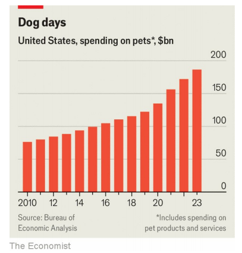

# People are splurging like never before on their pets

like never before：从未有过；未曾发生过          

splurge：挥霍；浪费；破费；大量花费；过度消费

Would you buy your furry companion a cologne?

cologne：美 [kəˈloʊn] 古龙香水；科隆香水； **注意发音**

companion：同伴；伙伴；朋友；伴侣；

原文：

Among the products of DOG by Dr Lisa, an Australian pet-care brand, you will

find a cleanser for sensitive skin, a soothing balm and a cologne. All are free

of genetically modified ingredients—and vegan, which dogs are not, at least

by choice. Still, canines craving meat need not eat like animals: Butternut

Box, a maker of fresh pet food taste-tested by humans, can offer your furry

friend a low-fat chicken dish with peas, lentils and “a whiff of sage”. It is the

most popular meal it offers.

在澳大利亚宠物护理品牌丽萨博士的产品中，你会发现一种针对敏感皮肤的清洁剂，一种舒缓的香膏和一种古龙水。所有的都不含转基因成分，也不含纯素食，而狗不是，至少是自愿选择的。尽管如此，渴望吃肉的狗不一定要像动物一样吃:Butternut Box是一家经人类品尝的新鲜宠物食品制造商，它可以为你的毛茸茸的朋友提供一份低脂鸡肉菜肴，其中有豌豆、扁豆和“一股鼠尾草味”。这是它提供的最受欢迎的一餐。

学习：

pet-care：宠物护理

cleanser： 美 [ˈklɛnzər] 清洁剂；洗涤剂；清洗剂

sensitive skin：敏感肌肤

soothing：舒缓的

balm：英 [bɑːm] 香膏

genetically modified：转基因的

vegan：严格素食主义者；纯素食

canines：美 ['kænaɪnz] 犬的；犬齿的

craving：强烈欲望；渴望

canines craving meat：想吃肉的狗

low-fat：低脂

peas：豌豆；（pea的复数）

lentil：美 [ˈlɛnt(ə)l] 小扁豆；

sage：鼠尾草；鼠尾草属植物（可用作调料）

原文：

There is little, it seems, that people won’t do for their pets. Americans spent

$186bn on them last year, according to the Bureau of Economic Analysis,

covering everything from food and vet visits to toys and grooming. That is

more than they spent on childcare. Catering to pets has become big business.

Mars, a company best known for its chocolate bars, made two-thirds of its

revenue last year from pet-care. Besides owning the Royal Canin pet-food

brand, the company also operates thousands of vet clinics. Nestlé and

Colgate, two other consumer-products giants, also make around a fifth of

their revenue from their pet divisions.

看起来，人们几乎会为他们的宠物做任何事情。根据经济分析局(Bureau of Economic Analysis)的数据，美国人去年在这方面的支出为1860亿美元，涵盖了从食品和兽医门诊到玩具和美容的方方面面。这比他们花在儿童保育上的钱还多。迎合宠物已经成为大生意。以巧克力棒闻名的玛氏公司去年三分之二的收入来自宠物护理。除了拥有Royal Canin宠物食品品牌，该公司还经营着数千家兽医诊所。另外两家消费品巨头雀巢和高露洁也有大约五分之一的收入来自宠物部门。

学习：

vet visits：去兽医门诊

groom：梳毛；清洁；（使）整洁；打扮；

Colgate：美 [ˈkoʊlgeɪt] 高露洁；高露洁（一种牙膏的商标名）

Nestle：雀巢

原文：

Spending on pets rocketed through the covid-19 pandemic, as lonely people

adopted animals then splurged on them. Between 2019 and 2023 pet

spending grew by a compound annual rate of 11%, in nominal terms,

compared with 6% for consumer spending overall and 5% for pet spending

over the preceding decade (see chart). Plenty more growth is yet to come.

在pandemic下，人们在宠物上的花费飙升，因为孤独的人们收养动物，然后在它们身上挥霍。从2019年到2023年，名义上宠物支出的复合年增长率为11%，相比之下，过去十年整体消费者支出为6%，宠物支出为5%(见图表)。更多的增长还在后面。

学习：

adopt animals：收养宠物

原文：

Unlike virtual yoga classes or meal-kit subscriptions, animals weren’t easy

to drop once lockdowns ended. Consumers, grappling lately with higher

prices and a cooling job market, have been reluctant to inflict austerity on

their pets. Morgan Stanley, a bank, reckons pet spending in America will

grow by 2.5% this year, well ahead of estimates for, say, clothes. The pet

business proved similarly resilient during the global financial crisis of 2007-

09.

与虚拟瑜伽课程或套餐订阅不同，一旦疫情结束，动物就不容易离开。消费者最近在努力应对价格上涨和就业市场降温，不愿意对他们的宠物实施紧缩政策。摩根士丹利银行估计，今年美国的宠物支出将增长2.5%，远高于对服装的预期。在2007年至2009年的全球金融危机中，宠物行业也表现出了类似的弹性。

原文：

And analysts reckon the pet business will soon have the zoomies again.

Morgan Stanley forecasts that annual spending will rise to around $260bn by

2030, consistent with its pre-pandemic growth trend. Behind that is a shift in

the relationship between pets and humans. Owners increasingly see

themselves as parents, not masters. “Pets have gone from the backyard to the

living room to the bedroom,” says Loïc Moutault, head of the pet division at

Mars.

分析家认为宠物行业将很快再次回到活跃状态。摩根士丹利预测，到2030年，年度支出将升至2600亿美元左右，与疫情之前的增长趋势一致。这背后是宠物和人类之间关系的转变。所有者越来越把自己视为父母，而不是主人。“宠物已经从后院到客厅再到卧室，”玛氏宠物部门的负责人loc mout ault说。

学习：

zoomies:  宠物突然兴奋地四处奔跑、活蹦乱跳的行为

>这里的 **"zoomies"** 是指宠物突然兴奋地四处奔跑、活蹦乱跳的行为，通常用来形容宠物短暂的兴奋状态。在这句话中，"zoomies" 比喻了宠物行业即将再次快速增长或回到活跃状态。
>
>**举例**：
>1. **英文**: After a long nap, my dog got the zoomies and started racing around the house.
>2. **中文**: 我的狗睡了个长觉后突然变得异常兴奋，开始在房子里疯狂地跑来跑去。

living room：客厅

原文：

That change is playing out across generations. Millennials, many of whom

have put off having children, have more fur babies per household than any

other generation in America. Gen Z is proving to be equally pet-loving.

“Millennials and Gen Z see their pets differently,” says Kristin Peck, chief

executive of Zoetis, a drugmaker for animals. “They really see them as part

of their families.”

这种变化会在几代人之间发生。千禧一代中的许多人已经推迟了要孩子的时间，他们每户拥有的毛皮婴儿比美国其他任何一代人都多。事实证明，Z世代同样热爱宠物。“千禧一代和Z世代对宠物的看法不同，”动物制药商Zoetis的首席执行官克里斯汀·佩克(Kristin Peck)表示。“他们真的把它们视为家庭的一部分。”

原文：

Dogs, cats and other animals lucky enough to be welcomed into such

families are in for a treat. Younger owners might take their pets to the vet

more often, to the animals’ dismay, but they make up for it by giving them

more presents. Some 95% of Gen Z owners surveyed last year by the

American Pet Products Association, an industry group, said they bought

their dog a gift at least once a year, compared with 81% of boomers. The

average cost of those gifts was a lavish $44 among Gen Z owners, compared

with $17 among boomers.

狗、猫和其他幸运地被这些家庭接纳的动物将会享受美好的款待。令动物沮丧的是，年轻的主人可能会更频繁地带他们的宠物去看兽医，但他们会给它们更多的礼物来弥补这一点。行业组织美国宠物产品协会去年调查了大约95%的Z世代主人，他们说他们每年至少给他们的狗买一次礼物，相比之下，婴儿潮一代的这一比例为81%。这些礼物在Z世代拥有者中的平均花费是44美元，而在婴儿潮一代中是17美元。

学习：

in for a treat：

>这里的 **"in for a treat"** 意思是即将享受美好的事情或得到特别的款待。在这个上下文中，指那些被年轻主人照顾的宠物即将享受到更多的关爱和礼物。
>
>**举例**：
>1. **英文**: If you like chocolate, you're in for a treat at this bakery.
>2. **中文**: 如果你喜欢巧克力，那么在这家面包店你会享受到美味的款待。

原文：

Owners are also now giving their pets yummier food. At Freshpet, an

American pet-food producer founded in 2006, sales are more than double

what they were three years ago. It only uses natural ingredients. William

Cyr, its boss, says the firm is gaining from the “humanisation” of pets.

“Canned dog food was invented in 1922,” Mr Cyr says. “And it smells like

it.”

主人现在也给他们的宠物更美味的食物。在2006年成立的美国宠物食品生产商Freshpet，销售额是三年前的两倍多。它只用天然成分。该公司老板威廉·西尔说，该公司正从宠物的“人性化”中获益。“罐装狗粮是在1922年发明的，”西尔先生说。“而且闻起来很像。”

原文：

All this is attracting plenty of newcomers to the pet industry. Private-equity

firms have poured so much money into buying and consolidating vet clinics

that they have caught the attention of antitrust regulators in America and

Britain. Earlier this month Gilles Andrier, the boss of Givaudan, a Swiss

company that is the world’s largest manufacturer of flavours and fragrances,

said his firm is eyeing the pet-food market. “People spend more money on

pets than kids nowadays,” he explained. Best, then, to have a dog in the

fight. ■

所有这些都吸引了大量宠物行业的新来者。私募股权公司在购买和整合兽医诊所上投入了如此多的资金，以至于引起了美国和英国反垄断监管机构的注意。本月早些时候，全球最大的香精香料生产商瑞士Givaudan公司的老板Gilles Andrier说，他的公司正在关注宠物食品市场。“如今，人们在宠物身上花的钱比孩子还多，”他解释道。那么，最好有一只狗参加战斗。■

学习：

pet industry：宠物行业

## 后记

2024年9月15日15点00分于上海。

