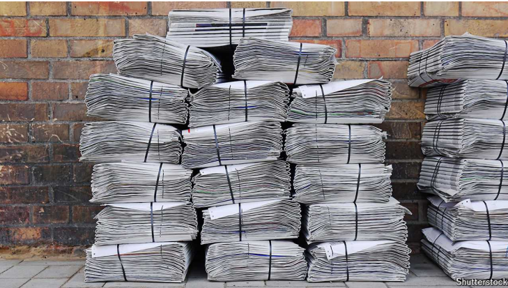

# Tabloids are about more than trashy headlines

Love them or hate them, their history and future are long

tabloids：美 [ˈtæblɔidz] 小报

**The Newsmongers: A History of Tabloid Journalism.** By Terry Kirby.

*Reaktion Books; 392 pages; $27.50 and £20*

原文：

BEFORE ANY journalist thought to use the word, a drugs company trademarked it

in 1884. “Tabloid”, a portmanteau of “tablet” and “alkaloid”, denoted drugs

in tablet form but quickly assumed a broader meaning: “anything

compressed or concentrated for easy assimilation”. That also describes what

has come to be known as tabloid journalism: brief sentences, punchy (and

often incendiary) headlines, short articles, famous subjects.

在任何记者想到使用这个词之前，一家药品公司在1884年就注册了这个词。“Tabloid”是“药片”和“生物碱”的合成词，指的是药片形式的药物，但很快就有了更广泛的含义:“任何压缩或浓缩的易于吸收的东西”。这也描述了所谓的小报新闻:简短的句子，有力的(通常是煽动性的)标题，短文，著名的主题。

学习：

trademark：商标；标志          

portmanteau：美 [ˌpɔrtˈmæntoʊ] 混成词；合成词；

alkaloid： 美 [ˈælkəˌlɔɪd] 生物碱；植物碱；

assume：呈现

assimilation：美 [əˌsɪməˈleɪʃn] 吸收；同化；消化

punchy：强有力的；有冲击力的；简洁有力的

incendiary：英 [ɪnˈsɛndɪəri] 煽动性的；激动人心的；

原文：

Sophisticates’ list of complaints is long: tabloids titillate and enrage more

than they enlighten; they deepen and pander to readers’ prejudices; they

traffic in gossip and vapidity; they pry into people’s private lives and exploit

tragedy for sales. But looming above these worthy whines lurks a simple

truth: tabloids attract a huge number of readers. In Britain the most-read

news sources online, after the BBC, are all tabloids, including Reach (the group

that owns the *Daily Mirror* and *Daily Express)*, the *Sun* and the *Daily Mail*’s

*MailOnline*.

世故者的抱怨清单很长:小报刺激和激怒的比它们启发的多；它们加深并迎合读者的偏见；他们传播流言蜚语和无聊之事；他们刺探人们的私生活，利用悲剧进行销售。但是在这些有价值的抱怨背后隐藏着一个简单的事实:小报吸引了大量的读者。在英国，除了BBC之外，阅读量最大的在线新闻来源都是小报，包括Reach(拥有《每日镜报》和《每日快报》的集团)、《太阳报》和《每日邮报》的MailOnline。

学习：

sophisticates: 老于世故的人；精通时尚和文化的人；（sophisticate的复数）

titillate：美 [ˈtɪdlˌeɪt] 挑逗；使兴奋；

enrage：美 [ɪnˈreɪdʒ] 激怒；使愤怒

pander：美 [ˈpændər]（常指为谋私利而）迎合；讨好，pander to

gossip：美 [ˈɡɑːsɪp] 闲话；流言蜚语；八卦

vapidity：美 [væ'piditi] 无生气; 无趣; 乏味; 

pry into：窥探；刺探；打探          

whine：美 [waɪn]  哀鸣声；抱怨声；牢骚声；

lurk：潜伏，隐藏着

原文：

Terry Kirby, a journalist and lecturer at Goldsmiths, University of London,

brings serious analysis to these light publications, noting that the public has

long had an appetite for lurid news. Printed accounts of horrific crimes were

popular in Britain in the early 17th century. Circulars around that same time

told of wheat raining for miles around Suffolk, a sorcerer burned in

Edinburgh and a monster that appeared out of a tempest and “mortally

wrung the necks of several worshippers”.

伦敦大学金史密斯学院的记者兼讲师Terry Kirby对这些轻松的出版物进行了严肃的分析，指出公众长期以来一直对耸人听闻的新闻感兴趣。17世纪初，可怕罪行的印刷记录在英国很流行。大约在同一时间，传单上说，在萨福克周围几英里的地方下着麦雨，一个巫师在爱丁堡被烧死，一个怪物从暴风雨中出现，并“致命地拧断了几个礼拜者的脖子”。

学习：

light publications：轻松的出版物

lurid：耀眼的；光彩夺目的；令人震惊的；猎奇的；俗艳的；花哨的

circulars：传单；通知；街招；（circular的复数）

sorcerer：英 [ˈsɔːs(ə)rə] 巫师；术士；魔法师

tempest：猛烈的风暴；暴风雨；大风暴

mortally：致命地；极度地；非常地

wrung：扭；（wring的过去式和过去分词）        

>
>
>*"Wheat raining"* 在这里指的是一种非常不寻常的现象或传闻，描述了小麦从天而降，可能是当时的目击者或传闻的夸张表现。这个短语在文中是为了强调当时公众对怪异、耸人听闻的故事的兴趣。虽然这类事情在现实中并不可能发生，但它反映了17世纪英国民众对神秘、超自然事件的好奇和关注。
>
>这种“从天而降”的小麦事件类似于现代社会中夸张的新闻报道或都市传说，目的是吸引读者的兴趣。
>
>类似的表达可以是：
>- *Reports of frogs falling from the sky captivated the townspeople.* (青蛙从天而降的报道吸引了镇上居民的注意。)

原文：

Another was illustrated with an engraving of men in breeches and broad-

brimmed hats merrily chopping up and disembowelling a man. Ben Jonson,

an English playwright, lampooned people’s appetite for gossip in a satirical

play called “The Staple of News”, first performed in 1625. A character tells

a “gossip scout” to “get o’ this News, to store your office*,/* Who dines and

sups i’ the town? Where and with whom?”

另一幅插图是一个穿着马裤、戴着宽边帽的男人快乐地砍一个男人并取出他的内脏。英国剧作家本·琼生在一部名为《新闻的主要内容》的讽刺剧中讽刺了人们对八卦的兴趣，该剧首次上演于1625年。一个角色告诉一个“八卦侦察兵”去“滚出这个新闻，保住你的办公室/谁在镇上吃喝?”？在哪里和谁？”

学习:

engraving: 雕刻艺术；雕刻作品；版画

breeches：半长裤；马裤

broad-brimmed：宽边的

merrily：欢快地；兴高采烈地；

disembowel：英 [ˌdɪsɪmˈbaʊəl]  取出…的内脏；开…的膛

playwright：美 [ˈpleɪraɪt] 剧作家；戏剧作者；编剧；

lampooned：美 [læmˈpu:nd] 嘲讽；讥讽；（lampoon的过去式）

staple：主要产品；支柱产品；主要内容

scout：侦察兵；侦查员；侦察机

原文：

In the 19th century American “penny papers” served an increasingly literate

working class and changed newspapers’ business models, allowing sales of

individual copies on the day they were printed rather than requiring readers

to subscribe in advance. The rotary press, invented in 1843, could print more

papers, while the electric telegraph, created the next year, let reporters

transmit information to the home office more quickly than letters or physical

travel. Newspapers that seized technological advancements thrived: the

*Daily Mirror* dominated the early 20th century thanks in part to its ability to

print photographs quickly, just as the *MailOnline* has done with digital

aggregation and headlines optimised for search engines.

19世纪，美国的“廉价报纸”服务于越来越多有文化的工人阶级，改变了报纸的商业模式，允许在印刷当天销售单份报纸，而不是要求读者提前订阅。1843年发明的轮转印刷机可以印刷更多的报纸，而第二年发明的电报可以让记者比写信或物理旅行更快地向总部传递信息。抓住技术进步的报纸蓬勃发展:《每日镜报》主宰了20世纪初，部分原因是它能够快速打印照片，就像《每日邮报》在数字聚合和为搜索引擎优化标题方面所做的那样。

学习：

penny：便宜的

literate：有读写能力的；识字的；识字的人

rotary：美 [ˈroʊtəri] 旋转的；轮转的；转动的

press：印刷机

原文：

Mr Kirby’s history is heavily slanted towards Britain, for good reason.

Tabloids began there rather than in America, and America’s size worked

against its having influential national tabloids, as Britain did. The *New York*

*Post* is a first-rate tabloid, but, as the name suggests, focuses a lot on local

concerns. The *National Enquirer*’s relentless focus on celebrity news and

gossip meant it never attained the political influence of British tabloids,

though it broke some big stories (Gary Hart’s affair in 1987 and John

Edwards’s in 2007) and sat on others, such as Stormy Daniels’s account of

her affair with the paper’s favourite politician, Donald Trump.

柯比先生的历史非常倾向于英国，这是有充分理由的。小报起源于那里，而不是美国，美国的规模不利于它像英国那样拥有有影响力的全国性小报。《纽约邮报》是一份一流的小报，但是，正如它的名字所暗示的，它非常关注当地的问题。《国家询问报》对名人新闻和八卦的不懈关注意味着它从未获得英国小报的政治影响力，尽管它披露了一些重大新闻(1987年加里·哈特的绯闻和2007年约翰·爱德华兹的绯闻)，并隐瞒了其他新闻，如斯托米·丹尼尔斯对她与该报最受欢迎的政治家唐纳德·川普的绯闻的报道。

学习：

slanted：有倾向的；倾斜的；使倾斜；（slant的过去式）

first-rate：一流的；极好的；顶级的；

enquirer：追究者；寻问者

>
>
>这里的 *broke* 是指“报道”或“揭露”，而 *sat on* 是指“压制”或“隐瞒”。

原文：

As Mr Kirby’s story reaches the present, he grows increasingly shrill.

Heaping scorn on Robert Maxwell, the eccentric and crooked owner of the

*Daily Mirror* in the 1980s-90s, or tabloids’ campaigns against migrants and

the European Union is one thing. And he is right to bemoan tabloids’

intrusiveness and unethical conduct concerning the lives of celebrities and

the royal family. However, his scolding at length about “an endless scroll of

content aggregated from everywhere around the world”, or celebrity stories

written in prose that “resembled something out of the lushly worded

romantic fiction of writers like Barbara Cartland” or “the baser nationalistic

and jingoistic prejudices” of tabloid readers quickly grows tiresome.

随着科比先生的故事发展到现在，他变得越来越尖锐。对罗伯特·马克斯韦尔(Robert Maxwell)的蔑视是一回事，他是20世纪80-90年代《每日镜报》(Daily Mirror)古怪而不诚实的所有者，或者小报反对移民和欧盟的运动也是一回事。他抱怨小报对名人和皇室生活的侵扰和不道德行为是对的。然而，他对“从世界各地聚集的无休止的内容卷轴”，或以散文形式写的名人故事“类似于芭芭拉·卡特兰(Barbara Cartland)等作家措辞华丽的浪漫小说”，或小报读者“更下贱的民族主义和沙文主义偏见”的责骂很快变得令人厌倦。

学习：

shrill：尖锐的；刺耳的；尖细的

scorn：轻蔑；藐视；嘲笑

eccentric：美 [ɪkˈsentrɪk] 古怪的；异常的；怪异的

crooked：不诚实的；欺诈的

bemoan：悲叹；哀叹；哀怨；抱怨

intrusiveness：侵入性；侵扰性；干涉性

unethical：美 [ʌnˈeθɪkl] 不道德的

scolding：责骂；斥责

baser：卑鄙的；不纯正的；下贱的；（base的比较级）

jingoistic： 美 [ˌdʒɪŋɡoʊ'ɪstɪk] 极端爱国主义的；好战主义的

tiresome：乏味的；烦人的；无聊的

原文：

Still, “The Newsmongers” is a largely enjoyable and enlightening story—for

journalists, of course, but also for anyone who wants to understand better the

intricate relationship between newspapers and their rapt readers. ■

尽管如此，《新闻贩子》在很大程度上是一个令人愉快和富有启发性的故事——当然，对于记者来说，但对于任何想更好地理解报纸与其着迷的读者之间错综复杂的关系的人来说也是如此。■

学习：

intricate：复杂难懂的；难以理解的

intricate relationship：错综复杂的关系

rapt：着迷的；痴迷的

## 后记

2024年9月17日14点03分于上海。

