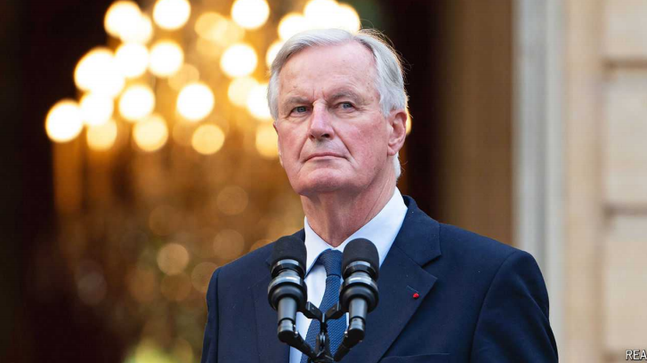

# Michel Barnier’s burden

France has found a prime minister, but is still seeking a government

原文：

Found: A NEW prime minister. Wanted: a new government. President Emmanuel

Macron’s appointment of Michel Barnier as France’s new prime minister on

September 5th, after a two-month search that followed inconclusive

parliamentary elections in July, ended one painful political quest. A veteran

conservative from the Republicans party and the European Union’s former

Brexit negotiator, Mr Barnier is a pro-European Gaullist with old-school

manners and a reputation for consensus-seeking. His selection has reassured

investors; 52% of the French approve. But he now has his work cut out

trying to forge a government with any chance of survival.

已找到:新首相。想要:新政府。9月5日，埃马纽埃尔·马克龙总统任命米歇尔·巴尼耶为法国新总理，结束了一场痛苦的政治追求。此前，法国在7月份的议会选举中进行了两个月的搜寻，但没有结果。巴尼耶是共和党的资深保守派，也是欧盟的前英国退出欧盟谈判代表，他是亲欧洲的戴高乐主义者，有着老派的举止和寻求共识的名声。他的被选择让投资者放心；52%的法国人赞成。但是他现在面临着艰巨的任务，试图组建一个有任何生存机会的政府。

学习：

inconclusive：不确定的；不决定性的；非定论的；无法令人信服的

Gaullist：戴高乐主义者

old-school：老派的；守旧派的；老式的          

has his work cut out：面临着艰巨的任务

原文:

Mr Barnier spent his first week on a recruitment drive, revealing little. The

Republicans hold a mere 47 seats in the 577-seat National Assembly. He still

depends on Mr Macron’s centrists, who form the second-biggest bloc, with

166. Indeed many of them come from the centre-right. They include Bruno

Le Maire, the finance minister, who is taking a break from politics, Gérald

Darmanin, the interior minister, and Edouard Philippe, a former prime

minister, who recently announced that he will run for the presidency in 2027.

巴尼耶的第一周是在招聘活动中度过的，没透露什么。在577个席位的国民议会中，共和党仅占有47个席位。他仍然依赖马克龙的中间派，他们形成了第二大集团，拥有166个席位。事实上，他们中的许多人来自中右翼。他们包括财政部长布鲁诺·勒梅尔(Bruno Le Maire)，他正在从政治中脱离出来，内政部长热拉尔·达尔马宁(Gérald Darmanin)，以及前总理爱德华·菲利普(Edouard Philippe)，他最近宣布将在2027年竞选总统。

原文：

Yet Mr Macron’s party, Renaissance, as a whole insists that its support

should not be taken for granted. Gabriel Attal, the 35-year-old former prime

minister who handed over to the 73-year-old Mr Barnier, is now the

centrists’ parliamentary leader. He told his deputies last week that their

attitude should be “neither an intention to obstruct nor unconditional

support”. Those on the centre-left of Renaissance are particularly sceptical.

Roland Lescure, the outgoing industry minister and incoming deputy

speaker of parliament, cautioned Mr Barnier against leaning too far to the

right, notably on immigration. “He can’t assume that we will be a

walkover,” he says.

然而，马克龙的政党复兴党(Renaissance)整体上坚持认为，不应将支持视为理所当然。35岁的前总理加布里埃尔·阿塔尔将权力移交给73岁的巴尼耶，现在是中间派的议会领袖。他上周告诉他的副手们，他们的态度应该是“既不是有意阻挠，也不是无条件支持”。Renaissance中的左派尤其怀疑。即将离任的工业部长和即将上任的议会副议长Roland Lescure警告巴尼耶不要太过右倾，尤其是在移民问题上。“他不能认为我们会轻易取胜，”他说。

学习：

deputies：代表；副手；代理人；议员；警官；（deputy的复数）

walkover：（比赛或竞赛中的）轻易取得的胜利；轻而易举的事          

原文：

Short of a formal coalition agreement, which is unlikely to be forthcoming,

Mr Barnier will need to tread a delicate line between some continuity with

the Macron project, to secure centrist backing, and a show of independence,

to make clear that he is not the president’s lackey. Until now, Mr Macron has

kept a tight grip on all government policy. Now, say aides, this will end.

“We’re changing era,” insists someone close to the president, arguing that

the prime minister will be “free and independent” to devise policy: “The

president will preside, the government will govern.”

在不太可能达成正式联盟协议的情况下，巴尼耶需要在与马克龙项目的一些连续性和独立性之间走一条微妙的路线，前者是为了获得中间派的支持，后者是为了表明自己不是总统的走狗。到目前为止，马克龙一直牢牢掌控着政府的所有政策。助手们说，现在，这种情况将会结束。“我们正在改变时代，”一位接近总统的人坚持说，认为总理将“自由和独立”地制定政策:“总统将主持，政府将管理。”

学习：

forthcoming：即将到来的；即将发生的；

tread：行走；踏过；踏入

lackey：美 [ˈlæki] 仆人；狗腿子；

preside：美 [prɪˈzaɪd] 主持（会议、仪式等）；掌管；领导

原文：

Even with the centrists, Mr Barnier will be running a minority government.

It will be vulnerable at any moment to a motion of no-confidence that could

be tabled by the opposition. This is where the equation gets really tricky. Mr

Barnier was not Mr Macron’s first pick; he got the job because he has fewer

political enemies than the president’s two preferred choices, Xavier

Bertrand, the centre-right president of the Hauts-de-France region, and

Bernard Cazeneuve, an ex-Socialist prime minister estranged from his

former party.

即使是中间派，巴尼耶也将管理一个少数派政府。它随时都可能受到反对党提出的不信任动议的攻击。这就是方程变得非常棘手的地方。巴尼耶不是马克龙的首选；他得到这份工作是因为他的政敌比总统的两个首选更少，他们是上法兰西地区的中右翼总统Xavier Bertrand和与其前政党疏远的前社会党总理Bernard Cazeneuve。

学习：

minority government： 少数派政府；少数党政府

motion：提议；动议

table: 提出，提交
>
>
>在这里，“**table**” 的意思是 “提出” 或 “提交”（提案或议案）。这个词在议会或类似的正式环境中使用时，意味着将一个提案或议案放到讨论的议程上。
>
>**例子：**
>- **英文**: The opposition party is planning to table a motion of no-confidence against the government.
>- **中文**: 反对党计划提出对政府的不信任动议。

first pick：首选

estranged：疏远的；关系冷淡的；分离的；隔阂的；

原文：

Yet Mr Barnier will get no help from the left. The four-party left-wing

alliance, dominated by Jean-Luc Mélenchon’s hard-left Unsubmissive

France, is fuming. It holds the biggest parliamentary bloc, with 193 seats,

and claims that Mr Macron has “stolen” the election. The alliance will vote

against Mr Barnier at the first chance.

然而巴尼耶先生不会从左派那里得到任何帮助。由让-吕克·梅朗雄领导的极左翼不屈服的法国主导的四党左翼联盟正怒火中烧。它拥有最大的议会集团，拥有193个席位，并声称马克龙先生“窃取”了选举。该联盟一有机会就会投票反对巴尼耶先生。

学习：

fume：发怒；

原文：

That means that, awkwardly, the survival of Mr Barnier’s future government

is now largely in the hands of none other than Marine Le Pen. Her hard-right

friends form the third-biggest parliamentary bloc, with 142 seats, and her

promise not to vote immediately against Mr Barnier helped him to clinch the

job. Now she, in effect, has her finger on the ejector-seat button. Among her

demands is the introduction of proportional representation for the legislative

vote, which would benefit her own party. She could press that button at any

time.

尴尬的是，这意味着巴尼耶未来政府的生死存亡现在很大程度上掌握在马林·勒·庞手中。她的极右朋友组成了第三大议会集团，拥有142个席位，她承诺不会立即投票反对巴尼耶先生，这帮助他获得了职位。现在，她实际上已经把手指放在了弹射座椅按钮上。她的要求之一是在立法投票中引入比例代表制，这将有利于她自己的政党。她可以在任何时候按下那个按钮。

学习：

clinch：成功取得；达成；取得（胜利、协议）

clinch the job：获得职位，获得工作

原文：

An Alpine skier and mountaineer from the Savoy region, Mr Barnier is on a

tightrope. He is due to get a budget to parliament by October 1st. Mr Le

Maire says the budget deficit could reach 5.6% of GDP this year, well above the

5.1% forecast, not to mention the EU’s limit of 3%. The European

Commission is monitoring the country closely. France, says Mr Le Maire,

needs a further €16bn ($17.6bn) of savings this year. Nobody will thank Mr

Barnier for enacting budget cuts in his first weeks in office. Yet he may have

little choice. Indeed, such a thankless task is reason to think that, for once,

Mr Macron may actually be ready to take a step back and leave the new

government to take the flak. ■

巴尼耶是来自萨瓦地区的高山滑雪和登山运动员，他正在走钢丝。他应该在10月1日前向议会提交预算。勒梅尔表示，今年的预算赤字可能达到GDP的5.6%，远高于5.1%的预测，更不用说欧盟3%的上限了。欧盟委员会正在密切关注该国。勒梅尔表示，法国今年还需要160亿€欧元(合176亿美元)的储蓄。没有人会感谢巴尼耶在上任头几周就实施了预算削减。然而，他可能别无选择。事实上，这样一个吃力不讨好的任务有理由认为，马克龙可能真的准备后退一步，让新政府接受批评。■

学习：

skier： 英 [ˈskiːə]  滑雪运动员；滑雪爱好者

mountaineer: 登山者；登山运动员

tightrope：美 [ˈtaɪtˌroʊp] （马戏团表演用的）绷紧的钢丝；

thankless task：费力不讨好的任务          

flak：猛烈的批评；严厉的指责；

## 后记

2024年9月18日09点41分于上海。