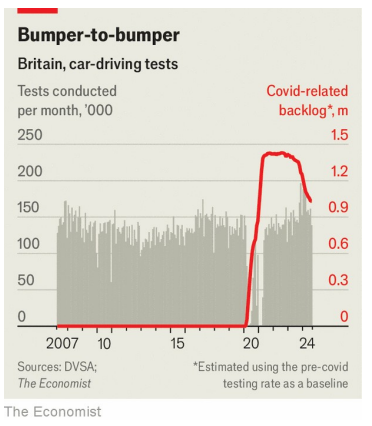

# Finding a driving test in Britain is painful, slow and expensive

Unless the government steps up, it will take nearly five more years to clear the backlog

backlog：积压的工作；未完成的事务

原文：

All sorts of things were disrupted by the covid-19 pandemic: supplies of

toilet roll and sourdough starter ran scarce, flights were left near-empty.

Most industries long ago returned to something like normality. The Driver

and Vehicle Standards Agency (DVSA), which awards driving licences, is still

reeling.

各种各样的事情都被新冠肺炎疫情打乱了:厕纸和发酵粉供应短缺，航班几乎空无一人。大多数行业很久以前就回归了常态。颁发驾驶执照的司机和车辆标准局(DVSA)仍然步履蹒跚。

学习：

toilet roll：卫生纸；厕纸；

sourdough：英 [ˈsaʊədəʊ] 酵母面团；酸面团；

sourdough starter：老面

>老面指任何以非面包酵母菌在面粉为成分的培养基中发酵而成的酵母，亦称老面种、酸面团、或坊间所称“天然酵母”。

return to normality：回到正常

reel: 受到强烈影响

>这里的 **"reel"** 意思是 "受到强烈影响，动摇"。在这个上下文中，**"The Driver and Vehicle Standards Agency (DVSA) is still reeling"** 表示英国的驾驶和车辆标准管理局仍在努力应对疫情带来的冲击，尚未完全恢复正常状态。
>
>例如：
>
>- 英文：The company is still reeling from the financial losses caused by the crisis.
>- 中文：公司仍在努力应对危机造成的财务损失。

原文：

The problem is a huge backlog of driving tests. Learners are waiting over

four months on average for a test to take place; many places in Britain have

it worse (see map). In July all but one test centre in London was booked

solid for the next 24 weeks, which is as far out as tests are available,

according to data obtained by *The Economist* under the Freedom of

Information Act. At current rates, the backlog will take almost five years to

clear.

问题是大量积压的驾驶考试。学习者平均要等四个多月才能参加考试；英国许多地方的情况更糟(见地图)。根据《经济学人》根据《信息自由法案》获得的数据，7月份，除了一个考试中心，伦敦所有的考试中心在接下来的24周内都被预订满了，这是目前为止可以进行的考试。按照目前的速度，积压将需要近五年时间才能清理完毕。

学习：

booked solid: 预定满了

>这里的 **"book solid"** 是指 **"完全预订满了"**，即没有任何空位或时间可以预约。句子中的 **"all but one test centre in London was booked solid for the next 24 weeks"** 意思是伦敦几乎所有的驾照考试中心在接下来的24周内都被预订满了，只有一个中心例外。
>
>例如：
>
>- 英文：The restaurant is booked solid for the weekend.
>- 中文：这家餐厅周末的预订已经满了。

原文：

New driving-test slots become available at 6am on Mondays. Nabbing one

has become like a weekly re-enactment of the rush for tickets for the

upcoming reunion of Oasis, a Mancunian rock band—minus the payoff of

being entertained. A black market has sprung up, reselling tests for hundreds

of pounds. A bevy of apps scrape the DVSA website, hoovering up last-minute

cancellations for their subscribers.

新的驾照考试时间在周一早上6点开始。抢到一场考试就像是曼彻斯特摇滚乐队Oasis即将到来的重聚的门票抢购活动的每周重演——减去娱乐带来的回报。黑市出现了，倒卖考试的价格高达数百英镑。一群应用程序抓取DVSA网站，为他们的用户在最后一刻取消订单。

学习：

slots：时间

>
>
>这里的 **"slot"** 是指 **"时间段"** 或 **"预约时间"**，通常指用于预约某项服务的可用时间。

nab：抓获；夺取；窃取

>
>
>**Re-enactment**：指 **"重现"** 或 **"再现"**，是对过去事件或场景的重新表演或模拟。

>
>
>**"Nabbing one has become like a weekly re-enactment of the rush for tickets for the upcoming reunion of Oasis, a Mancunian rock band—minus the payoff of being entertained"**：这句话的意思是，抢到一个驾考预约时间段已经像每周重演一次抢购Oasis乐队重聚演唱会门票的场景一样——但少了那种最终能得到娱乐的回报。也就是说，抢预约时间非常紧张，但不像抢到演唱会门票后能享受娱乐，抢到的只是考试的机会。

Mancunian：曼彻斯特人

rock band：摇滚乐队；摇滚乐团          

bevy：一群（尤指女性或鸟类）；一大批

scrape：爬虫

hoover up: 迅速占有

>**Hoover up**：这里指 **"大量搜刮"** 或 **"迅速占有"**，来源于吸尘器的动作，形象地表示迅速抓住或占有资源。

原文：

One stymied driver, Eddie Jacobs, told *The Economist* that after failing to

find tests locally, he booked one in Lincoln, a city four hours away from

him. He then spent almost £1,000 ($1,300) on trains, hotels and more

driving lessons but the DVSA cancelled the test two days out. He’s since stopped

trying. That is not just a waste of time and money; it also cuts down

employment options. “There’s a subtle process where not having a car

winnowed away the possibility space of what I considered; I wouldn’t apply

to this job or that job just because I didn’t have a licence,” he says.

一位陷入困境的司机Eddie Jacobs告诉《经济学人》,在当地找不到测试后，他在离他四小时路程的林肯市预定了一个。随后，他花了近1000英镑(1300美元)在火车、酒店和更多驾驶课程上，但DVSA取消了两天后的考试。他从此不再尝试。这不仅仅是浪费时间和金钱；这也减少了就业选择。“这是一个微妙的过程，没有车会让我失去思考的可能性空间；我不会仅仅因为没有执照就申请这份工作或那份工作，”他说。

学习：

stymied：使处于困境的

winnow： 筛选，淘汰；逐渐减少或排除某些选项

>1. **Winnow**：这里的 **"winnow"** 指的是 **"筛选"** 或 **"淘汰"**，用来形象地表示逐渐减少或排除某些选项。它本意是指风选谷物时将杂质吹走，这里比喻为逐步缩小或减少某些可能性。
>
>2. **例子**：
>   - 英文：**After realizing that she didn't have the right qualifications, Sarah winnowed down her job applications to a few positions she was confident about.**  
>   - 中文：**莎拉发现自己不具备所需的资格后，将她的求职申请范围缩小到几个她有信心的职位。**
>
>在Eddie Jacobs的情况下，他没有驾照，所以 **"winnowed away the possibility space"** 意思是他的就业选择被逐渐减少，因为他自动排除了那些需要驾照的工作。

原文：

What’s driving this mess? Before covid, the DVSA pushed through roughly

140,000 tests per month. That flow slowed to a trickle during lockdown. But

demand for tests kept building, resulting in a backlog that reached 1.4m tests

in 2021 and 2022, *The Economist* estimates (see chart). Today, the DVSA is still

a million tests behind. That translates to 500,000 or so qualified drivers (the

pass rate is just under half).

是什么造成了这种混乱？在冠状病毒肺炎之前，DVSA每月进行大约140，000次测试。在封锁期间，水流减缓为涓涓细流。但是对考试的需求持续增长，导致积压的考试在2021年和2022年达到140万，据《经济学人》估计(见图表)。今天，DVSA仍然落后一百万次测试。这相当于50万左右的合格司机(通过率不到一半)。

学习：

trickle：细流；涓涓细流；缓缓流动

原文：

The DVSA has variously blamed the delays on strikes, economic growth, test

reselling bots and learners booking their exams before they are ready. But

the crux of the matter is simple: the supply of tests hasn’t kept up with pent-

up demand. And the principal reason for that is too few test examiners. The

DVSA has struggled to ramp up its hiring sufficiently. Pay is £28,000 per year,

appreciably less than what driving instructors—who have very similar

qualifications but work in the private sector—can make in many parts of

Britain. Rigid civil-service pay scales mean that pressing need hasn’t

translated into materially higher salaries for examiners.

DVSA将考试延迟归咎于罢工、经济增长、考试被贩卖和学生在准备好之前预订考试。但问题的关键很简单:考试的供应跟不上被压抑的需求。最主要的原因是考官太少了。DVSA一直在努力充分增加招聘人数。年薪为2.8万英镑，明显低于英国许多地方的驾驶教练——他们拥有非常相似的资格，但在私营部门工作——的收入。僵化的公务员工资等级意味着迫切的需求并没有转化为考官实质上更高的工资。

学习：

crux：症结；难题；关键

pent-up：被压抑的；被抑制的；积聚的；

ramp up：增加；提高；加强

原文：

The DVSA did run a six-month surge of tests, where all its qualified employees

(including many in administrative or policy jobs) stopped regular work to

run exams full-time. That effort ended in March, however, and only made a

small dent. High-tech reforms that have helped elsewhere—the passport

office used digitisation to resolve its post-pandemic crush—aren’t much use

here: Britain simply needs to hold more driving tests. One solution would be

to pay driving instructors to run tests part-time until the backlog is cleared.

DVSA确实进行了为期六个月的激增测试，所有合格的员工(包括许多行政或政策工作人员)都停止了日常工作，全职运营考试。然而，这一努力在三月份结束了，并且只取得了一点小小的进展。高科技改革在其他地方有所帮助——护照办公室使用数字化解决了大流行后的拥挤——在这里没有多大用处:英国只需要举行更多的驾驶考试。一个解决办法是付钱给驾驶教练，让他们兼职进行测试，直到积压的测试被清理掉。

学习：

dent：进步

make a small dent：取得很小的进步

原文：

The fact that the problem has lumbered on for years is damning in itself.

Four different Conservative ministers held the road-safety brief after the

backlog emerged; none managed to solve it. Louise Haigh, the transport

secretary, now says driving tests are a “top priority” but hasn’t yet

announced plans to tackle the issue. The new Labour government says it is

serious about reforming public services and unblocking growth. The size of

the driving-test backlog will be one way to measure how it is doing. ■

这个问题已经拖延了多年，这一事实本身就很糟糕。积压出现后，四位不同的保守党部长召开了道路安全简报会；没有人设法解决它。英国交通大臣路易丝黑格(Louise Haigh)现在表示，驾驶考试是“重中之重”，但尚未宣布解决这一问题的计划。新的工党政府表示，它对改革公共服务和疏通增长是认真的。路考积压的规模将是衡量其表现的一种方式。■

学习：

lumber：笨重地行进；缓慢地移动

## 后记

2024年9月18日15点46分于上海。

