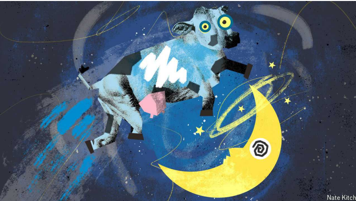

# Loons and the Tory leadership battle in Britain

Who will speak for the Great British loon?

原文：

The phrase “swivel-eyed loon” holds a special place in British politics. First

uttered by an ally of David Cameron in 2013 to dismiss Conservative Party

members unhappy with the unsound direction of his government, it swiftly

entered Westminster’s vernacular. What started out as an insult soon became

a badge of honour. “I am a lifelong Tory, and would be happy to wear a

badge ‘Proud to be a Swivel-eyed Loon’,” wrote one correspondent to the

*Telegraph*. A compendium of such letters was titled appropriately: “The

lunatics have taken over the asylum.”

“旋转眼的疯子”这个短语在英国政治中占有特殊的地位。2013年，大卫·卡梅伦(David Cameron)的一位盟友首次发表言论，驳斥对其政府错误方向不满的保守党成员，该言论迅速进入了威斯敏斯特的日常用语。起初是一种侮辱的东西很快变成了荣誉的象征。“我是一个终生的保守党人，并且很乐意戴上‘以身为一个旋转眼的笨蛋为荣’的徽章，”一名记者向《每日电讯报》写道。这类信件的概要被恰如其分地命名为:“疯子们接管了精神病院。”

学习：

swivel：美 [ˈswɪvəl] 转动；旋转

loon：潜水鸟（北美食鱼大鸟，叫声似笑）；怪人；愚人；笨蛋

swivel-eyed loon:  "目光呆滞的疯子”或“神经兮兮的疯子”

>“Swivel-eyed loon” 是一个在英国政治语境中特别的表达，最初是用来侮辱那些对政府方向不满的保守党成员。这个词在2013年由当时首相大卫·卡梅伦的盟友首次使用。起初它是一种带有贬义的侮辱，但随着时间的推移，这个词被一些人当作荣誉的象征。比如有保守党支持者写信说他们乐意佩戴写有“Proud to be a Swivel-eyed Loon”（自豪的“目光呆滞的疯子”）的徽章。
>
>在中文中，“swivel-eyed loon” 可以翻译为“目光呆滞的疯子”或“神经兮兮的疯子”。这个词形象地表达了人们对于一些被认为过于极端、固执己见的人的蔑视。
>
>例子：
>
>1. **English**: After hearing his radical opinions, people started calling him a swivel-eyed loon, but he wore the label with pride.
>2. **中文**：听到他激进的观点后，人们开始叫他“目光呆滞的疯子”，但他却骄傲地接受了这个称呼。
>
>3. **English**: She dismissed the opposition as nothing more than a group of swivel-eyed loons who refused to accept change.
>4. **中文**：她把反对派斥为一群拒绝接受改变的“神经兮兮的疯子”。

vernacular：美 [vərˈnækjələr] 日常用语

insult：侮辱；辱骂

badge：徽章；证章

compendium：美 [kəmˈpendiəm] 概要；提要

lunatics：疯子；狂人；（lunatic的复数）

asylum：美 [əˈsaɪləm] 收容所；精神病院

原文：

The loon remains a powerful beast on the right wing of British politics. The

Conservative Party’s members will choose the next Tory leader and

potentially Britain’s next prime minister. All the 121 Conservative MP

s can do is give them a choice of two candidates. To appeal to this unusual electorate,

candidates must still show off how right-wing they are (options include

“quite” and “very”). They must also prove themselves to be ever so slightly

mad.

loon仍然是英国政坛右翼的强大野兽。保守党成员将选择下一任保守党领袖和潜在的英国下一任首相。121名保守党议员所能做的就是给他们两个候选人的选择。为了吸引这些不同寻常的选民，候选人仍然必须炫耀他们有多右翼(选项包括“相当”和“非常”)。他们还必须证明自己有那么一点点疯狂。

原文：

Every Tory candidate places themselves on a spectrum that runs from

“sensible” to “loon”. To truly understand what it is to be a loon, consider

Boris Johnson and Theresa May. Each promised a government dedicated to

leaving the European Union, alongside big-state Conservatism and

rebalancing the country’s economy. The difference was style. Mrs May

approached governance with the diligence of a vicar’s daughter; Mr Johnson

approached it with the fervour of a feral loon, proroguing Parliament,

sacking MPs and lying through his teeth.

每个保守党候选人都把自己放在一个从“明智”到“愚蠢”的范围内。要真正理解什么是疯子，想想鲍里斯·约翰逊(Boris Johnson)和特里萨·梅(Theresa May)。两人都承诺组建一个致力于脱离欧盟的政府，以及大国保守主义和重新平衡国家经济的政府。不同之处在于风格。梅夫人以牧师女儿的勤奋从事管理工作；约翰逊先生像一只野生的疯子一样狂热地对待它，中止议会，解雇议员，撒谎。

学习：

vicar：美 [ˈvɪkər] 教区牧师；教堂牧师

feral：野生的；凶猛的；

proroguing：美 [proʊ'roʊg] 休会；（prorogue的现在分词）

sack：解雇

原文：

This “loon axis”, as it has been dubbed by gonzo political scientists online,

is the best way to understand the Tory leadership contest. In policy terms

there is not much between them; the real battle is to speak for the loon.

gonzo政治学家在网上称之为“疯子轴心”,这是理解保守党领袖竞争的最佳方式。从政策上来说，他们之间没有太大的区别；真正的战斗是为疯子说话。

学习：

dub：给…起绰号；把…戏称为；授予称号；

原文：

Kemi Badenoch has styled herself as the defender of the loons. Not

coincidentally, she is comfortably the most popular candidate among party

members. Her rivals have produced campaign videos with typical tropes,

giving speeches in the windswept countryside. Ms Badenoch kicked hers off

by continuing a fight over LGBT rights with David Tennant, an actor best

known for playing Doctor Who, a time-travelling alien. “You need someone

like me who’s not afraid of Doctor Who, or whoever, and who’s going to

take the fight to them,” she exhorted. You need, in short, a loon.

凯米·巴登诺奇自称为loon的捍卫者。并非巧合的是，她是党员中最受欢迎的候选人。她的对手制作了带有典型比喻的竞选视频，在狂风肆虐的乡村发表演讲。Badenoch女士开始了她与大卫·田纳特的关于LGBT权利的斗争，这位演员因扮演神秘博士，一位时间旅行的外星人而闻名。“你需要一个像我这样的人，他不害怕神秘博士，或者任何人，也不害怕任何人去和他们战斗，”她鼓励道。简而言之，你需要一个疯子。

学习：

trope：隐喻；典型

windswept：风吹雨打的；荒凉的；

exhort：美 [ɪɡˈzɔːrt]  忠告；告诫

原文：

Even the wettest candidates must have some loon appeal. Tom Tugendhat, a

former security minister, has a reputation for being unsound on that most

vital matter within loon circles: Europe. Maybe it is the French passport.

Maybe it is having an uncle, Lord Tugendhat, who was an EU commissioner.

Whatever the reason, Mr Tugendhat entered the contest with a pledge that, if

needs be, he was happy to leave the European Convention on Human Rights

(ECHR), a totemic loon goal. Cracking down on small boats bringing migrants

across the English Channel is possible within the convention. But this is

politics, not reality. A pledge to leave the ECHR is less a policy than a loon-ish

affectation.

即使是最懦弱的候选人也一定有一些疯狂的吸引力。前安全部长Tom Tugendhat在最重要的问题上有着不健全的名声:欧洲。也许是法国护照。也许是因为有一个叔叔，曾担任欧盟专员的图根达勋爵。不管是什么原因，Tugendhat先生在参加竞选时承诺，如果有必要，他很乐意离开欧洲人权公约(ECHR)，这是一个象征性的目标。在该公约范围内，取缔运送移民穿越英吉利海峡的小船是可能的。但这是政治，不是现实。承诺离开ECHR与其说是一项政策，不如说是一种疯狂的做作。

学习：

wettest：懦弱的；（wet的最高级）          

totemic：美 [toʊ'temɪk] 图腾的

crack down on：打击

affectation：美 [ˌæfɛkˈteɪʃ(ə)n] 假装；虚饰；装模作样	

原文：

Others have to travel in the opposite direction. Being too much of a loon can

put off even the looniest, particularly in the first rounds when more moderate

MPs are the selectorate. In a rare moment of good judgment, Suella

Braverman, a former home secretary, dropped out in August because her

party thought she was, in her own words, “mad, bad and dangerous”. Priti

Patel, another former home secretary, came last in the first round of MP

voting. Perhaps colleagues remembered the time she was sacked from

cabinet for flying to Israel to conduct her own outré foreign policy.

其他人不得不向相反的方向行进。太过疯狂甚至会让最疯狂的人望而却步，尤其是在第一轮选举中，更温和的议员会当选。前内政大臣苏埃拉·布雷弗曼(Suella Braverman)罕见地做出了正确的判断，她在8月份退出了，因为她所在的政党认为她“疯狂、恶劣、危险”。另一位前内政大臣普里蒂·帕特尔在第一轮议员投票中排名最后。也许同事们还记得那次她因飞往以色列执行自己的激进外交政策而被内阁解雇。

学习：

home secretary：内政大臣

outre：美 [uˈtreɪ] 离奇的；古怪的；

原文：

James Cleverly, a former home secretary and foreign secretary, has

positioned himself as a unifier. He has little truck with schemes to drag

Britain out of the ECHR, arguing it was the country’s own courts that put paid to

Tory government plans to deport asylum-seekers to Rwanda. But Mr

Cleverly can afford to appeal to moderate elements in the party since his

loon credentials are not in doubt. Mr Cleverly was a Brexiteer and Mr

Johnson’s most loyal foot-soldier, before falling in behind Liz Truss. He

may have the likeable manner of a soldier-cum-politician, but he has the

heart and stomach of a loon.

前内政大臣和外交大臣詹姆斯·克莱弗利将自己定位为一个统一者。他很少参与将英国拖出ECHR的计划，认为是英国自己的法院终结了保守党政府将寻求庇护者驱逐到卢旺达的计划。但是Cleverly先生有能力吸引党内的温和派，因为他的疯子身份是毋庸置疑的。在与利兹·特拉斯(Liz Truss)分道扬镳之前，克莱弗利曾是英国退欧主义者，也是约翰逊最忠实的追随者。他可能有一个军人兼政治家的讨人喜欢的举止，但是他有一颗疯子的心和胃。

学习：

put paid to：终止；结束；使结束；

原文：

Robert Jenrick, the front-runner along with Ms Badenoch, has styled himself

as a serious figure of the right. In his telling, it is possible to be bracingly

right-wing without the excesses of loondom, such as picking fights with

actors. It is not that Mr Jenrick disagrees with Ms Badenoch when it comes

to battling Doctor Who; he simply thinks that voters have different concerns.

Instead Mr Jenrick implores people to “be serious”, before arguing that the

Rwanda scheme did not go far enough.

罗伯特·詹瑞克，与巴登诺齐女士一起领先，将自己标榜为一个严肃的右翼人物。在他的讲述中，有可能成为令人振奋的右翼分子，而没有疯狂的过度行为，例如与演员打架。在对抗神秘博士的问题上，詹瑞克先生并不同意巴德诺奇女士的观点；他只是认为选民有不同的关注点。取而代之的是，詹瑞克先生恳求人们“严肃一点”，然后指出卢旺达的计划做得还不够。

## **Fly me to the loon**

原文：

Even moderate elements of the Tory party are in hock to loon-thought. An

accelerationist strategy has emerged among some of the party’s remaining

wets: vote for the most bonkers candidate on the logic that since all parties

go through a mid-life crisis after a heavy defeat, better to get it over and

done with quickly. If Labour had turned sooner to Jeremy Corbyn, a leftie

leader who in 2019 took the party to its worst result since 1935, it might

have spent less time in the electoral bin. So vote loon!

甚至保守党中的温和派也陷入了疯狂的思考。在该党剩余的温和派中出现了一种加速主义策略:投票给最疯狂的候选人，其逻辑是，既然所有政党在一次严重失败后都会经历中年危机，最好尽快结束。如果工党早点转向杰里米·科尔宾，这位左翼领导人在2019年将该党带到了自1935年以来最糟糕的结果，它可能会在选举中花更少的时间。所以投票给loon吧！

学习：

bonkers：疯狂的；极其愚蠢的；

 mid-life：中年          

原文：

Catering to loons will only delay the party’s return to power. Being a loon is

more suited to office than opposition. In power, weird ideas can become a

reality. Rwanda was treated as if it were a policy option rather than a wacky

scheme; leaving the EU went from crank opinion on the *Telegraph* letters page

to government mission. In opposition, bizarre schemes just make you look

bizarre. Why is each candidate wanging on about European human-rights

law and fighting Doctor Who when the Tories lost the election because

public services stopped working? In power, the loon can prevail. In

opposition, the loon is nothing but a hindrance. ■

迎合loons只会推迟该党重新掌权。作为一个loon，更适合做政府官员，而不是反对派。在权力中，怪异的想法可以变成现实。卢旺达被视为一个政策选择，而不是一个古怪的计划；离开欧盟从《每日电讯报》上的古怪观点变成了政府使命。相反，奇怪的计划只会让你看起来很奇怪。当保守党因为公共服务停止运作而输掉选举时，为什么每个候选人都在喋喋不休地谈论欧洲人权法和与神秘博士斗争？在权力上，loon可以占上风。相反，loon只是一个障碍。■

学习：

wacky：古怪的；滑稽的；荒唐的

crank：易于倾覆的；不稳定的；不牢固的；

hindrance： 美 [ˈhɪndrəns] 妨碍；妨害；阻挠；干扰；

## 后记

2024年9月19日09点53分于上海。

