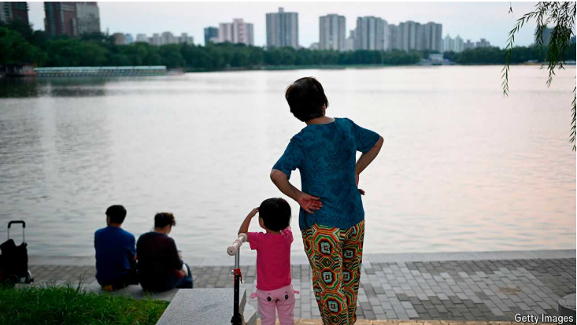

# By raising the retirement age, has China created a care crisis?

Older women tend to look after the country’s young children

原文：

CHINA’S PENSIONS are underfunded and its population is getting older.

So the government’s recent decision to raise the retirement age for state

pensions seemed overdue. But it may create other problems, most notably in

the field of child care. And these challenges may lead young people to have

fewer babies, exacerbating the country’s demographic crisis.

中国养老金资金不足，人口老龄化。因此，政府最近决定提高国家养老金的退休年龄似乎是姗姗来迟。但这可能会产生其他问题，尤其是在儿童保育领域。这些挑战可能会导致年轻人少生孩子，加剧该国的人口危机。

原文：

According to state media, under 8% of Chinese toddlers are enrolled in

nurseries. Most families rely on grandparents to care for them. That is true in

cities, where nearly 80% of households are thought to do so. And it is also

the case in rural areas. Parents from the countryside often work far from

home, leaving their children behind. Walk around some villages and all you

will see are the elderly and the young.

据官方媒体报道，只有不到8%的中国幼儿在托儿所注册。大多数家庭依靠祖父母照顾他们。这在城市中是真实的，那里近80%的家庭被认为是这样。而且在农村也是如此。来自农村的父母经常在离家很远的地方工作，把他们的孩子留在家里。在一些村庄走一走，你会看到老人和年轻人。

学习：

toddler：美 [ˈtɑːdlər]  刚学走路的小孩；蹒跚学步的孩子

nursery：美 [ˈnɜːrsəri]  托儿所；育儿室；

原文：

So raising the retirement age risks creating a child-care deficit, which may

affect the decisions of young women. China’s fertility rate, or the number of

children that each woman is expected to have, is 1.1. That is among the

lowest in the world and well below the 2.1 needed to keep the population

stable. In a study published last year, Jing Zhang of Erasmus University in

Rotterdam found that women who lean on grannies for care are four times

more likely to have a second child than women who do not.

因此，提高退休年龄有造成儿童保健赤字的风险，这可能会影响年轻女性的决定。中国的生育率是1.1，即每个妇女预期生育的孩子数量。这是世界上最低的，远低于保持人口稳定所需的2.1。鹿特丹伊拉兹马斯大学的张箐在去年发表的一项研究中发现，依靠奶奶照顾的女性生二胎的可能性是不依靠奶奶的女性的四倍。

学习：

fertility：美 [fərˈtɪləti] 肥沃；繁殖力

fertility rate：生育率；出生率；人口出生率

grannies：奶奶；外婆；（granny的复数）

原文：

Many women face a choice between starting a family or continuing their

careers. Chinese women are increasingly choosing the latter. But the

availability of grandparent-provided child care might mean that women need

not choose. Research published in 2019 showed that access to such care

increased the labour-force participation of mothers with young children in

cities by around 40%.

许多女性面临着成家立业和继续职业生涯之间的选择。中国女性越来越多地选择后者。但是祖父母提供的托儿服务可能意味着女性不需要选择。2019年发表的研究表明，获得这种护理将城市中有年幼子女的母亲的劳动力参与率提高了约40%。

原文：

Another area likely to be affected by the higher retirement age is care of the

elderly. It is common for Chinese women in their 50s to look after the old as

well as the young. On social media some commenters wonder how society

will cope with all this change. He Lin-shan, a popular poster on Douyin,

China’s version of TikTok, asked: “If women can’t retire, will the policy

experts take care of their families for them?”■

另一个可能受到更高退休年龄影响的领域是对老年人的照顾。对于50多岁的中国妇女来说，既照顾老人又照顾年轻人是很常见的。在社交媒体上，一些评论者想知道社会将如何应对所有这些变化。中国版的抖音上的一张人气海报He Lin-shan问道:“如果女性不能退休，政策专家会为她们照顾家庭吗？”■

## 后记

2024年9月25日10点37分于上海。

