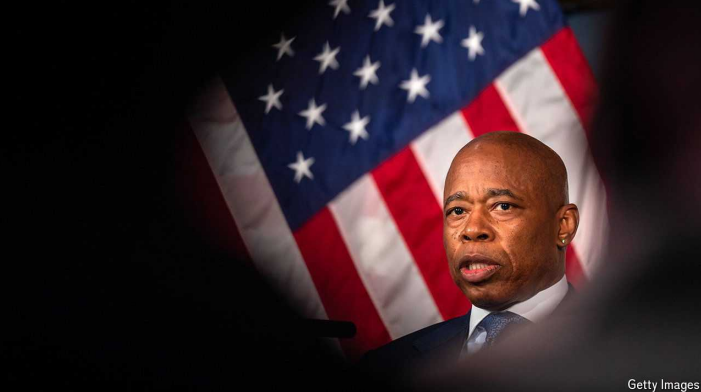

# Eric Adams, New York’s mayor, is indicted

indicted：美 [inˈdaitid] 起诉；指控；（indict的过去式和过去分词）          **注意发音**

New Yorkers are sadly familiar with scandal at City Hall

原文：

WHEN ERIC ADAMS, New York City’s mayor, was 15 he was arrested and

beaten by a police officer. He went on to become a police officer himself,

rising to captain before entering politics. He used that powerful anecdote

from his youth to launch his mayoral campaign in 2020. His story resonated

with New Yorkers. Nearly four years later, the mayor’s time at City Hall

looks precarious. On September 25th the *New York Times* revealed that Mr

Adams faces federal criminal charges in an indictment and he may be

arrested again.

纽约市长埃里克·亚当斯15岁时被一名警察逮捕并殴打。他自己后来成为了一名警察，在进入政界之前升到了队长。他利用自己年轻时的那段有力轶事，发起了2020年的市长竞选。他的故事引起了纽约人的共鸣。将近四年后，市长在市政厅的日子看起来岌岌可危。9月25日《纽约时报》披露，亚当斯先生面临联邦刑事指控，他可能会再次被捕。

学习：

City Hall：市政厅

precarious：美 [prɪˈkeriəs] 不稳定的；不牢固的；摇摇欲坠的；不稳的；危险的

原文：

It seems likely that the (still sealed) indictment will entail charges related to

the many investigations that have been swirling around City Hall and Mr

Adams’s inner circle. Many of his closest advisers, among them two deputy

mayors, have had their mobile phones seized by federal investigators. Some

had their homes raided. Mr Adams’s own phone was seized in November.

His police and health commissioners, schools chancellor and legal adviser

have all stepped down in recent days.

这份(仍未公开的)起诉书很可能会包含与围绕市政厅和亚当斯先生核心圈子的许多调查相关的指控。他的许多最亲密的顾问，其中包括两位副市长，他们的手机被联邦调查人员没收了。一些人的家遭到了搜查。亚当斯先生自己的手机在11月被没收。他的警察和卫生专员、学校校长和法律顾问都在最近几天辞职。

学习：

inner circle：核心圈子；核心集团；

raided：突击搜捕；突然搜查；（raid的过去式和过去分词）          

原文：

Some speculate that Mr Adams could be charged with acting as an

unregistered foreign agent after receiving donations from foreign sources,

maybe including Turkey. The FBI is also said to be looking into whether Mr

Adams pressed the fire department to fast-track the opening of the new

Turkish consulate, despite some unresolved safety issues. Mr Adams said

any charges made against him are “entirely false” and “based on lies”,

insisting he was being targeted because he had “stood my ground” for New

Yorkers.

一些人推测，亚当斯先生可能被指控在接受外国来源的捐款后充当未注册的外国代理人，这些外国来源可能包括土耳其。据说，美国联邦调查局还在调查亚当斯是否向消防部门施压，要求加快新土耳其领事馆的开放，尽管还有一些未解决的安全问题。亚当斯表示，对他的任何指控都是“完全错误的”和“基于谎言的”，坚称他之所以成为目标，是因为他为纽约人“坚持了我的立场”。

学习：

fast-track：快速通道；快车道；

consulate：领事馆

原文：

Many politicians, including Alexandria Ocasio-Cortez, a congresswoman

representing the Bronx, and some rivals in next year’s mayoral race, have

called on him to resign. “This is a sad day for New Yorkers,” said Brad

Lander, the city comptroller who wants to be mayor. “Trust in public

institutions—especially City Hall—is essential.”

许多政客，包括代表布朗克斯区的女议员亚历山大·奥卡西奥·科尔特斯，以及明年市长竞选的一些竞争对手，都呼吁他辞职。“对纽约人来说，这是悲伤的一天，”想要成为市长的市审计长布拉德·兰德说。"信任公共机构——尤其是市政厅——至关重要."

学习：

comptroller：审计官（主要用于官员的头衔中）          

原文：

Mr Adams may not have much choice. It is within the power of New York’s

governor, Kathy Hochul, to remove him from office. Ms Hochul may worry

about his ability to do the job under such a dark cloud. She also may feel

pressure to act from Kamala Harris, the Democratic presidential nominee, if

the scandal becomes distracting. Ms Hochul drew the wrath of Democratic

leaders when Democrats lost crucial seats in New York in the 2022 midterm

elections. New York’s governors have used this removal power sparingly

and never directed it at a mayor of New York City. Franklin Roosevelt came

close in 1932. He began the process to remove Jimmy Walker, who was

embroiled in a bribery scandal. Walker resigned before he was ejected.

亚当斯先生可能没有太多选择。纽约州州长凯西·霍楚尔有权解除他的职务。Hochul女士可能会担心他在这种乌云笼罩下的工作能力。如果丑闻变得令人分心，她可能还会感受到来自民主党总统候选人卡玛拉·哈里斯的压力，要求她采取行动。当民主党在2022年中期选举中失去纽约的关键席位时，霍楚尔引起了民主党领导人的愤怒。纽约州州长们谨慎地使用了这一免职权力，从未将它指向纽约市市长。富兰克林·罗斯福在1932年差点指向纽约市长。他启动了罢免卷入贿赂丑闻的吉米·沃克的程序。沃克在被驱逐之前辞职了。

学习:

wrath：美 [ræθ] 愤怒；激怒；狂怒；暴怒

embroiled：搅乱；牵连；卷入；（embroil的过去式和过去分词）

原文：

If Mr Adams is removed—or resigns—Jumaane Williams, the city’s public

advocate, an elected watchdog, becomes mayor automatically. He could then

set a date for a special election.

如果亚当斯先生被免职或者辞职，该市的公共辩护律师朱玛恩·威廉姆斯，一个被选举出来的监督人，将自动成为市长。然后他可以确定一个特殊选举的日期。

原文：

The scandal is sadly familiar for New Yorkers. It took decades to throw off

the lingering power of Tammany Hall, once the Democratic Party’s corrupt

machine in the city. As well as Walker, Bill O’Dwyer, a former cop, resigned

as mayor in 1950 amid police-corruption allegations. More recently state

lawmakers, including an Assembly speaker and a state-senate president,

have spent time in prison for corruption. Prosecutors looked at whether Bill

de Blasio’s campaign tried to dodge contribution limits. Rudy Giuliani, then

a tenacious federal prosecutor, who would later become mayor himself,

investigated Ed Koch’s allies for corruption in the 1980s. Though Koch was

not suspected of wrongdoing himself, his reputation took a hit.

纽约人对这一丑闻非常熟悉。花了几十年时间才摆脱坦慕尼大厅挥之不去的权力，它曾是民主党在该市的腐败机器。和沃克一样，前警察比尔·奥德怀尔也因警察腐败指控于1950年辞去市长职务。最近，包括一名议会发言人和州参议院主席在内的州议员因腐败入狱。检察官调查比尔·白思豪的竞选团队是否试图规避捐款限额。鲁迪·朱利安尼，当时一位顽强的联邦检察官，后来成为市长，在20世纪80年代调查了埃德·科赫的盟友的腐败。尽管科赫本人并未被怀疑有不当行为，但他的声誉却受到了打击。

学习：

dodge：躲避；闪躲；避开

原文：

Talking to a local news channel on September 25th, Mr Adams said that

government meant “constant change”. Change may be coming his way soon.■

9月25日，亚当斯先生在接受当地新闻频道采访时说，政府意味着“不断的变化”。他可能很快就会迎来变革。■

## 后记

2024年9月29日18点31分于上海。

