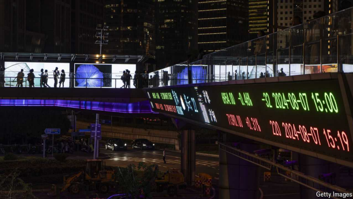

# Don’t celebrate China’s stimulus just yet

It will take more than a spectacular stockmarket rally to revive the economy

原文：

China’s policymakers have blinked at last. For 18 months, even as deflation

set in and economic sentiment curdled, stimulus was half-hearted and

piecemeal. Then last week came a belated turnaround. Officials unleashed a

range of easing measures, suggesting that their pain threshold had been

reached.

中国的政策制定者终于眨了眨眼。18个月来，即使通货紧缩开始，经济情绪开始变坏，刺激措施也是半心半意和零敲碎打的。接着，上周出现了迟来的转机。官员们推出了一系列宽松措施，表明他们的痛苦阈值已经达到。

学习：

blink: 退让，让步

>在这里，**"blink"** 指的是中国决策者终于让步或退缩了。它暗示在持续的经济压力下，决策者最终不得不采取行动，做出调整或妥协。通常，这个词用来形容在对抗中某一方率先退步。
>
>**例子**：
>
>- **English**: After weeks of negotiations, the company finally blinked and agreed to lower its prices.
>- **中文**：经过几周的谈判，公司终于让步，同意降低价格。

curdle：使凝固；变稠；（使）结块；（使）凝乳；使心惊胆战；

>**"Curdle"** 通常指液体（如牛奶）凝结，但在这里是一个比喻性用法，指经济情绪“变坏”或“恶化”。“Economic sentiment curdled” 意味着经济环境变得消极或不利。
>
>**例子**：
>
>- **English**: As the political crisis deepened, public optimism began to curdle into frustration.
>- **中文**：随着政治危机加深，公众的乐观情绪逐渐转变为沮丧。

half-hearted：半心半意的；不热心的；敷衍的；

piecemeal：分步进行的；逐步的；逐渐的；不连贯的；不系统的；零散的；零碎的；

belated：迟到的；晚出现的；姗姗来迟的；

turnaround：起色；好转；反转；转机

原文：

Stockmarkets are rejoicing. As Hong Kong’s market reopened on October

2nd after a public holiday, shares rose by more than 6%, capping a rally of

over 20% in a mere six frenetic trading days. But China will need even more

stimulus to escape from its deflationary trap.

股票市场一片欢腾。10月2日，香港股市在公众假期后重新开盘，股价上涨超过6%，在短短六个交易日内涨幅超过20%。但中国将需要更多刺激来摆脱通缩陷阱。

学习：

rejoicing：欣喜；欢庆；庆祝；高兴；（rejoice的现在分词形式）

public holiday：公共假日；公休日；法定假日；公众假期          

rally：回升（指股市或价格）

frenetic：狂热的；狂乱的；疯狂的；

capping：为xxx画上句号，达到

>这里的 **"cap"** 是动词，意思是“为……画上句号”或“达到……的顶峰”。在这个语境中，**"capping"** 表示香港股市在经历了快速上涨之后，达到了20%以上的涨幅，这6天的疯狂交易达到了高潮。
>
>例子：
>
>- **English**: The athlete's incredible performance capped off a season full of victories.
>- **中文**：这位运动员的精彩表现为充满胜利的赛季画上了完美的句号。

原文：

The mood shift began with the central bank. On September 24th, a week

after America’s Federal Reserve had eased policy and given it more room

for manoeuvre, the People’s Bank of China cut interest rates, eased reserve

requirements for banks and reduced the cost of existing mortgages. It also

introduced new tools to stoke the stockmarket. Two days later, China’s

Communist Party promised to arrest the decline in the property market and

to fight the economic slowdown more forcefully. Media reports suggest the

central government may soon borrow an extra 2trn yuan ($285bn) or

roughly 1.5% of GDP. Half will help local authorities deal with their debts; the

other half will help consumers, including direct handouts to families with

more than one child.

情绪的转变始于央行。9月24日，在美国美联储放松政策并给予其更多操作空间一周后，中国人民银行降低了利率，放松了对银行的准备金要求，并降低了现有抵押贷款的成本。它还引入了新的工具来刺激股票市场。两天后，中国共产党承诺遏制房地产市场的下滑，并更有力地抗击经济放缓。媒体报道称，中央政府可能很快会再借2万亿元人民币(2850亿美元)，相当于GDP的1.5%。一半将帮助地方政府处理债务；另一半将帮助消费者，包括对有一个以上孩子的家庭的直接补助。

学习：

manoeuvre：操作

stoke：激起；激发；增强；使兴奋

arrest：阻止；抑制；中止；

arrest the decline：遏制下滑

handouts：补助

原文：

The measures represent a long overdue change in the style and urgency of

China’s policymaking. For months it seemed that the government was scared

of doing too much, rather than too little, to help the economy. Xi Jinping,

China’s ruler, had disdained generous handouts to households, which he

feared would undermine their self-reliance. National leaders had failed to get

a grip on the country’s property slump, leaving it to individual cities to

cobble together responses without enough help from Beijing. Local

governments were so strapped for cash that they worsened the slowdown by

cutting spending and harassing firms for fees and back taxes.

这些措施代表了中国决策风格和紧迫性的一种期待已久的变化。几个月来，政府似乎害怕做得太多，而不是太少，来帮助经济。中国的统治者，不屑于向家庭慷慨施舍，他担心这会削弱他们的自力更生。国家领导人未能控制该国的房地产暴跌，让各个城市在没有北京足够帮助的情况下胡乱拼凑应对措施。地方政府资金如此匮乏，以至于他们通过削减支出和骚扰企业收取费用和补税来加剧经济放缓。

学习：

overdue：逾期的；过期的；未按时支付的；

disdained：不屑于做；鄙弃；（disdain的过去式和过去分词）

self-reliance：自力更生；自立；自主；自给自足

get a grip on：掌握；控制；理解；抓住；

cobble：匆忙拼凑；粗制滥造；

原文：

Compared with past stimulus efforts, the latest measures have been better

communicated and co-ordinated, and more targeted at consumers. But after

their sluggishness, officials will face an uphill task of reviving sentiment and

spending. Even if all the reported fiscal measures are confirmed, they lack

the necessary scale. To revive growth and inflation, many economists think

China needs a stimulus of 7trn-10trn yuan, which would amount to 2.5-4%

of GDP if spread over two years.

与以往的刺激措施相比，最新措施得到了更好的沟通和协调，并且更有针对性地针对消费者。但是在他们的迟钝之后，官员们将面临一个艰难的任务来恢复信心和消费。即使所有报道的财政措施都得到证实，它们也缺乏必要的规模。为了恢复增长和通货膨胀，许多经济学家认为中国需要7-10万亿元的刺激，如果在两年内分散，这将相当于GDP的2.5-4%。

学习：

sluggishness：惰性；低灵敏度；惯性；不振；萧条；呆滞          

uphill task：费力的工作；艰难的工作          

原文：

Officials must also say how they will stop the property slump. That may

require the central government to guarantee the delivery of pre-sold but

unfinished properties. It also needs to tackle the silent forests of flats that

stand finished but unsold. Beijing wants state-owned firms to buy them and

convert them into affordable homes. But it has not put enough money where

its mouth is.

官员们还必须说明他们将如何阻止房地产暴跌。这可能需要中央政府保证交付预售但未完工的房产。它还需要解决那些已经完工但尚未售出的无声的公寓。北京希望国有企业购买这些房屋，并将其改造成经济适用房。但是它没有拿出足够的钱来兑现它的承诺。

原文：

With a big enough stimulus, China’s economy would have a shot at escaping

from its deflationary doldrums. In time, consumers might feel confident

enough to spend, and companies to invest. China’s stimulus would also be

felt around the world—but differently from in the past.

有了足够大的刺激计划，中国经济将有机会摆脱通货紧缩的低迷。假以时日，消费者可能会有足够的信心进行消费，企业也会有足够的信心进行投资。世界各地也会感受到中国的刺激——但与过去不同。

学习：

doldrums：美 [ˈdoʊldrəmz] 萧条；停滞；忧郁；低迷

原文：

During the global financial crisis China helped revive the world economy, as

the government unleashed a huge, infrastructure-heavy stimulus that stoked

roaring demand for imported commodities. If a new package is targeted

towards consumers, it will not fire up commodity markets as much. Instead,

if Chinese households bought more cars and other manufactured goods,

fewer of them would wash up in overseas markets that are fearful of Chinese

competition. Stimulus would not just lift the spirits of shoppers at home. It

might hearten China’s economic rivals abroad, too. ■

在全球金融危机期间，中国帮助世界经济复苏，因为政府推出了庞大的、以基础设施为重点的刺激计划，刺激了对进口大宗商品的需求。如果一个新的一揽子计划是针对消费者的，它不会像以前那样刺激商品市场。相反，如果中国家庭购买更多的汽车和其他制成品，那么很少有人会去担心中国竞争的海外市场。刺激计划不仅会提振国内消费者的情绪。这也可能鼓舞中国在海外的经济对手。■

学习：

fire up：点燃；点火；发动

fire up commodity markets：刺激商品市场

## 后记

2024年10月4日19点33分于上海。

