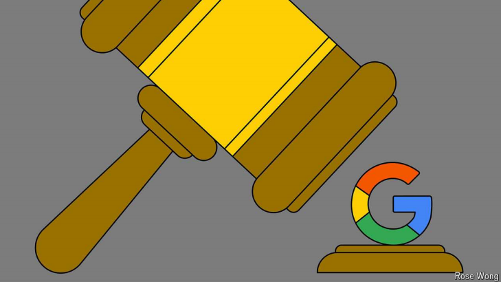

# Dismantling Google is a terrible idea

Despite its appeal as a political rallying cry

dismantling: （枪支）分解；解散；拆除；（dismantle的现在分词）          

appeal：吸引力

rallying cry: 战斗口号；团结口号；集会口号          

>这里的 **"appeal"** 指的是某种事物的吸引力或感染力，通常是指它能够引起人们的兴趣或支持。在这句话中，"appeal" 描述了“拆分谷歌”这一观点作为政治口号的吸引力，暗示虽然这个主张可能在政治上很有号召力或吸引力，但从实际角度来看却是个糟糕的想法。
>
>例子：
>
>- **English**: The candidate’s promise to lower taxes has strong appeal to voters.
>- **中文**：这位候选人降低税收的承诺对选民有很强的吸引力。

原文：

The parallels draw themselves. In 1999 America’s government prevailed in a

high-profile antitrust suit against a tech giant it alleged was abusing a

monopoly. The case then turned on the “power of the default” in internet

browsers: Uncle Sam said Microsoft was forcing computer-makers to

distribute its browser along with its Windows software. It resulted in

proposals to break Microsoft up (though the firm won on appeal and

remained whole).

历史总是惊人的相似。1999年，美国政府在一场高调的反垄断诉讼中获胜，指控一家科技巨头滥用垄断。此案随后开启了互联网浏览器的“默认权力”:山姆大叔称微软强迫电脑制造商将其浏览器与其Windows软件一起发布。这导致了拆分微软的提议(尽管该公司在上诉中获胜并保持完整)。

学习：

**"The parallels draw themselves"** 意思是，这些相似之处显而易见

>这里的第一句话 **"The parallels draw themselves"** 意思是，这些相似之处显而易见，不需要过多解释。它暗示当前的情况与过去某个类似的情形（例如1999年美国政府对微软的反垄断诉讼）有明显的相似性，读者能够很容易地看到这些相似之处。
>
>例子：
>
>- **English**: When comparing the two political scandals, the parallels draw themselves; both involve high-ranking officials and cover-ups.
>- **中文**：当比较这两起政治丑闻时，相似之处显而易见；两者都涉及高官和掩盖行为。

prevail: (在比赛、竞赛或争辩中）击败；获胜

appeal：上诉

原文：

Tech-watchers could be forgiven for feeling a sense of déjà vu. In August

trustbusters scored their first major victory against big tech in a quarter of a

century when Amit Mehta, a judge in the District of Columbia, ruled that

Google was a monopolist in online search. Using the power of the default,

he argued, Google had blocked rivals and raised prices for its ads beyond

free-market rates. On October 8th the Department of Justice is due to file

proposed remedies for this abuse of monopoly power. These may include a

proposal to dismantle the tech giant—perhaps by hiving off Chrome, its

browser, or Android, its operating system for mobile handsets.

科技观察人士有一种似曾相识的感觉是情有可原的。8月，当哥伦比亚特区的法官Amit Mehta裁定谷歌是在线搜索的垄断者时，反垄断者取得了25年来对大型科技公司的第一次重大胜利。他认为，谷歌利用违约的力量屏蔽了竞争对手，并将其广告价格提高到自由市场价格之外。10月8日，司法部将对这种滥用垄断权力的行为提出补救措施。其中可能包括解散这个科技巨头的提议——也许是通过剥离其浏览器Chrome或其手机操作系统Android。

学习：

déjà vu： 美 [ˌdeɪʒɑ ˈvu] 似曾相识；既视感；旧事重现

handsets： 手机；（handset的复数）          

hive off：分出；脱离编制；剥离

原文：

This would be foolhardy. It is not at all clear that it would solve the central

issue presented in the case. And besides, even though Google has long

enjoyed the vast profits associated with its vice-like grip on search, it may

not continue to do so. New generative artificial-intelligence (AI) tools, such as

ChatGPT and Claude, are quickly gaining market share.

这是有勇无谋的。根本不清楚这是否能解决本案中的核心问题。此外，尽管谷歌长期以来享受着与它对搜索的控制相关的巨额利润，但它可能不会继续这样做。新的生成性人工智能(AI)工具，如ChatGPT和Claude，正在迅速赢得市场份额。

学习：

foolhardy：鲁莽的；有勇无谋的；蛮干的；冒失的          

the central issue：核心问题

vice-like: 掌控牢固的

>
>这里的 **"vice-like"** 是比喻性的表达，指的是像老虎钳（**vice**）一样牢固的、难以摆脱的抓握。**"Vice-like grip"** 意味着谷歌对搜索市场的掌控非常牢固，几乎不可撼动。这个比喻形象地传达了谷歌长期以来在搜索引擎市场中的强大主导地位。
>
>例子：
>
>- **English**: The company maintained a vice-like grip on the industry, making it difficult for competitors to gain a foothold.
>- **中文**：这家公司牢牢控制着行业，使得竞争对手难以立足。

原文：

Google is the web’s most-used search engine, handling about 90% of queries

in America. That dominance, Mr Mehta ruled, has been cemented through

“default search agreements”. Open up Safari on an iPhone or Mozilla

Firefox on a laptop and type a query into the search bar, and it will be

Google that returns the results. For the privilege of doing so Google shares

some of the advertising revenue its search engine generates. These payments

amounted to $26bn in 2021. Some $20bn went to Apple alone.

谷歌是网络上最常用的搜索引擎，处理美国大约90%的查询。梅塔先生裁定，这种优势通过“默认搜索协议”得到了巩固。在iPhone上打开Safari，在笔记本电脑上打开Mozilla Firefox，在搜索栏中输入一个查询，谷歌就会返回结果。为此，谷歌分享其搜索引擎产生的部分广告收入。2021年，这些支出总计260亿美元。仅苹果就获得了约200亿美元。

学习：

cement：加强；巩固

原文：

For firms to pay to be first in the queue for potential customers is hardly an

outlandish idea. Cereal-makers pay supermarkets to be “eye-level” on

shelves; publishers pay booksellers for spots on their coveted “front table”.

The trouble with default search agreements is that they do not just make one

option more prominent. They take choice away altogether.

对公司来说，付费排在潜在顾客的第一位并不是什么稀奇古怪的想法。麦片制造商付钱给超市，让超市的货架与他们的眼睛齐平；出版商向书商支付他们梦寐以求的“前台”位置的费用。默认搜索协议的问题在于，它们不只是让一个选项更加突出。他们完全剥夺了选择。

学习：

potential customers：潜在客户

outlandish：古怪的；异乎寻常的；

cereal：美 [ˈsɪriəl] 粗粮；谷物；谷类食品

coveted：美 [ˈkʌvətɪd] 垂涎的；梦寐以求的；

原文：

Hiving off Chrome or Android would not fix this problem, as long as

Google were still allowed to pay their eventual owners to be the default

search engine. So the court should target default arrangements directly. It

could limit Google to being able to pay to be one of a range of choices of

search engine, a fix that European regulators have already put in place.

Absent the fat cheque Google pays to be the default, Apple and other deep-

pocketed tech firms might focus on building search engines of their own.

剥离Chrome或Android不会解决这个问题，只要谷歌仍被允许向最终所有者付费，成为默认搜索引擎。因此，法院应该直接针对违约安排。这可能会限制谷歌付费成为一系列搜索引擎的选择之一，欧洲监管机构已经采取了这一措施。没有谷歌支付的巨额默认支票，苹果和其他财大气粗的科技公司可能会专注于建立自己的搜索引擎。

学习：

fix the problem：解决问题

eventual：最终的；最后的

原文：

An order to force Google to make public some of the technology that

enables its search engine to work, such as its index of web pages and search

query logs, could make it easier for rivals to try. The trial revealed that it

costs an estimated $20bn to build a search engine, plus $3bn-4bn per year in

annual research and development. Reducing those costs would let smaller

companies compete, too.

迫使谷歌公开一些使其搜索引擎运行的技术，如网页索引和搜索查询日志，会让竞争对手更容易尝试。试验显示，建立一个搜索引擎的成本估计为200亿美元，外加每年30亿至40亿美元的研发费用。降低这些成本也会让小公司参与竞争。

原文：

Another reason to avoid a remedy as drastic as a breakup is that technology

moves far faster than any legal system can. Add in the appeals process and

any action against Google is still years away. Yet already there is emerging

evidence that Google’s grip on search is slackening as generative-AI tools gain

ground. A survey by Evercore, a bank, found that ChatGPT is the “go-to search

engine” for 8% of Americans. Innovation dramatically weakened

Microsoft’s dominance a quarter-century ago, too. The firm was swiftly left

behind as mobile technology took off.

避免像切分出去这样激烈的补救措施的另一个原因是，技术的发展速度远远超过任何法律体系。再加上上诉程序，任何针对谷歌的行动仍需数年时间。然而，已经有新的证据表明，随着人工智能工具的普及，谷歌对搜索的控制正在减弱。Evercore银行的一项调查发现，ChatGPT是8%的美国人的“首选搜索引擎”。25年前，创新也极大地削弱了微软的统治地位。随着移动技术的腾飞，该公司很快被甩在了后面。

学习：

slacken：放松；松懈；变得不紧张；减轻紧迫感；松开

gain ground：取得进展；有进步；赢得支持；逐渐流行；

原文：

Antitrust intervention may have sped the firm’s decline. That is why it is

important for regulators to look forward as much as back. If Google is left

unchecked, the danger is that its incumbent position impedes competition.

With its huge proprietary datasets, Google may one day build better AI tools

than its rivals. Buoyed by its monopoly profits, it offers its current AI tools

free, unlike newer competitors which must charge subscriptions to help

cover their costs. If Google were indeed blocking future rivals, then limiting

its ability to use its search engine to distribute its AI products might stop it

from exploiting one monopoly to acquire another. A breakup, however

politically appealing it may be to some, is not the answer. ■

反垄断干预可能加速了该公司的衰落。这就是为什么监管者既要回顾过去，也要展望未来。如果谷歌任其发展，危险在于其现有地位会阻碍竞争。凭借其庞大的专有数据集，谷歌有朝一日可能会打造出比竞争对手更好的人工智能工具。在其垄断利润的支撑下，它免费提供当前的人工智能工具，不像新的竞争对手必须收取订阅费来帮助弥补成本。如果谷歌确实在阻止未来的竞争对手，那么限制其使用搜索引擎分发其人工智能产品的能力可能会阻止其利用一个垄断收购另一个公司。不管剥离（chrome和android）在政治上对某些人有多有吸引力，它都不是答案。■

学习：

sped：加快速度；加速发展；（speed的过去式和过去分词）

unchecked：未受控制的；未受约束的；不受限制的；放任的；不加约束的

## 后记

2024年10月5日19点25分于上海。

