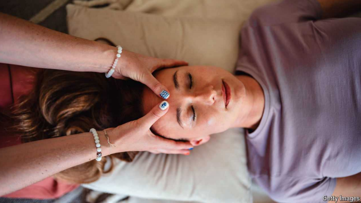

# Workouts for the face are a growing business

They may not help much in the quest for eternal youth

原文：

The FaceGym studio in central London looks more like a hair salon than a

fitness studio. Customers recline on chairs while staff pummel their faces

with squishy balls. They use their knuckles to “warm up” skin and muscles;

give it a “cardio” session to improve circulation; and then a deep-tissue

massage. Customers, who spend at least £100 ($133), say they leave with

less puffy cheeks and more defined jaw lines.

伦敦市中心的FaceGym工作室看起来更像是一家美发沙龙，而不是健身工作室。顾客斜靠在椅子上，工作人员用黏糊糊的球打他们的脸。他们用指关节“温暖”皮肤和肌肉；给它一次“有氧运动”来促进血液循环；然后是深层组织按摩。花费至少100英镑(133美元)的顾客说，他们离开时脸颊没有那么浮肿，下巴线条更加分明。

学习：

recline：美 [rəˈklaɪn] 斜靠；斜倚；斜躺

pummel：英 [ˈpʌm(ə)l] 捶打；连续猛击；拍打

squishy：湿软的；粘糊糊的

knuckles：美 [ˈnʌklz] 指关节；膝关节；肘；指节；（knuckle的复数）

cardio：有氧运动

circulation：美 [ˌsɜːrkjəˈleɪʃn] 循环；血液循环

puffy：英 [ˈpʌfi] 肿胀的；鼓胀的；浮肿的

puffy cheeks：脸颊浮肿

jaw：美 [dʒɔː] 颚；下巴；下颌；

defined：轮廓分明的；清晰的

jaw lines：下颌线

原文：

The booming market for facial workouts offers the hope of looking younger

and more chiselled. A third of Britons who had a non-invasive facial

treatment in 2023 had or were interested in having a face workout, says

Mintel, a research firm. Their growing popularity may be a result of

customers frowning at conventional facials, which involve lathering with

lotions and invasive cosmetic procedures. Inge Theron, Facegym’s founder,

got into facial workouts after a having “thread lift”, which uses temporary

sutures, that went wrong.

蓬勃发展的面部锻炼市场给人们带来了看起来更年轻、轮廓更分明的希望。调查公司Mintel称，2023年，三分之一接受过非侵入式面部治疗的英国人已经或有兴趣进行面部锻炼。它们越来越受欢迎可能是因为顾客对传统的面部护理不满，传统的面部护理包括用乳液涂肥皂和侵入性的美容程序。Facegym的创始人英格·塞隆(Inge Theron)在使用临时缝线的“提线术”出现问题后，开始进行面部锻炼。

学习：

chiselled：轮廓分明的；

frowning：不同意；皱眉；（frown的现在分词形式）

lathering：起泡沫；涂上肥皂沫；（lather的现在分词）          

lotion：护肤液；润肤乳

sutures：缝线；缝合；（suture的复数）

原文：

Facial workouts could be lucrative if they grab even a sliver of a market for

injectable procedures, such as botox and fillers, that will be worth over $5bn

in North America in 2025, according to McKinsey, a consultancy. It will

help that the clientele is not limited to the usual spa-goer. At Face Flex in

Dubai 45% of customers are male, says Nikisha Singh, a co-founder of the

firm, attracted by the idea that this is a form of exercise.

咨询公司麦肯锡(McKinsey)表示，如果面部锻炼能在注射程序(如肉毒杆菌和填充物)的市场中占有哪怕是一点点份额，那么它们就能带来丰厚的利润。到2025年，北美的注射程序价值将超过50亿美元。这将有助于客户不局限于通常的spa爱好者。迪拜Face Flex公司的联合创始人Nikisha Singh说，45%的顾客是男性，他们被这是一种锻炼方式的想法所吸引。

学习：

botox：美 [ˈboʊtɑks] 肉毒杆菌；保妥适（商标名）

clientele：美 [ˌklaɪənˈtel] 客户；（统称）顾客；

原文：

Faces can be worked out at home, too. Apps such as Luvly provide

personalised instructions for the stretching and contortions of face yoga.

Tools are also a big business. Social media is filled with videos of dewy-

skinned women scraping at their faces with rollers made of jade or rose

quartz. These can cost from $3 to over $100. Facegym sells a wand, which

sends small electric pulses into the skin, for £633.

人脸也可以在家里锻炼出来。Luvly等应用程序为面部瑜伽的拉伸和扭曲提供个性化指导。工具也是一个大行业。社交媒体上充斥着皮肤白皙的女性用玉石或玫瑰石英制成的滚筒刮脸的视频。这些费用从3美元到100多美元不等。Facegym出售一种向皮肤发送小电脉冲的魔杖，售价633英镑。

学习：

dewy：英 [ˈdjuːi] 带露水的；湿润的；多露水的；

scrape：刮掉；擦去；

quarts： 美 [kwɔːrts] 石英；水晶

原文：

What of sceptics who raise a quizzical eyebrow? Dermatologists warn that

touching your face too much can give you acne and stretching the skin could

create wrinkles. There isn’t enough rigorous research into the effects of face

workouts but, as Suzanne Olbricht, a dermatologist at Harvard Medical

School, puts it, they probably can’t hurt. ■

怀疑者扬起了疑惑的眉毛，这是怎么回事？皮肤科医生警告说，过多触摸你的脸会让你长痤疮，拉伸皮肤会产生皱纹。对于面部锻炼的效果还没有足够严格的研究，但是，正如哈佛医学院的皮肤科医生苏珊娜·奥尔布里切特所说，面部锻炼可能不会有什么坏处。■

学习：

quizzical：带有疑问的；诧异的

dermatologist：美 [ˌdə:məˈtɔlədʒists] 皮肤学者；（dermatologist的复数）皮肤科医生

acne：美 [ˈækni] 青春痘；痤疮；粉刺

## 后记

2024年10月10日19点37分于上海。

