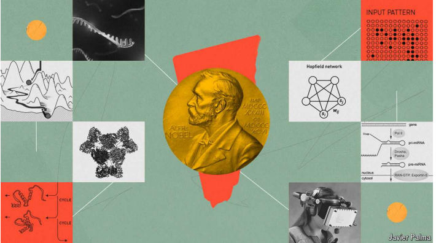

# AI wins big at the Nobels

Awards went to the discoverers of micro-RNA, pioneers of artificial intelligence models and those using them for protein-structure prediction

原文：

The scientific Nobel prizes have always, in their way, honoured human

intelligence. This year, for the first time, the transformative potential of

artificial intelligence (AI) has been recognised as well. That recognition began

on Tuesday October 8th, when Sweden’s Royal Academy of Science

awarded the physics prize to John Hopfield of Princeton University and

Geoffrey Hinton of the University of Toronto for computer-science

breakthroughs integral to the development of many of today’s most powerful

AI models.

诺贝尔科学奖总是以他们自己的方式尊重人类的智慧。今年，人工智能(AI)的变革潜力也首次得到了认可。这种认可始于10月8日星期二，当时瑞典皇家科学院将物理学奖授予普林斯顿大学的John Hopfield和多伦多大学的Geoffrey Hinton，以表彰他们在开发当今许多最强大的人工智能模型中不可或缺的计算机科学突破。

学习：

breakthroughs：突破；重要发现；重大成就；突破性进展；突破点；（breakthrough的复数）          

原文：

The next day, the developers of one such model also received the coveted

call from Stockholm. Demis Hassabis and John Jumper from DeepMind,

Google’s  AI  company, received one half of the chemistry prize for their

development of AlphaFold, a program capable of predicting three-

dimensional protein structure, a long-standing grand challenge in

biochemistry. The prize’s other half went to David Baker, a biochemist at the

University of Washington, for his computer-aided work designing new

proteins.

第二天，另一个类似模型的开发者也接到了来自斯德哥尔摩的令人垂涎的电话。谷歌人工智能公司DeepMind的戴密斯·哈萨比斯和约翰·跳线(John Jumper)因开发AlphaFold获得了一半的化学奖，alpha fold是一种能够预测三维蛋白质结构的程序，是生物化学领域一项长期的重大挑战。该奖项的另一半授予了华盛顿大学的生物化学家大卫·贝克，以表彰他在计算机辅助设计新蛋白质方面的工作。

学习：

coveted：美 [ˈkʌvətɪd] 垂涎的；梦寐以求的

原文：

The AI focus was not the only thing the announcements had in common. In

both cases, the research being awarded would be seen by a stickler as being

outside the remit of the prize-giving committees (AI research is computer

science; protein research arguably counts as biology).

人工智能并不是这两个公告的唯一共同点。在这两种情况下，被授予的研究都会被坚持己见的人视为超出了颁奖委员会的职权范围(人工智能研究是计算机科学；蛋白质研究可以算作生物学)。

学习：

stickler：美 [ˈstɪk(ə)lər] 一丝不苟的人；固执己见的人；严格要求者；挑剔的人

remit：职权范围；委托权限

prize-giving：颁奖；颁奖仪式；颁奖典礼；

## **Boundary-pushing**

原文：

Such flexibility is not unprecedented. In 1973, for example, three pioneering

students of animal behaviour, who worked on honeybees, geese and

sticklebacks, were shoehorned into the physiology category. The award to

Drs Hinton and Hopfield, however, recognises achievements with more

profound consequences.

这种灵活性并非史无前例。例如，在1973年，三名研究蜜蜂、鹅和棘鱼的动物行为学先驱学生被硬塞进了生理学类别。然而，授予辛顿和霍普菲尔德博士的奖项是对具有更深远影响的成就的认可。

学习：

honeybee：蜜蜂

geese：鹅；雌鹅；（goose的复数）

stickleback： 刺鱼；三刺鱼；棘鱼；三棘鱼

shoehorned：硬塞进；（shoehorn的过去式）

physiology：美 [ˌfɪziˈɑːlədʒi] 生理学；生理功能

原文：

Both researchers did their crucial work in the early 1980s, at a time when

computer hardware was unable to take full advantage of it. Dr Hopfield was

responsible for what has become known as the Hopfield network—a type of

artificial neural network that behaves like a physical structure called a spin

glass, which gave the academy a tenuous reason to call the field “physics”.

Dr Hinton’s contribution was to use an algorithm known as backpropagation

to train neural networks.

两位研究人员都在20世纪80年代早期完成了他们至关重要的工作，当时计算机硬件还不能充分利用它。霍普菲尔德博士负责了被称为霍普菲尔德网络的东西——一种行为类似于被称为旋转玻璃的物理结构的人工神经网络，这给了学院一个将该领域称为“物理学”的站不住脚的理由。辛顿博士的贡献是使用一种被称为反向传播的算法来训练神经网络。

学习：

renuous：脆弱的；微弱的；贫乏的

tenuous reason：勉强的借口

原文：

Artificial neural networks are computer programs based loosely on the way

in which real, biological networks of nerve cells or neurons are believed to

work. In particular, the strengths of the connections (known as weights)

between “nodes” (the equivalent of neurons) in such networks are plastic.

This plasticity grants a network the ability to process information differently

in response to past performance; or, in other words, to learn. Hopfield

networks, in which each node is connected to every other except itself, are

particularly good at learning to extract patterns from sparse or noisy data.

人工神经网络是基于神经细胞或神经元的真实生物网络工作方式的计算机程序。特别是，这种网络中“节点”(相当于神经元)之间的连接强度(称为权重)是可塑的。这种可塑性使网络能够根据过去的表现以不同的方式处理信息；或者换句话说，去学习。Hopfield网络中的每个节点除了自身之外都是相互连接的，这种网络特别擅长学习从稀疏或嘈杂的数据中提取模式。

原文：

Dr Hinton’s algorithm turbocharged neural networks’ learning ability by

letting them work in three dimensions. Hopfield networks and their ilk are,

in essence, two-dimensional. Though they actually exist only as simulations

in software, they can be thought of as physical layers of nodes. Stack such

layers on top of one another, though, and train them by tweaking the weights

as signals move both backward and forward between the layers (ie, back-

propagated as well as forward-propagated) and you have a much more

sophisticated learning system.

辛顿博士的算法通过让神经网络在三维空间中工作来增强它们的学习能力。Hopfield网络及其类似物本质上是二维的。虽然它们实际上只是作为软件中的模拟而存在，但它们可以被认为是节点的物理层。然而，将这样的层一层一层地堆叠起来，随着信号在层之间来回移动(即反向传播和正向传播)，通过调整权重来训练它们，你就有了一个更加复杂的学习系统。

学习：

ilk：美 [ɪlk] 类型；种类；同类

原文：

Dr Hinton also, for good measure, tweaked Dr Hopfield’s networks using a

branch of maths called statistical mechanics to create what are known as

Boltzmann machines. (Statistical mechanics, which underlies modern

understanding of the second law of thermodynamics, was invented by

Ludwig Boltzmann, a near contemporary of Alfred Nobel.) Boltzmann

machines can be used to create systems that learn in an unsupervised

manner, spotting patterns in data without having to be explicitly taught.

此外，Hinton博士还利用一种叫做统计力学的数学分支，对Hopfield博士的网络进行了改进，创造出了所谓的Boltzmann机器。(统计力学是与阿尔弗雷德·诺贝尔同时代的路德维希·玻尔兹曼发明的，它奠定了现代对热力学第二定律的理解。)玻尔兹曼机器可以用来创建以无人监督的方式学习的系统，在不需要明确教授的情况下发现数据中的模式。

学习：

for good measure：额外的；附加的；另外的

thermodynamics：热力学

原文：

It is, then, the activities of these two researchers which have made machine

learning really sing. AI models can now not only learn, but create (or, for

sceptics, reorganise and regurgitate in a most sophisticated manner). Such

tools have thus gone from being able to perform highly specific tasks, such

as recognising cancerous cells in pictures of tissue samples or streamlining

mountains of particle-physics data, to anything from writing essays for lazy

undergraduates to running robots.

那么，正是这两位研究人员的活动让机器学习真正发达起来。人工智能模型现在不仅能学习，还能创造(或者，对怀疑论者来说，以最复杂的方式重组和反刍)。因此，这些工具已经从能够执行高度特定的任务，如识别组织样本图片中的癌细胞或精简堆积如山的粒子物理数据，发展到从为懒惰的大学生写论文到运行机器人的任何事情。

学习：

regurgitate：美 [rəˈɡərdʒəˌteɪt] 反刍；回流；涌回

原文：

Dr Hinton, whom the academy’s detectives tracked down to a hotel in

California to deliver the glad tidings, and who gamely agreed to answer

questions from the press, despite the time difference, seemed both worried

and proud about his achievements. He fretted, as many in the field do, about

how machine intelligence that outstripped the human variety would then go

on to treat its creators. But he also mused that by assisting mental labour, AI

might have as big an effect on society as the Industrial Revolution’s

assistance of physical labour has had.

辛顿博士被学院的侦探追踪到加州的一家酒店，带来了这个好消息，尽管有时差，但他勇敢地同意回答媒体的问题，似乎对他的成就既担心又自豪。和该领域的许多人一样，他担心超越人类的机器智能会如何对待其创造者。但他也认为，通过帮助脑力劳动，人工智能可能会像工业革命帮助体力劳动一样对社会产生巨大影响。

学习：

tidings：消息；音信；音讯（news的古语）          

gamely：勇敢地；不屈地；勇于承担地          

time difference：时差

fretted：焦急；磨损；烦恼；（fret的过去式）

outstripped：超过；跑过；比…跑得快；（outstrip的过去式和过去分词）

mused：沉思；冥想；（muse的过去式和过去分词）          

原文：

Such musings were timely. Not 24 hours later, the academy would recognise

research conducted, with the help of AI models, on the structure of proteins.

这样的思考是及时的。不到24小时后，学院将认可在AI models的帮助下对蛋白质结构进行的研究。

## **Return to the fold**

原文：

Proteins are the main chemical building blocks of life. They are made up of

smaller molecules called amino acids, arranged in long chains which fold in

highly complex and specific ways. A protein’s final folded form determines

its biological function. In other words, to understand proteins—and, by

extension, biology—one must understand their structure.

蛋白质是生命的主要化学组成部分。它们由称为氨基酸的较小分子组成，排列成长链，以高度复杂和特定的方式折叠。蛋白质的最终折叠形式决定了它的生物功能。换句话说，要理解蛋白质——进而理解生物学——就必须理解它们的结构。

学习：

amino：美 [əˈminoʊ] 氨基（化合物中的基团，含有氮原子和氢原子）

amino acids：氨基酸

by extension：进而言之；推而广之；引申开来；

原文：

Dr Baker achieved such understanding through doing. In a landmark paper

from 2003, he succeeded in designing a completely new protein. Using a

computer program he had named Rosetta, he found an amino-acid sequence

capable of folding in ways not seen in nature. Once the sequence was

recreated in the lab and the protein formed, he determined its final structure

using a technique called X-ray crystallography: it was a close match to what

he had set out to make. Rosetta, now called Rosetta Commons, has

subsequently become a software package used by protein chemists around

the world, and computational protein design has assisted in everything from

vaccine development to the detection of toxic chemicals.

贝克博士通过实践获得了这样的理解。在2003年的一篇里程碑式的论文中，他成功设计了一种全新的蛋白质。利用一个他命名为Rosetta的计算机程序，他发现了一种能够以自然界中从未见过的方式折叠的氨基酸序列。一旦该序列在实验室中重现，蛋白质形成，他就用一种叫做X射线结晶学的技术确定了它的最终结构:这与他开始制作的非常接近。Rosetta现在被称为Rosetta Commons，随后成为世界各地蛋白质化学家使用的软件包，计算蛋白质设计已经帮助了从疫苗开发到有毒化学物质检测的所有事情。

学习：

crystallography：美 [ˌkrɪstəˈlɑɡrəfi] 晶体学；晶体结构学；晶体形态学

原文：

Going the other way, and predicting a protein’s structure from its amino-acid

sequence, is a problem that took even longer to crack. Given the near

limitless number of configurations into which a protein can fold—by some

estimates, as many as 10^300 for a single complex protein—even computers

had limited success. DeepMind’s AlphaFold 1 and 2 (both artificial neural

networks), made public in 2018 and 2020 respectively, were the first to even

get close. AlphaFold 2 now has a database of more than 200m protein

structure predictions, with a prediction accuracy approaching 90%.

反其道而行之，从氨基酸序列预测蛋白质的结构，是一个需要更长时间才能解决的问题。鉴于一种蛋白质可以折叠成几乎无限多种构型——有人估计，一种复杂的蛋白质可以折叠成10^300种——即使是计算机也只能取得有限的成功。DeepMind的AlphaFold 1和2(都是人工神经网络)，分别于2018年和2020年公开，甚至是第一次接近。AlphaFold 2现在拥有超过2亿个蛋白质结构预测的数据库，预测准确率接近90%。

原文：

Though Sir Demis and Dr Jumper have featured on various contender lists

this year, many wondered if it was too soon for AlphaFold to be recognised.

Yet it has already had real impact: DeepMind says that some 2m scientists

already use it in their research. AlphaFold 3, released in May, goes beyond

proteins to predict the structure of a host of other biomolecules, such as DNA,

as well as small molecules that might function as drugs. It can also predict

how different molecules with different structures fit together, such as how a

virus’s spike protein might interact with antibodies and sugars found in the

body.

尽管德米斯爵士和Jumper博士今年出现在各种竞争者的名单上，但许多人怀疑AlphaFold获得认可是否为时过早。然而，它已经产生了真正的影响:DeepMind表示，大约200万名科学家已经在他们的研究中使用了它。5月份发布的AlphaFold 3超越了蛋白质，预测了许多其他生物分子的结构，如DNA，以及可能具有药物功能的小分子。它还可以预测不同结构的不同分子如何结合在一起，例如病毒的刺突蛋白可能如何与体内的抗体和糖相互作用。

原文：

By choosing, for the first time, to honour work performed with an AI model,

the committee has opened the door for more such prizes in the future. That is

just as well; AI has been seeping into all areas of science for some time now,

as Dr Baker illustrated when he was phoned up during the committee’s press

conference. He said that AlphaFold has inspired him to make generative-AI

models that can design new proteins. “Our new AI methods are much more

powerful,” he said.

通过第一次选择表彰与AI模型合作的作品，委员会为将来获得更多此类奖项打开了大门。那也无妨；一段时间以来，人工智能已经渗透到科学的所有领域，正如贝克博士在委员会的新闻发布会上接到电话时所描述的那样。他说，AlphaFold启发他制作可以设计新蛋白质的生成式人工智能模型。“我们新的人工智能方法更加强大，”他说。

学习：

seeping：渗出；渗透；（seep的现在分词）

## **Mega-important**

原文：

The prize for physiology or medicine, for its part, eschewed any mention of

AI. It was also immune to charges of genre-bending, continuing the

academy’s trend of increasingly recognising the smallest advances at the

molecular and cellular level—rather than work on physiology or organs—

because it is on these microscopic scales that the most exciting scientific

frontiers are to be found.

生理学或医学奖，就其本身而言，避免提及任何人工智能。它也不受打破传统界限的指控，继续了学术界越来越多地承认分子和细胞水平上的最小进展的趋势——而不是生理学或器官上的工作——因为正是在这些微观尺度上，最令人兴奋的科学前沿才会被发现。

学习：

eschewed：避开；回避；（eschew的过去式）          美 [esˈtʃu:d]

genre-bending： 混合或超越不同的类别或风格

>这里的 **"genre-bending"** 指的是打破或模糊传统界限的做法，通常用于描述在某个领域中混合或超越不同的类别或风格。在这句话中，"immune to charges of genre-bending" 的意思是，生理学或医学奖避免了被指责为打破传统领域界限的情况，继续专注于分子和细胞层面的研究，而不是涉及生理学或器官研究的跨界或混合研究。
>
>例子：
>
>- **English**: The movie was praised for its genre-bending approach, combining elements of sci-fi, romance, and thriller.
>- **中文**：这部电影因其打破传统类型界限的做法而广受赞誉，融合了科幻、浪漫和惊悚的元素。

原文：

The joint winners were Victor Ambros at the University of Massachusetts 

Medical School and Gary Ruvkun at Massachusetts General Hospital for 

their discovery of micro-RNA (miRNA) and its role in “post-transcriptional 

gene regulation”. These are a class of small molecules composed of only 

20 to 24 nucleotides (the A, C, G, U letters of the genome), and they 

play a key role in how cells work. 

共同获奖者是麻省大学医学院的Victor Ambros和麻省总医院的Gary Ruvkun，他们发现了微RNA (miRNA)及其在“转录后基因调控”中的作用。这是一类仅由20至24个核苷酸(基因组的A，C，G，U字母)组成的小分子，它们在细胞如何工作中发挥着关键作用。

学习：

gene regulation：基因调控

nucleotide：英 [ˈnjuːklɪətʌɪd]  核苷酸（构成DNA和RNA的基本单位）

原文：

Inside the nucleus of every human cell is a full set of instructions—the

genome—for creating a person. A key question in biology is how the same

set of genes and instructions can lead to such different types of cells in the

body, from muscle to liver cells by way of the neurons found in the brain.

The answer is that not all the genes within a nucleus are translated into

protein. Different types of cells follow their own developmental pathways by

using only those genetic instructions relevant to their growth and

development. The selection necessary for each cell type is controlled in part

by the miRNA molecules discovered by Drs Ambros and Ruvkun.

每个人类细胞的细胞核内都有一套完整的指令——基因组——用来创造一个人。生物学中的一个关键问题是，通过大脑中发现的神经元，同一组基因和指令如何在体内产生如此不同类型的细胞，从肌肉细胞到肝细胞。答案是，并不是细胞核内的所有基因都被翻译成蛋白质。不同类型的细胞通过只使用那些与其生长和发育相关的遗传指令来遵循它们自己的发育途径。Ambros和Ruvkun博士发现的微分子部分控制着每种细胞类型的选择。

学习：

nucleus：美 [ˈnuːkliəs] 核；细胞核；

genome：美 [ˈdʒiːnoʊm] 基因组；全部基因

原文：

They work primarily by binding to target parts of another molecule within 

cells, known as messenger RNA(mRNA)—which carries information from 

the DNA of the genome to the protein-making factories within cells. 

By interfering with mRNA molecules, miRNA can alter or prevent the 

production of proteins. Underscoring the growing importance of this 

area of molecular biology, mRNA was itself the subject of the Nobel prize last year. 

它们主要通过结合细胞内另一种分子的目标部分来发挥作用，这种分子被称为信使RNA(mRNA)，它将信息从基因组的DNA携带到细胞内的蛋白质制造工厂。通过干扰mRNA分子，miRNA可以改变或阻止蛋白质的产生。mRNA本身就是去年诺贝尔奖的主题，这凸显了分子生物学领域日益增长的重要性。

原文：

Finding miRNAs, in 1993, paved the way to the understanding, today, that there

are over a thousand of these small molecules within our cells. The discovery

has had far-reaching implications in biology. Abnormal regulation by miRNA

molecules can contribute to cancer and epilepsy. Mutations in genes that

code for miRNA molecules have been found to cause conditions such as

congenital hearing loss and are thought to be involved in the pathology of

many eye disorders, such as cataracts, glaucoma and macular degeneration.

The miRNA molecules are also thought to be important in numerous bone

diseases, such as osteoporosis, osteosarcoma and bone metastasis.

1993年发现的miRNAs为我们今天理解细胞内有超过一千个这样的小分子铺平了道路。这一发现对生物学产生了深远的影响。miRNA分子的异常调节可导致癌症和癫痫。编码miRNA分子的基因突变被发现会导致先天性听力损失等疾病，并被认为与许多眼病的病理有关，如白内障、青光眼和黄斑变性。miRNA分子也被认为在许多骨疾病中是重要的，如骨质疏松症、骨肉瘤和骨转移。

学习：

epilepsy：美 [ˈɛpəˌlɛpsi] 癫痫；

mutations：变异；突变；变种；（mutation的复数）          

congenital：美 [kənˈdʒenɪtl] 先天的；天生的

pathology：美 [pəˈθɑːlədʒi] 病理学；疾病学

eye disorders：眼病

cataracts：美 ['kætərækts] 白内障；暴雨；（cataract的复数）

glaucoma：美 [ɡlɔˈkoʊmə] 青光眼

macular： 美 [ˈmækjələr] 黄斑的

molecules：英 [ˈmɒlɪkjuːlz] 分子；微粒；微小颗粒；（molecule的复数） **注意发音**

osteoporosis：美 [ˌɑstioʊpəˈroʊsəs] 骨质疏松症；骨质疏松

osteosarcoma：英 [ˌɒstɪəʊsɑːˈkəʊmə] 骨肉瘤；骨癌

metastasis：美 [məˈtæstəsəs] （瘤）转移

原文：

Drs Ambros and Ruvkun—who worked at the same lab in the late 1980s at

the Massachusetts Institute of Technology—discovered miRNA molecules

using a key tool of biological inquiry: the roundworm *Caenorhabditis*

*elegans*. They were studying two mutant strains of worms that had defects in

the genes that dictated how the animals developed and worked. In doing so,

the researchers showed that a gene called lin-4 produced an unusually short

RNA molecule that did not code for any proteins and which seemed to inhibit

the activity of another gene.

Ambros和Ruvkun博士——他们在20世纪80年代末在麻省理工学院的同一个实验室工作——使用生物学研究的关键工具发现了miRNA分子:秀丽隐杆线虫。他们正在研究两种变异的蠕虫，这两种蠕虫在决定动物如何发育和工作的基因上有缺陷。通过这样做，研究人员表明，一种叫做lin-4的基因产生了一种不寻常的短RNA分子，它不编码任何蛋白质，似乎抑制了另一种基因的活性。

学习：

biological inquiry：生物学探究，生物学研究

roundworm：蛔虫；线虫

mutant：突变的；变异的；

原文：

In awarding the prize, the Karolinska Institute’s Nobel committee noted that

when the scientists published their results, they met an “almost deafening

silence from the scientific community”. The unusual mechanism of gene

regulation in *C. elegans* was assumed to be a peculiarity of that organism,

not relevant to humans or other more complex organisms. That view

eventually shifted, as it became clear that genes that encode for miRNAs were

found throughout the animal kingdom.

在颁奖时，卡罗林斯卡学院的诺贝尔委员会指出，当科学家们发表他们的成果时，他们遇到了“科学界几乎震耳欲聋的沉默”。秀丽隐杆线虫中基因调控的异常机制被认为是该生物的一种特性，与人类或其他更复杂的生物无关。这一观点最终发生了转变，因为很明显编码miRNAs的基因在整个动物界都被发现了。

学习：

peculiarity：美 [pɪˌkjuːliˈærəti] 特色；特点；独特性

原文：

Novo Nordisk, a Danish pharmaceutical giant, is one of the firms trying to make 

medicines using miRNAs. This year it acquired Cardior, a German firm, whose lead 

drug candidate, CDR132L, works by blocking a particular miRNA in the hope of 

helping patients with chronic heart failure and cardiac hypertrophy (thickening 

and stiffening of the walls of the heart). 

丹麦制药巨头诺和诺德公司是尝试使用miRNAs制造药物的公司之一。今年，它收购了一家德国公司Cardior，该公司的主要候选药物CDR132L通过阻断一种特定的miRNA而起作用，希望能够帮助慢性心力衰竭和心脏肥大(心脏壁增厚和硬化)的患者。

学习：

heart failure：心力衰竭；心脏衰竭；

cardiac hypertrophy：心脏肥大；心肌肥厚；心脏肥厚          

hypertrophy：英 [hʌɪˈpəːtrəfi] （器官或组织的）肥大；过度生长；增生

stiffening：加固；使更为坚定；使（衣物、织物）硬化

原文：

This year’s prize highlights the continuing trend of recognising discoveries

at the molecular level. Recently, several Nobel prizes have been awarded to

technologies that have had obvious clinical applications, such as cancer

immunotherapy (in 2018) and gene editing (in 2020). It is perhaps no

surprise that, as the technology for molecular and genetic research has

improved, scientists are gaining ever more insight into cellular function, and

are therefore able to make more profound and useful discoveries with them.

今年的奖项突出了在分子水平上认可发现的持续趋势。最近，几个诺贝尔奖被授予已经有明显临床应用的技术，如癌症免疫疗法(2018年)和基因编辑(2020年)。随着分子和基因研究技术的进步，科学家对细胞功能的了解越来越多，因此能够做出更深刻、更有用的发现，这也许并不奇怪。

## **Nobel pursuits**

原文：

For the growing number of researchers around the world who rely on AI in their 

work, the lasting message of this year’s awards may be a different one: that they, too, 

could one day nab science’s most prestigious gongs. For hispart, said 

Dr Jumper, “I hope...that we have opened the door to many incredible 

scientific breakthroughs with computation and AI to come.” ■

对于世界各地越来越多在工作中依赖人工智能的研究人员来说，今年奖项的持久信息可能是不同的:他们也可能有一天获得科学界最负盛名的奖项。“对他来说，”Jumper博士说，“我希望...随着计算和人工智能的到来，我们已经为许多令人难以置信的科学突破打开了大门。”■

学习：

nab：捉住；抓获；夺取

gongs：奖章；（gong的复数）          

## 后记

2024年10月11日15点50分于上海。

