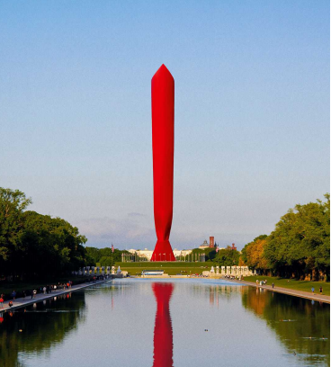

# The Trumpification of American policy

No matter who wins in November, Donald Trump has redefined both parties’ agendas

原文：

THE CHOICE facing America in less than a month will not be made by

voters weighing rival sets of policies. Kamala Harris’s plans lack detail;

Donald Trump’s are sometimes untethered from reality—and in any case

divisions over culture motivate voters more than tax policy. Yet the choice

matters hugely in policy terms, for America and the rest of the world. This

aspect of the election has been under-covered relative to fantasies about

what Haitian migrants in Ohio have for lunch. Our current issue, which

contains eight concise policy briefs on the areas where we think the election

will make the most difference, is intended as an antidote to that.

在不到一个月的时间里，美国面临的选择将不会由权衡不同政策的选民做出。卡玛拉·哈里斯的计划缺乏细节；唐纳德·特朗普(Donald Trump)的观点有时脱离现实——而且无论如何，文化分歧比税收政策更能激励选民。然而，对于美国和世界其他国家来说，这个选择在政策方面非常重要。相对于俄亥俄州的海地移民午餐吃什么的幻想，选举的这一方面被掩盖了。我们目前的问题，包含八个简明的政策简介，我们认为选举将在哪些领域产生最大的影响，旨在解决这一问题。

学习：

untether：解开；释放；使不受束缚；

antidote：美 [ˈæntidoʊt] 解毒药；解毒剂；治疗方法

原文：

Our list is selective: we have left out subjects where the contrast between the

two candidates is stark, but which have no direct bearing on public policy.

These include the candidates’ characters, what the election would mean for

institutions and even for American democracy. Nor have we included

abortion, where the candidates’ different views are unlikely to translate into

markedly different policies thanks to a Congress that neither party is likely

to dominate. Strip those things out, important as they are, focus on policies

that are in the president’s gift instead, and the result is surprising. Whoever

gets to 270 electoral-college votes on November 5th, Mr Trump’s ideas will

win. He, not Ms Harris, has set the terms of this contest. American policy

has become thoroughly Trumpified.

我们的列表是有选择性的:我们忽略了两位候选人之间形成鲜明对比、但与公共政策没有直接关系的主题。这些问题包括候选人的性格，选举对公共机构乃至美国民主的意义。我们也没有考虑堕胎问题，在这个问题上，候选人的不同观点不太可能转化为明显不同的政策，这要归功于两党都不可能占据主导地位的国会。尽管这些事情很重要，但把它们剥离出来，转而关注总统礼物中的政策，结果令人惊讶。无论谁在11月5日获得270张选举人票，特朗普的想法都会获胜。是他，而不是哈里斯女士，设定了这场竞赛的规则。美国的政策已经完全特朗普化了。

学习：

stark：明显的；

direct bearing on：对xxx有直接的影响

原文：

Take Ms Harris’s domestic platform. Her immigration policy is to endorse

the most conservative bipartisan reform proposal this century. Its provisions

include shutting down asylum applications when the flow of irregular

migrants is high. Her trade policy involves keeping, in modified form, most

of the tariffs Mr Trump imposed in his first term. On tax, Ms Harris would

keep most of the cuts Mr Trump signed in 2017 (raising rates only for those

who earn over $400,000). On energy, she has become a convert to fracking

and has been part of an administration that has seen America pump more oil

and gas than ever before. Because America is so partisan, and Mr Trump is

such a polarising figure, Ms Harris has been able to borrow parts of Mr

Trump’s first-term agenda without most people noticing.

以哈里斯的国内政治宣言为例。她的移民政策是支持本世纪最保守的两党改革提案。其条款包括在非正常移民流量大时停止庇护申请。她的贸易政策包括以修改后的形式保留特朗普在第一个任期内征收的大部分关税。在税收方面，哈里斯将保留特朗普在2017年签署的大部分减税措施(仅对收入超过40万美元的人提高税率)。在能源方面，她已经成为水力压裂法的拥护者，并且已经成为美国政府的一部分，这个政府已经见证了美国比以往任何时候都要多的石油和天然气。由于美国的党派性太强，而特朗普又是一个极端人物，哈里斯能够借用特朗普第一任期的部分议程，而大多数人都没有注意到。

学习：

provisions：条款

convert：皈依者；新入教者；新信徒

原文：

This policy-poaching makes political sense. Mr Trump moved onto

Democrats’ turf first, love-bombing trade unions and scrapping Republican

plans to trim public spending on pensions and health care. Because the

election will be fought in six or seven swing states, all of which were a

couple of percentage points more Republican than the national average in

2020, Ms Harris’s quiet adoption of Trumpier positions could help her win.

Yet the result is that a candidate who lost the last election, whose party was

trounced in the 2018 midterms—a candidate who has never won the popular

vote and probably never will—has remade American policy in his image.

这种政策挖墙脚在政治上是有道理的。特朗普首先进入了民主党的地盘，拉拢工会，废除共和党削减养老金和医疗保健公共支出的计划。因为选举将在六到七个摇摆州进行，所有这些州Republican都比2020年的全国平均水平高出几个百分点，哈里斯女士悄悄地采取特朗普式的立场可能有助于她获胜。然而，结果是，一个在上次选举中失败的候选人，他的政党在2018年的中期选举中被击败——一个从未赢得普选并且可能永远不会赢得普选的候选人——按照他的形象重塑了美国政策。

学习：

poaching：漂洗；（poach的现在分词）

policy-poaching：借用或采纳另一政党或政治人物的政策想法或主张

>**"Policy-poaching"** 指的是借用或采纳另一政党或政治人物的政策想法或主张。在这里，它形容的是卡马拉·哈里斯借用了特朗普的某些政策，虽然她是民主党成员，但她采纳了一些特朗普在其第一任期内的保守政策，以增加她在摇摆州选民中的吸引力。
>
>**例子**：
>
>- **English**: The politician engaged in policy-poaching by adopting the rival party’s popular healthcare reforms to win more votes.
>- **中文**：这位政客通过采纳对手党派的热门医疗改革政策来吸引更多选票，进行政策“偷猎”。

turf：（自己的）地盘；势力范围；主场

love-bombing: 指用过度的关注、奉承或亲近感来赢得别人的支持或好感

>**"Love-bombing"** 通常指用过度的关注、奉承或亲近感来赢得别人的支持或好感。在这里，"love-bombing" 描述了特朗普通过与工会和工人阶级建立密切联系，以赢得他们支持的策略。
>
>**例子**：
>
>- **English**: The candidate’s love-bombing of undecided voters included multiple campaign stops and personal meetings to gain their support.
>- **中文**：这位候选人通过多次竞选站点停留和个人会面，向未决定的选民大肆示好，试图赢得他们的支持。

scrapping：废弃；

trim：削减

trounced：痛打；严责；（trounce的过去式和过去分词）          

原文：

The same is true in foreign policy. The two candidates have different

approaches: one is built on values and alliances; the other on asking what the

world can do for America. If Mr Trump wins, nervous speculation over

America’s commitment to NATO will come back; with Ms Harris it is not in

doubt. Yet there is surprising overlap. Mr Trump adopted a more

confrontational approach to China than any recent president, even if his

policies were in practice less scary than they sounded. The administration

Ms Harris has been part of has been less verbally antagonistic but tougher in

practice, banning technology exports to China and placing huge tariffs on

imports of Chinese electric vehicles. On the Middle East, Ms Harris has not

let Mr Trump outflank her on the right, despite pressure from within her own

party to cut arms supplies to Israel. Nor does she seem in a hurry to revive

the deal with Iran that Mr Trump tore up; this week she called the Islamist

regime America’s greatest adversary. Here too, Mr Trump has set the terms.

外交政策也是如此。两位候选人有不同的方法:一个是建立在价值观和联盟的基础上；另一个问题是世界能为美国做些什么。如果特朗普获胜，关于美国对北约承诺的紧张猜测将卷土重来；对于哈里斯女士来说，这是毫无疑问的。然而，令人惊讶的是，两者存在重叠。特朗普对中国采取了比最近任何一位总统都更具对抗性的态度，尽管他的政策实际上没有听起来那么可怕。哈里斯所在的政府在口头上不那么敌对，但在实践中更加强硬，禁止向中国出口技术，并对进口的中国电动汽车征收高额关税。在中东问题上，哈里斯没有让特朗普在右翼超过她，尽管她所在的党内有人要求她削减对以色列的武器供应。她似乎也不急于恢复特朗普撕毁的与伊朗的协议；本周，她称伊斯兰政权是美国最大的敌人。在这方面，特朗普也设定了条件。

学习：

antagonistic：美 [ænˌtæɡəˈnɪstɪk] 敌对的；对抗性的；反对的

outflank：侧翼包抄；迂回包围；智胜；超越

原文：

Support for Ukraine is where the gap seems widest. Ms Harris has been part

of an administration that has led the Western effort to help Ukraine defend

itself against Russia’s unprovoked invasion. She would continue to supply

Ukraine with arms and cash, as long as Congress let her do so. Mr Trump’s

policy is extraordinarily vague: he says only that the war would not have

broken out on his watch and that he would end it swiftly. He does not say

how, and his refusal to say which side he would like to win adds to fears that

he would urge Ukraine to settle on Russia’s terms. Such a catastrophic

betrayal is not certain, however. Even Mr Trump may worry that letting

Russian tanks roll over more of Ukraine would make him look weak.

对乌克兰的支持似乎是差距最大的地方。哈里斯一直是领导西方帮助乌克兰抵御俄罗斯无端入侵的政府的一员。只要国会允许，她将继续向乌克兰提供武器和现金。特朗普的政策非常模糊:他只是说，在他的任期内，战争不会爆发，他会迅速结束战争。他没有说如何，也拒绝说他希望哪一方获胜，这增加了人们对他将敦促乌克兰按照俄罗斯的条件解决问题的担忧。然而，这种灾难性的背叛是不确定的。就连特朗普也可能担心，让俄罗斯坦克碾过乌克兰更多地区会让他看起来很虚弱。

学习：

unprovoked：无缘无故的；未受挑衅的；无端的

## **A choice and an echo**

原文：

The second thing that is clear from our policy briefs is that while Ms Harris

has moved towards the Donald Trump of the first term, Mr Trump has

become more extreme, even compared with his prior self. On trade he said

earlier this year he favoured a 10% universal tariff on imports and has now

upped that to 20%. He wants a tariff of 60% on all Chinese imports. On tax

he now wants to cut everything in sight, making all the 2017 cuts permanent

and reducing corporate taxes further. The Committee for a Responsible

Federal Budget reckons that his plans would add twice the amount to the

national debt that Ms Harris’s would (and hers are hardly restrained). On

immigration, 2024 Trump is more extreme than 2016 Trump. He always

needs a new big promise, and this time it is not merely a wall but mass

deportation. Some of his policies are extreme by omission: he has no

discernible plan for reducing CO2 emissions, or for helping the country adapt

to climate change.

从我们的政策简报中可以清楚看到的第二件事是，尽管哈里斯向第一任期的唐纳德·特朗普靠拢，但特朗普变得更加极端，甚至与他之前的自己相比也是如此。在贸易方面，他今年早些时候表示，他赞成对进口商品征收10%的关税，现在已经提高到20%。他希望对所有中国进口商品征收60%的关税。在税收方面，他现在希望削减眼前的一切，使2017年的所有削减永久化，并进一步降低企业税。负责任的联邦预算委员会认为，他的计划将增加两倍于哈里斯女士的国家债务(她的计划几乎不受限制)。在移民问题上，2024特朗普比2016特朗普更极端。他总是需要一个新的大承诺，这一次不仅仅是一堵墙，而是大规模驱逐。他的一些政策因疏忽而变得极端:他没有明确的计划来减少二氧化碳排放，或者帮助国家适应气候变化。

学习：

deportation：驱逐出境；放逐

omission：遗漏；省略；疏忽；忽略；

原文：

Next week we will look more closely at how the two candidates’ policies

might affect the economy. For all Mr Trump’s claims that President Joe

Biden has “destroyed” it, America’s economy is currently the envy of the

world. Yet it is striking how little faith either candidate places in the things

that made it great, such as openness to trade, talent and competition .

Clearly, Ms Harris would not seek to shut America off as vigorously as Mr

Trump would. But whoever wins in November, the Trumpification of

American policy seems likely to continue. ■

下周，我们将更仔细地观察两位候选人的政策会如何影响经济。尽管特朗普声称美国总统乔·拜登(Joe Biden)已经“摧毁”了美国经济，但美国经济目前仍令全世界羡慕。然而，令人吃惊的是，两位候选人对使其伟大的事物都缺乏信心，比如贸易开放、人才和竞争。显然，哈里斯不会像特朗普那样大力寻求关闭美国。但无论谁在11月获胜，美国政策的特朗普化似乎都将继续。■

## 后记

2024年10月11日18点42分于上海。

