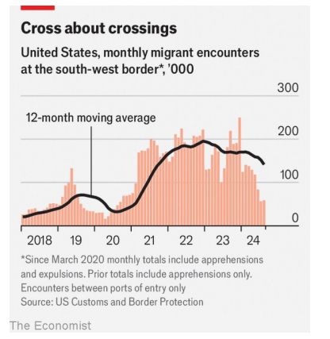

# Donald Trump is preparing an assault on America’s immigration system

assault: 美 [əˈsɔːlt] （军事）攻击；袭击;武力攻击；抨击；冲击；

The divide between the two candidates on migration is stark, but it has narrowed

原文：

PART OF BEING Donald Trump is saying outrageous things. Yet what was

outrageous in 2011 (suggesting that Barack Obama was born in Kenya)

seems almost quaint in 2024. His rhetoric has turned darker. Immigrants are

no longer just criminals and rapists, they are “poisoning the blood of our

country”. Chants of “Build the wall!” have been replaced by “Send them

back!” In MAGA world, legal immigrants from Haiti are threatening to eat the

pets of the good people of Springfield, Ohio.

成为唐纳德·特朗普的一部分就是说一些离谱的事情。然而，2011年令人愤慨的事情(暗示巴拉克·奥巴马出生于肯尼亚)在2024年似乎变得有些古怪。他的言辞变得更加隐晦。移民不再仅仅是罪犯和强奸犯，他们正在“毒害我们国家的血液”。“建墙！”的圣歌已经换成了“把他们送回去！”在MAGA world，来自海地的合法移民威胁要吃掉俄亥俄州斯普林菲尔德善良人们的宠物。

学习：

outrageous：令人无法接受的；无法容忍的；骇人听闻的；令人惊讶的

say outrageous things：说离谱的事情

quaint：古怪的；离奇有趣的；异乎寻常的

rhetoric：言辞

原文：

Mr Trump’s obsession with immigration has shaped this presidential

campaign—and American politics for the past nine years. A chasm yawns

between Mr Trump’s and Kamala Harris’s immigration policies, but his

dominant focus on the issue has forced her to tack to the right to avoid

looking weak on border security. Voters’ concerns (61% of registered voters

say immigration is a priority for them in this election, according to the Pew

Research Centre) mean that action on immigration will be at the top of the

next president’s to-do list, no matter who wins.

特朗普对移民的痴迷影响了这次总统竞选，也影响了过去九年的美国政治。特朗普和卡玛拉·哈里斯的移民政策之间存在巨大分歧，但特朗普对这一问题的高度关注迫使她转向右翼，以免在边境安全问题上显得软弱。选民的担忧(根据皮尤研究中心的数据，61%的登记选民表示，移民是他们在此次选举中的优先事项)意味着，无论谁获胜，对移民的行动都将是下一任总统的首要任务。

学习：

obsession：痴迷；迷恋；固执的念头

chasm：美 [ˈkæzəm] 深渊；裂缝；峡谷；分歧

yawn：出现裂缝或间隙；张大；裂开；张开

tack：改变方向或策略

原文：

Both Mr Trump and Ms Harris would be constrained by Congress, which

has not meaningfully reformed immigration law since 1990. The result is a

creaking, inflexible system ill-equipped to find the workers America needs.

That is unlikely to change, no matter which party wins control of the Senate

and the House. But, as Mr Trump and Joe Biden have shown in recent years,

presidents can find ways to exercise immense power to affect policy.

特朗普和哈里斯都将受到国会的制约，自1990年以来，国会没有对移民法进行过有意义的改革。结果是一个摇摇欲坠、缺乏灵活性的系统，无法找到美国需要的工人。无论哪个政党赢得参议院和众议院的控制权，这都不太可能改变。但是，正如特朗普和乔·拜登(Joe Biden)近年来所展示的那样，总统可以找到行使巨大权力影响政策的方法。

学习：

creaking：勉强运转；（creak的现在分词形式）

inflexible：缺乏弹性的；僵化的；死板的；

ill-equipped：装备落后的；设备简陋的；能力不足的          

原文：

J.D. Vance, Mr Trump’s running-mate, claims that 25m “illegal aliens” are

living in America, and has said that a mass-deportation scheme could begin

by removing 1m people, implying that more could follow. Yet his numbers

seem plucked out of thin air. The Department of Homeland Security (DHS)

suggests that 11m unauthorised immigrants lived in the country in 2022,

most of whom arrived before 2010. A second Trump administration will not

get the funding from Congress it needs to carry out that many removals, but

even rumours of raids or botched attempts to round up immigrants can do

harm. Studies suggest that children of migrants get more anxious and

depressed during periods of increased immigration enforcement. Police

departments have noticed that immigrants become more hesitant to report

crimes against them.

特朗普的竞选搭档J.D .万斯(J.D. Vance)声称，有2500万“非法外国人”生活在美国，并表示大规模驱逐计划可能会从遣返100万人开始，这意味着可能会有更多人跟进。然而，他的数据似乎是凭空而来的。国土安全部(DHS)表示，2022年有1100万非法移民居住在该国，其中大部分是在2010年之前到达的。第二届特朗普政府将不会从国会获得执行这么多驱逐所需的资金，但即使是突袭或试图围捕移民的拙劣尝试的谣言也可能造成伤害。研究表明，在移民执法力度加大的时期，移民的子女会变得更加焦虑和抑郁。警察部门已经注意到移民越来越不愿意举报针对他们的犯罪。

学习：

pluck：拔；摘取；采摘；挑选出；

out of thin air：凭空；无中生有地          

raids：突然袭击；抢劫；劫掠；（raid的复数）

botched：（尤指工作）一团糟的，拙劣的

round up：围捕；抓捕；逮捕；聚拢

round up immigrants：围捕移民

原文：

Mr Vance has not ruled out bringing back the family-separation policy of Mr

Trump’s first administration, which tried to use the possibility of removing

children from their parents to deter illegal border crossings. (In March, the DHS 

reckoned that roughly 1,400 children had yet to be reunited with their

families.) He wants to restart the “migrant-protection protocols”, a policy

which would force some asylum-seekers to wait in Mexico while their

claims are adjudicated. Whether that happened would depend on how well

Mr Trump gets along with Mexico’s new president, Claudia Sheinbaum.

万斯没有排除恢复特朗普第一届政府的家庭分离政策，该政策试图利用将孩子从父母身边带走的可能性来阻止非法越境。(今年3月，DHS估计约有1400名儿童尚未与家人团聚。)他希望重启“移民保护协议”，这一政策将迫使一些寻求庇护者在墨西哥等待他们的申请得到裁决。这种情况是否会发生，将取决于特朗普与墨西哥新总统克劳迪娅·申鲍姆(Claudia Sheinbaum)相处得如何。

学习：

illegal border crossings：非法越境

adjujicated：判决；（adjudicate的过去式和过去分词）          

原文：

Under Mr Trump, increased vetting requirements and fees for visa

applications could slow them down. Presidents have the power to decide

how many refugees the country will accept each year; that number would

plummet. Mr Trump may again try to end DACA—a programme that protects

from deportation immigrants brought to the country as children—if the

courts do not decide it is illegal first. Court challenges are likely, but a

second Trump administration will have learned from the first. Regulations

will be more rigorously written, and a friendlier bench may be more

deferential to presidential authority.

在特朗普治下，提高签证申请的审查要求和费用可能会让他们放慢脚步。总统有权决定国家每年接收多少难民；这个数字会直线下降。特朗普可能会再次试图终止DACA——一个保护童年时被带到美国的移民免遭驱逐的项目——如果法院没有首先裁定它非法的话。法庭挑战是可能的，但第二届特朗普政府将从第一届政府中吸取教训。法规将会更加严格，一个更加友好的法官席可能会更加尊重总统的权威。

学习：

vetting：审查；彻底审查；（vet的现在分词）          

deferential：恭敬的；尊敬的；谦恭的；顺从的          

原文：

Ms Harris’s immigration policy would largely be one of continuity. Mr

Biden adopted a carrot-and-stick approach: opening up new legal pathways

for migrants where possible while restricting asylum at the southern border.

This combination has proved successful in recent months. In 2023, monthly

migrant encounters at the border reached record heights. They have since

fallen to the lowest level since 2020, when Mr Trump was in charge.

哈里斯女士的移民政策在很大程度上将是一项持续性政策。拜登先生采取了胡萝卜加大棒的方法:在可能的情况下为移民开放新的合法途径，同时限制在南部边境的庇护。这种结合在最近几个月被证明是成功的。2023年，每月在边境遇到的移民人数达到创纪录的高度。自2020年特朗普执政以来，它们已降至最低水平。

学习：

carrot-and-stick：软硬兼施的；胡萝卜加大棒的；奖惩并用的          

原文：

Ms Harris wants to revive a bipartisan border-security bill that Mr Trump

kiboshed so he could campaign on chaos. But Republicans would have little

incentive to work with a President Harris on immigration. A daughter of

immigrants, she alludes to finding ways to protect from removal

unauthorised migrants who have lived in America for years. This could

resemble the visa programme Mr Biden proposed for undocumented spouses

of citizens, which is tied up in the courts.

哈里斯女士希望恢复一项两党边境安全法案，该法案被特朗普先生搁置，以便他可以在混乱中竞选。但是共和党人没有动力在移民问题上与哈里斯总统合作。作为一名移民的女儿，她暗示要想办法保护那些在美国居住多年的非法移民不被驱逐。这可能类似于拜登先生为公民的无证件配偶提出的签证计划，该计划被搁置在法庭上。

学习：

kibosh：美 [ˈkaɪˌbɑʃ]  终止；阻止；废止

allude：暗示

resemble：相似；类似；与…相像；像；类似于

tied up：搁置，延迟

>这里的 **"tied up"** 是指某件事情被卡住、搁置或延迟，通常因为复杂的法律程序或其他阻碍而无法推进。在这个语境中，拜登提议的针对美国公民无证配偶的签证计划**因法律纠纷而受阻**，仍在法院审理中，尚未实施。
>
>### 例子：
>- **English**: The construction project is tied up in legal disputes, so it cannot move forward.
>- **中文**：这个建筑项目因为法律纠纷被搁置，无法推进。

原文：

Yet some daylight has emerged between Ms Harris and her boss. She has not

only endorsed the limits placed on asylum at the border, but suggests she

would make them harder to lift. Her rightward lurch is an admission that Mr

Trump has been winning on the issue. It is also a calibrated response to the

fact that Americans increasingly favour tougher border security. A YouGov

poll from January suggests that 32% of Democrats support building a border

wall, up from 20% in 2022.

然而，哈里斯女士和她的老板之间出现了一些曙光。她不仅认可了边境庇护的限制，还暗示她将加大取消这些限制的难度。她的右倾意味着承认特朗普在这个问题上一直处于上风。这也是对美国人越来越倾向于加强边境安全这一事实的恰当回应。一月份的YouGov民意调查显示，32%的民主党人支持修建边境墙，高于2022年的20%。

学习：

daylight；日光；天亮；白天

lurch：突然的转变；

calibrated response：恰当回应

原文：

Events could change either candidate’s agenda. If the economy weakens,

fewer migrants will try to come. Unrest or economic collapse in Haiti or

Venezuela, say, could push more people towards the border. Immigration is

at the very centre of American politics. That is not about to change.■

这些事件可能会改变两位候选人的议程。如果经济疲软，将会有更少的移民试图来到这里。比如，海地或委内瑞拉的动荡或经济崩溃可能会将更多的人推向边境。移民是美国政治的核心。这一点不会改变。■

学习：

unrest：不安；动乱；骚动

## 后记

2024年10月13日14点30分于上海。

