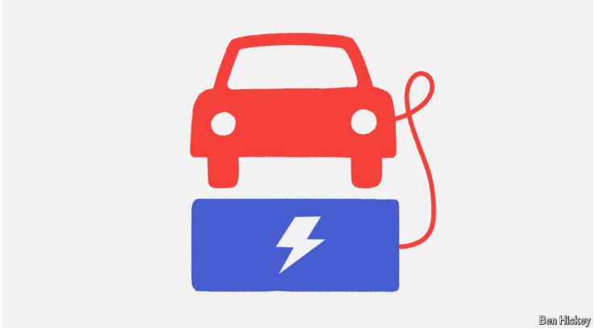

# On energy and climate, Trump and Harris are different by degrees

Green subsidies will probably survive Mr Trump’s re-election, and Big Oil will probably do just fine under Ms Harris

原文：

The next president will inherit the most ambitious climate policies in

American history. Under Joe Biden a trio of laws—the CHIPS and Science Act,

the Bipartisan Infrastructure Law and especially the Inflation Reduction Act

(IRA)—have put in place a sweeping industrial policy that seeks to subsidise

an ambitious decarbonisation of the economy. Left-wingers, who think the

investments are not ambitious enough, hope that a President Kamala Harris

will go further. Conservatives are confident a re-elected President Donald

Trump will tear it all down.

下一任总统将继承美国历史上最雄心勃勃的气候政策。在乔·拜登的领导下，三部法律——芯片和科学法案，两党基础设施法，特别是通货膨胀削减法案(IRA)——已经出台了一项全面的产业政策，旨在补贴经济的雄心勃勃的去碳化。左翼人士认为这些投资不够雄心勃勃，希望卡玛拉·哈里斯总统能走得更远。保守派相信，连任总统唐纳德·特朗普(Donald Trump)将会彻底摧毁这一切。

学习：

trio：英 [ˈtriːəʊ] 三人一组；三重奏；三重唱

sweeping：广泛的；全面的；影响深远的；影响广泛的

tear down： 拆掉；拆除；拆毁；

原文：

It is worth setting aside campaign rhetoric to ask: would a President Harris

go much greener than Mr Biden? And could a re-elected President Trump

really kill Mr Biden’s clean-energy policies?

抛开竞选时的花言巧语，我们有必要问一句:哈里斯总统会比拜登先生更环保吗？特朗普连任总统真的会扼杀拜登的清洁能源政策吗？

原文：

Consider first the Biden energy legacy. Goldman Sachs, a bank, reckons

that, if kept in place, the IRA alone will generate over $3trn in public and

private investment in clean technologies by 2030. But Mr Biden has also

presided over a fossil-fuel boom. His administration encouraged

hydrocarbon production to offset the impacts on energy markets of war in

Ukraine and the Middle East, so America is now the world’s biggest oil-and-

gas exporter.

首先考虑拜登的能源遗产。高盛银行认为，如果IRA继续存在，到2030年将会产生超过3万亿美元的公共和私人清洁技术投资。但是拜登先生也领导了化石燃料的繁荣。他的政府鼓励碳氢化合物生产以抵消乌克兰和中东战争对能源市场的影响，因此美国现在是世界上最大的石油和天然气出口国。

学习：

presided：主持；统辖；（preside的过去式）          

原文：

Ms Harris cast the deciding vote for the IRA and has raised hopes on the left

because of her past greenery. As California’s attorney-general she sued

energy companies over pipeline leaks and offshore oil development. During

her failed presidential bid in 2019 she supported a ban on shale fracking and

the Green New Deal. Some environmentalists dream that, if elected, she

might declare a national “climate emergency” to promote even more

ambitious action than Mr Biden did.

哈里斯女士为IRA投下了决定性的一票，并且因为她过去的绿色行动而提高了左派的希望。作为加州总检察长，她起诉能源公司管道泄漏和近海石油开发。在2019年竞选总统失败期间，她支持禁止页岩压裂和绿色新政。一些环保主义者梦想，如果她当选，她可能会宣布全国进入“气候紧急状态”，以推动比拜登先生更具雄心的行动。

学习：

cast a vote：投票

shale：页岩

原文：

Yet there are clear indications that Ms Harris will embrace both clean energy

and fossil fuels. She now explicitly supports domestic oil-and-gas

production and fracking, and she openly endorses such green bugbears as

nuclear power and reform of the permit process (which would allow all

types of new energy infrastructure to be built more quickly).

然而，有明显的迹象表明，哈里斯女士将同时支持清洁能源和化石燃料。她现在明确支持国内油气生产和水力压裂法，并公开支持核能和许可程序改革(这将允许所有类型的新能源基础设施更快地建设)等绿色困扰。

学习：

indications：迹象；指示

bugbear：令人烦恼的事物；令人恐惧的事物；妖怪；使人烦恼的原因；困扰

原文：

If a Harris presidency is likely to offer continuity, could a Trump presidency

represent a radical reversal? When he was in the White House Mr Trump

embraced fossil fuels and tried to roll back environmental regulations. He

might again launch an assault on the Environmental Protection Agency and

its regulation of exhaust-pipe and power-plant emissions, but his record in

the courts last time was poor, and a recent Supreme Court ruling curtailing

the interpretive powers of agencies like EPA will complicate matters. During

this year’s campaign Mr Trump’s energy mantra has been “Drill, baby,

drill!” and he has mocked climate science and electric vehicles (EVs). Big Oil

bosses have openly endorsed him. Thanks to Mr Trump’s earlier success in

appointing conservative judges, courts may look more favourably on his

agenda. Yet experts agree that the wholesale scrapping of the IRA is highly

unlikely.

如果哈里斯当选总统可能会提供连续性，特朗普当选总统会不会代表一种彻底的逆转？特朗普在白宫时支持化石燃料，并试图取消环境法规。他可能会再次对环境保护署及其对排气管和发电厂排放的监管发起攻击，但他上次在法庭上的记录很差，最近最高法院的一项裁决削弱了环保局等机构的解释权，这将使问题复杂化。在今年的竞选中，特朗普的能源口号一直是“钻吧，宝贝，钻吧！”他还嘲笑气候科学和电动汽车。大型石油公司老板已经公开支持他。由于特朗普此前在任命保守派法官方面的成功，法院可能会更看好他的议程。然而，专家们一致认为，大规模废除IRA是非常不可能的。

学习：

roll back：击退；削减

exhaust-pipe：排气管

curtail：削减；缩减

mantra：口头禅；经常重复的话；信条；准则

scrapping：废除

原文：

The most likely impact, says Jeff Navin of Boundary Stone, an energy

consultancy, would be on IRA tax breaks. But except for credits for buying 

EVs,most of these look secure. Nearly four-fifths of credits are flowing to

Republican districts, which explains why 18 Republican congressmen

declared in August that they opposed IRA repeal. Big Oil loves its subsidies

for hydrogen and carbon capture. A former Trump energy secretary now

running the top utilities lobby has said his priority is defending credits for

his industry.

能源咨询公司Boundary Stone的Jeff Navin说，最有可能的影响是IRA的税收减免。但除了购买电动汽车的税收抵免，大多数看起来都很安全。近五分之四的抵免流向共和党选区，这解释了为什么18名共和党国会议员在8月份宣布他们反对废除IRA。大型石油公司喜欢其对氢和碳捕获的补贴。一位前特朗普能源部长，现在负责最高公用事业游说团，他说他的首要任务是捍卫他的行业的税收抵免。

学习：

repeal：废除（法律或规章）；撤销；废止

>
>这里的 **"credits"** 指的是税收抵免（tax credits），即政府为了鼓励特定类型的行为或投资（如购买电动汽车、氢能和碳捕获项目）而提供的税收优惠。这些税收抵免可以减少企业或个人的应缴税额，有时甚至能够大幅降低投资成本，因此对相关行业非常有吸引力。
>
>### 例子：
>- **English**: If you buy an electric vehicle, you may qualify for a $7,500 tax credit, which reduces the amount of federal taxes you owe.
>- **中文**：如果你购买一辆电动汽车，你可能有资格获得7500美元的税收抵免，从而减少你需要缴纳的联邦税额。

原文：

The picture is less clear on spending. If money has not yet been disbursed,

Mr Trump could make it harder for agencies to do so. However, officials are

rushing to get remaining funds out of the door. The third category,

discretionary money, is easier to gum up. The Department of Energy has not

spent much of a $300bn-plus kitty meant to help scale up novel climate

technologies. Mr Trump could in theory quash this lending, though in

practice energy-industry lobbies would oppose this, too.

支出方面的情况不太明朗。如果资金尚未发放，特朗普可能会让机构更难发放。然而，官员们正忙着将剩余资金转移出去。第三类，自由支配的钱，更容易搞砸。能源部没有花掉3000多亿美元来帮助扩大新气候技术的规模。特朗普理论上可以取消这一贷款，尽管实际上能源行业游说团体也会反对。

学习：

disbursed：美 [dɪsˈbɜ:st] 支出；支付；（disburse的过去分词）

discretionary：可任意使用的；全权决定的          

gum up：搞糟；打乱          

kitty：公款；小金库；奖金池

quash：撤销；取消；废止

原文：

The Trump administration’s withdrawal from the Paris Agreement on

climate change did not notably retard international efforts. Mr Trump might

undermine pledges by the Biden administration to reduce methane

emissions, but such acts of self-isolation would hardly come as a shock

abroad. At home, a Trump victory would not mean a collapse in climate

efforts either, but it would still give Wall Street pause. Wood Mackenzie, a

consultancy, reckons a Trump presidency would reduce investment in

America’s energy transition by $1trn by 2050, to roughly $6trn. So the

choice voters will make in November will either hold steady America’s

current pace of decarbonisation or slow it. Either way, the direction of travel

will remain largely unchanged.■

特朗普政府退出气候变化巴黎协定并没有明显阻碍国际努力。特朗普可能会破坏拜登政府减少甲烷排放的承诺，但这种自我孤立的行为在国外不会引起震惊。在国内，特朗普的胜利也不意味着气候努力的崩溃，但它仍会让华尔街暂停。咨询公司Wood Mackenzie估计，到2050年，特朗普当选总统将使美国能源转型投资减少1万亿美元，至约6万亿美元。因此，选民将在11月做出的选择要么保持美国当前的去碳化速度，要么减缓这一速度。不管怎样，方向将基本保持不变。■

学习：

retard：减缓；延缓；阻止；妨碍

energy transition：能源转型

## 后记

2024年10月13日18点01分于上海。

