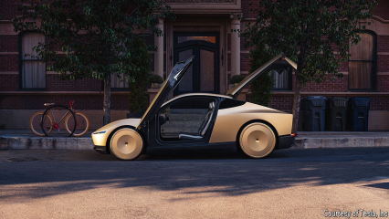

# The trouble with Elon Musk’s robotaxi dream

Scaling up self-driving taxis will be hard, and competition will be fierce

原文：

**E**LON MUSK’S choice of Warner Bros Studios for the long-

anticipated launch of his robotaxi on October 10th was entirely

appropriate. Hollywood’s film studios are as much a dream factory

as Tesla, his electric-car company. The vision he served up,

accompanied by whoops of delight from the superfans in the

audience, is an autonomous Cybercab so cheap that it will serve as

“individualised mass transit”. But Mr Musk’s promises were, like

many Hollywood movies, long on bombast and short on reality.

The road to self-driving taxis will be long, and Tesla will face

intense competition along the way.

埃隆·马斯克选择华纳兄弟工作室在10月10日举行期待已久的robotaxi发布会是完全合适的。好莱坞的电影制片厂和他的电动汽车公司特斯拉一样，都是梦工厂。伴随着观众中超级粉丝的欢呼，他提出的愿景是一个自动驾驶的Cybercab，它非常便宜，可以充当“个性化的公共交通工具”。但是马斯克先生的承诺就像许多好莱坞电影一样，夸夸其谈，缺乏现实。自动驾驶出租车的道路将是漫长的，特斯拉一路上将面临激烈的竞争。

学习：

 long-anticipated：期待已久的

serve up：呈现，提供，展示

>
>这里的 **"serve up"** 是一个 **俚语表达**，意思是 **呈现、提供或展示**（特别是带有某种吸引力或令人兴奋的方式）。在这个语境中，它指的是 **埃隆·马斯克向观众展示他的机器人出租车的愿景**，伴随着粉丝的欢呼，类似于电影工作室向观众呈现梦幻般的电影。
>
>例子：
>
>- **English**: The chef served up a delicious three-course meal.  
>- **中文**：厨师呈上一顿美味的三道菜大餐。  
>
>- **English**: The politician served up promises of tax cuts during his campaign.  
>- **中文**：这位政治家在竞选期间提出了减税的承诺。
>
>在这里，**"served up"** 强调了马斯克的发布会不仅仅是宣布技术，而是像好莱坞的电影一样，把未来的愿景包装得引人入胜。但文中也暗示这些承诺可能 **夸大其词，缺乏现实基础**，类似于一些好莱坞大片“雷声大雨点小”的情况。

whoops：呼喊；高喊；喊叫；大声叫喊；（whoop的第三人称单数）

mass transit：公共交通；大众运输系统          

long on：长于；擅长

bombast：夸夸其谈；浮夸的言辞

原文：

The Cybercab, a two-seater car without a steering wheel or pedals,

will be on sale “before 2027”, according to Mr Musk, though his

timelines often slip—he once promised a fleet of 1m robotaxis by 2020.

He also showed off a Robovan, which will carry 20

passengers, and modestly predicted that his humanoid robot will be

the “biggest product ever of any kind”. Yet the event, which was

light on details, disappointed investors; Tesla’s share price fell by

9% the following day.

根据马斯克的说法，没有方向盘或踏板的双座汽车Cybercab将“在2027年之前”出售，尽管他的时间表经常推迟——他曾承诺到2020年拥有100万辆robotaxis。他还展示了一个可以搭载20名乘客的Robovan，并谦虚地预测他的人形机器人将是“有史以来最大的产品”。然而，这一轻细节的事件令投资者失望；第二天，特斯拉的股价下跌了9%。

学习：

two-seater：双座汽车；双座飞机；双人座

two-seater car：双座汽车

steering wheel：方向盘

原文：

In recent years robotaxi services have popped up in a growing

number of cities. Waymo, a division of Alphabet, has raced ahead

in America. After 15 years and perhaps $30bn of investment it now

has a fleet of 700 self-driving cabs operating in Los Angeles, San

Francisco and Phoenix, and will soon launch in Atlanta and Austin.

Farther back is Cruise, whose biggest investor is General Motors. It

also operates in Phoenix and is resuming tests in San Francisco

after regulators slammed on the brakes following an accident last

year. Zoox, Amazon’s contribution to driverless travel, is testing

vehicles in five locations including Las Vegas and Miami.

近年来，robotaxi服务已经在越来越多的城市出现。Alphabet旗下的Waymo已经在美国遥遥领先。经过15年的时间和大约300亿美元的投资，它现在拥有一支由700辆无人驾驶出租车组成的车队，在洛杉矶、旧金山和凤凰城运营，并将很快在亚特兰大和奥斯汀推出。再往后是克鲁斯，他的最大投资者是通用汽车。它还在凤凰城运营，并在去年发生事故后监管机构踩下刹车后，正在旧金山恢复测试。亚马逊对无人驾驶旅行的贡献Zoox正在拉斯维加斯和迈阿密等五个地点测试车辆。

学习：

cab：出租车；

原文：

China has also become a hotspot for autonomy. Apollo Go, the

robotaxi unit of Baidu, a Chinese tech giant, launched its service in

Wuhan in 2022 and has since expanded to ten other Chinese cities.

It aims to double its Wuhan fleet to 1,000 robotaxis by the end of

the year. Other Chinese firms including Pony.ai, WeRide and Didi,

the country’s biggest ride-hailing firm, are also experimenting with

robotaxis in a number of big cities.

中国也成为了自动驾驶的热土。中国科技巨头百度旗下的机器人平台萝卜快跑于2022年在武汉推出了这项服务，并已扩展到中国其他十个城市。该公司的目标是到今年年底将武汉的自动驾驶汽车数量增加一倍，达到1000台。其他中国公司，包括Pony.ai、WeRide和中国最大的打车公司滴滴，也在一些大城市试验robotaxis 。

原文：

But a series of pilots in a handful of cities is far from the go-

anywhere vision that Elon Musk has espoused, and there is still no

guarantee of meaningful profits in the foreseeable future. Waymo

and its competitors so far mostly operate in places where the

weather is fine and the roads are straight and wide. Expanding to

trickier cityscapes will take time and money. To deploy its service

in a new city, Waymo has to invest significant sums upfront to

compile detailed 3D maps and build other necessary infrastructure.

但是，在少数几个城市进行的一系列试点离埃隆·马斯克所倡导的无处不在的愿景还很远，而且在可预见的未来仍无法保证有意义的利润。迄今为止，Waymo及其竞争对手大多在天气晴朗、道路笔直宽阔的地方运营。扩展到更复杂的城市景观需要时间和金钱。为了在一个新城市部署其服务，Waymo必须预先投资大量资金来编制详细的3D地图，并建立其他必要的基础设施。

学习：

espouse：支持；拥护

upfront：预先；事先

sums：金额

原文：

The cost of the self-driving vehicles themselves—around $150,000

apiece for Waymo—also remains a problem. Around two-thirds of

that is estimated to come from hardware. To operate their vehicles

autonomously, Waymo and others are relying on a battery of

expensive sensors including cameras, radars and lidars, which use

lasers to create a 3D image of the vehicle’s surroundings, as well as

oodles of in-car computing power to make sense of all the data.

自动驾驶汽车本身的成本——对Waymo来说，每辆大约15万美元——也仍然是个问题。据估计，其中大约三分之二来自硬件。为了自主驾驶车辆，Waymo和其他公司依赖一组昂贵的传感器，包括摄像头、雷达和激光雷达，这些传感器使用激光来创建车辆周围的3D图像，以及大量的车内计算能力来理解所有数据。

学习：

a battery of：一连串的          

lidar：美 [ˈlaɪdɑr]  激光雷达

oodles：英 [ˈuːd(ə)lz] 大量；众多；成堆

## **Roadblocks**

原文：

Human drivers account for well over half the fare of ride-hailing

services such as Uber and Lyft, which might suggest a big

opportunity for self-driving cabs. Yet Waymo still employs remote

“safety drivers” to keep an eye on its vehicles. Significant amounts

of real estate are also needed close to city centres in order to

charge, clean and maintain robotaxis. Bernstein, a broker,

calculates that once all costs are considered, fares for self-driving

taxis will remain higher than for human ones for some time. What

is more, replacing the fleet of Uber and Lyft cars in America with

robotaxis would require up to 400,000 vehicles, Bernstein reckons.

At the current cost of a Waymo, that would mean an investment of

around $60bn.

在优步和来福车等打车服务中，人类司机占了一半以上的份额，这可能意味着无人驾驶出租车的巨大机遇。然而，Waymo仍然雇佣远程“安全司机”来监视其车辆。为了给无人驾驶汽车充电、清洁和维护，市中心附近还需要大量的房地产。经纪人伯恩斯坦(Bernstein)计算出，一旦考虑到所有成本，无人驾驶出租车的费用在一段时间内仍将高于人工出租车。更重要的是，Bernstein估计，用robotaxis替换美国的优步和来福车车队将需要多达40万辆汽车。以Waymo目前的成本计算，这意味着大约600亿美元的投资。

学习：

ride-hailing：打车

原文：

Tesla is betting it can make a cheaper option work. Its “full-self

driving” system, which will be the underlying tech for its robotaxis,

relies only on cameras to collect information. Data from these will

go into an “end-to-end neural network”—an algorithmic black box

trained on 9bn miles of driving data from the 6m Teslas already on

the road—to produce driving commands. As a result, Tesla says its

robotaxis will cost under $30,000 and will be easier to transfer

from one city to another.

特斯拉打赌它能让更便宜的选择发挥作用。它的“全自动驾驶”系统将成为其robotaxis的基础技术，仅依靠摄像头来收集信息。来自这些系统的数据将进入一个“端到端神经网络”——一个算法黑匣子，根据已上路的600万辆特斯拉汽车的90亿英里驾驶数据进行训练——以产生驾驶命令。因此，特斯拉表示，其robotaxis的成本将低于3万美元，并且更容易从一个城市转移到另一个城市。

原文：

Even if Tesla can make the technology work, it will still need to

convince regulators of its approach. Its neural network will be far

less transparent than the modular systems used by Waymo and

others. And regulators may not trust that relying solely on cameras

will be sufficient to deal with rare and unusual “edge cases”.

Officials are already wary of safety after Cruise’s accident last year,

in which one of its vehicles dragged along a pedestrian thrown into

its path by a human hit-and-run driver.

即使特斯拉能够让这项技术发挥作用，它仍需要说服监管机构接受它的方法。它的神经网络将远不如Waymo和其他公司使用的模块化系统透明。监管者可能不相信仅仅依靠摄像头就足以处理罕见和不寻常的“边缘案件”。去年克鲁斯发生事故后，官员们已经开始担心安全问题。在那次事故中，克鲁斯的一辆汽车拖着一名行人行驶，这名行人被一名肇事逃逸的司机扔到了路上。

学习：

hit-and-run：肇事逃逸；逃逸；肇事逃跑          

原文：

Mr Musk believes his approach will gain regulatory approval once

it proves it is safer than human drivers. But any incidents that do

occur could still turn off would-be passengers. And some cities

may also resist robotaxis if they are perceived as a threat to public

transport and local jobs or a source of traffic congestion.

马斯克认为，一旦证明其比人类司机更安全，他的方法将获得监管机构的批准。但是任何确实发生的事故仍然会让潜在的乘客失去兴趣。如果robotaxis心被视为对公共交通和当地就业的威胁或交通拥堵的根源，一些城市也可能会抵制robotaxis心。

原文：

Also unresolved is the question of who will own and operate all

these robotaxis. Ride-hailing firms are one possibility. Uber has

signed deals with Waymo and Cruise to make their vehicles

available on its platform in some locations. It has also invested in

Wayve, a British autonomy startup. But the company, which has

only just begun to turn a profit after years of torching cash, may be

reluctant to pour vast sums of money into acquiring a self-driving

fleet.

同样悬而未决的问题是谁将拥有和操作所有这些robotaxis。打车公司是一种可能性。优步已经与Waymo和Cruise签署了协议，在一些地方让他们的车辆可以在其平台上使用。它还投资了英国autonomy初创公司Wayve。但该公司在多年烧钱后才刚刚开始盈利，可能不愿意投入大量资金来收购自动驾驶车队。

学习：

torch cash：烧钱

原文：

During his presentation, Mr Musk speculated that “an Uber or Lyft

driver today” could one day operate a fleet of self-driving cabs

“like a shepherd tends their flock”. That kind of wishful thinking is

part of the reason why JPMorgan Chase, a bank, does not expect

“material revenue generation...for years to come” from Tesla’s

robotaxis. Standing expectantly by the roadside for a driverless lift

will, for most people, involve a long wait. ■

在他的中，马斯克推测，“今天的优步或来福车司机”有一天可能会“像牧羊人照看羊群一样”运营一支无人驾驶出租车车队。这种一厢情愿的想法是摩根大通银行不期望“实质性收入产生”的部分原因...在接下来的几年里,“来自特斯拉的robotaxis”。对大多数人来说，满怀期待地站在路边等待无人驾驶汽车将意味着漫长的等待。■

## 后记

2024年10月19日16点49分于上海。