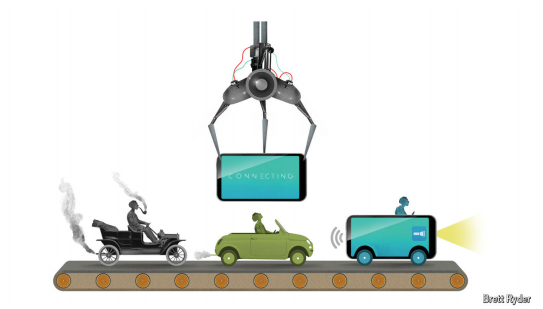

# What if carmaking went the way of consumer electronics?

The Foxconnification of electric vehicles

原文：

**C**ARS AREN’T what they used to be. This is not a petrolhead’s

lament. It is a statement of technological fact. These days even

automobiles powered by a growling V8 engine contain a few

kilometres of electrical wires, up from a few hundred metres in the

1990s, plus a thousand semiconductor chips and millions of lines of

computer code to control everything from locks and antilock brakes

to infotainment. And that is before you get to the electric vehicles

(EVs) that are set to one day hog the world’s roads, a recent

slowdown in sales notwithstanding, let alone to Elon Musk’s self

driving Cybercabs. The battery and other electronics make up more

than half the value of components in an EV, compared with a tenth

in that V8. Now, 17 years after Apple gave the world the iPhone

and 13 since Toyota somewhat prematurely coined the phrase

“smartphone on wheels”, modern cars have a lot in common with

consumer gadgets.

汽车不再是过去的样子了。这不是石油大亨的哀叹。这是对技术事实的陈述。如今，即使是由轰鸣的V8发动机驱动的汽车也包含几公里长的电线，而20世纪90年代只有几百米长，外加1000个半导体芯片和数百万行计算机代码来控制从锁和防抱死制动系统到信息娱乐的一切。这还是在你看到有一天将主宰世界道路的电动汽车(ev)之前，尽管最近销售放缓，更不用说埃隆·马斯克(Elon Musk)的自动驾驶网络出租车了。电池和其他电子设备占电动汽车零部件价值的一半以上，而V8只占十分之一。现在，在苹果给世界带来iPhone 17年后，在丰田有点过早地创造了“轮子上的智能手机”这个短语13年后，现代汽车与消费电子产品有很多共同点。

学习：

growling：隆隆响的；咆哮的

infotainment：英 [ˌɪnfə(ʊ)ˈteɪnm(ə)nt] 资讯娱乐；信息娱乐；娱乐新闻；

hog：独占；贪婪地占用；霸占

notwithstanding：尽管；虽然

gadget：产品

原文：

One company would like them to share another

commonality—namely itself. Foxconn wants to be to carmakers

what it already is to Apple and other consumer-electronics brands,

which is to say their contract manufacturer of choice. On October

8th the firm unveiled two new EV “reference” models, an

unexpectedly handsome people-carrier and an ungainlier small bus.

They join a line-up of six earlier designs for car companies to pick

from, fine-tune to their liking and slap their badge on. One of these,

an SUV, has become a domestic EV bestseller for Luxgen, a 15-

year-old Taiwanese carmaker. Next year Foxconn aims to be mass-

producing a version of it with an American partner. One day it

would love to be churning out Teslas.

一家公司希望他们分享另一个共性——那就是自己。富士康希望成为汽车制造商，就像它已经成为苹果和其他消费电子品牌一样，也就是说成为他们首选的合同制造商。10月8日，该公司发布了两款新的电动“参考”车型，一款出乎意料的漂亮的载人车和一款不太漂亮的小型巴士。他们加入了六个早期设计的行列，让汽车公司从中挑选，根据他们的喜好进行微调，并贴上他们的徽章。其中一款SUV已经成为拥有15年历史的台湾汽车制造商Luxgen在国内最畅销的电动汽车。明年，富士康的目标是与一家美国合作伙伴一起大规模生产它的一个版本。总有一天，它会乐于生产特斯拉。

学习：

ungainly：美 [ˌənˈɡeɪnli]  笨拙的；不雅的；难看的

原文：

If an EV is a smartphone on wheels, why not build it like a

smartphone? And who better to do this than the world’s leading

assembler of electronics? For Foxconn, the $4trn global car market

is a big prize as smartphone sales tail off. For EV newcomers with

no manufacturing chops and legacy car giants with the wrong sort,

farming out assembly could be a way out of “production hell”, as

Mr Musk once memorably described Tesla’s efforts to expand

capacity. And what automotive CEO would pass up an opportunity

to be more like Tim Cook at Apple, overseeing a revered brand,

ungodly profits and a $3.5trn market capitalisation?

如果电动汽车是一部带轮子的智能手机，为什么不像智能手机一样制造呢？还有谁比世界领先的电子组装商更适合做这件事呢？对于富士康来说，随着智能手机销量的减少，4万亿美元的全球汽车市场是一个巨大的奖励。对于没有制造能力的电动汽车新来者和技术不佳的传统汽车巨头来说，外包组装可能是摆脱“生产地狱”的一种方式，马斯克先生曾令人难忘地描述了特斯拉扩大产能的努力。哪个汽车行业的首席执行官会放弃一个更像苹果公司的蒂姆·库克的机会，去监管一个受人尊敬的品牌、不敬的利润和3.5万亿美元的市值？

学习：

tail off：逐渐减少；变小；减弱

chop：技艺；长处

farm out：外包

pass up：放过；放弃；

revered：尊崇；崇敬；（revere的过去式和过去分词）

原文：

This should not be a huge leap for carmakers. Their suppliers

nowadays contribute two-thirds of the value of a vehicle, estimates

Matteo Fini of S&P Global Mobility, a research group, leaving

them to do the design, final assembly, marketing and distribution.

Moreover, integrating all the disparate subsystems is a growing

headache. Already some BMWs, Jaguars and Toyotas, notably low-

volume, high-margin coupés and convertibles, are put together by

contractors such as Magna Styer. In 1999 Ford toyed with getting

out of metal-bending entirely in order to focus on the immaterial

bits of the business. As a Ford executive summed it up to *The*

*Economist* at the time*,* “Auto companies are seen as firms which

invest a lot and get little return. Consumer companies are seen as

investing little and earning a lot.”

对于汽车制造商来说，这不应该是一个巨大的飞跃。据研究机构标普全球移动公司的马泰奥·菲尼估计，如今他们的供应商贡献了一辆汽车价值的三分之二，让他们去做设计、最终组装、营销和分销。此外，集成所有不同的子系统越来越令人头疼。已经有一些宝马、捷豹和丰田，尤其是低产量、高利润的双门跑车和敞篷车，由Magna Styer等承包商组装。1999年，福特完全放弃了金属弯曲业务，专注于业务的非物质部分。正如一位福特高管当时对《经济学人》总结的那样，“汽车公司被认为是投资大回报少的公司。消费类公司被视为投资少、收入高。”

学习：

coupe：英 [ˈkuːpeɪ]  双门轿车；双座四轮轿式马车；双门跑车；

convertibles：有活动折蓬的汽车；可换证券；（convertible的复数）

toy with：短暂的考虑

>在这里，"toy" 是 **动词**，表示“考虑”或“玩味某种想法”，尤其指 **短暂地、不确定地尝试或探讨某种可能性**。
>
>**例句**：
>
>- Ford toyed with the idea of selling its luxury car division.
>  （福特短暂地考虑过出售其豪华车部门。）
>- She toyed with the thought of moving to a new city.
>  （她曾短暂考虑过搬到一个新城市。）
>
>在本文中：
>
>> **"In 1999 Ford toyed with getting out of metal-bending entirely"**
>> 意思是：1999 年时，福特曾经**短暂地考虑**完全退出“金属加工”领域。

>**"Metal-bending"** 在这里是指 **汽车制造过程中涉及金属材料的加工与制造**，如冲压、焊接、和车身框架制造等传统工艺。
>
>本文中的意思是：
>
>- 福特曾考虑过不再亲自从事这些繁重、回报低的金属制造工艺，而将重点转向更加 **“无形”** 的部分，如设计、品牌和服务。

原文：

That idea proved too futuristic for turn-of-the-century Detroit and

was ditched. But the executive’s words rang true then and ring truer

today. Ford and Apple each maintain $40bn or so in fixed assets

and spend $8bn-10bn a year on capital investments. Yet in 2023 the

iPhone-maker raked in more than twice Ford’s revenue and 23

times its net profit. Even if you add its $30bn in research and

development (R&D) costs to its capital expenditure, Apple is

matched by Volkswagen and Toyota, the world’s two biggest

carmakers, neither of which sells as much. As a share of revenue,

Apple’s combined R&D and capital spending, at 10%, is dwarfed

by that of BYD, China’s EV champion, which last year spent 27%.

对于世纪之交的底特律来说，这个想法被证明过于超前，因此被抛弃了。但这位高管的话在当时听起来是对的，今天更是如此。福特和苹果各自拥有约400亿美元的固定资产，每年在资本投资上花费80亿至100亿美元。然而，2023年，这家iPhone制造商的收入是福特的两倍多，净利润的23倍。即使你把苹果300亿美元的研发(R&D)成本加到它的资本支出中，它也能与世界上最大的两家汽车制造商大众和丰田相媲美，这两家公司的销量都没有苹果高。作为收入的一部分，苹果的R&D和资本支出之和为10%，与中国电动汽车冠军比亚迪相比相形见绌，后者去年的支出为27%。

学习：

rake in:轻松赚取大量金钱

>
>
>**"Rake" 的含义**  
>
>在这段话中，**"rake in"** 是一个 **俚语**，表示 **轻松赚取大量金钱**，通常用于描述企业或个人获得巨额利润。  
>
>---
>
>**例句**：
>
>- The casino raked in millions of dollars over the weekend.  
>（这家赌场在周末轻松赚了几百万美元。）  
>- That movie raked in huge profits at the box office.  
>（那部电影在票房上轻松赚取了巨额利润。）  
>
>---
>
>**在本文中的意思**：
>
>> **"In 2023 the iPhone-maker raked in more than twice Ford’s revenue"**  
>> 意思是：2023 年时，**苹果轻松获得的收入超过了福特的两倍**，显示出苹果在利润和营收方面的巨大成功。
>
>---
>
>**总结**  
>
>"Rake in" 强调了苹果公司的**高效盈利能力**，即相比于汽车制造商福特，苹果不仅营收更高，而且更容易获得巨额利润。这也揭示了科技公司和传统制造业之间在商业模式上的巨大差异。

原文：

There are two problems with the Apple comparison. First, the

challenge of replicating one of the best businesses ever may

intimidate even car bosses known for their lorry-sized egos.

Second, Apple relied on contract manufacturers for its iPhone from

the beginning, making it impossible to tell how much of its

outperformance is down to this strategy rather than some other

commercial *je ne sais quoi*

苹果的比较有两个问题。首先，复制有史以来最好的企业之一的挑战可能会让那些以卡车般自负著称的汽车老板们感到害怕。第二，苹果从一开始就依赖合同制造商来生产iPhone，因此很难判断它的优异表现在多大程度上归功于这种策略，而不是其他商业手段

学习：

je ne sais quoi：不可名状的特质；某种特别的东西；某种魅力；

原文：

An earlier consumer-electronics pioneer offers a more instructive

analogy. In 1993 Hewlett-Packard, then one of the world’s biggest

makers of computer hardware, began outsourcing the production of

its PCs, printers and servers. By 2000 virtually all its computers

were made by third parties. In that period HP increased its revenues

from $20bn to $49bn. It pulled this off while barely growing its

fixed-asset base and nearly halving the share of sales going on

R&D and capital expenditure, from 16-18% in 1988-92 to 9% by

the end of the decade. Its global workforce shrank from 96,000 to

88,500. Net profit more than trebled. Return on equity improved

from 12% in the early 1990s to an average of 19% between 1994

and 2000.

一个更早的消费电子先驱提供了一个更有启发性的类比。1993年，当时世界上最大的计算机硬件制造商之一的惠普公司开始外包其个人电脑、打印机和服务器的生产。到2000年，几乎所有的电脑都是由第三方制造的。在此期间，惠普的收入从200亿美元增至490亿美元。它实现了这一目标，但其固定资产基础几乎没有增长，R&D和资本支出的销售份额几乎减半，从1988-92年的16-18%下降到2010年的9%。其全球员工数量从9.6万人缩减至8.85万人。净利润增加了两倍多。股本回报率从20世纪90年代初的12%提高到1994年至2000年间的平均19%。

学习：

trebled：变成三倍；（treble的过去式）

## **HP sauce**

原文：

Now imagine that Toyota or Volkswagen trimmed their outlays

along similar lines. Cutting their R&D and capital spending by half

would free up $19bn apiece in each firm’s cashflow after capital

expenses. Assuming their shares kept trading at a typical recent

multiple of this free cashflow, Volkswagen would stand to gain

$170bn in market value and Toyota some $270bn, more than

doubling and quadrupling their market values, respectively.

现在想象一下，丰田或大众以类似的方式削减支出。将R&D和资本支出削减一半，每家公司扣除资本支出后的现金流将增加190亿美元。假设他们的股票保持在这种自由现金流的典型近期倍数，大众汽车的市值将增加1700亿美元，丰田汽车将增加约2700亿美元，分别是其市值的两倍和三倍以上。

学习：

outlays：花费；费用；（outlay的复数）

原文：

This presupposes other things being equal (they aren’t), powerful

labour unions giving the nod (they wouldn’t) and Foxconn

remaining content with margins that make gaps in a Rolls-Royce’s

bodywork look gaping (fat chance). And it still leaves the car firms

a country mile behind Apple. But as they struggle to reinvent

themselves for the electric-vehicle age, understanding what made

consumer electronics so successful is a good place to start. ■

这是以其他条件不变为前提的(事实并非如此)，强大的工会点头同意(他们不会)，富士康仍然满足于利润率，这使得劳斯莱斯车身上的缺口看起来很大(可能性极小)。这仍然让汽车公司远远落后于苹果。但当他们努力为电动汽车时代重塑自我时，理解是什么让消费电子产品如此成功是一个很好的起点。■

学习：

bodywork：车身；车体

fat chance：机会不大；概率小；不太可能          

country mile：很长的距离；极远的距离；

## 后记

2024年10月20日20点21分于上海。

