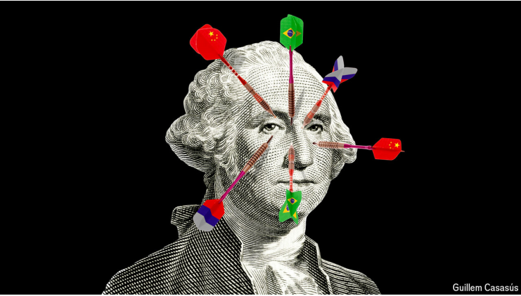
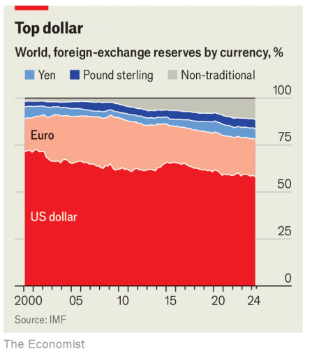

# Putin’s plan to dethrone the dollar

He hopes this week’s BRICS summit will spark a sanctions-busting big bang

dethrone：美 [diˈθroʊn] 废黜（国王或君主）；解除王位；推翻；使降位；撵下台

sanction-busing:  通过某种手段或策略绕过或无视经济制裁的行为

>"Sanction-busting" 的含义  
>在这段话中，“sanction-busting”是一个复合词，指的是通过某种手段或策略绕过或无视经济制裁的行为。这通常涉及到对制裁国的法律或规定的规避，以便继续进行贸易或金融交易。
>
>例句：
>1. Some companies are accused of sanction-busting by continuing to trade with countries under embargo.
>   （一些公司被指控通过继续与受禁运国家进行贸易来规避制裁。）
>
>2. The government is cracking down on sanction-busting activities that undermine international efforts.
>   （政府正在打击那些破坏国际努力的制裁规避活动。）
>
>在本文中的意思：
>“sanctions-busting big bang”意思是：普京希望本周的金砖国家峰会能够引发一个能够打破经济制裁的重大变革或突破，暗示他希望通过这个峰会来寻找绕过制裁的解决方案。
>
>总结  
>这个短语强调了在国际关系中应对经济制裁的复杂性，以及通过合作寻求打破制裁的努力。

原文：

**V**LADIMIR PUTIN, Russia’s president, was cock-a-hoop on

October 22nd when he welcomed world leaders including Narendra

Modi of India and Xi Jinping of China at the BRICS summit in

Kazan on the Volga river. Last year, when the bloc met in South

Africa and expanded from five to ten members, Mr Putin had to

stay home to avoid being arrested on a warrant issued by the

International Criminal Court in The Hague. This time he played

host to a rapidly growing club that is challenging the dominance of

the Western-led order.

10月22日，俄罗斯总统弗拉基米尔·普京在伏尔加河畔的喀山举行的金砖国家峰会上，兴高采烈地欢迎了包括印度的纳伦德拉·莫迪和中国主席在内的世界领导人。去年，当欧盟在南非召开会议，并从5个成员国扩大到10个成员国时，普京不得不呆在家里，以免被海牙国际刑事法院发出的逮捕令逮捕。这一次，他接待了一个快速发展的俱乐部，挑战西方主导的秩序的主导地位。

学习：

cock-a-hoop：得意洋洋的；兴高采烈的；

Volga river：伏尔加河

warrant：逮捕令

原文：

Now in their 15th year together, the original BRICS (Brazil,

Russia, India, China and South Africa) have achieved little. Yet Mr

Putin hopes to give the bloc heft by getting it to build a new

international payments system to attack America’s dominance of

global finance and shield Russia and its pals from sanctions.

“Everyone understands that anyone may face US or other Western

sanctions,” Sergei Lavrov, Russia’s foreign minister, said last

month. A BRICS payments system would allow “economic

operations without being dependent on those that decided to

weaponise the dollar and the euro”. This system, which Russia calls

“BRICS Bridge”, is intended to be built within a year and would let

countries conduct cross-border settlement using digital platforms

run by their central banks. Controversially, it may borrow concepts

from a different project called mBridge, part-run by a bastion of the

Western-led order, the Swiss-based Bank for International

Settlements (BIS).

如今，最初的金砖四国(巴西、俄罗斯、印度、中国和南非)在一起已是第15个年头，但收效甚微。然而，普京希望通过让欧盟建立一个新的国际支付系统来打击美国在全球金融领域的主导地位，并保护俄罗斯及其盟友免受制裁，从而赋予欧盟影响力。“所有人都明白，任何人都可能面临美国或其他西方制裁，”俄罗斯外长谢尔盖拉夫罗夫(Sergei Lavrov)上月表示。金砖国家支付系统将允许“经济运行不依赖于那些决定将美元和欧元武器化的国家”。这个被俄罗斯称为“金砖国家之桥”的系统计划在一年内建成，将允许各国利用其央行运营的数字平台进行跨境结算。有争议的是，它可能会借用另一个名为mBridge的项目的概念，该项目由西方主导秩序的堡垒，总部位于瑞士的国际清算银行(BIS)部分运营。

学习：

heft：重要性；影响力

bastion：美 [ˈbæstʃ(ə)n] 堡垒；防御工事；要塞

原文：

The talks will shine a light on the race to remake the world’s

financial plumbing. China has long bet that payments technology—

not a creditors’ rebellion or armed conflict—will reduce the power

that America gets from being at the centre of global finance. The

BRICS plan could make transactions cheaper and faster. Those

benefits may be enough to entice emerging economies. In a sign

that the scheme has genuine potential, Western officials are wary

that it may be designed to evade sanctions. Some are frustrated by

the unintended role of the BIS, known as the central bank for

central banks.

这些会谈将为重塑世界金融管道的竞赛带来曙光。长期以来，中国一直押注支付技术——而非债权人的反叛或武装冲突——将削弱美国作为全球金融中心所获得的权力。金砖四国的计划可能会让交易更便宜、更快捷。这些好处可能足以吸引新兴经济体。西方官员担心该计划可能是为了逃避制裁，这表明该计划具有真正的潜力。一些人对国际清算银行的意外角色感到沮丧，该银行被称为央行的央行。

学习：

plumbing: 各种交易、支付和资金流动的“管道”
>"Plumbing" 的含义  
>在这段话中，“plumbing”是一个隐喻，用来描述全球金融体系的基础设施和运作机制。这个词通常指水管系统的布局和功能，借用这个比喻来形容金融系统中的各种交易、支付和资金流动的“管道”。
>
>例句：
>1. The plumbing of the city's water supply needs urgent repairs to prevent leaks.
>   （这个城市的水供应管道急需维修，以防止漏水。）
>
>2. Understanding the plumbing of the internet is essential for effective cybersecurity.
>   （了解互联网的基础架构对有效的网络安全至关重要。）
>
>在本文中的意思：
>“the race to remake the world’s financial plumbing”意思是：各国正在竞相重塑全球金融体系的运作机制，尤其是如何进行支付和资金流动，以减少美国在全球金融中心的权力。
>
>总结  
>这里的“plumbing”强调了全球金融体系的复杂性和相互联系，以及中国希望通过技术创新改变这一体系的愿景。

原文：

America’s dominance of the global financial system, centred on the

dollar, has been a mainstay of the post-war order and has put

American banks at the centre of international payments. Sending

money around the world is a bit like taking a long-haul flight; if

two airports are not linked, passengers need to change flights,

ideally at a busy hub. In the world of international payments, the

biggest hub is America.

以美元为核心的美国在全球金融体系中的主导地位，一直是战后秩序的支柱，并使美国银行处于国际支付的中心。在世界各地寄钱有点像坐长途飞机；如果两个机场没有连接，乘客需要改变航班，最好是在繁忙的枢纽。在国际支付领域，最大的枢纽是美国。

学习：

mainstay: 支柱；中流砥柱；主要依靠

haul: 旅程；旅行的距离

long-haul flight:长途飞行；远程航班；长途旅行          

原文：

The centrality of the dollar provides what Henry Farrell and

Abraham Newman, two scholars, call “panopticon” and “choke-

point” effects. Because almost all banks transacting in dollars have

to do so through a correspondent bank in America, it is able to

monitor flows for signs of terrorist-financing and sanctions

evasion. That provides America’s leaders with an enormous lever

of power.

美元的中心地位产生了两位学者亨利·法瑞尔和亚伯拉罕·纽曼所说的“全景监狱”和“咽喉”效应。因为几乎所有用美元交易的银行都必须通过美国的代理银行进行，所以它能够监控恐怖分子融资和逃避制裁的迹象。这为美国领导人提供了巨大的权力杠杆。

学习：

panopticon：全景监狱；环形监狱；

原文：

After Russia’s invasion of Ukraine in 2022, the West froze $282bn

of Russian assets held abroad and disconnected Russian banks from

SWIFT, which is used by some 11,000 banks for cross-border

payments. America has also threatened “secondary sanctions” on

banks in other countries that support Russia’s war effort. This

tsunami has prompted central banks to accumulate gold· and

America’s adversaries to move away from using the dollar for

payments, which China views as one of its biggest vulnerabilities.

2022年俄罗斯入侵乌克兰后，西方冻结了2820亿美元的俄罗斯海外资产，并切断了俄罗斯银行与SWIFT的联系。约1.1万家银行使用SWIFT进行跨境支付。美国还威胁对支持俄罗斯战争的其他国家的银行进行“二次制裁”。这场海啸促使各国央行积累黄金，美国的对手也不再使用美元支付，中国认为这是其最大的弱点之一。

原文：

Mr Putin is hoping to capitalise on this dollar dissatisfaction at the

BRICS summit. For him, creating a new scheme is an urgent

practical priority as well as a geopolitical strategy. Russia’s

foreign-exchange markets now almost exclusively trade yuan, but

because it cannot get enough of this currency to pay for all of its

imports, it has been reduced to bartering.

普京希望在金砖国家峰会上利用这种对美元的不满。对他来说，创建一个新的范式是一个紧迫的实际优先事项，也是一个地缘政治战略。俄罗斯的外汇市场现在几乎只交易人民币，但因为它无法获得足够的人民币来支付所有的进口，它已经沦为以物易物。

学习：

bartering：[贸易]作物物交换；进行易货贸易；（barter的现在分词形式）

原文：

Mr Putin wants the summit to advance plans for BRICS Bridge, a

payments system that would use digital money issued by central

banks and backed by fiat currencies. This would place central

banks, not correspondent banks with access to the dollar clearing

system in America, in the middle of cross-border transactions. The

biggest advantage for him is that no one country could impose

sanctions on another. Chinese state media say that the new BRICS

plan “is likely to draw on the lessons learned” from mBridge, an

experimental payments platform developed by the BIS alongside

the central banks of China, Hong Kong, Thailand and the United

Arab Emirates (see chart).

普京希望此次峰会推进金砖国家桥(BRICS Bridge)计划，这是一个支付系统，将使用由各国央行发行、由法定货币支持的数字货币。这将把各国央行，而不是能够进入美国美元清算系统的代理行，置于跨境交易的中间。对他来说，最大的优势是没有一个国家可以对另一个国家实施制裁。中国官方媒体表示，新的金砖国家计划“很可能借鉴”mBridge的经验教训。mBridge是一个实验性支付平台，由国际清算银行与中国、中国香港、泰国和阿联酋的央行共同开发(见图表)。

学习：

fiat： 法定货币

>"Fiat" 的含义  
>在这段话中，“fiat”指的是法定货币，即由政府或中央银行颁布并被广泛接受的货币，通常没有内在价值，仅凭政府的命令和社会的信任而具有价值。
>
>例句：
>1. The US dollar is a fiat currency that is used as the world’s primary reserve currency.
>   （美元是一种法定货币，是世界主要的储备货币。）
>
>2. Many people prefer to invest in gold rather than fiat currencies due to concerns about inflation.
>   （由于对通货膨胀的担忧，许多人更愿意投资黄金而不是法定货币。）
>
>在本文中的意思：
>“digital money issued by central banks and backed by fiat currencies”意思是：由中央银行发行并以法定货币为支持的数字货币，这表明这种数字货币的价值依赖于政府的支持和经济基础。
>
>总结  
>“fiat”强调了数字货币的价值来源，即它是基于国家信用的，而不是由物理资产（如黄金）支撑的，这为国际支付系统的稳定性提供了一种保障。

draw on：汲取；借鉴；

draw on the lessons ：汲取经验教训

原文：

That BIS experiment was innocent in design and initiated in 2019,

before Russia’s full-scale invasion. It has been stunningly

successful, according to several people involved in the project. It

could cut transaction times from days to seconds and transaction

costs to almost nothing. In June the BIS said mBridge had reached

“minimum viable product stage” and Saudi Arabia’s central bank

joined as a fifth partner in the scheme. This week an Emirati

official said the platform has since processed hundreds of

transactions worth billions of dollars in total—a figure that is

growing rapidly. By creating a system that could be more efficient

than the current one—and which would weaken the dominance of

the dollar—the BIS has unwittingly stepped into a geopolitical

minefield.

国际清算银行的实验在设计上是无辜的，并于2019年启动，在俄罗斯全面入侵之前。据几个参与该项目的人说，它取得了惊人的成功。它可以将交易时间从几天缩短到几秒，交易成本几乎为零。今年6月，国际清算银行表示，mBridge已经达到“最低可行产品阶段”，沙特阿拉伯央行作为第五个合作伙伴加入了该计划。本周，一名阿联酋官员表示，该平台已经处理了数百笔交易，总价值达数十亿美元——这个数字还在快速增长。通过创建一个可能比当前更有效率的体系——这将削弱美元的主导地位——国际清算银行无意中踏入了一个地缘政治雷区。

学习：

full-scale：全幅的；全范围的          

full-scale invasion：全面入侵

unwittingly：无意地；不知不觉地；不经意地；

minefield：雷区；布雷区；危险区域

原文：

“If someone is transacting outside of the dollar system for political

reasons, you want that to be more expensive for them than the

dollar system,” says Jay Shambaugh, a Treasury Department

official. The efficiency gains of new kinds of digital money may

erode the use of the dollar in cross-border trade, according to the

Fed. Reciprocally they could boost China’s currency. Speaking to

bankers and officials about mBridge in September, a Hong Kong

official said it “provides another opportunity to allow the easier use

of the renminbi in cross-border payment, and Hong Kong as an

offshore hub stands to benefit”.

“如果有人出于政治原因在美元体系之外进行交易，你会希望他们付出比美元体系更高的代价，”美国财政部官员Jay Shambaugh表示。美联储表示，新型数字货币的效率提升可能会侵蚀美元在跨境贸易中的使用。反过来，它们可能会推高人民币的地位。一名香港官员在9月份与银行家和官员谈论mBridge时表示，它“提供了另一个让人民币在跨境支付中更容易使用的机会，而香港作为离岸中心将从中受益”。

学习：

reciprocally：美 [rɪ'sɪprəklɪ] 相反地；

原文：

Is it possible that mBridge’s concepts and code might be replicated

by the BRICS, China or Russia? The BIS doubtless views mBridge

as a joint project and believes that it has the ultimate say over who

can join. Yet some Western officials say that participants in the

mBridge trial may be able to pass on the intellectual capital it

involves to others, including participants in the BRICS Bridge.

According to multiple sources, China has taken a lead on the

software and code behind the mBridge project. The People’s Bank

of China (PBOC), the central bank, leads its technology

subcommittee and, according to comments made by a BIS official

in 2023, its digital ledger “was built by” the PBOC. Perhaps this

technology and know-how could be used to build a parallel system

beyond the reach of the BIS or its Western members. The BIS has

declined to comment on any similarities between its experiment

and Mr Putin’s plan.

金砖四国、中国或俄罗斯有可能复制mBridge的概念和代码吗？BIS无疑将mBridge视为一个联合项目，并认为它对谁能加入拥有最终决定权。然而，一些西方官员表示，mBridge试验的参与者可能会将其中涉及的知识资本传递给其他人，包括金砖国家桥梁的参与者。据多个消息来源称，中国在mBridge项目背后的软件和代码方面处于领先地位。中国央行中国人民银行(PBOC)领导着其技术小组委员会，根据国际清算银行一名官员2023年的评论，其数字账本“由”PBOC“建造”。也许这种技术和诀窍可以用来建立一个平行系统，超越国际清算银行或其西方成员的能力。国际清算银行拒绝评论其实验与普京计划之间的任何相似之处。

原文：

The BRICS’s foray into the payments race reveals the new

geopolitical challenges facing multilateral organisations. At a

meeting of the G20 group of large economies in 2020, the BIS was

given the job of both improving the existing system and, at China’s

urging, of experimenting with digital currencies. Earlier this year

Agustín Carstens, its boss, called for “entirely new architectures”

and a “fundamental rethink of the financial system”. As different

members of the organisation have rival objectives, staying above

the fray is getting harder. The world has become more difficult to

navigate, acknowledges Cecilia Skingsley, the boss of the BIS

Innovation Hub. But she says the BIS still has a role to play in

solving problems for all countries “almost independent of what

other kind of agenda they might have”.

金砖四国参与支付竞赛，揭示了多边组织面临的新的地缘政治挑战。在2020年由大型经济体组成的20国集团(G20)的一次会议上，国际清算银行被赋予了改善现有体系和在中国的敦促下试验数字货币的任务。今年早些时候，其老板奥古斯丁·卡斯滕斯(Agustín Carstens)呼吁“全新的架构”和“对金融体系的根本反思”。由于该组织的不同成员有相互竞争的目标，保持中立变得越来越困难。国际清算银行创新中心的老板Cecilia Skingsley承认，这个世界变得更加难以驾驭。但她表示，国际清算银行在解决所有国家的问题方面仍将发挥作用，“几乎与它们可能拥有的其它议程无关”。

学习：

foray：尝试；短暂尝试；初步尝试

stay above the fray： 保持中立或不参与激烈争论或冲突

>"Staying above the fray" 的含义
>在这段话中，“staying above the fray”指的是保持中立或不参与激烈争论或冲突，以避免被卷入复杂和对立的局势。
>
>例句：
>
>1. The mediator tried to stay above the fray during the negotiations to ensure a fair outcome. （调解人在谈判中试图保持中立，以确保公正的结果。）
>2. As a journalist, it's important to stay above the fray and report the facts without bias. （作为一名记者，保持中立并不偏不倚地报道事实是很重要的。）
>
>在本文中的意思： “staying above the fray is getting harder”意味着：在面对不同成员国之间的竞争目标时，保持中立和客观变得越来越困难。

navigate：是在复杂的环境或情况中找到解决方案

>"Navigate" 的含义
>在这段话中，“navigate”指的是在复杂的环境或情况中找到解决方案或合适的路径，通常涉及谨慎的决策和策略。
>
>例句：
>
>1. The captain had to navigate through rough waters to reach the safe harbor. （船长必须在波涛汹涌的水域中找到安全的港口。）
>2. She learned to navigate the complexities of corporate politics during her years at the company. （在公司工作多年后，她学会了如何应对公司政治的复杂性。）
>
>在本文中的意思： “the world has become more difficult to navigate”意味着：当前的国际局势变得更加复杂，使得各国在解决问题时面临更大的挑战。

原文：

One option for America and its allies is to try to hobble new

payments systems that compete with the dollar. Western officials

have warned the BIS that the project could be misused by countries

with malign motives. The BIS has since slowed down its work on

mBridge, according to some former staff and advisers, and is

unlikely to admit any new members to the project.

美国及其盟友的一个选择是试图阻碍与美元竞争的新支付系统。西方官员警告国际清算银行，该项目可能会被怀有恶意的国家滥用。据一些前工作人员和顾问称，国际清算银行此后放缓了mBridge的工作，并且不太可能接纳任何新成员加入该项目。

学习：

hobble：妨碍；跛行；阻止；

admit：准许进入；允许加入

admit any new members to the project： 接纳新成员加入该项目

原文：

Another option is to improve the dollar-based system so that it is as

efficient as new rivals. In April the New York Fed joined six other

central banks in a BIS project aimed at making the existing system

faster and cheaper. The Federal Reserve may also link its domestic

instant-payments system with those in other countries. SWIFT

plans to conduct trials of digital transactions next year, leveraging

some of its incumbent advantages including strong network effects

and trust, says Tom Zschach, its innovation chief.

另一个选择是改进以美元为基础的体系，使其与新的竞争对手一样高效。4月份，纽约联邦储备银行和其他六家央行一起加入了国际清算银行的一个项目，旨在使现有系统更快更便宜。美联储也可能将其国内即时支付系统与其他国家的系统连接起来。SWIFT创新主管Tom Zschach表示，SWIFT计划明年进行数字交易试验，利用现有的一些优势，包括强大的网络效应和信任。

原文：

Any rival BRICS payments system will still face huge challenges.

Guaranteeing liquidity will be difficult or require large implicit

government subsidies. If the underlying flows of capital and trade

between two countries are imbalanced, which they usually are, they

will have to accumulate assets or liabilities in each other’s

currencies, which may be unappealing. And to scale up a digital

currency system, countries must agree on complex rules to govern

settlement and financial crime. Such unanimity is unlikely to win

the day in Kazan.

任何与之竞争的金砖国家支付系统仍将面临巨大挑战。保证流动性将很困难，或者需要大量隐性政府补贴。如果两个国家之间的资本和贸易流动失衡(这种情况经常发生)，它们将不得不以对方的货币积累资产或负债，这可能没有吸引力。为了扩大数字货币系统，各国必须就管理结算和金融犯罪的复杂规则达成一致。这样的一致不太可能在喀山赢得胜利。

学习：

win the day：获胜；取得胜利；成功；战胜对手          

unanimity：一致同意；全体一致；同意          

原文：

For all that, the BRICS scheme may have momentum. There is a

broad consensus that current cross-border payments are too slow

and expensive. Although rich countries tend to focus on making it

quicker, many others want to overturn the current system entirely.

At least 134 central banks are experimenting with digital money,

mostly for domestic purposes, reckons the Atlantic Council, a

think-tank in Washington. The number working on such currencies

for cross-border transactions has doubled to 13 since Russia

invaded Ukraine.

尽管如此，金砖四国计划可能会有势头。人们普遍认为，目前的跨境支付太慢、太贵。尽管富裕国家倾向于致力于使其更快，但许多其他国家想要完全推翻当前的体系。华盛顿智库大西洋理事会估计，至少有134家央行正在试验数字货币，主要用于国内目的。自俄罗斯入侵乌克兰以来，从事跨境交易的此类货币数量已增加一倍，至13种。

原文：

This week’s BRICS summit is no Bretton Woods. All that Russia

and its pals have to do is move a relatively small number of

sanctions-related transactions beyond America’s reach. Still, many

are aiming higher. Next year the BRICS summit will be held in

Brazil, chaired by its president, Luiz Inácio Lula da Silva, who

fulminates over the power of the greenback. “Every night I ask

myself why all countries have to base their trade on the dollar,” he

said last year. “Who was it that decided?” ■

本周的金砖国家峰会不是布雷顿森林会议。俄罗斯及其盟友所要做的就是将相对较少的制裁相关交易转移到美国范围之外。尽管如此，许多人的目标更高。明年金砖四国峰会将在巴西举行，由巴西总统路易斯·伊纳西奥·卢拉·达席尔瓦主持，他强烈谴责美元的力量。“每天晚上我都问自己，为什么所有国家都必须以美元为基础进行贸易，”他去年表示。“是谁决定的？”■

学习：

fulminate：英 [ˈfʊlmɪneɪt]  猛烈抨击；严厉谴责；

## 后记

2024年10月27日19点48分于上海。

