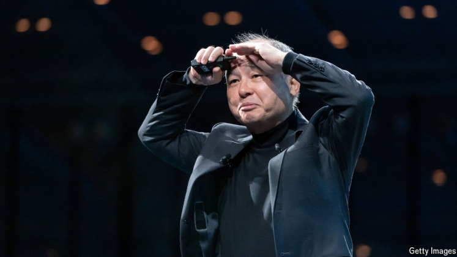

# Softbank’s gambling founder, Masayoshi Son, is catnip for authors

But readers will remember him as much for his missteps as for his successes

catnip：[植物]猫薄荷；猫草；

>**“Catnip”** 在这个上下文中是一个比喻，指某人或某物对某类人的强烈吸引力或诱惑。就像猫对猫薄荷的反应一样，某些人或事物会让特定的受众感到特别兴奋或着迷。
>
>**例句：**
>- The new superhero movie is catnip for comic book fans.
>（这部新超级英雄电影对漫画书迷来说非常吸引人。）
>- His charismatic personality is catnip for potential investors.
>（他有魅力的个性对潜在投资者来说极具吸引力。）
>
>在这段话中，"catnip for authors" 意思是Masayoshi Son的故事和个性对作者们来说非常吸引，他们乐于写关于他的成功与失败的作品。

**Gambling Man.** By Lionel Barber. *Allen Lane; 416 pages; £30. To*

*be published in America by Atria/One Signal in January; $29.99*

**The Money Trap.** By Alok Sama. *St Martin’s Press; 304 pages;*

*$30. Macmillan Business; £22*

原文：

**M**ASAYOSHI SON, boss of SoftBank, a Japanese tech and

telecoms giant, is one of the boldest investors of modern times. He

earned billions from prescient investments in Arm Holdings, a chip

company, and Yahoo and Alibaba, two internet pioneers. Yet Mr

Son also vaporised billions with astonishing speed by staking the

likes of WeWork and countless other tech confections. Revered for

his insight, he is mocked for his overreach.

日本科技和电信巨头软银的老板孙正义是现代最大胆的投资者之一。他通过对芯片公司Arm Holdings以及互联网先驱雅虎和阿里巴巴的预见性投资赚了数十亿美元。然而，孙正义也以惊人的速度蒸发了数十亿美元，投资了WeWork和无数其他科技产品。他因其洞察力而受人尊敬，因其不自量力而受人嘲笑。

学习：

prescient： 英 [ˈprɛsɪənt] 预知的；先觉的；预示性的

confection： 糖果；甜食；甜点；制作精良的物品；混合物

这里指的是“看似华丽但实际上可能缺乏实质基础或价值的事物”

>**“Confection”** 在这个上下文中指的是一些看似华丽但实际上可能缺乏实质基础或价值的事物。在商业和投资的语境中，这通常指那些被过度包装或宣传，但可能并没有实质性收益的公司或项目。
>
>**例句：**
>- The startup was more of a confection than a solid business model.
>（这家初创公司更像是一个华而不实的概念，而不是一个扎实的商业模式。）
>- Many tech companies can appear as confections during the hype of an IPO.
>（许多科技公司在首次公开募股的炒作中可能看起来像是华而不实的产品。）
>
>在这段话中，"countless other tech confections" 意思是指Masayoshi Son投资的一些科技项目和公司，它们可能在表面上看起来很吸引人，但实际上却没有稳固的基础或长期的成功潜力。

overreach：贪功致败；不自量力

>**“Overreach”** 指的是在某个领域或情况中超出能力范围或界限的行为，通常意味着过于雄心勃勃的尝试或冒险，导致失败或负面后果。在商业或投资的语境中，它常常指的是投资者或公司在追求增长或利润时，做出了不切实际的决策，结果反而遭遇损失。
>
>**例句：**
>- The company's overreach in expanding too quickly led to significant financial losses.
>（公司过于急于扩张，导致了巨大的财务损失。）
>- His overreach in trying to dominate the market resulted in a backlash from consumers.
>（他在试图主导市场方面的过度追求引发了消费者的反弹。）
>
>在这段话中，Masayoshi Son 被嘲笑为“overreach”，意味着他在追求投资成功和市场扩张时，做出了一些可能超出了他能力或判断范围的决策，导致了一些失败或损失。

原文：

Discerning the true Masa, as he is known, is no small task. Two

new books illuminate his essence, though neither quite reconciles

the central dichotomy of his long career. One, a cradle-to-present

treatment by Lionel Barber, former editor of the *Financial Times*,

lays claim to being the first Western biography of Mr Son. The

other, a lively memoir by Alok Sama, Softbank’s former chief

financial officer, offers an unvarnished insider’s peek at the man.

辨别真正的孙正义，正如他所知，是一项不小的任务。两本新书阐明了他的本质，尽管两本书都没有调和他漫长职业生涯的中心二分法。一部是《金融时报》前主编莱昂内尔·巴伯(Lionel Barber)所著的《从摇篮到现在》一书，自称是第一本西方的孙正义传记。另一本是由软银前首席财务官Alok Sama撰写的生动的回忆录，提供了一个关于这个人的真实内幕。

学习：

Masa：孙正义

discerning：辨明；分清；分辨出

reconcile：调和；使和解；

>**“Reconcile”** 的意思是调和或和解，尤其是指将相互矛盾或对立的事物结合在一起，使之能共存或得到理解。在这段话中，它指的是两本书虽然各自揭示了 Masayoshi Son 的不同方面，但都未能调和他职业生涯中存在的核心矛盾。
>
>**例句：**
>
>- They tried to reconcile their differences, but it was too late. （他们试图调和彼此的分歧，但为时已晚。）
>- The two theories cannot be easily reconciled with each other. （这两种理论无法轻易地调和。）

dichotomy：对立；分裂；矛盾；二叉分枝；双分法

cradle：摇篮；发源地；

treatment: 详细讨论或描述
>**“Treatment”** 在这里指的是对某个主题或人物的详细讨论或描述，尤其是在书籍或学术研究中的叙述方式。在这段话中，“treatment by Lionel Barber” 指的是 Lionel Barber 对 Masayoshi Son 一生的全面描写。
>
>**例句：**
>
>- The treatment of the subject in the book was thorough and insightful. （这本书对主题的探讨既全面又深刻。）
>- His treatment of the historical events was well-researched and engaging. （他对历史事件的叙述经过充分研究，且引人入胜。）

unvarnished：未经涂漆的；质朴的；原始的；坦率的；不加修饰的

原文：

Mr Barber paints Mr Son, who granted the author extensive access,

as heroic, if flawed. “If hubris brought him tumbling down, not

once, not twice but three times, he never gave up,” he writes. Mr

Son’s career arc is epic and his persistence legendary. As an ethnic

Korean growing up in poverty in Japan, he was a keen student who

yearned from a tender age to be wealthy. A teenage Mr Son fixated

on and finagled a meeting with a Japanese entrepreneur, Den

Fujita, who had brought McDonald’s franchises to Japan. Fujita

gave him two pieces of advice: learn English and pursue

computers.

巴伯先生把给予作者广泛接触权的孙先生描绘成英雄，尽管有缺陷。“如果自大让他跌倒，不是一次，不是两次，而是三次，他从未放弃，”他写道。孙正义的职业生涯是史诗般的，他的坚持是传奇式的。作为一个在日本贫困中长大的朝鲜族人，他是一个求知欲很强的学生，从小就渴望成为富人。十几岁的孙正义关注并用计谋取得了与日本企业家藤田(Den Fujita)的会面，藤田将麦当劳的特许经营权带到了日本。藤田给了他两条建议:学英语，搞计算机。

学习：

hubris：傲慢；自大；狂妄；

tumbling：摔跤；翻筋斗；翻跟头；歪斜状的；翻滚；（tumble的现在分词）          

tumble down：跌倒

>**“Tumble down”** 的意思是指某人或某物突然、迅速地跌落或崩溃，通常用来形容在某种情况下失去地位、财富或成功。在这段话中，指的是 Mr. Son 因为过度自信（hubris）而多次遭遇失败或损失。
>
>**例句：**
>- The old building tumbled down during the earthquake.
>（这座老建筑在地震中倒塌了。）
>- After a series of bad investments, the company's fortunes tumbled down.
>（经过一系列糟糕的投资后，公司的命运迅速下滑。）
>
>在这段话中，提到 Mr. Son “not once, not twice but three times” tumbles down，强调了他经历了多次重大失败，但仍然没有放弃。

keen: 非常热衷于学习的学生
>**“Keen student”** 的意思是指一个非常热衷于学习的学生，表现出对学习的强烈兴趣和积极态度。在这段话中，形容 Mr. Son 是一位对知识和教育非常渴望的学生。
>
>**例句：**
>
>- She was a keen student, always asking questions and seeking out new information. （她是一名热衷学习的学生，总是提问并寻找新信息。）
>- The keen students excelled in their exams due to their dedication. （那些热衷学习的学生因其努力在考试中表现优异。）

tender age：幼年          

finagle：英 [fɪˈneɪɡ(ə)l]  用诡计获得；耍手段；搞到；用计谋取得

fixate on：对某事物有强烈的、过度的关注或执着

>**“Fixate on”** 的意思是指对某事物有强烈的、过度的关注或执着。在这段话中，Mr. Son 对与日本企业家 Fujita 见面的想法表现出极大的执着。
>
>**例句：**
>
>- He tends to fixate on minor details, which can slow down his progress. （他往往对小细节过于关注，这会拖慢他的进度。）
>- Many fans fixate on the idea of meeting their favorite celebrities. （许多粉丝对见到自己喜欢的明星的想法表现出极大的执着。）

原文：

Before long, Mr Son found his way to the University of California,

Berkeley, where he teamed up with a professor to start his first

company. Mr Barber outs Mr Son as slippery, both in his own

mythmaking and in his business dealings: the professor, 92 years

old when Mr Barber tracks him down in Berkeley, claims Mr Son

cheated him out of money.

不久，孙正义找到了去加州大学伯克利分校的路，在那里他与一位教授合作创办了自己的第一家公司。巴伯先生认为孙正义狡猾，无论是在他自己创造的神话中还是在他的商业交易中:巴伯先生在伯克利找到这位教授时，他已经92岁了，他声称孙正义骗了他的钱。

学习：

before long：不久；很快

slippery：滑头滑脑的；难以应对的；

out: 揭露或暴露某人不为人知的特征、行为或秘密

>在这个上下文中，**“out”** 的意思是揭露或暴露某人不为人知的特征、行为或秘密。具体来说，Mr. Barber 揭露了 Mr. Son 在他自己的神话创造和商业交易中不太诚实的一面。
>
>**例句：**
>- The investigation aimed to out the corrupt practices of several officials.
>（这项调查旨在揭露几位官员的腐败行为。）
>- She decided to out her colleague's unethical behavior to the management.
>（她决定向管理层揭露她同事的不道德行为。）
>
>在这段话中，Mr. Barber 揭示了 Mr. Son 在商业活动中可能不诚实的一面，表明他在塑造个人形象时并不完全真实。

原文：

Operating from Japan, Mr Son forged himself into the tech world’s

“Zelig” (a constant chameleon played in a film of that name by

Woody Allen). He did a deal with Rupert Murdoch, an Australian

media baron; claimed to have shared with Steve Jobs, Apple’s co-

founder, his own sketch for a smartphone before the iPhone’s

release; and in 2017 launched the largest-ever tech investing fund,

the so-called “Vision” fund, with $100bn. With that he fuelled a

fundraising craze among startups.

孙正义在日本开展业务，将自己打造成了科技界的“泽里格”(伍迪·艾伦(Woody Allen)的同名电影中扮演的一只不变的变色龙)。他与澳大利亚媒体大亨鲁珀特·默多克达成协议；声称在iPhone发布前，他曾与苹果联合创始人史蒂夫·乔布斯分享过他自己的智能手机草图；2017年推出了有史以来最大的科技投资基金，即所谓的“愿景”基金，规模为1000亿美元。由此，他在创业公司中掀起了筹资热潮。

学习：

baron：贵族；男爵；大亨（指有重要影响力的人物，尤指商界或工业界的领袖）；

craze：狂热；风靡一时的流行；风行一时的东西；时尚热潮；

原文：

A literary tell-all, Mr Sama’s narrative chronicles his own journey

as an Indian-born former investment banker to become one of

Masa’s key lieutenants. As such, his tale functions as a Rorschach

test for readers, who will either interpret it as a paean to the glories

of dealmaking or a screed against the vacuousness and intellectual

dishonesty of pursuing wealth at the expense of relationships.

作为一部文学作品，萨马的叙述记录了他自己从一名出生于印度的前投资银行家成长为孙正义的主要助手之一的历程。因此，他的故事对读者来说是一个罗夏测验，读者要么将其解读为对交易荣耀的赞美，要么将其解读为对以牺牲关系为代价追求财富的空虚和智力欺诈的抨击。

学习：

tell-all：全盘托出

lieutenant：美 [luːˈtenənt]   副职官员；副队长；副指挥官；

paean：美 [ˈpiən] 颂歌；赞美诗；赞歌；

screed：冗长的文章；长篇大论；长篇演说；

vacuousness ：空虚

原文：

Figuring out what makes Masa “tick” is Mr Sama’s mission,

though he never quite fulfils it. He concludes that it is too simple to

attribute Mr Son’s verve to the scars he got as an outsider growing

up in Japan. If anything, Mr Son is *sui generis*, a cultural, financial

and entrepreneurial black swan. Mr Sama cleverly captures his

former boss’s charm—“When he looked at me and smiled, it was

like Nick Carraway meets Gatsby”—yet he also narrates Mr Son’s

absurd and reckless side. For example, an affection for “numerical

symmetry” led Mr Son to promise India’s prime minister, Narendra

Modi, a $10bn investment over ten years and America’s president

elect Donald Trump an investment of $50bn and the creation of

50,000 jobs.

弄清楚是什么让孙正义“滴答作响”是萨马先生的任务，尽管他从未完全完成。他的结论是，将孙正义的热情归因于他作为一个外来者在日本长大时留下的伤疤，这太简单了。如果有什么不同的话，孙正义是独一无二的，是一只文化、金融和创业领域的黑天鹅。萨马先生巧妙地抓住了他前老板的魅力——“当他看着我笑的时候，就像尼克·卡拉维遇到了盖茨比”——但他也讲述了孙正义荒谬和鲁莽的一面。比如，对“数字对称”的喜爱让孙正义承诺在十年内向印度总理纳伦德拉·莫迪(Narendra Modi)投资100亿美元，向美国当选总统唐纳德·特朗普(Donald Trump)投资500亿美元，创造5万个就业岗位。

学习：

verve：热情；活力；激情；

sui generis：独特的；独一无二的；

>“**Nick Carraway meets Gatsby**” 是对《了不起的盖茨比》（The Great Gatsby）中的两个角色的比喻。Nick Carraway 是故事的叙述者，代表了观察者的视角，而 Jay Gatsby 则是一个充满魅力和神秘色彩的人物，象征着追求梦想和成功的极端。
>
>在这里，这个比喻表达了 Mr. Son 的魅力和复杂性。他既有观察者般的智慧（像 Nick Carraway），也有盖茨比那种引人注目的激情和决心。这种比较突显了 Mr. Son 的独特性和复杂性，既有其迷人的一面，也有他在商业决策上的激进和不拘一格。
>
>**例句：**
>- Her storytelling style is a blend of Nick Carraway meets Gatsby, capturing both the observer's insight and the protagonist's allure.
>（她的叙述风格融合了 Nick Carraway 和 Gatsby 的特质，既捕捉到了观察者的洞察力，又展现了主角的魅力。）

原文：

In the end, Mr Sama says he tried warning Mr Son that his

breakneck investments would end poorly. Mr Son eventually lost

more than $10bn just on WeWork, an office-letting firm. Why? The

enormous size of his investing fund meant that Mr Son needed to

write large cheques, so he favoured big bets, even in firms that

were not really tech companies. However, Mr Sama cannot help

but judge his former boss in a net-positive light. “No matter the

results, I will always be inspired by the colossal vitality of Masa

Son’s visions,” he writes.

萨马说，最后他试图警告孙正义，他的危险投资不会有好结果。孙正义最终仅在办公租赁公司WeWork就损失了逾100亿美元。为什么？他的投资基金规模巨大，这意味着孙正义需要开出大额支票，所以他喜欢大赌注，即使是在那些并非真正科技公司的公司。然而，Sama先生不得不对他的前老板做出正面的评价。“不管结果如何，我将永远被Masa Son愿景的巨大活力所鼓舞，”他写道。

学习：

breakneck：危险的；鲁莽的；冒险的

office-letting：办公室出租

cannot help but：不得不          

colossal：巨大的；庞大的；极大的；

原文：

But what of those visions? After his investments imploded Mr Son

announced he was taking a breather, only to say more recently he

and SoftBank are back in the tech-investing game. This month the

firm put $500m into OpenAI’s latest fundraising round, which

values the startup at a stunning $157bn. The inveterate gambler of

Mr Barber’s title cannot quit the casino. Mr Son is 67 and still has

billions to burn.

但是那些幻象呢？在他的投资失败后，孙正义宣布他要休息一段时间，只是说最近他和软银又回到了科技投资的游戏中。本月，该公司向OpenAI的最新一轮融资投入了5亿美元，这家初创公司的估值达到了惊人的1570亿美元。巴伯先生头衔的根深蒂固的gambler孙正义不能退出赌 场。孙正义已经67岁了，但仍有数十亿美元可以挥霍。

学习：

implode：突然失败

breather：短暂休息；喘息

inveterate：根深蒂固的；积习难改的；长期形成的；顽固的；

原文：

His lasting impact on Silicon Valley is likely to be how he egged on

venture capitalists to raise ever-larger sums to compete with him.

But his spotty record disqualifies him from the list of tech

investing greats such as Arthur Rock, an early backer of Apple, or

John Doerr and Michael Moritz, who staked Google. Were his

career to end today, Mr Son would be remembered as a bold

financier whose timing was awful as often as it was spectacular and

who has not created anything nearly as unique as the entrepreneurs

whose companies he has sometimes correctly backed. ■

他对硅谷的持久影响可能是他如何怂恿风险资本家筹集越来越多的资金与他竞争。但是他不稳定的记录使他失去了科技投资大师的资格，比如苹果早期的支持者亚瑟·洛克，或者入股谷歌的约翰·杜尔登和迈克尔·莫里茨。如果孙正义的职业生涯今天结束，他将作为一个大胆的金融家被人们记住，他的时机选择既糟糕又惊人，而且他没有创造出任何与他有时正确支持的公司的企业家一样独特的东西。■

学习：

egged：煽动；怂恿；（egg的过去式和过去分词）          

spotty：时好时坏的；不均匀的；质量参差不齐的

stake goggle：入股google

## 后记

2024年10月28日18点28分于上海。

