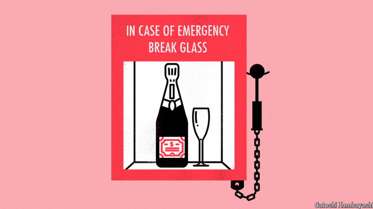

# Investors should not fear a stockmarket crash

Take a long view, and shares are a lot less risky than many realise

原文：

**S**HAREHOLDERS ARE enjoying one of their best runs in history.

Since a trough last October the S&P 500 index of large American

firms has risen by more than 40%; peers in Europe, Japan and

Canada have all gone up by at least half as much. The fears of last

year, that stubborn inflation would prevent central banks from

cutting interest rates, keeping bond yields high and dragging share

prices down, have all but vanished. In fact, many of the world’s

monetary guardians have been slashing borrowing costs just as

corporate profits have climbed and animal spirits have surged. The

result is that plenty of stockmarkets are now hovering near all-time

highs.

股东们正享受着他们历史上最好的业绩之一。自去年10月的低谷以来，美国大公司的标准普尔500指数已经上涨了40%以上；欧洲、日本和加拿大的同行都上涨了至少一半。去年人们担心，顽固的通货膨胀会阻止中央银行降息，保持高债券收益率并拖累股价，现在这种担心已经烟消云散。事实上，就在企业利润攀升、动物精神高涨之际，全球许多货币监管者一直在大幅削减借贷成本。结果是许多股票市场现在徘徊在历史高点附近。

学习：

trough：美 [trɔːf] （海浪间的）波谷；萧条时期；低谷          

hovering：盘旋；徘徊；（hover的现在分词形式）

原文：

Accordingly, investors are engaged in the activity that is traditional

for such moments: not sending champagne corks flying, but

obsessing about whether the good times are already over. They are

hardly short of reasons to fret. Relative to underlying profits,

American stocks have rarely been pricier, and then only before big

slumps. Unnervingly, more than a third of the S&P 500’s market

value is concentrated in just ten firms. Spurred on by rich-world

governments’ insatiable appetite for borrowing, and especially the

prospect of Donald Trump entering the White House and sending

America’s deficit even higher, bond yields are again rising quickly.

Volatility is up, too, and gold—typically seen as a hedge against

chaos—has been on a rally for the ages·. A crash would need a

catalyst. But a lot of other potential causes are already in place.

因此，投资者参与到这种时刻的传统活动中:不是开香槟庆祝，而是纠结于好时光是否已经结束。他们几乎不缺少焦虑的理由。相对于潜在利润，美国股票很少更贵，而且只是在暴跌之前。令人不安的是，超过三分之一的标准普尔500市值集中在十家公司手中。受富裕世界政府贪得无厌的借贷欲望的刺激，尤其是唐纳德·特朗普入主白宫并让美国赤字进一步上升的前景，债券收益率再次快速上升。波动性也在上升，黄金——通常被视为对混乱的对冲——多年来一直在上涨。崩溃需要催化剂。但是很多其他潜在的原因已经存在。

学习：

corks：软木塞；瓶塞

fret：焦虑

unnervingly：令人胆怯地；使人紧张不安地          

原文：

Here, then, is a reason to be cheerful should you end up watching a

big chunk of your portfolio go up in smoke. Naturally, this would

be unpleasant. Yet the nicest result of the past few decades’

academic research on finance is that, at least in the long run, it

matters less than you might think. The reason is that stocks are

more like bonds than most investors realise. As prices (or, more

precisely, valuations) fall, expected returns rise.

那么，如果你最终眼睁睁看着自己的一大块投资化为乌有，这是一个值得高兴的理由。自然，这将是不愉快的。然而，过去几十年金融学术研究的最好结果是，至少从长期来看，它没有你想象的那么重要。原因是股票比大多数投资者意识到的更像债券。随着价格(或者更准确地说，估值)下降，预期回报上升。

学习：

go up in smoke：被烧光；被焚毁；被烧掉；以失败告终；一事无成；付之一炬；

原文：

For bonds, this is easy to see. Just consider what happened in 2022.

Interest rates rose by several percentage points, dragging up bond

yields with them. To align existing bonds, many of which paid next

to no interest, with prevailing yields, prices were hammered. After

all, investors would buy bonds only if they were sufficiently

discounted from face value to make up for their low coupons.

Viewed this way, American Treasuries had their worst year in over

a century. Unless they sold after the crash, though, this would not

have altered their owners’ returns by one jot. If they held their

Treasuries to maturity, they would still receive every coupon they

had been promised, followed by the repayment of principal.

对于债券来说，这很容易理解。想想2022年发生了什么。利率上升了几个百分点，从而拉高了债券收益率。为了让现有债券(其中许多几乎没有利息)与当前收益率保持一致，价格受到了打击。毕竟，投资者只有在债券的面值被充分贴现以弥补其低票息时才会购买债券。从这个角度来看，美国国债经历了一个多世纪以来最糟糕的一年。不过，除非他们在崩盘后出售，否则这不会对其所有者的回报产生丝毫影响。如果他们持有美国国债至到期，他们仍将获得承诺的每一张息票，随后偿还本金。

原文：

It is not obvious that stocks behave similarly—for one thing, there

is no repayment of principal to make up for a drop in prices. Even

so, they do, concluded a panoramic survey of asset-price research

published in 2011 by John Cochrane, then at the University of

Chicago. The ratio of profits to share prices, once thought to

forecast future earnings, in fact does not. What it does predict,

much like the yield on a bond, is the shareholder’s expected return.

Unlike a bond yield, this is not a sure thing: realised returns might

fall on either side of the forecast. Thankfully, as is the case with

bonds, investors are compensated for falling share prices with

higher expected returns.

股票的表现并不明显——首先，没有本金偿还来弥补价格下跌。即便如此，他们确实如此，2011年芝加哥大学的John Cochrane发表的资产价格研究全景调查总结道。利润与股价的比率曾被认为是预测未来收益的指标，但事实上并非如此。它所预测的，很像债券的收益率，是股东的预期回报。与债券收益率不同，这不是一件确定的事情:实际回报率可能会在预测的上下浮动。值得庆幸的是，与债券一样，投资者因股价下跌而获得了更高的预期回报。

学习：

realised returns：实际回报率

原文：

Armed with this information, one class of investor should welcome

a crash. Sky-high stock valuations have badly eroded the returns

youngish savers can expect to earn as they age. In a recent note,

analysts at Goldman Sachs, a bank, put this into grim numbers.

Based on valuations and factors such as market concentration and

interest rates, they forecast annualised nominal returns of just 3%

for the S&P 500 over the coming decade, compared with a

historical average of 11%. A painful crash might at least reset the

dial and give youngsters a better chance of retiring at some point.

有了这些信息，一类投资者应该会欢迎崩盘。极高的股票估值严重侵蚀了年轻储户随着年龄增长可以预期获得的回报。在最近的一份报告中，高盛银行的分析师们对此进行了严峻的统计。基于估值以及市场集中度和利率等因素，他们预测未来十年标准普尔500的年名义回报率仅为3%，而历史平均水平为11%。一场痛苦的崩盘至少会重新调整表盘，给年轻人一个更好的退休机会。

原文：

The broader implication is that anyone holding stocks for the long

run—in a pension pot, say—is taking less risk than they might

think. Investors often imagine year-by-year returns as like a series

of independent coin tosses, in which a run of poor luck implies

nothing at all about the odds of the next flip. In this world a crash is

simply terrible news. Reality is more pleasant. Investing in stocks

is like flipping the coin of the gambler’s fallacy: a long series of

tails really does make it more likely that you will come up heads

next time. Cold comfort, perhaps, when prices are plunging and

some of your savings have disappeared. But a good reason to buy

at the bottom.■

更广泛的含义是，任何长期持有股票的人——比如说，养老金储蓄——承担的风险比他们想象的要小。投资者通常把年复一年的回报率想象成一系列独立的掷硬币游戏，在这些游戏中，一连串的运气不佳并不意味着下一次的赔率。在这个世界上，崩盘简直是可怕的消息。现实更令人愉快。投资股票就像投掷赌徒谬误的硬币:一连串的尾巴确实会让你下次更有可能出现正面。当价格暴跌，你的一些储蓄消失时，这或许是一种冰冷的安慰。但这是在底部买入的好理由。■

学习：

pension pot：养老金账户；退休金储备；

poor luck：运气不好

## 后记

2024年10月30日13点23分于上海。

