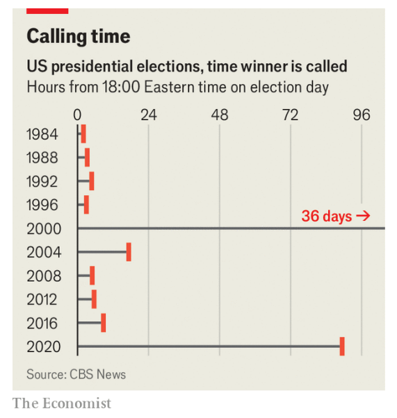
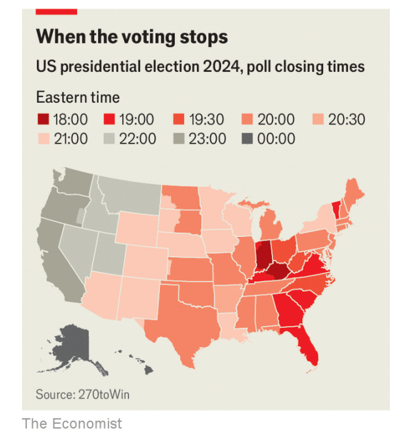

# What to watch for on election night, and beyond

The first clues on election night that could point to the next president

原文：

**T**HE RESULT of the 2020 presidential election was the slowest to

be called since 2000. Covid-19 restrictions, a mass switch to early

voting, high turnout and tight margins in swing states led to four

anxious days of vote-counting, nail-biting and Twitter-refreshing

before Joe Biden was declared president-elect.

2020年总统大选的结果是自2000年以来最慢的一次。新冠肺炎的限制、大规模提前投票、高投票率以及摇摆州的微弱优势，导致乔·拜登(Joe Biden)在宣布当选总统之前，进行了四天焦虑的计票、咬指甲和刷新推特。

学习：

nail-biting：咬指甲

vote-counting：计票

原文：

This year, given heavy early voting, many expect the counting will

be slow again. Officials insist that ballot tallying will be faster. And

although the contest is close—with six days to go, *The Economist*’s

forecast model had it as a dead heat—there is a good chance of a

decisive victory for either Donald Trump or Kamala Harris, due to

a normal polling error·. The results could be known just a few

hours after polls close—as they were for seven of the past ten

elections (see chart).

今年，考虑到大量的提前投票，许多人预计计票会再次变慢。官员们坚持认为计票会更快。尽管比赛已经接近尾声——还有六天，经济学人的预测模型认为势均力敌——但由于正常的民调误差，唐纳德·川普或卡玛拉·哈里斯都很有可能取得决定性胜利。投票结束后几个小时就能知道结果——就像过去十次选举中的七次一样(见图表)。

学习：

ballot：美 [ˈbælət] 选票；投票；选举；

tallying：标签；计数器；记账；计算；记录；使符合；（tally的现在分词形式）

dead heat：不分胜负；平局；并列名次

decisive victory：决定性的胜利          

原文：

The first states to conclude voting will be on the east coast. Six

states, including the key battleground of Georgia, will finish voting

statewide at 7pm eastern time (midnight in London). By 8pm, 19

more states will have joined them and a flurry of data will be

published. Readers should exercise caution: little of substance will

be revealed at this stage of the night, unless the election is a

landslide.

第一批结束投票的州将在东海岸。包括关键战场佐治亚州在内的六个州将在东部时间晚上7点(伦敦午夜)结束全州投票。到晚上8点，将有19个州加入他们的行列，一系列数据将会公布。读者应该小心:除非选举取得压倒性胜利，否则在深夜的这个阶段，几乎没有什么实质性的东西会被披露。

学习：

exercise caution：小心谨慎；谨慎行事；采取谨慎措施；

landslide：压倒性胜利；选举中的压倒性多数票；一边倒的胜利

原文：

Exit polls will be published in states that have completed counting.

Unlike such polls in many countries, the data will not include

estimates of candidates’ share of the vote. Instead, these polls

include information on the composition of the electorate, their

policy views and top issues—none of which will reveal who has

won.

出口民调将在已经完成计票的州公布。与许多国家的此类民调不同，这些数据将不包括候选人的投票份额估计。相反，这些民意调查包括选民的构成、他们的政策观点和首要问题等信息——这些都不会揭示谁赢了。

原文：

In some states, where one candidate is heavily favoured, the

election result will be called almost immediately. Unless there is a

major upset or a striking trend, these calls may not say much about

the election overall. One of the first states to be called in 2020 was

Vermont, which Ms Harris is overwhelmingly likely to win. The

absence of a call may be more informative: if Virginia is not called

soon after polls close, it may indicate that Mr Trump is having a

good night. The reverse is true for Ohio.

在一些候选人优势明显的州，选举结果会几乎立刻被宣布。如果没有出现重大冷门或明显的趋势，这类结果的公布可能对整个选举形势不会提供太多信息。比如，2020年最早宣布结果的州之一是佛蒙特州，而哈里斯很可能会轻松赢得该州。如果没有及时宣布结果，反而可能更具信息价值：如果弗吉尼亚州在投票结束后很快没有宣布结果，这可能表明特朗普的表现不错；对于俄亥俄州，则相反。

学习：

call：这里的 **"call"** 指的是 **“宣布选举结果”** 或 **“预测胜出者”**。

原文：

The first sets of counted votes are unlikely to reveal much, either.

In many states, where large urban counties that lean Democratic are

slow to count, the vote will appear more Republican than the final

tally. In 2020 this effect was compounded in some states by mail-in

ballots (which skewed Democratic) being slowest to count. Hence

the “blue shift” phenomenon: Republican vote leads wiped out by

late-counted Democratic ballots, fuelling false claims of electoral

fraud.

第一轮计票也不太可能透露太多信息。在许多州，倾向于民主党的大城市县的计票速度很慢，投票将比最终计票更倾向于共和党。2020年，这种影响在一些州变得更加严重，因为邮寄选票(偏向民主党)的统计速度最慢。因此出现了“蓝移”现象:共和党的选票领先优势被最新统计的民主党选票抹去，助长了选举舞弊的虚假指控。

学习：

mail-in：邮寄；寄送          

skew：数据或统计结果 **“倾向”** 或 **“偏向”** 某一方向

>这里的 **"skew"** 是指数据或统计结果 **“倾向”** 或 **“偏向”** 某一方向。举个例子，文中提到邮寄选票因为民主党支持者使用较多，所以使得早期投票数据倾向于共和党。最终计票时，因为邮寄选票较晚被统计，这会造成 **"blue shift"**（蓝色转移）现象，即晚期计入的民主党选票会逆转早期的共和党优势。
>
>**例子**：
>
>1. **“During a survey, the sample skews younger, as more young people responded to online forms.”**
>   - **在调查中，样本偏向年轻，因为更多年轻人填写了在线表格。**
>
>2. **“The data skewed towards urban residents, as rural respondents had limited access to the survey.”**
>   - **数据偏向于城市居民，因为农村的受访者获取调查的途径较少。** 
>
>在以上例子中，"skew" 用来表示某些因素导致数据或结果偏向一方。

原文：

So what will be the first solid pointers on election night? One

metric to watch is the change between county-level results in 2020

and 2024 (this will appear on each state’s results page on

economist.com). By comparing counties which have completed

their tallies, we can measure the change in support for each party’s

candidate.

那么，在选举之夜，第一个可靠的指示是什么呢？一个值得关注的指标是2020年和2024年县级结果之间的变化(这将出现在economist.com上每个州的结果页面上)。通过比较已经完成统计的县，我们可以衡量两党候选人支持率的变化。

原文：

For example, in a key state such as Pennsylvania—with 67 counties

—the early results might come from a selection of counties that Mr

Biden won by ten percentage points in 2020. Suppose those

counties show Ms Harris winning by five points. If that shift were

replicated across the state, Mr Trump would be on track to win

Pennsylvania as a whole by four points (Mr Biden won it by one

point in 2020).

例如，在宾夕法尼亚州这样一个拥有67个县的关键州，初步结果可能来自拜登在2020年赢得10个百分点的一些县。假设这些县显示哈里斯女士领先5个百分点。如果这种转变在整个州复制，特朗普将有望以四个百分点的优势赢得整个宾夕法尼亚州(拜登在2020年以一个百分点的优势赢得该州)。

原文：

When the first states conclude counting, we will get more clues as

to how the election has panned out. Florida finished counting

before midnight eastern time in 2020. Although the state is not

likely to be competitive (our forecast gives Ms Harris a five-in-100

chance of an upset), it could still indicate who has the upper hand.

Using simulations from our forecast, we can see how the result in

Florida relates to Ms Harris’s chances of winning overall. If she

loses Florida by seven percentage points, she has a one-in-two

chance of winning the presidency. If she loses the state by more

than 11 points, her chances of winning the election sink below one

in five.

当第一批州结束计票时，我们将获得更多关于选举结果的线索。佛罗里达州在东部时间2020年午夜前完成计数。尽管该州不太可能有竞争力(我们的预测给哈里斯女士一百分之五的机会翻案)，但它仍然可能表明谁占上风。使用我们预测的模拟，我们可以看到佛罗里达州的结果如何与哈里斯女士的总体获胜机会相关联。如果她在佛罗里达州输了7个百分点，她就有二分之一的机会赢得总统大选。如果她在该州的得票率相比较而言低11个百分点，那么她赢得选举的机会就会降到五分之一以下。

学习：

pan out:指 **“结果如何”** 或 **“事情的发展或结局”**

>这里的 **"pan out"** 是指 **“结果如何”** 或 **“事情的发展或结局”**。在这段话中，它表示选举的结果如何，随着计票完成会逐渐揭晓。
>
>**例子**：
>
>1. **“We invested heavily in the project, but we’ll have to wait to see if it pans out.”**
>   - **我们在项目上投入了大量资金，但还得等着看结果会怎样。**
>
>2. **“She put a lot of effort into her studies; let’s see how it pans out in her final grades.”**
>   - **她在学习上投入了很多精力，让我们看看最终成绩如何。**
>
>在这个语境中，"pan out" 是关于选举形势如何明朗，随着佛罗里达州的计票结果，可以进一步推测整个选举的走向。

原文：

Both of these measures are imperfect. The first counties and states

to tally their votes may be unrepresentative. In 2020 Florida moved

two points towards Mr Trump whereas the country as a whole

moved two points towards Mr Biden.

这两种方法都不完美。第一批计票的县和州可能不具有代表性。2020年，佛罗里达州向特朗普移动了两个百分点，而整个国家向拜登移动了两个百分点。

原文：

The final result will probably come down to seven key states. In

our forecast, Ms Harris has a 93% chance of becoming president if

she wins Pennsylvania, for example, and Mr Trump has a 95%

chance if he wins Michigan. Of the seven states, Georgia and

Michigan may be the fastest to count. Georgia has mandated that

results from early voting (around 70% of Georgia’s total vote) must

be announced by 8pm eastern time. Michigan has changed the law

to allow the processing of early votes before election day, speeding

up the tally compared with 2020. North Carolina is also

traditionally quick to count but may experience disruption due to

Hurricane Helene.

最终结果可能会归结为七个关键州。例如，在我们的预测中，如果哈里斯赢得宾夕法尼亚州，她有93%的机会成为总统，如果特朗普赢得密歇根州，他有95%的机会成为总统。在七个州中，乔治亚州和密歇根州可能是统计速度最快的。佐治亚州规定，提前投票(约占佐治亚州总票数的70%)的结果必须在东部时间晚上8点公布。密歇根州已经修改法律，允许在选举日之前处理提前投票，与2020年相比加快了计票速度。北卡罗来纳州传统上也很快开始计票，但可能会因飓风海伦而中断。

学习：

come down to：（问题、决定等）归结为；取决于；由…决定；

mandated：授权；授权托管；批准；（mandate的过去式和过去分词）

原文：

Others could well be slower. Pennsylvania, the most likely pivotal

state according to our forecast, will not start processing millions of

postal ballots until the morning of election day. Arizona and

Nevada, in the west, finish voting later that day and take longer to

count their mail-in ballots, which are popular in both states.

Nevada accepts and counts ballots which arrive after election day,

too (although these are unlikely to flip the state).

其他州很可能会慢一些。根据我们的预测，宾夕法尼亚州最有可能成为关键州，直到选举日早上才会开始处理数百万张邮寄选票。西部的亚利桑那州和内华达州在当天晚些时候结束投票，并需要更长时间来统计邮寄选票，这在这两个州都很受常见。内华达州也接受并计算选举日之后到达的选票(尽管这些不太可能翻转该州)。

原文：

The timing of the final call will depend on how close the election

is. In 2000, when the presidency was decided by just over 500

votes in Florida, it took weeks to determine the result. In 1984,

when Ronald Reagan won by a landslide, the result was called at

8pm eastern time, while voters on the west coast were still casting

ballots. A decisive victory for either candidate would reduce the

opportunities for spurious litigation and election denialism—a

pastime of Mr Trump’s which may slow the announcement of the

final result.

最终公布的时间将取决于离大选还有多近。2000年，当佛罗里达州以500多票决定总统选举时，花了几个星期才确定结果。1984年，当罗纳德·里根以压倒性优势获胜时，结果在东部时间晚上8点宣布，而西海岸的选民仍在投票。两位候选人的决定性胜利将减少虚假诉讼和选举否认主义的机会——这是特朗普的一种消遣，可能会延缓最终结果的公布。

学习：

litigation：诉讼；起诉；打官司

denialism：否认主义

## **Eyes on the prize**

原文：

The median scenario from our forecast has Ms Harris winning her

pivotal 270th electoral-college vote by less than half a percentage

point. But there is also a substantial chance of a polling miss· of a

scale that would give one or other of the candidates a comfortable

win. In one in six scenarios from our forecast, the winning margin

in the pivotal state is greater than five points—matching Barack

Obama’s re-election in 2012. If that were to happen, we would

probably have a clear indication early in the night (the 2012

election was called before midnight eastern time). In three out of

four forecast scenarios, the margin of victory in the pivotal state is

larger than Mr Biden’s in 2020.

我们预测的中间值是哈里斯女士以不到半个百分点的优势赢得了她关键的第270张选举团选票。但是也有很大的可能会出现一次大规模的投票失误，让一个或另一个候选人轻松获胜。根据我们的预测，在六分之一的情况下，这个关键州的胜率超过五个百分点，与巴拉克·奥巴马在2012年的连任相当。如果发生这种情况，我们可能会在晚上早些时候有一个明确的迹象(2012年选举在东部时间午夜之前举行)。在四分之三的预测情景中，2020年在这个关键州的胜算大于拜登。

原文：

The tail risk of election-night becoming election-week or election

month is still significant. If the presidency comes down to a few

thousand votes in Wisconsin or Pennsylvania—the central estimate

of our forecast—it could take weeks to resolve. Election

interference could extend the wait even further. But there is also a

fair chance that the result is known sooner than many expect.

Election-watchers, adjust your sleep schedule accordingly. ■

选举之夜变成选举周或选举月的尾部风险仍然很大。如果总统选举在威斯康星或宾夕法尼亚只剩下几千张选票——这是我们预测的核心估计——可能需要几周才能解决。选举干预可能会进一步延长等待时间。但也有可能比许多人预期的更早知道结果。选举观察家们，相应地调整你的睡眠时间表。■

学习：

fair chance：公平的机会

## 后记

2024年11月6日15点54分于上海。

