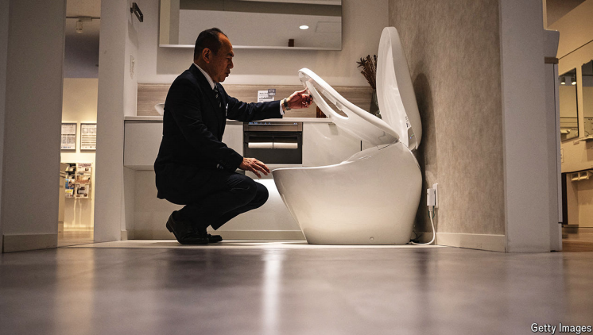

# Can Japan’s toilet technology crack global markets?

The leading maker of electronic bidets shows the difficulties facing Japanese companies abroad

bidets：英 ['biːdeɪs] 坐浴盆；（bidet的复数）**注意发音**

>这里的 **"crack"** 表示**“突破”**或**“打开”**（某个市场）。在这句话中，**"crack global markets"** 意思是**日本的厕所技术能否成功进入并占领全球市场**。也就是说，作者在问日本的智能马桶技术是否能在其他国家（尤其是西方国家）获得广泛认可和接受。
>
>类似的用法示例如下：
>
>- **"The company is trying to crack the European market with its innovative products."**
>  - **这家公司正试图用其创新产品打入欧洲市场。**
>
>- **"It's challenging for foreign brands to crack the American market due to cultural differences."**
>  - **由于文化差异，外国品牌很难打入美国市场。**

原文：

**T**HE PAST century has been one of relentless innovation. But in

the West the humble toilet is a curious exception. By the early 20th

century, free-standing flush toilets with U-bend plumbing were

being installed in homes on both sides of the Atlantic. Americans

and Europeans seem to think that the model is still more or less

good enough.

过去的一个世纪是不断创新的世纪。但是在西方，不起眼的厕所是一个奇怪的例外。到20世纪初，大西洋两岸的家庭都安装了带有U形弯管管道的独立式抽水马桶。美国人和欧洲人似乎认为这个模型或多或少还是足够好的。

学习：

relentless：不停的；持续不断的

free-standing：独立式的；自立的；不依靠支撑物的

原文：

Not the Japanese. Electronic toilets are standard in homes and

hotels—and a marvel to visiting Westerners. Toto, by its own

estimation the world’s largest maker of bathroom fixtures, has led

the technological vanguard. Its “washlet”, first sold in 1980,

features directed jets of water and air (pick your temperature),

heated seats and deodorisers. The firm is listed in Tokyo, valued at

¥779bn ($5bn).

但日本人不这么觉得。电子厕所是家庭和酒店的标准配置——对来访的西方人来说是一个奇迹。据Toto自己估计，它是世界上最大的卫浴设备制造商，引领着技术的前沿。它的“washlet”于1980年首次出售，以水和空气的直接喷射(选择你的温度)、加热座椅和除臭剂为特色。该公司在东京上市，价值7790亿日元(50亿美元)。

学习：

fixture：固定装置；固定设施（如房屋内安装的浴缸或抽水马桶）

vanguard： 美 [ˈvænɡɑːrd] 政治、艺术、工业等社会活动的）领导者；先驱者

deodorizer：美 [di'oʊdəˌraɪzə]   除臭剂

原文：

Toto, which still makes about two-thirds of its sales at home, is

keen to bring foreign toilets up to date (or at least into the Japan of

40 years ago). But like other Japanese firms, it is encountering two

big difficulties.

Toto仍有三分之二的销售额来自国内，它热衷于让国外的厕所更新(或者至少达到40年前的日本的水平)。但是像其他日本公司一样，它遇到了两大困难。

原文：

The first is Japan’s “Galapagos syndrome”: many goods developed

and sold there go no further. The world’s fourth-largest economy is

big enough to support all sorts of indigenous products, from phones

to toilets. But stagnating incomes and a declining population make

it an unreliable market. On October 28th Toto’s third-quarter results

undershot investors’ expectations. The company cut its sales

forecast for this fiscal year from ¥750bn to ¥730bn. Its share price

fell by 13% the next day.

第一个是日本的“加拉帕戈斯综合症”:许多在那里开发和销售的商品没有进一步发展。世界第四大经济体足以支撑从手机到马桶的各种本土产品。但是停滞的收入和下降的人口使它成为一个不可靠的市场。10月28日，Toto的第三季度业绩低于投资者的预期。该公司将本财年的销售额预期从7500亿日元下调至7300亿日元。第二天，其股价下跌了13%。

学习：

indigenous：美 [ɪnˈdɪdʒənəs] 本地的；当地的

原文：

The second difficulty relates to China, which at the end of 2022

yielded 17% of Toto’s sales, but provides just 10% today. It now

looks like a busted flush. The freefall in Chinese property

investment, down 10% so far this year, after similar declines in

2022 and 2023, means fewer new buildings and bathrooms.

Domestic rivals have also appeared.

第二个困难与中国有关，2022年底，中国贡献了Toto销售额的17%,但现在只占10%。现在它看起来像一个失势的人。继2022年和2023年类似的下降之后，中 国 房 地 产投 资今年迄今下降了10%，这意味着新建筑和浴室的减少。国内的对手也出现了。

学习：

busted flush：失势的人(或机构)；失去影响力的人（或机构）；破产的人；

原文：

There is light at the end of the U-bend. Sales are up in South-East

Asia and India. And revenue from the Americas soared by 34%,

year on year, in the six months to September, accounting for a tenth

of the company’s total.

U型弯的尽头有光。东南亚和印度的销量上升。截至9月的6个月中，来自美洲的收入同比飙升34%，占公司总收入的十分之一。

原文：

Toto’s toilets face some blockages in America, though. The most

acute, notes James Lin, founder of BidetKing.com, an online

marketplace, is electricity for the seat. Most American bathrooms

have a power source near the sink, but not near the cistern. Even

new homes are not always suitably equipped.

不过，Toto的厕所在美国面临一些障碍。在线市场BidetKing.com的创始人James Lin指出，最严重的问题是座椅的电力。大多数美国浴室在水槽附近有电源，但在水箱附近没有。即使是新房子也不总是有合适的设备。

学习：

blockages：堵塞；（blockage的复数）          

cistern：美 [ˈsɪstərn] （抽水马桶的）水箱；

原文：

Still, the flow is in the right direction. During the pandemic fears of

toilet-paper shortages, worries about hygiene and the growth of

DIY gave the market a jump-start. Returning tourists may also

help. Americans made more than 2m trips to Japan in 2023, up

from 1.7m in 2019. Another record is likely this year—adding to

the convenience-converted. ■

尽管如此，资金流向是正确的。在疫情期间，对卫生纸短缺的担忧、对卫生的担忧以及DIY的增长推动了市场的发展。归国游客也可能有所帮助。2023年，美国人赴日旅游超过200万次，高于2019年的170万次。另一项记录很可能在今年出现——增加了体验到便利性（如日本的高科技马桶）而被“转变”的人群。■

学习：

jump-start：助动启动；紧急启动（汽车等）

>
>
>这里的 **"convenience-converted"** 指的是那些因为体验到便利性（如日本的高科技马桶）而被“转变”的人群，意即因感受到便利而改变了习惯或偏好的消费者。在本文中，指的是那些到日本旅行、体验过智能马桶带来的舒适与便利后，被这种体验“转变”的美国游客。随着他们返回美国，他们的体验有可能推动美国市场对类似产品（如Toto的智能马桶）的需求。
>
>这种用法可以理解为：因为便利性而“被转变”的人们。例如：
>
>- **"After traveling to Japan and experiencing the convenience of smart toilets, many Americans become convenience-converted and start looking for similar products at home."**
>  - **在日本旅行并体验了智能马桶的便利之后，许多美国人被这种便利所“转变”，开始在国内寻找类似产品。**

## 后记

2024年11月7日10点06分于上海。

